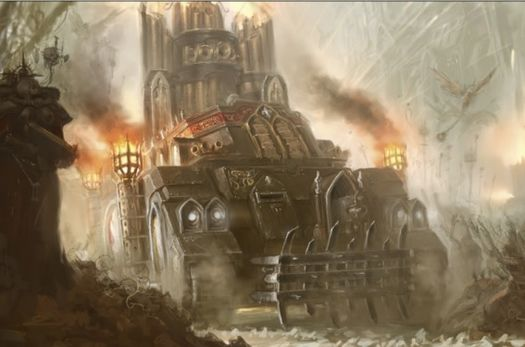
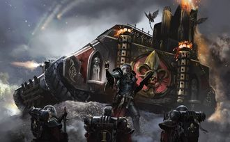
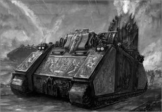
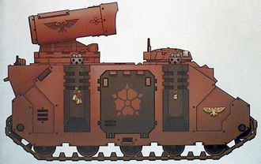
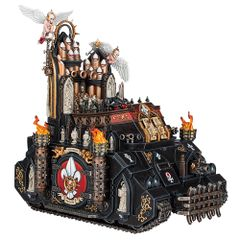
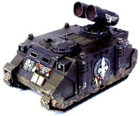

# 1524 驱魔人导弹车 Exorcist Missile Tank

精校状态：中文行文已逐段精校，部分术语仍为暂定

分类：载具 / 地面 / 火炮

原文来源：https://www.bilibili.com/opus/1214368515126984724

原作者：帝国神选罐头

原文时间：2026年06月16日 11:30

[返回分类目录](目录.md) · [全书目录](../../目录.md)

原篇名：驱魔者导弹坦克 Exorcist Missile Tank

<!-- A1524-B0001 -->
**英文原文**

The Exorcist missile tank fulfils the role of long-range fire support for the Sisters of Battle.

<!-- /A1524-B0001 -->

<!-- A1524-B0002 -->

原译文

驱魔者导弹坦克为战斗修女提供远程火力支援。

**校订译文**

驱魔人导弹车为战斗修女提供远程火力支援。

**校注：** Exorcist修女会车型使用官方驱魔人导弹车（GW09/GW10第2页），区别驱魔者战团或职务。

<!-- /A1524-B0002 -->

<!-- A1524-B0003 图片 -->

<!-- A1524-B0004 -->

原译文

Exorcist 驱魔者

**校订译文**

Exorcist 驱魔人导弹车

<!-- /A1524-B0004 -->

<!-- A1524-B0005 -->
## Overview 概述

<!-- /A1524-B0005 -->

<!-- A1524-B0006 -->
**英文原文**

Besides the Rhino, the Exorcist is the oldest vehicle in service to the Adepta Sororitas. The first Exorcists were produced in the Age of Apostasy on Mars, of which some from that period, known as the 'Prioris' pattern, still survive. These machines are highly venerated, although their Machine Spirits are known to be temperamental and require constant work and prayer. Each vehicle is regarded as a work of art, as much a symbol of the Emperor as a provider of long-range fire support.

<!-- /A1524-B0006 -->

<!-- A1524-B0007 -->

原译文

除了犀牛，驱魔者是为修女会服务的最古老的载具。第一批驱魔者是在叛教时代在火星上生产的，其中一些来自那个时期，被称为“首席”型，仍然存在。这些机械备受推崇，尽管众所周知，它们的机魂是喜怒无常的，需要不断的工作和祈祷。每辆载具都被视为艺术品，既是帝皇的象征，也是远程火力支援的提供者。

**校订译文**

除犀牛战车外，驱魔人导弹车是修女会服役历史最悠久的车辆。第一批在叛教时代于火星制造，其中一些被称为“首席型”的车辆至今仍然留存。它们备受敬奉，但机魂也出了名地喜怒无常，需要持续维护与祈祷。每一辆都被视为艺术品，既是远程火力平台，也是帝皇的象征。

<!-- /A1524-B0007 -->

<!-- A1524-B0008 图片 -->

<!-- A1524-B0009 -->

原译文

Exorcist Tank 驱魔者坦克

**校订译文**

Exorcist Tank 驱魔人导弹车

<!-- /A1524-B0009 -->

<!-- A1524-B0010 -->
**英文原文**

While other patterns exist, such as the 'Sanctorum' and 'Dominica', they are not held in as high esteem as the original vehicles, blessed from the nearby divine presence of the Emperor when they were constructed. Adepta Sororitas never gave their Exorcists to another Imperium faction, like the Imperial Guard and the Space Marines, in fear that the machine spirits of this holy weapon would be tainted by non-believers and incur the displeasure of the Emperor himself.

<!-- /A1524-B0010 -->

<!-- A1524-B0011 -->

原译文

虽然存在其他型号，如“圣所”和“多米妮卡”，但它们并没有像最初的载具那样受到高度尊重，在建造时受到了帝皇神圣存在的祝福。修女会从未将他们的驱魔者交给另一个帝国派系，如帝国卫队和星际战士，担心这种神圣武器的机魂会被非信徒污染，并招致帝皇本人的不满。

**校订译文**

圣所型、多米妮卡型等其他型号也确实存在，但地位均不及最初的车辆；后者在建造时距离帝皇神圣的存在更近，因此被认为蒙受其祝福。修女会从不将驱魔人导弹车交给帝国卫队、星际战士等其他帝国组织，因为她们担心，这种圣器的机魂会被不信者玷污，招致帝皇本人不满。

<!-- /A1524-B0011 -->

<!-- A1524-B0012 图片 -->

<!-- A1524-B0013 -->

原译文

Exorcist Tank 驱魔者坦克

**校订译文**

Exorcist Tank 驱魔人导弹车

<!-- /A1524-B0013 -->

<!-- A1524-B0014 -->
**英文原文**

The ancient, arcane technology of the Exorcist launcher is only vaguely understood by the Techpriests of the Adeptus Mechanicus.

<!-- /A1524-B0014 -->

<!-- A1524-B0015 -->

原译文

驱魔者发射器的古老而神秘的技术，只有机械神教的技术神甫才能模糊地理解。

**校订译文**

即便是机械修会的技术祭司，对驱魔人发射器所用的古老秘奥技术也仅有模糊了解。

<!-- /A1524-B0015 -->

<!-- A1524-B0016 -->
**英文原文**

The missiles themselves are armour-piercing explosives and capable of annihilating enemy tanks or destroying squads of heavy infantry in a single salvo (assuming the launcher does not malfunction). Other payloads are available, including high-explosive or incendiary projectiles such as Conflagration Rockets, and anti-aircraft projectiles.

<!-- /A1524-B0016 -->

<!-- A1524-B0017 -->

原译文

导弹本身是穿甲炸药，能够在一次齐射中歼灭敌方坦克或摧毁重型步兵小队（假设发射器没有故障）。其他有效载荷也是可用的，包括高爆或燃烧弹，如爆炎火箭，以及防空弹药。

**校订译文**

导弹采用穿甲爆破弹头；只要发射器正常工作，一次齐射就能摧毁敌方坦克，或消灭整支重装步兵小队。它也可使用其他弹药，包括高爆弹、爆炎火箭等燃烧弹药，以及防空弹药。

<!-- /A1524-B0017 -->

<!-- A1524-B0018 图片 -->

<!-- A1524-B0019 -->

原译文

Exorcist of the Order of the Sacred Rose 神圣玫瑰修会的驱魔者

**校订译文**

Exorcist of the Order of the Sacred Rose 神圣玫瑰修会的驱魔人导弹车

<!-- /A1524-B0019 -->

<!-- A1524-B0020 -->
**英文原文**

Though potent, to the Sisterhood its primary purpose is to serve as a divine symbol of the power and glory of the Ecclesiarchy and serve as a mobile shrine for the Sisters of Battle. Each one is hand-crafted and unique.

<!-- /A1524-B0020 -->

<!-- A1524-B0021 -->

原译文

虽然强大，但对修女会来说，它的主要目的是作为国教权力和荣耀的神圣象征，并作为战斗修女的移动圣地。每一辆都是手工制作的，独一无二。

**校订译文**

尽管火力强大，在修女会眼中，它最重要的意义仍是象征国教神圣的威能与荣耀，并充当战斗修女的移动圣龛。每一辆都由手工打造，独一无二。

<!-- /A1524-B0021 -->

<!-- A1524-B0022 -->
**英文原文**

Some Exorcists are equipped with a hull-mounted Heavy Bolter; they may also be upgraded with Blessed Ammunition, Dozer Blades, Extra Armour, a Holy Icon, a Hunter-killer Missile, Laud Hailers, Pintle-mounted Storm Bolter, a Searchlight and Smoke Launchers.

<!-- /A1524-B0022 -->

<!-- A1524-B0023 -->

原译文

一些驱魔者配备了车体安装的重型爆矢枪；它们还可以升级祝福弹药、推土机铲刀、额外装甲、圣像、猎杀导弹、圣歌播放器、枢轴风暴爆矢枪、探照灯和烟雾发射器。

**校订译文**

一些驱魔人导弹车配有车体重型爆矢枪，还可加装祝福弹药、推土铲、附加装甲、圣像、猎杀导弹、圣歌播放器、枢轴安装的风暴爆矢枪、探照灯和烟雾发射器。

<!-- /A1524-B0023 -->

<!-- A1524-B0024 图片 -->

<!-- A1524-B0025 -->

原译文

Exorcist 驱魔者

**校订译文**

Exorcist 驱魔人导弹车

<!-- /A1524-B0025 -->

<!-- A1524-B0026 -->
## Technical Information 技术资料

原题：Technical Information 技术信息

<!-- /A1524-B0026 -->

<!-- A1524-B0027 -->
**英文原文**

Vehicle Name:Exorcist

<!-- /A1524-B0027 -->

<!-- A1524-B0028 -->

原译文

载具名称：驱魔者

**校订译文**

载具名称：驱魔人导弹车

<!-- /A1524-B0028 -->

<!-- A1524-B0029 -->
**英文原文**

Crew:2 (Driver, Gunner)

<!-- /A1524-B0029 -->

<!-- A1524-B0030 -->

原译文

乘员：2（驾驶员，炮手）

**校订译文**

乘员：2人（驾驶员、炮手）

<!-- /A1524-B0030 -->

<!-- A1524-B0031 -->
**英文原文**

Weight:32 tons

<!-- /A1524-B0031 -->

<!-- A1524-B0032 -->

原译文

重量：32吨

**校订译文**

重量：32吨

<!-- /A1524-B0032 -->

<!-- A1524-B0033 -->
**英文原文**

Length:6.1m

<!-- /A1524-B0033 -->

<!-- A1524-B0034 -->

原译文

长度：6.1米

**校订译文**

长度：6.1米

<!-- /A1524-B0034 -->

<!-- A1524-B0035 -->
**英文原文**

Width:4m

<!-- /A1524-B0035 -->

<!-- A1524-B0036 -->

原译文

宽度：4米

**校订译文**

宽度：4米

<!-- /A1524-B0036 -->

<!-- A1524-B0037 -->
**英文原文**

Height:2.6m (not including missile launcher)

<!-- /A1524-B0037 -->

<!-- A1524-B0038 -->

原译文

高度：2.6米（不含导弹发射器）

**校订译文**

高度：2.6米（不含导弹发射器）

<!-- /A1524-B0038 -->

<!-- A1524-B0039 -->
**英文原文**

Ground Clearance:0.45m

<!-- /A1524-B0039 -->

<!-- A1524-B0040 -->

原译文

离地间隙：0.45m

**校订译文**

离地间隙：0.45米

<!-- /A1524-B0040 -->

<!-- A1524-B0041 -->
**英文原文**

Fording Depth:1.2m

<!-- /A1524-B0041 -->

<!-- A1524-B0042 -->

原译文

涉水深度：1.2m

**校订译文**

涉水深度：1.2米

<!-- /A1524-B0042 -->

<!-- A1524-B0043 -->
**英文原文**

Max Speed - on road:70 kph

<!-- /A1524-B0043 -->

<!-- A1524-B0044 -->

原译文

最大行驶速度：70公里/小时

**校订译文**

最大公路速度：70公里／小时

<!-- /A1524-B0044 -->

<!-- A1524-B0045 -->
**英文原文**

Max Speed - off road:55 kph

<!-- /A1524-B0045 -->

<!-- A1524-B0046 -->

原译文

最大越野速度：55公里/小时

**校订译文**

最大越野速度：55公里/小时

<!-- /A1524-B0046 -->

<!-- A1524-B0047 -->
**英文原文**

Transport Capacity:None

<!-- /A1524-B0047 -->

<!-- A1524-B0048 -->

原译文

运输能力：无

**校订译文**

运输能力：无

<!-- /A1524-B0048 -->

<!-- A1524-B0049 -->
**英文原文**

Access Points:n/a

<!-- /A1524-B0049 -->

<!-- A1524-B0050 -->

原译文

入口：无

**校订译文**

出入口：不适用

<!-- /A1524-B0050 -->

<!-- A1524-B0051 -->
**英文原文**

Main Armament:Exorcist missile launcher

<!-- /A1524-B0051 -->

<!-- A1524-B0052 -->

原译文

主要武器：驱魔者导弹发射器

**校订译文**

主要武器：驱魔人导弹发射器

<!-- /A1524-B0052 -->

<!-- A1524-B0053 -->
**英文原文**

Secondary Armament:optional pintle mounted stormbolter

<!-- /A1524-B0053 -->

<!-- A1524-B0054 -->

原译文

次要武器：可选枢轴风暴爆矢枪

**校订译文**

次要武器：可选枢轴风暴爆矢枪

<!-- /A1524-B0054 -->

<!-- A1524-B0055 -->
**英文原文**

Traverse:360°

<!-- /A1524-B0055 -->

<!-- A1524-B0056 -->

原译文

横向：360°

**校订译文**

水平射界：360°

<!-- /A1524-B0056 -->

<!-- A1524-B0057 -->
**英文原文**

Elevation:From

<!-- /A1524-B0057 -->

<!-- A1524-B0058 -->

原译文

仰角：前

**校订译文**

俯仰角：未提供

**校注：** 英文仅剩From，俯仰角数值缺失；原译前不成立。

<!-- /A1524-B0058 -->

<!-- A1524-B0059 -->
**英文原文**

Main Ammunition:64 missiles

<!-- /A1524-B0059 -->

<!-- A1524-B0060 -->

原译文

主要弹药：64枚导弹

**校订译文**

主武器载弹量：64枚导弹

<!-- /A1524-B0060 -->

<!-- A1524-B0061 -->
**英文原文**

Secondary Ammunition:bolter rounds

<!-- /A1524-B0061 -->

<!-- A1524-B0062 -->

原译文

次要弹药：爆矢弹药

**校订译文**

副武器弹药：爆矢弹

<!-- /A1524-B0062 -->

<!-- A1524-B0063 -->
### Armour 装甲

<!-- /A1524-B0063 -->

<!-- A1524-B0064 -->
**英文原文**

Superstructure:30-60mm

<!-- /A1524-B0064 -->

<!-- A1524-B0065 -->

原译文

上部结构：30-60mm

**校订译文**

上部结构：30-60mm

<!-- /A1524-B0065 -->

<!-- A1524-B0066 -->
**英文原文**

Hull:30-60mm

<!-- /A1524-B0066 -->

<!-- A1524-B0067 -->

原译文

车体：30-60mm

**校订译文**

车体：30-60mm

<!-- /A1524-B0067 -->

<!-- A1524-B0068 -->
**英文原文**

Gun Mantlet:No main gun

<!-- /A1524-B0068 -->

<!-- A1524-B0069 -->

原译文

炮盾：无主炮

**校订译文**

炮盾：无主炮

<!-- /A1524-B0069 -->

<!-- A1524-B0070 -->
**英文原文**

Vehicle Designation:Undisclosed

<!-- /A1524-B0070 -->

<!-- A1524-B0071 -->

原译文

载具编号：未披露

**校订译文**

载具编号：未披露

<!-- /A1524-B0071 -->

<!-- A1524-B0072 -->
**英文原文**

Firing Ports:n/a

<!-- /A1524-B0072 -->

<!-- A1524-B0073 -->

原译文

开火口：无

**校订译文**

射击孔：不适用

<!-- /A1524-B0073 -->

<!-- A1524-B0074 -->
**英文原文**

Turret:No Turret

<!-- /A1524-B0074 -->

<!-- A1524-B0075 -->

原译文

炮塔：无炮塔

**校订译文**

炮塔：无炮塔

<!-- /A1524-B0075 -->

<!-- A1524-B0076 图片 -->

<!-- A1524-B0077 -->

原译文

Sanctorum Pattern Exorcist 圣所型驱魔者

**校订译文**

Sanctorum Pattern Exorcist 圣所型驱魔人导弹车

<!-- /A1524-B0077 -->

<!-- A1524-B0078 -->
**英文原文**

Vehicle Name:MkIId Sanctorum pattern Exorcist

<!-- /A1524-B0078 -->

<!-- A1524-B0079 -->

原译文

载具名称：MkIId圣所型驱魔者

**校订译文**

载具名称：MkIId圣所型驱魔人导弹车

<!-- /A1524-B0079 -->

<!-- A1524-B0080 -->
**英文原文**

Forge World of Origin:Ophelia VII

<!-- /A1524-B0080 -->

<!-- A1524-B0081 -->

原译文

起源铸造世界：奥菲利亚七号

**校订译文**

起源铸造世界：奥菲利亚七号

<!-- /A1524-B0081 -->

<!-- A1524-B0082 -->
**英文原文**

Known Patterns:I-IV

<!-- /A1524-B0082 -->

<!-- A1524-B0083 -->

原译文

已知型号：I-IV

**校订译文**

已知型号：I-IV

<!-- /A1524-B0083 -->

<!-- A1524-B0084 -->
**英文原文**

Crew:Driver, Gunner

<!-- /A1524-B0084 -->

<!-- A1524-B0085 -->

原译文

乘员：驾驶员，炮手

**校订译文**

乘员：驾驶员，炮手

<!-- /A1524-B0085 -->

<!-- A1524-B0086 -->
**英文原文**

Powerplant:Quad MkII Adaptable Thermic Combustor Reactor

<!-- /A1524-B0086 -->

<!-- A1524-B0087 -->

原译文

动力装置：阔德MkII适应性热燃烧反应堆

**校订译文**

动力装置：4台MkII自适应热燃烧反应堆

**校注：** Quad按同底盘1465四台独立发动机说明译数量，不音译阔德。两份技术表尺寸、速度、载弹量不同，保留为不同资料／型号，不擅自合并。

<!-- /A1524-B0087 -->

<!-- A1524-B0088 -->
**英文原文**

Weight:32 tonnes

<!-- /A1524-B0088 -->

<!-- A1524-B0089 -->

原译文

重量：32吨

**校订译文**

重量：32吨

<!-- /A1524-B0089 -->

<!-- A1524-B0090 -->
**英文原文**

Length:6.1m

<!-- /A1524-B0090 -->

<!-- A1524-B0091 -->

原译文

长度：6.1米

**校订译文**

长度：6.1米

<!-- /A1524-B0091 -->

<!-- A1524-B0092 -->
**英文原文**

Width:4.5m

<!-- /A1524-B0092 -->

<!-- A1524-B0093 -->

原译文

宽度：4.5米

**校订译文**

宽度：4.5米

<!-- /A1524-B0093 -->

<!-- A1524-B0094 -->
**英文原文**

Height:5.3m

<!-- /A1524-B0094 -->

<!-- A1524-B0095 -->

原译文

高度：5.3米

**校订译文**

高度：5.3米

<!-- /A1524-B0095 -->

<!-- A1524-B0096 -->
**英文原文**

Ground Clearance:0.44m

<!-- /A1524-B0096 -->

<!-- A1524-B0097 -->

原译文

离地间隙：0.44m

**校订译文**

离地间隙：0.44米

<!-- /A1524-B0097 -->

<!-- A1524-B0098 -->
**英文原文**

Max Speed - on road:55 kph

<!-- /A1524-B0098 -->

<!-- A1524-B0099 -->

原译文

最大行驶速度：55公里/小时

**校订译文**

最大公路速度：55公里／小时

<!-- /A1524-B0099 -->

<!-- A1524-B0100 -->
**英文原文**

Max Speed - off road:35 kph

<!-- /A1524-B0100 -->

<!-- A1524-B0101 -->

原译文

最大越野速度：35公里/小时

**校订译文**

最大越野速度：35公里/小时

<!-- /A1524-B0101 -->

<!-- A1524-B0102 -->
**英文原文**

Transport Capacity:None

<!-- /A1524-B0102 -->

<!-- A1524-B0103 -->

原译文

运输能力：无

**校订译文**

运输能力：无

<!-- /A1524-B0103 -->

<!-- A1524-B0104 -->
**英文原文**

Access Points:N/a

<!-- /A1524-B0104 -->

<!-- A1524-B0105 -->

原译文

入口：无

**校订译文**

出入口：不适用

<!-- /A1524-B0105 -->

<!-- A1524-B0106 -->
**英文原文**

Main Armament:Exorcist launcher

<!-- /A1524-B0106 -->

<!-- A1524-B0107 -->

原译文

主武器：驱魔者发射器

**校订译文**

主武器：驱魔人发射器

<!-- /A1524-B0107 -->

<!-- A1524-B0108 -->
**英文原文**

Secondary Armament:N/A

<!-- /A1524-B0108 -->

<!-- A1524-B0109 -->

原译文

次要武器：无

**校订译文**

副武器：不适用

<!-- /A1524-B0109 -->

<!-- A1524-B0110 -->
**英文原文**

Traverse:360°

<!-- /A1524-B0110 -->

<!-- A1524-B0111 -->

原译文

横向：360°

**校订译文**

水平射界：360°

<!-- /A1524-B0111 -->

<!-- A1524-B0112 -->
**英文原文**

Elevation:From -0° to +65°

<!-- /A1524-B0112 -->

<!-- A1524-B0113 -->

原译文

仰角：从-0°到+65°

**校订译文**

俯仰角：0°至＋65°

<!-- /A1524-B0113 -->

<!-- A1524-B0114 -->
**英文原文**

Main Ammunition:48 missiles

<!-- /A1524-B0114 -->

<!-- A1524-B0115 -->

原译文

主要弹药：48枚导弹

**校订译文**

主武器载弹量：48枚导弹

<!-- /A1524-B0115 -->

<!-- A1524-B0116 -->
**英文原文**

Secondary Ammunition:N/A

<!-- /A1524-B0116 -->

<!-- A1524-B0117 -->

原译文

次要弹药：无

**校订译文**

副武器弹药：不适用

<!-- /A1524-B0117 -->

<!-- A1524-B0118 -->
### Armour 装甲

<!-- /A1524-B0118 -->

<!-- A1524-B0119 -->
**英文原文**

Superstructure:80mm

<!-- /A1524-B0119 -->

<!-- A1524-B0120 -->

原译文

上部结构：80mm

**校订译文**

上部结构：80mm

<!-- /A1524-B0120 -->

<!-- A1524-B0121 -->
**英文原文**

Hull:100mm

<!-- /A1524-B0121 -->

<!-- A1524-B0122 -->

原译文

车体：100mm

**校订译文**

车体：100mm

<!-- /A1524-B0122 -->

<!-- A1524-B0123 -->
**英文原文**

Gun Mantlet:N/A

<!-- /A1524-B0123 -->

<!-- A1524-B0124 -->

原译文

炮盾：无

**校订译文**

炮盾：不适用

<!-- /A1524-B0124 -->

<!-- A1524-B0125 -->
**英文原文**

Vehicle Designation:0120-766-0813-EX013

<!-- /A1524-B0125 -->

<!-- A1524-B0126 -->

原译文

载具编号：0120-766-0813-EX013

**校订译文**

载具编号：0120-766-0813-EX013

<!-- /A1524-B0126 -->

<!-- A1524-B0127 -->
**英文原文**

Firing Ports:N/a

<!-- /A1524-B0127 -->

<!-- A1524-B0128 -->

原译文

开火口：无

**校订译文**

射击孔：不适用

<!-- /A1524-B0128 -->

<!-- A1524-B0129 -->
**英文原文**

Turret:N/A

<!-- /A1524-B0129 -->

<!-- A1524-B0130 -->

原译文

炮塔：无

**校订译文**

炮塔：不适用

<!-- /A1524-B0130 -->

本篇核心术语与暂定项

以下列出本篇出现的英文原形及核心术语表用词。同形词可能指不同对象，具体词义以本篇正文和校注为准；单复数、别名和仅见于图注的名称可能尚未列入。完整候选见[术语表](../../术语表/双语术语候选.csv)。

| 英文 | 采用中文 | 状态 |
| --- | --- | --- |
| Space Marines | 星际战士 | 官方已核对 |
| Adepta Sororitas | 修女会 | 官方已核对 |
| Adeptus Mechanicus | 机械修会 | 官方已核对 |
| Imperial Guard | 帝国卫队 | 暂定·语境区分 |
| Imperium | 帝国 | 暂定·简称 |
| Emperor | 帝皇 | 官方已核对 |
| Ecclesiarchy | 国教会 | 暂定 |
| Forge World | 铸造世界 | 暂定·官方待核 |
| Age of Apostasy | 叛教时代 | 暂定·官方待核 |
| Hunter-Killer | 猎杀者 | 暂定·官方待核 |
| Sisters of Battle | 战斗修女 | 暂定·官方待核 |
| Mars | 火星 | 暂定·官方待核 |
| Ophelia VII | 奥菲利亚七号 | 暂定·官方待核 |
| Exorcist | 驱魔人导弹车（载具）／驱魔者（舰级或职衔） | 语境定译·载具官译已核 |
| Ancient | 旗手 | 官方已核对 |
| Rhino | 犀牛战车 | 官方已核对 |
| Exorcists | 驱魔者 | 暂定·官方待核 |
| Gun | 甘 | 暂定·官方待核 |
| Missile Launcher | 导弹发射器 | 暂定·官方待核 |
| Hunter-killer missile | 猎杀导弹 | 官方已核对 |
| Bolter | 爆矢枪 | 暂定·官方待核 |
| Heavy bolter | 重型爆矢枪 | 官方已核对 |
| Storm bolter | 风暴爆矢枪 | 官方已核对 |
| Extra Armour | 额外装甲 | 暂定·官方待核 |
| Sanctorum Pattern Exorcist | 圣所型驱魔人导弹车 | 暂定·官方待核 |
| Conflagration Rockets | 爆炎火箭 | 暂定·官方待核 |

