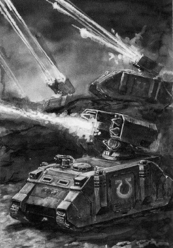
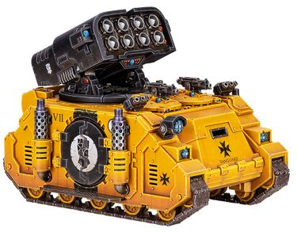
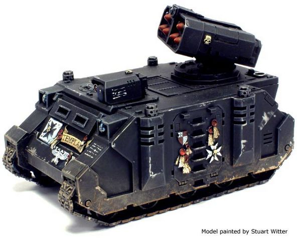
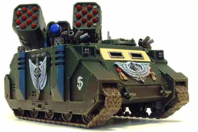
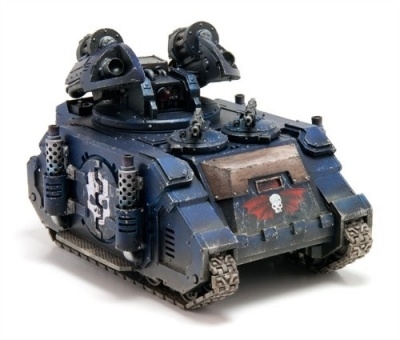
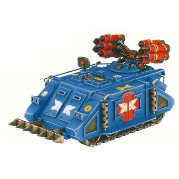

# 1525 旋风火炮坦克 Whirlwind Artillery Tank

精校状态：中文行文已逐段精校，部分术语仍为暂定

分类：载具 / 地面 / 火炮

原文来源：https://www.bilibili.com/opus/1040706546179244057

原作者：帝国神选罐头

原文时间：编辑于 2026年09月11日 08:24

[返回分类目录](目录.md) · [全书目录](../../目录.md)

<!-- A1525-B0001 -->
**英文原文**

The Whirlwind Artillery Tank is a Rhino-based multiple rocket launcher. One of the few indirect-fire vehicles fielded by the Space Marines besides the Land Raider Helios, the Whirlwind provides accurate fire support for the suppression of numerous or highly-mobile enemies. It can also be used as an air defense system in situations where air support is not available.

<!-- /A1525-B0001 -->

<!-- A1525-B0002 -->

原译文

旋风火炮坦克是一种基于犀牛的多管火箭炮。旋风是除兰德掠袭者赫利俄斯之外，星际战士为数不多的间接火力车辆之一，它为压制数量众多或高度机动的敌人提供了精确的火力支援。在没有空中支援的情况下，它也可以用作防空系统。

**校订译文**

旋风战车是以犀牛底盘制造的多联火箭发射车。它与赫利俄斯型兰德掠袭者战车一样，是星际战士为数不多的间接火力车辆，负责以精确炮火压制数量众多或机动性强的敌人。缺乏空中支援时，它也可充当防空系统。

<!-- /A1525-B0002 -->

<!-- A1525-B0003 图片 -->

<!-- A1525-B0004 -->

原译文

Whirlwinds open fire 旋风开火

**校订译文**

Whirlwinds open fire 旋风开火

<!-- /A1525-B0004 -->

<!-- A1525-B0005 -->
## History 历史

<!-- /A1525-B0005 -->

<!-- A1525-B0006 -->
**英文原文**

Based off the STC of the venerable Rhino APC, the Whirlwind was developed as a mobile artillery piece. The more familiar modern version was developed during the Great Crusade after the Scorpius, whose auto-loading launcher was effective against strongpoints or concentrations of enemies but was insufficient for saturation fire over a wide area.

<!-- /A1525-B0006 -->

<!-- A1525-B0007 -->

原译文

基于历史悠久的犀牛APC的STC，旋风被开发为一种移动火炮。更熟悉的现代版本是在天蝎座之后大远征期间开发的，其自动装载发射器对据点或敌人集群有效，但不足以在大范围内进行饱和射击。

**校订译文**

旋风以古老犀牛装甲运兵车的STC设计为基础，作为自行火炮研制。人们更熟悉的现代版本在大远征期间出现，晚于天蝎型。天蝎型的自动装填发射器擅长攻击据点和密集目标，却难以进行大范围饱和轰击。

<!-- /A1525-B0007 -->

<!-- A1525-B0008 图片 -->

<!-- A1525-B0009 -->

原译文

Deimos-pattern Whirlwind 火卫二型旋风

**校订译文**

Deimos-pattern Whirlwind 迪莫斯型旋风战车

<!-- /A1525-B0009 -->

<!-- A1525-B0010 -->
**英文原文**

While today known for its use by the Space Marines, the original Whirlwind multiple missile launcher was first fielded by the Imperial Army. This weapon was later field tested on the Rhino chassis during the latter years of the Great Crusade, though it had not yet been approved for mass production when the Horus Heresy began. The modern incarnation of the Whirlwind was first used by members of the Salamanders Legion during the Heresy in the Purging of Taral III.

<!-- /A1525-B0010 -->

<!-- A1525-B0011 -->

原译文

虽然现今以星际战士的使用而闻名，但最初的旋风多管导弹发射器最初是由帝国军队部署的。在大远征的后期，这种武器后来在犀牛底盘上进行了实地测试，尽管在荷鲁斯叛乱开始时，它尚未被批准大规模生产。旋风的现代化身最早是由火蜥蜴军团的成员在叛乱期间的塔拉尔三号净化期间使用的。

**校订译文**

如今旋风以星际战士装备的身份闻名，但最初的旋风多联导弹发射器首先由帝国军使用。大远征后期，这种武器被安装在犀牛底盘上进行战地测试；到荷鲁斯之乱爆发时，尚未获准量产。接近现代形态的旋风，最早由火蜥蜴军团在荷鲁斯之乱期间的塔拉尔三号净化行动中使用。

<!-- /A1525-B0011 -->

<!-- A1525-B0012 -->
## Whirlwind Helios 旋风赫利俄斯

<!-- /A1525-B0012 -->

<!-- A1525-B0013 -->
**英文原文**

Based upon the Rhino chassis, the Whirlwind is both fast and mobile, able to keep up with a Space Marine battlegroup. Because the number of Whirlwinds available to a Chapter is limited (typically between twenty and thirty for most), the ability to engage the enemy and rapidly change positions to avoid counter-battery is prized more than masses of long-ranged, slower artillery commonly used by the Imperial Guard. Its target acquisition and telemetry gear also allows the Whirlwind to engage the enemy from behind cover with far better accuracy than conventional artillery. The Whirlwind can also be converted into an anti-aircraft vehicle when issued with short-ranged AA missiles, although this task is better suited to specialised variants such as the Hyperios.

<!-- /A1525-B0013 -->

<!-- A1525-B0014 -->

原译文

基于犀牛底盘，旋风既快速又机动，能够跟上星际战士的战斗群。由于一个战团可用的旋风数量有限（通常在20到30之间），因此与帝国卫队通常使用的远程慢速火炮相比，与敌人交战并迅速改变位置以避免反炮兵的能力更为重要。它的目标捕获和遥测设备也使旋风能够从掩体后以比传统火炮高得多的精度与敌人交战。当配备短程放空导弹时，旋风也可以改装成防空车辆，尽管这项任务更适合许珀里翁等专用变体。

**校订译文**

犀牛底盘使旋风兼具速度与机动性，能够跟上星际战士战斗群。大多数战团仅有20至30辆旋风，因此，相比帝国卫队常用的大量远程慢速火炮，战团更重视开火后迅速转移、躲避敌方反炮兵射击的能力。目标捕获和遥测设备使旋风能藏在掩体后射击，精度远高于传统火炮。换装短程防空导弹后，它也能执行防空任务，不过许珀里翁等专用改型更适合这一职责。

<!-- /A1525-B0014 -->

<!-- A1525-B0015 -->
**英文原文**

The most common type of Whirlwind is the 'Helios' pattern, though differences between most Whirlwinds is simply a matter of how many missiles can be fired. When fully loaded, the Helios' missile launcher commonly carries six missiles. However, because these missiles can only be manually reloaded, the Whirlwind must withdraw after firing in order to rearm. In spite of this, the transport capacity inherited from the Rhino allows for a large ammunition stockpile, and some Chapters equip each vehicle with a Servitor dedicated to speeding up the reload process.

<!-- /A1525-B0015 -->

<!-- A1525-B0016 -->

原译文

最常见的旋风类型是“赫利俄斯”型，尽管大多数旋风之间的差异只是可以发射多少枚导弹的问题。当满载时，赫利俄斯的导弹发射器通常携带六枚导弹。然而，由于这些导弹只能手动重新装弹，旋风在导弹发射后必须撤退才能重新武装。尽管如此，从犀牛继承的运输能力允许大量弹药库存，一些战团为每辆车配备了一个机仆，专门用于加快重新装填过程。

**校订译文**

最常见的旋风是赫利俄斯型；多数型号的主要区别，在于可发射的导弹数量。赫利俄斯型发射器满载时通常装有6枚导弹。由于只能手动装填，射完后必须退出交战位置重新装弹。不过，犀牛底盘留下的内部空间可储存大量备弹，一些战团还为每辆车配备专职机仆，以加快装填。

<!-- /A1525-B0016 -->

<!-- A1525-B0017 图片 -->

<!-- A1525-B0018 -->

原译文

Whirlwind Helios 旋风赫利俄斯

**校订译文**

Whirlwind Helios 旋风赫利俄斯

<!-- /A1525-B0018 -->

<!-- A1525-B0019 -->
**英文原文**

The main missile types includes the Vengeance pattern high explosive warheads, that balances size, weight, range and payload providing the Space Marines with the most effective form of artillery support at their disposal. Another main type - is the Castellan incendary warheads that sacrifices explosive power for the ability to engulf the target in a rain of searing flame. For some period of time the Astartes utilized a special form of missile that provided a scuttering fire of sub-munitions across the broad target zone - the result of some newly discovered STC imprint. But this variant saw only limited use because it was outright unsuitable to the Marine's aggressive style of combat.

<!-- /A1525-B0019 -->

<!-- A1525-B0020 -->

原译文

主要的导弹类型包括复仇式高爆弹头，它平衡了尺寸、重量、射程和有效载荷，为星际战士提供了最有效的火炮支援。另一种主要类型是堡主燃烧弹头，它牺牲了爆炸力，以便用灼热的火焰雨吞噬目标。在一段时间内，阿斯塔特使用了一种特殊形式的导弹，这种导弹在广阔的目标区域内提供了子弹般的快速射击，这是一些新发现的STC模版的结果。但这种变体的使用有限，因为它完全不适合星际战士的侵略性战斗风格。

**校订译文**

主要弹种之一是复仇型高爆弹，它在尺寸、重量、射程与战斗部载荷之间取得平衡，为星际战士提供高效的炮火支援。另一主要弹种是堡主型燃烧弹，牺牲爆破威力，换取以灼热火雨吞没目标的能力。阿斯塔特还曾使用一种基于新发现STC模板的特殊导弹，可将大量子弹药散布到广阔目标区。但它与星际战士积极进攻的作战方式不相适应，因而只获有限使用。

**校注：** sub-munitions是子弹药，不是子弹或快速射击。

<!-- /A1525-B0020 -->

<!-- A1525-B0021 -->
**英文原文**

It is considered that other exotic missile types exists or have existed in the past and passed out from common employment. Other types mentioned in the archives includes melta and plasma warheads, missiles with powerful gases and chemicals of various types, anti-plant, tanglefoot, haywire and even the feared vortex warheads as well as countless others. But in the 41st Millennium such types if they even still exist is believed to reside only in Deathwatch quantium-sealed stasis batteries and/or they may simply be reserved only for special situations which the standard missiles of the Whirlwind is not able to counter.

<!-- /A1525-B0021 -->

<!-- A1525-B0022 -->

原译文

据认为，其他奇异的导弹类型存在或过去曾存在，并从普遍使用中消失。档案中提到的其他类型包括热熔和等离子弹头、含有各种类型强效气体和化学物质的导弹、反植物、缠足、故障，甚至还有令人恐惧的涡旋弹头以及无数其他类型的弹头。但在第41个千年，这种类型（如果它们仍然存在的话）被认为只存在于死亡守望量子密封的停滞舱中，和/或它们可能只是被保留用于旋风标准导弹无法应对的特殊情况。

**校订译文**

人们认为，过去曾存在或如今仍有其他罕见弹种，只是已退出常规使用。档案提及热熔弹头、等离子弹头、装填强效气体或各类化学药剂的导弹，以及除植、缠足、紊乱乃至令人畏惧的涡旋弹头等。到第41个千年，如果这些弹药仍然存在，据信也只封存在死亡守望以量子封印密封的停滞储库中，或专门保留给标准旋风导弹无法应对的特殊任务。

<!-- /A1525-B0022 -->

<!-- A1525-B0023 -->
**英文原文**

When required to provide indirect fire support against massed targets over long ranges, Whirlwinds will also form into Suppression Forces, with a Land Speeder modified to function as an artillery spotter.

<!-- /A1525-B0023 -->

<!-- A1525-B0024 -->

原译文

当需要对远距离聚集的目标提供间接火力支援时，旋风还将形成压制部队，并改装一辆兰德速攻艇作为火炮观察员。

**校订译文**

需要对远处密集目标实施间接火力支援时，旋风会组成压制部队，并配属一辆改装为炮兵观察平台的兰德速攻艇。

<!-- /A1525-B0024 -->

<!-- A1525-B0025 -->
### Equipment 装备

原题：Equipment 设备

<!-- /A1525-B0025 -->

<!-- A1525-B0026 -->
**英文原文**

In addition to its primary weapon, the Whirlwind also comes with a Searchlight and Smoke Launchers as standard. It can be upgraded with Dozer Blades, Extra Armour, a Hunter-killer Missile, and a Storm Bolter.

<!-- /A1525-B0026 -->

<!-- A1525-B0027 -->

原译文

除了主要武器外，旋风还标配探照灯和烟雾发射器。它可以用推土机铲刀、额外装甲、猎手飞弹和风暴爆矢枪进行升级。

**校订译文**

除主武器外，旋风标配探照灯和烟雾发射器，还可加装推土铲、附加装甲、猎杀导弹和风暴爆矢枪。

<!-- /A1525-B0027 -->

<!-- A1525-B0028 -->
### Technical Information 技术资料

原题：Technical Information 技术信息

<!-- /A1525-B0028 -->

<!-- A1525-B0029 -->
**英文原文**

Vehicle Name:Whirlwind Helios

<!-- /A1525-B0029 -->

<!-- A1525-B0030 -->

原译文

载具名称：旋风赫利俄斯

**校订译文**

载具名称：旋风赫利俄斯

<!-- /A1525-B0030 -->

<!-- A1525-B0031 -->
**英文原文**

Forge World of Origin:Helios

<!-- /A1525-B0031 -->

<!-- A1525-B0032 -->

原译文

起源铸造世界：赫利俄斯

**校订译文**

起源铸造世界：赫利俄斯

<!-- /A1525-B0032 -->

<!-- A1525-B0033 -->
**英文原文**

Known Patterns:I-V

<!-- /A1525-B0033 -->

<!-- A1525-B0034 -->

原译文

已知型号：I - V

**校订译文**

已知型号：I - V

<!-- /A1525-B0034 -->

<!-- A1525-B0035 -->
**英文原文**

Crew:Driver, Gunner

<!-- /A1525-B0035 -->

<!-- A1525-B0036 -->

原译文

乘员：驾驶员，炮手

**校订译文**

乘员：驾驶员，炮手

<!-- /A1525-B0036 -->

<!-- A1525-B0037 -->
**英文原文**

Powerplant:Quad MkII Adaptable Thermic Combustor Reactor

<!-- /A1525-B0037 -->

<!-- A1525-B0038 -->

原译文

动力装置：阔德MkII适应性热燃烧反应堆

**校订译文**

动力装置：4台MkII自适应热燃烧反应堆

<!-- /A1525-B0038 -->

<!-- A1525-B0039 -->
**英文原文**

Weight:33.0 tonnes

<!-- /A1525-B0039 -->

<!-- A1525-B0040 -->

原译文

重量：33.0吨

**校订译文**

重量：33.0吨

<!-- /A1525-B0040 -->

<!-- A1525-B0041 -->
**英文原文**

Length:6.6m

<!-- /A1525-B0041 -->

<!-- A1525-B0042 -->

原译文

长度：6.6米

**校订译文**

长度：6.6米

<!-- /A1525-B0042 -->

<!-- A1525-B0043 -->
**英文原文**

Width:4.5m

<!-- /A1525-B0043 -->

<!-- A1525-B0044 -->

原译文

宽度：4.5米

**校订译文**

宽度：4.5米

<!-- /A1525-B0044 -->

<!-- A1525-B0045 -->
**英文原文**

Height:5.0m

<!-- /A1525-B0045 -->

<!-- A1525-B0046 -->

原译文

高度：5.0米

**校订译文**

高度：5.0米

<!-- /A1525-B0046 -->

<!-- A1525-B0047 -->
**英文原文**

Ground Clearance:0.44m

<!-- /A1525-B0047 -->

<!-- A1525-B0048 -->

原译文

离地间隙：0.44米

**校订译文**

离地间隙：0.44米

<!-- /A1525-B0048 -->

<!-- A1525-B0049 -->
**英文原文**

Max Speed - on road68kph

<!-- /A1525-B0049 -->

<!-- A1525-B0050 -->

原译文

最大速度-公路68公里/小时

**校订译文**

最大速度-公路68公里/小时

<!-- /A1525-B0050 -->

<!-- A1525-B0051 -->
**英文原文**

Max Speed - off road:50kph

<!-- /A1525-B0051 -->

<!-- A1525-B0052 -->

原译文

最大速度-越野：50公里/小时

**校订译文**

最大速度-越野：50公里/小时

<!-- /A1525-B0052 -->

<!-- A1525-B0053 -->
**英文原文**

Transport Capacity:N/A

<!-- /A1525-B0053 -->

<!-- A1525-B0054 -->

原译文

运输能力：无

**校订译文**

运兵能力：不适用

<!-- /A1525-B0054 -->

<!-- A1525-B0055 -->
**英文原文**

Access Points:N/A

<!-- /A1525-B0055 -->

<!-- A1525-B0056 -->

原译文

入口：无

**校订译文**

出入口：不适用

<!-- /A1525-B0056 -->

<!-- A1525-B0057 -->
**英文原文**

Main Armament:Whirlwind multiple missile launcher

<!-- /A1525-B0057 -->

<!-- A1525-B0058 -->

原译文

主武器：旋风多管导弹发射器

**校订译文**

主武器：旋风多管导弹发射器

<!-- /A1525-B0058 -->

<!-- A1525-B0059 -->
**英文原文**

Secondary Armament:N/A

<!-- /A1525-B0059 -->

<!-- A1525-B0060 -->

原译文

次要武器：无

**校订译文**

副武器：不适用

<!-- /A1525-B0060 -->

<!-- A1525-B0061 -->
**英文原文**

Traverse:360°

<!-- /A1525-B0061 -->

<!-- A1525-B0062 -->

原译文

横向：360°

**校订译文**

水平射界：360°

<!-- /A1525-B0062 -->

<!-- A1525-B0063 -->
**英文原文**

Elevation:From -0° to +55°

<!-- /A1525-B0063 -->

<!-- A1525-B0064 -->

原译文

仰角：从-0°到+55°

**校订译文**

俯仰角：0°至＋55°

<!-- /A1525-B0064 -->

<!-- A1525-B0065 -->
**英文原文**

Main Ammunition:60 missiles

<!-- /A1525-B0065 -->

<!-- A1525-B0066 -->

原译文

主要弹药：60枚导弹

**校订译文**

主武器载弹量：60枚导弹

<!-- /A1525-B0066 -->

<!-- A1525-B0067 -->
**英文原文**

Secondary Ammunition:N/A

<!-- /A1525-B0067 -->

<!-- A1525-B0068 -->

原译文

次要弹药：无

**校订译文**

副武器弹药：不适用

<!-- /A1525-B0068 -->

<!-- A1525-B0069 -->
### Armour 装甲

<!-- /A1525-B0069 -->

<!-- A1525-B0070 -->
**英文原文**

Superstructure:60mm

<!-- /A1525-B0070 -->

<!-- A1525-B0071 -->

原译文

上部结构：60毫米

**校订译文**

上部结构：60毫米

<!-- /A1525-B0071 -->

<!-- A1525-B0072 -->
**英文原文**

Hull:60mm

<!-- /A1525-B0072 -->

<!-- A1525-B0073 -->

原译文

车体：60毫米

**校订译文**

车体：60毫米

<!-- /A1525-B0073 -->

<!-- A1525-B0074 -->
**英文原文**

Gun Mantlet:N/A

<!-- /A1525-B0074 -->

<!-- A1525-B0075 -->

原译文

炮盾：无

**校订译文**

炮盾：不适用

<!-- /A1525-B0075 -->

<!-- A1525-B0076 -->
**英文原文**

Vehicle Designation:0120-766-0810-WW033

<!-- /A1525-B0076 -->

<!-- A1525-B0077 -->

原译文

载具编号：0120-766-0810-WW033

**校订译文**

载具编号：0120-766-0810-WW033

<!-- /A1525-B0077 -->

<!-- A1525-B0078 -->
**英文原文**

Firing Ports:N/A

<!-- /A1525-B0078 -->

<!-- A1525-B0079 -->

原译文

开火口：无

**校订译文**

射击孔：不适用

<!-- /A1525-B0079 -->

<!-- A1525-B0080 -->
**英文原文**

Turret:30mm

<!-- /A1525-B0080 -->

<!-- A1525-B0081 -->

原译文

炮塔：30毫米

**校订译文**

炮塔：30毫米

<!-- /A1525-B0081 -->

<!-- A1525-B0082 -->
### Named Whirlwind Helios 著名旋风赫利俄斯

<!-- /A1525-B0082 -->

<!-- A1525-B0083 -->
**英文原文**

Daceus - Attached to the Howling Griffons Fifth Company.

<!-- /A1525-B0083 -->

<!-- A1525-B0084 -->

原译文

达修斯 - 隶属于咆哮狮鹫第五连。

**校订译文**

达修斯号——配属咆哮狮鹫第五连。

<!-- /A1525-B0084 -->

<!-- A1525-B0085 -->
## Whirlwind Hyperios 旋风许珀里翁

<!-- /A1525-B0085 -->

<!-- A1525-B0086 -->
**英文原文**

The Whirlwind Hyperios is a specialized version of the standard Whirlwind used by many Chapters as an anti-aircraft vehicle. Instead of the typical armament of other Whirlwinds, the Hyperios mounts a specialized missile launcher, along with automated tracking and targeting equipment, dedicated to shooting down enemy aircraft and jetbikes. While it does not have the same reach as a Manticore AA missile it is highly efficient against low-flying craft making strafing runs. In a pinch the Hyperios can be used to target ground units, in which case its missiles act similar to Hunter-killer missiles, though this is mostly a method of last resort.

<!-- /A1525-B0086 -->

<!-- A1525-B0087 -->

原译文

旋风许珀里翁是许多战团用作防空车辆的标准旋风的专用版本。许珀里翁没有其他旋风的典型武器，而是安装了一个专门的导弹发射器，以及自动跟踪和瞄准设备，专门用于击落敌机和悬浮摩托。虽然它的射程不如蝎尾狮放空导弹，但它对低空飞行的飞机进行扫射非常有效。在紧急情况下，许珀里翁可用于瞄准地面部队，在这种情况下，其导弹的作用类似于猎杀飞弹，尽管这主要是最后的手段。

**校订译文**

许珀里翁型旋风是许多战团使用的专门防空改型。它以专用导弹发射器取代普通旋风的武器，并配备自动追踪、瞄准系统，用于击落敌机和喷气摩托。其射程不及蝎尾狮防空导弹，却很擅长打击正在低空扫射的飞行器。紧急时，它也能攻击地面目标，导弹效果类似猎杀导弹，但通常只有迫不得已才这样使用。

**校注：** 原译把敌机低空扫射误成车辆对敌机扫射；已恢复施受关系。

<!-- /A1525-B0087 -->

<!-- A1525-B0088 图片 -->

<!-- A1525-B0089 -->

原译文

Whirlwind Hyperios 旋风许珀里翁

**校订译文**

Whirlwind Hyperios 旋风许珀里翁

<!-- /A1525-B0089 -->

<!-- A1525-B0090 -->
**英文原文**

During the Moirae Schism all of the Whirlwing Hyperios' produced on the Moirae Forge World were desecrated by fellow Tech-Priests, which insinuated into the vehicles' hidden ciphers that blocked the Whirlwind's systems upon receiving the relevant code. Due to this even after the ending of the Schism some of the Space Marines Chapters refuse to deploy even a single Whirlwind Hyperios in battle, fearing that these "blessed" battle machines can betray them in the heat of a conflict.

<!-- /A1525-B0090 -->

<!-- A1525-B0091 -->

原译文

在摩伊赖分裂期间，所有在摩伊赖铸造世界生产的旋风许珀里翁都被其他技术神甫亵渎，他们暗示了车辆的隐藏密码，这些密码在收到相关代码后锁定了旋风的系统。因此，即使在分裂结束后，一些星际战士战团也拒绝在战斗中部署哪怕一架旋风许珀里翁，担心这些“幸运的”战斗机械会在激烈冲突时背叛他们。

**校订译文**

摩伊赖分裂期间，该铸造世界生产的所有许珀里翁型旋风都遭到技术祭司暗中破坏：他们在车内植入隐藏指令，一旦收到特定代码，就会锁死车辆系统。因此，分裂结束后仍有一些星际战士战团拒绝部署哪怕一辆许珀里翁型，担心这些“受祝福”的战争机器会在激战中背叛他们。

**校注：** insinuated指暗中植入；blessed意为受祝福，不是幸运。英文Whirlwing拼写照留。

<!-- /A1525-B0091 -->

<!-- A1525-B0092 -->
### Technical Specifications 技术信息

<!-- /A1525-B0092 -->

<!-- A1525-B0093 -->
**英文原文**

Vehicle Name:Whirlwind Hyperios

<!-- /A1525-B0093 -->

<!-- A1525-B0094 -->

原译文

载具名称：旋风许珀里翁

**校订译文**

载具名称：旋风许珀里翁

<!-- /A1525-B0094 -->

<!-- A1525-B0095 -->
**英文原文**

Forge World of Origin:Phaeton

<!-- /A1525-B0095 -->

<!-- A1525-B0096 -->

原译文

起源铸造世界：法厄同

**校订译文**

起源铸造世界：法厄同

<!-- /A1525-B0096 -->

<!-- A1525-B0097 -->
**英文原文**

Known Patterns:I-IV

<!-- /A1525-B0097 -->

<!-- A1525-B0098 -->

原译文

已知型号：I - IV

**校订译文**

已知型号：I - IV

<!-- /A1525-B0098 -->

<!-- A1525-B0099 -->
**英文原文**

Crew:Driver, Gunner

<!-- /A1525-B0099 -->

<!-- A1525-B0100 -->

原译文

乘员：驾驶员，炮手

**校订译文**

乘员：驾驶员，炮手

<!-- /A1525-B0100 -->

<!-- A1525-B0101 -->
**英文原文**

Powerplant:Quad MkII Adaptable Thermic Combustor Reactor

<!-- /A1525-B0101 -->

<!-- A1525-B0102 -->

原译文

动力装置：阔德MkII适应性热燃烧反应堆

**校订译文**

动力装置：4台MkII自适应热燃烧反应堆

<!-- /A1525-B0102 -->

<!-- A1525-B0103 -->
**英文原文**

Weight:33.0 tonnes

<!-- /A1525-B0103 -->

<!-- A1525-B0104 -->

原译文

重量：33.0吨

**校订译文**

重量：33.0吨

<!-- /A1525-B0104 -->

<!-- A1525-B0105 -->
**英文原文**

Length:6.6m

<!-- /A1525-B0105 -->

<!-- A1525-B0106 -->

原译文

长度：6.6米

**校订译文**

长度：6.6米

<!-- /A1525-B0106 -->

<!-- A1525-B0107 -->
**英文原文**

Width:4.5m

<!-- /A1525-B0107 -->

<!-- A1525-B0108 -->

原译文

宽度：4.5米

**校订译文**

宽度：4.5米

<!-- /A1525-B0108 -->

<!-- A1525-B0109 -->
**英文原文**

Height:5.2m

<!-- /A1525-B0109 -->

<!-- A1525-B0110 -->

原译文

高度：5.2米

**校订译文**

高度：5.2米

<!-- /A1525-B0110 -->

<!-- A1525-B0111 -->
**英文原文**

Ground Clearance:0.44m

<!-- /A1525-B0111 -->

<!-- A1525-B0112 -->

原译文

离地间隙：0.44米

**校订译文**

离地间隙：0.44米

<!-- /A1525-B0112 -->

<!-- A1525-B0113 -->
**英文原文**

Max Speed - on road68kph

<!-- /A1525-B0113 -->

<!-- A1525-B0114 -->

原译文

最大速度-公路68公里/小时

**校订译文**

最大速度-公路68公里/小时

<!-- /A1525-B0114 -->

<!-- A1525-B0115 -->
**英文原文**

Max Speed - off road:50kph

<!-- /A1525-B0115 -->

<!-- A1525-B0116 -->

原译文

最大速度-越野：50公里/小时

**校订译文**

最大速度-越野：50公里/小时

<!-- /A1525-B0116 -->

<!-- A1525-B0117 -->
**英文原文**

Transport Capacity:N/A

<!-- /A1525-B0117 -->

<!-- A1525-B0118 -->

原译文

运输能力：无

**校订译文**

运兵能力：不适用

<!-- /A1525-B0118 -->

<!-- A1525-B0119 -->
**英文原文**

Access Points:N/A

<!-- /A1525-B0119 -->

<!-- A1525-B0120 -->

原译文

入口：无

**校订译文**

出入口：不适用

<!-- /A1525-B0120 -->

<!-- A1525-B0121 -->
**英文原文**

Main Armament:Hyperios missile launcher

<!-- /A1525-B0121 -->

<!-- A1525-B0122 -->

原译文

主要武器：许珀里翁导弹发射器

**校订译文**

主要武器：许珀里翁导弹发射器

<!-- /A1525-B0122 -->

<!-- A1525-B0123 -->
**英文原文**

Secondary Armament:N/A

<!-- /A1525-B0123 -->

<!-- A1525-B0124 -->

原译文

次要武器：无

**校订译文**

副武器：不适用

<!-- /A1525-B0124 -->

<!-- A1525-B0125 -->
**英文原文**

Traverse:360°

<!-- /A1525-B0125 -->

<!-- A1525-B0126 -->

原译文

横向：360°

**校订译文**

水平射界：360°

<!-- /A1525-B0126 -->

<!-- A1525-B0127 -->
**英文原文**

Elevation:From -0° to +65°

<!-- /A1525-B0127 -->

<!-- A1525-B0128 -->

原译文

仰角：从-0°到+65°

**校订译文**

俯仰角：0°至＋65°

<!-- /A1525-B0128 -->

<!-- A1525-B0129 -->
**英文原文**

Main Ammunition:40 missiles

<!-- /A1525-B0129 -->

<!-- A1525-B0130 -->

原译文

主要弹药：40枚导弹

**校订译文**

主武器载弹量：40枚导弹

<!-- /A1525-B0130 -->

<!-- A1525-B0131 -->
**英文原文**

Secondary Ammunition:N/A

<!-- /A1525-B0131 -->

<!-- A1525-B0132 -->

原译文

次要弹药：无

**校订译文**

副武器弹药：不适用

<!-- /A1525-B0132 -->

<!-- A1525-B0133 -->
### Armour 装甲

<!-- /A1525-B0133 -->

<!-- A1525-B0134 -->
**英文原文**

Superstructure:60mm

<!-- /A1525-B0134 -->

<!-- A1525-B0135 -->

原译文

上部结构：60毫米

**校订译文**

上部结构：60毫米

<!-- /A1525-B0135 -->

<!-- A1525-B0136 -->
**英文原文**

Hull:60mm

<!-- /A1525-B0136 -->

<!-- A1525-B0137 -->

原译文

车体：60毫米

**校订译文**

车体：60毫米

<!-- /A1525-B0137 -->

<!-- A1525-B0138 -->
**英文原文**

Gun Mantlet:N/A

<!-- /A1525-B0138 -->

<!-- A1525-B0139 -->

原译文

炮盾：无

**校订译文**

炮盾：不适用

<!-- /A1525-B0139 -->

<!-- A1525-B0140 -->
**英文原文**

Vehicle Designation:0120-766-0810-WW161

<!-- /A1525-B0140 -->

<!-- A1525-B0141 -->

原译文

载具编号：0120-766-0810-WW161

**校订译文**

载具编号：0120-766-0810-WW161

<!-- /A1525-B0141 -->

<!-- A1525-B0142 -->
**英文原文**

Firing Ports:N/A

<!-- /A1525-B0142 -->

<!-- A1525-B0143 -->

原译文

开火口：无

**校订译文**

射击孔：不适用

<!-- /A1525-B0143 -->

<!-- A1525-B0144 -->
**英文原文**

Turret:30mm

<!-- /A1525-B0144 -->

<!-- A1525-B0145 -->

原译文

炮塔：30毫米

**校订译文**

炮塔：30毫米

<!-- /A1525-B0145 -->

<!-- A1525-B0146 -->
## Named Whirlwind Hyperios 著名旋风许珀里翁

<!-- /A1525-B0146 -->

<!-- A1525-B0147 -->
**英文原文**

Ferrus Annihilatus — of the War Bearers Chapter

<!-- /A1525-B0147 -->

<!-- A1525-B0148 -->

原译文

钢铁毁灭 — 承战者战团

**校订译文**

钢铁毁灭号——承战者战团所属。

<!-- /A1525-B0148 -->

<!-- A1525-B0149 -->
## Whirlwind Scorpius 天蝎型旋风战车

原题：Whirlwind Scorpius 旋风天蝎座

<!-- /A1525-B0149 -->

<!-- A1525-B0150 -->
**英文原文**

An ancient variant of the more common Whirlwind, the Scorpius was built on a Deimos Pattern Rhino chassis. The Whirlwind Scorpius' origins go back to the opening days of the Great Crusade, where it was created at the behest of the Space Wolves to aid them in the campaign against the fortified cities of the Xenos Ghassulian. Today it has become an all but forgotten relic. The ability to manufacture its complex munitions seems to have become a forgotten art, but for the Chapters it still remains as a potent weapon of war whenever it's deployed.

<!-- /A1525-B0150 -->

<!-- A1525-B0151 -->

原译文

天蝎座是更常见的旋风的一种古老变体，它建在火卫二型的犀牛底盘上。旋风天蝎座的起源可以追溯到大远征的最初几天，在那里，它是在太空野狼的命令下制造的，以帮助他们对抗加苏利安异型的设防城市。如今，它已成为几乎被遗忘的遗物。制造复杂弹药的能力似乎已经成为一门被遗忘的技艺，但对于各战团来说，无论何时部署，它仍然是一种强大的战争武器。

**校订译文**

天蝎型是旋风的古老改型，采用迪莫斯型犀牛底盘。其起源可追溯至大远征初期：太空野狼要求研制这种车辆，以帮助攻打加苏利安异形的坚固城市。如今，它已成为几乎被遗忘的古代遗物，其复杂弹药的制造技艺似乎也已失传。然而，对于仍保有天蝎型的战团而言，它每次出战仍是一件强大的战争利器。

<!-- /A1525-B0151 -->

<!-- A1525-B0152 图片 -->

<!-- A1525-B0153 -->

原译文

Whirlwind Scorpius 旋风天蝎座

**校订译文**

Whirlwind Scorpius 天蝎型旋风战车

<!-- /A1525-B0153 -->

<!-- A1525-B0154 -->
**英文原文**

The Scorpius replaces the Whirlwind Multiple Missile Launcher with drum-fed Scorpius Launchers, whose warheads cause implosions devastating to both infantry and light vehicles.

<!-- /A1525-B0154 -->

<!-- A1525-B0155 -->

原译文

天蝎座用鼓式天蝎座发射器取代了旋风多管导弹发射器，其弹头会对步兵和轻型载具造成毁灭性的内爆。

**校订译文**

天蝎型以弹鼓供弹的天蝎发射器，取代旋风多联导弹发射器；其弹头可引发内爆，对步兵与轻型车辆造成毁灭性打击。

<!-- /A1525-B0155 -->

<!-- A1525-B0156 -->
### Named Whirlwind Scorpius 著名天蝎型旋风战车

原题：Named Whirlwind Scorpius 著名旋风天蝎座

<!-- /A1525-B0156 -->

<!-- A1525-B0157 -->
**英文原文**

Encarmine — of the Red Scorpions Chapter

<!-- /A1525-B0157 -->

<!-- A1525-B0158 -->

原译文

染赤 — 红蝎战团

**校订译文**

染赤号——红蝎战团所属。

<!-- /A1525-B0158 -->

<!-- A1525-B0159 -->
## Other Known Patterns 其他已知型号

<!-- /A1525-B0159 -->

<!-- A1525-B0160 -->
**英文原文**

Thalia pattern - ancient pattern with 12 smaller missiles

<!-- /A1525-B0160 -->

<!-- A1525-B0161 -->

原译文

塔利亚型号 - 带有12枚小型导弹的古代型号

**校订译文**

塔利亚型号 - 带有12枚小型导弹的古代型号

<!-- /A1525-B0161 -->

<!-- A1525-B0162 -->
**英文原文**

MkII Mars Pattern - holds ten missiles in twin clusters of five

<!-- /A1525-B0162 -->

<!-- A1525-B0163 -->

原译文

MkII火星型 - 以五枚为一对的形式，装有十枚导弹

**校订译文**

MkII火星型——装有10枚导弹，分为两组，每组5枚。

**校注：** twin clusters of five是两组各5枚，不是五枚为一对。

<!-- /A1525-B0163 -->

<!-- A1525-B0164 图片 -->

<!-- A1525-B0165 -->

原译文

Mk.II Mars Pattern Whirlwind MkII火星型旋风

**校订译文**

Mk.II Mars Pattern Whirlwind MkII火星型旋风

<!-- /A1525-B0165 -->

本篇核心术语与暂定项

以下列出本篇出现的英文原形及核心术语表用词。同形词可能指不同对象，具体词义以本篇正文和校注为准；单复数、别名和仅见于图注的名称可能尚未列入。完整候选见[术语表](../../术语表/双语术语候选.csv)。

| 英文 | 采用中文 | 状态 |
| --- | --- | --- |
| Space Marines | 星际战士 | 官方已核对 |
| Deathwatch | 死亡守望 | 官方已核对 |
| Space Wolves | 太空野狼 | 官方已核对 |
| Imperial Guard | 帝国卫队 | 暂定·语境区分 |
| Imperial Army | 帝国军 | 暂定·官方待核 |
| Horus Heresy | 荷鲁斯之乱 | 官方已核对 |
| Servitor | 机仆 | 暂定 |
| Equipment | 装备 | 编辑用语已统一 |
| Forge World | 铸造世界 | 暂定·官方待核 |
| Great Crusade | 大远征 | 暂定·官方待核 |
| Horus | 荷鲁斯 | 暂定·官方待核 |
| STC | 标准建造模板 | 暂定·官方待核 |
| Hunter-Killer | 猎杀者 | 暂定·官方待核 |
| Salamanders | 火蜥蜴 | 暂定·官方待核 |
| Mars | 火星 | 暂定·官方待核 |
| Deimos | 迪莫斯 | 暂定·官方待核 |
| Spotter | 观察手 | 暂定·官方待核 |
| Land Raider | 兰德掠袭者战车 | 官方已核对 |
| Tech | 技术语 | 暂定·官方待核 |
| Ancient | 旗手 | 官方已核对 |
| Rhino | 犀牛战车 | 官方已核对 |
| Whirlwind | 旋风战车 | 官方已核对 |
| Space Marine | 星际战士 | 暂定·官方待核 |
| Chapter | 战团 | 暂定·官方待核 |
| Red Scorpions | 红蝎 | 暂定·官方待核 |
| Whirlwinds | 旋风 | 暂定·官方待核 |
| Howling Griffons | 咆哮狮鹫 | 暂定·官方待核 |
| War Bearers | 承战者 | 暂定·官方待核 |
| Castellan | 堡主 | 官方已核对 |
| Land Raider Helios | 赫利俄斯型兰德掠袭者战车 | 暂定·官方待核 |
| Whirlwind Scorpius | 天蝎型旋风战车 | 暂定·官方待核 |
| Xenos | 异形 | 暂定·官方待核 |
| Moirae Schism | 摩伊赖分裂 | 暂定·官方待核 |
| Raider | 掠袭者飞艇 | 官方已核对 |
| Vengeance | 复仇号 | 暂定·官方待核 |
| Daceus | 达修斯（连长）／达修斯号（战车） | 语境定译·官方待核 |
| Ciphers | 密员 | 暂定·官方待核 |
| Gun | 甘 | 暂定·官方待核 |
| System | 星系（恒星系统） | 暂定·官方待核 |
| Moirae | 摩伊赖 | 暂定·官方待核 |
| Phaeton | 法厄同 | 暂定·官方待核 |
| Helios | 赫利俄斯 | 暂定·官方待核 |
| Missile Launcher | 导弹发射器 | 暂定·官方待核 |
| Rocket Launcher | 火箭发射器 | 暂定·官方待核 |
| Hunter-killer missile | 猎杀导弹 | 官方已核对 |
| Hyperios Missile Launcher | 许珀里翁导弹发射器 | 暂定·官方待核 |
| Hyperios Missile | 许珀里翁导弹 | 暂定·官方待核 |
| Whirlwind multiple missile launcher | 旋风多管导弹发射器 | 暂定·官方待核 |
| Bolter | 爆矢枪 | 暂定·官方待核 |
| Storm bolter | 风暴爆矢枪 | 官方已核对 |
| Manticore | 蝎尾狮导弹车 | 官方已核对 |
| Extra Armour | 额外装甲 | 暂定·官方待核 |
| Whirlwind Helios | 赫利俄斯型旋风战车 | 暂定·官方待核 |
| Whirlwind Hyperios | 许珀里翁型旋风战车 | 暂定·官方待核 |
| Ferrus Annihilatus | 钢铁毁灭号 | 暂定·官方待核 |
| Ghassulian | 加苏利安 | 暂定·官方待核 |

