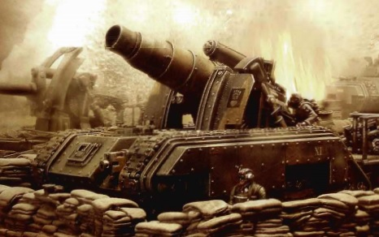
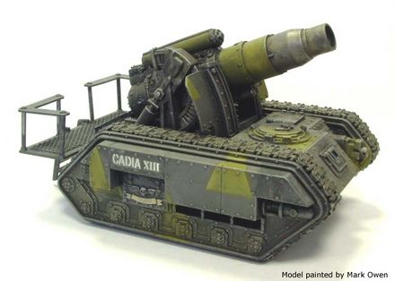
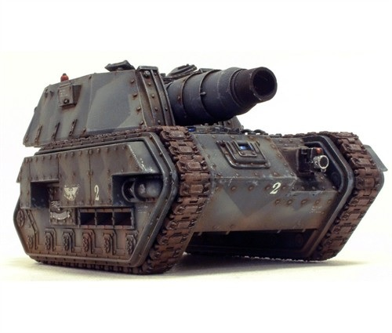
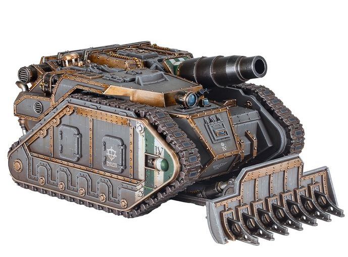

# 1526 美杜莎攻城坦克 Medusa Siege Tank

精校状态：中文行文已逐段精校，部分术语仍为暂定

分类：载具 / 地面 / 火炮

原文来源：https://www.bilibili.com/opus/1047023030047342593

原作者：帝国神选罐头

原文时间：2025年03月22日 12:24

[返回分类目录](目录.md) · [全书目录](../../目录.md)

<!-- A1526-B0001 -->
**英文原文**

The Medusa Siege Tank is an aging Imperial Guard siege platform used when attacking the thick walls of an enemy-held city or fortress. Built on the Chimera chassis, the Medusa suffers from a number of disadvantages compared to other artillery pieces like the Basilisk or Griffon, but its immense firepower ensures its continued use in the siege warfare depressingly common to the 41st Millennium.

<!-- /A1526-B0001 -->

<!-- A1526-B0002 -->

原译文

美杜莎攻城坦克是一种老式的帝国卫队攻城平台，用于攻击敌方控制的城市或堡垒的厚墙。美杜莎建立在奇美拉底盘上，与石化蜥蜴或狮鹫等其他火炮相比，美杜莎存在许多缺点，但其巨大的火力确保了它在第41个千年的压抑的攻城战中的持续使用。

**校订译文**

美杜莎攻城坦克是一种老式帝国卫队攻城平台，使用奇美拉底盘，专门轰击敌占城市或堡垒的厚重城墙。与石化蜥蜴、狮鹫等火炮相比，它有不少缺点，但火力极其强大。因此，在第41个千年频繁得令人沮丧的攻城战中，它仍有用武之地。

<!-- /A1526-B0002 -->

<!-- A1526-B0003 图片 -->

<!-- A1526-B0004 -->

原译文

Medusa Siege Tank 美杜莎攻城坦克

**校订译文**

Medusa Siege Tank 美杜莎攻城坦克

<!-- /A1526-B0004 -->

<!-- A1526-B0005 -->
## Overview 概述

<!-- /A1526-B0005 -->

<!-- A1526-B0006 -->
**英文原文**

The centerpiece of the siege tank is its Medusa Siege Gun which, unlike other artillery cannons, fires its heavy shells directly into the enemy's fortifications. It does this for days on end, from well-protected positions, until the constant barrage has created a large enough breach for friendly forces to assault through and secure a bridgehead. Beyond this limited role however the Medusa is less of a success. The gun itself is short-ranged compared to the weapons on Basilisks, Manticores, and even Bombards, limiting its use in a conventional artillery role. The Medusa also suffers from ammunition issues as it can only carry eighteen heavy shells; while not a problem during a siege with stable lines of resupply, this limits its endurance when operating in the field. It is viable as an urban assault gun, leveling enemy buildings with a single shot in support of infantry assaults, but such close-range fighting leaves the Medusa's exposed crew too vulnerable to enemy fire compared to the thick armour protecting Demolishers and Thunderers. For this reason many armoured regiments will have at most a battery of Medusas kept in reserve for use only when breaching a wall or assaulting a bunker line, as most commanders will avoid deploying them directly on the frontline if possible.

<!-- /A1526-B0006 -->

<!-- A1526-B0007 -->

原译文

攻城坦克的核心是它的美杜莎攻城炮，与其他火炮不同，它将重型炮弹直接发射到敌人的防御工事中。它从保护良好的阵地连续几天这样做，直到不断的炮击造成足够大的缺口，使友军能够进攻并守住桥头堡。然而，除了这一有限的作用外，美杜莎的成功率较低。与石化蜥蜴、蝎尾狮甚至臼炮上的武器相比，这种炮本身射程较短，限制了它在常规火炮中的使用。美杜莎也存在弹药问题，因为它只能携带18枚重型炮弹；虽然在有稳定补给线的攻城中不是问题，但这限制了它在野外作战时的持久力。它作为一种城市突击炮是可行的，可以一炮夷平敌人的建筑，以支援步兵的进攻，但与保护粉碎者和雷霆的厚装甲相比，这种近距离战斗使美杜莎暴露的乘员太容易受到敌人的火力攻击。出于这个原因，许多装甲团最多只会储备一批美杜莎，仅在突破墙壁或袭击地堡阵地时使用，因为大多数指挥官会尽可能避免将其直接部署在前线。

**校订译文**

其核心武器美杜莎攻城炮与一般火炮不同，会从防护良好的阵地将重型炮弹直接射向敌方工事，连续轰击数日，直到打开足够大的缺口，让友军突入并巩固突破口。除此以外，它的表现就不那么出色了：射程短于石化蜥蜴、蝎尾狮，甚至臼炮坦克，难以承担常规炮兵任务；载弹量也只有18发。攻城时有稳定补给，弹药尚不成问题，野战中的持续作战能力却因此受限。它也可充当城市突击炮，一炮摧毁建筑，支援步兵进攻；但近距离交战时，敞露的乘员很容易遭受敌方火力，防护远不及破坏者和雷霆的厚重装甲。因此，许多装甲团至多保留一个美杜莎炮兵连作为预备力量，只在破墙或攻击地堡防线时使用。多数指挥官会尽量避免把它直接部署在前线。

<!-- /A1526-B0007 -->

<!-- A1526-B0008 图片 -->

<!-- A1526-B0009 -->

原译文

Imperial Guard Medusa Siege Tank 帝国卫队美杜莎攻城坦克

**校订译文**

Imperial Guard Medusa Siege Tank 帝国卫队美杜莎攻城坦克

<!-- /A1526-B0009 -->

<!-- A1526-B0010 -->
**英文原文**

During the Great Crusade and Horus Heresy, the Medusa was used by Space Marine Legion siege units.

<!-- /A1526-B0010 -->

<!-- A1526-B0011 -->

原译文

在大远征和荷鲁斯叛乱期间，美杜莎被星际战士攻城部队使用。

**校订译文**

大远征和荷鲁斯之乱期间，星际战士军团的攻城部队也使用美杜莎。

<!-- /A1526-B0011 -->

<!-- A1526-B0012 -->
## Forge World Variations 铸造世界变体

<!-- /A1526-B0012 -->

<!-- A1526-B0013 -->
**英文原文**

Gryphonne IV - standard pattern

<!-- /A1526-B0013 -->

<!-- A1526-B0014 -->

原译文

格里芬四号 - 标准型

**校订译文**

格里芬四号 - 标准型

<!-- /A1526-B0014 -->

<!-- A1526-B0015 -->
**英文原文**

Armageddon - Hades pattern - fully enclosed fighting compartment

<!-- /A1526-B0015 -->

<!-- A1526-B0016 -->

原译文

阿玛吉多顿 - 哈迪斯型 - 全封闭战斗舱

**校订译文**

阿玛吉多顿 - 哈迪斯型 - 全封闭战斗舱

<!-- /A1526-B0016 -->

<!-- A1526-B0017 图片 -->

<!-- A1526-B0018 -->

原译文

Armageddon pattern Medusa 阿玛吉多顿型美杜莎

**校订译文**

Armageddon pattern Medusa 阿玛吉多顿型美杜莎

<!-- /A1526-B0018 -->

<!-- A1526-B0019 -->
**英文原文**

Vanaheim - Vanaheim pattern - distinctive gunshield

<!-- /A1526-B0019 -->

<!-- A1526-B0020 -->

原译文

华纳海姆 - 华纳海姆型 - 独特的炮盾

**校订译文**

瓦纳海姆——瓦纳海姆型，配有独特的炮盾。

<!-- /A1526-B0020 -->

<!-- A1526-B0021 -->
## Technical Specifications 技术信息

<!-- /A1526-B0021 -->

<!-- A1526-B0022 -->
**英文原文**

In addition to its Medusa Siege Gun the Medusa is also armed wit a hull-mounted weapon, either a Heavy Bolter or Heavy Flamer. Other standard equipment includes a Searchlight and Smoke Launchers. Common upgrades to the design include an Armoured Crew Compartment, Camo Netting, Dozer Blade, Extra Armour, a Hunter-Killer Missile and/or pintle-mounted Storm Bolter or Heavy Stubber.

<!-- /A1526-B0022 -->

<!-- A1526-B0023 -->

原译文

除了美杜莎攻城炮外，美杜莎还配备了一种车载武器，无论是重型爆矢枪还是重型火焰枪。其他标准设备包括探照灯和烟雾发射器。该设计的常见升级包括装甲乘员舱、迷彩网、推土机铲刀、额外装甲、猎人杀手导弹和/或枢轴安装的风暴螺栓或重型斯塔伯。

**校订译文**

除美杜莎攻城炮外，它还在车体上安装一挺重型爆矢枪或一具重型火焰喷射器。标准装备包括探照灯和烟幕发射器；常见升级包括装甲乘员舱、伪装网、推土铲、附加装甲、猎杀导弹，以及枢轴枪架上的风暴爆矢枪或重机枪。

<!-- /A1526-B0023 -->

<!-- A1526-B0024 图片 -->

<!-- A1526-B0025 -->

原译文

Solar Auxilia Medusa 太阳辅助军美杜莎

**校订译文**

Solar Auxilia Medusa 太阳辅助军美杜莎

<!-- /A1526-B0025 -->

<!-- A1526-B0026 -->
**英文原文**

Vehicle Name:Medusa Siege Gun

<!-- /A1526-B0026 -->

<!-- A1526-B0027 -->

原译文

车辆名称：美杜莎攻城炮

**校订译文**

车辆名称：美杜莎攻城炮

**校注：** 英文参数表用Medusa Siege Gun称车辆，正文则为Siege Tank；保留原字段所用称呼。

<!-- /A1526-B0027 -->

<!-- A1526-B0028 -->
**英文原文**

Forge World of Origin:Gryphonne IV

<!-- /A1526-B0028 -->

<!-- A1526-B0029 -->

原译文

起源铸造世界：格里芬IV号

**校订译文**

起源铸造世界：格里芬四号

<!-- /A1526-B0029 -->

<!-- A1526-B0030 -->
**英文原文**

Known Patterns:II-XIII

<!-- /A1526-B0030 -->

<!-- A1526-B0031 -->

原译文

已知型号：II-XIII

**校订译文**

已知型号：II-XIII

<!-- /A1526-B0031 -->

<!-- A1526-B0032 -->
**英文原文**

Crew:Commander, Gunner, Driver, 2 Loaders、

<!-- /A1526-B0032 -->

<!-- A1526-B0033 -->

原译文

乘员：指挥官、炮手、驾驶员、2名装载者

**校订译文**

乘员：车长、炮手、驾驶员、两名装填手

<!-- /A1526-B0033 -->

<!-- A1526-B0034 -->
**英文原文**

Powerplant:Vulcanor 16 Twin Coupled Multi-Burn

<!-- /A1526-B0034 -->

<!-- A1526-B0035 -->

原译文

力装置：Vulcanor 16双耦合多程燃烧

**校订译文**

动力装置：Vulcanor 16 双联多燃料发动机

<!-- /A1526-B0035 -->

<!-- A1526-B0036 -->
**英文原文**

Weight:38 tonnes

<!-- /A1526-B0036 -->

<!-- A1526-B0037 -->

原译文

重量：38吨

**校订译文**

重量：38吨

<!-- /A1526-B0037 -->

<!-- A1526-B0038 -->
**英文原文**

Length:5.29m

<!-- /A1526-B0038 -->

<!-- A1526-B0039 -->

原译文

长度：5.29米

**校订译文**

长度：5.29米

<!-- /A1526-B0039 -->

<!-- A1526-B0040 -->
**英文原文**

Width:3.78m

<!-- /A1526-B0040 -->

<!-- A1526-B0041 -->

原译文

高度：3.72米

**校订译文**

宽度：3.78米

**校注：** 原译将高度误置于宽度字段，宽度按英文补正；高度另补译于下一英文段。

<!-- /A1526-B0041 -->

<!-- A1526-B0042 -->
**英文原文**

Height:3.72m

**补译**

高度：3.72米

<!-- /A1526-B0042 -->

<!-- A1526-B0043 -->
**英文原文**

Ground Clearance:0.45m

<!-- /A1526-B0043 -->

<!-- A1526-B0044 -->

原译文

离地间隙：0.45m

**校订译文**

离地间隙：0.45米

<!-- /A1526-B0044 -->

<!-- A1526-B0045 -->
**英文原文**

Fording Depth:{{{Fording Depth}}}

<!-- /A1526-B0045 -->

<!-- A1526-B0046 -->

原译文

遗忘深度：｛｛｛遗忘深度｝｝

**校订译文**

涉水深度：原文模板字段未填

**校注：** Fording Depth原文留有模板占位符，无法确认数值，未猜补。

<!-- /A1526-B0046 -->

<!-- A1526-B0047 -->
**英文原文**

Max Speed - on road50kph

<!-- /A1526-B0047 -->

<!-- A1526-B0048 -->

原译文

最大速度-公路上50公里/小时

**校订译文**

公路最高速度：50公里/小时

<!-- /A1526-B0048 -->

<!-- A1526-B0049 -->
**英文原文**

Max Speed - off road:35kph

<!-- /A1526-B0049 -->

<!-- A1526-B0050 -->

原译文

最大速度-越野：35公里/小时

**校订译文**

越野最高速度：35公里/小时

<!-- /A1526-B0050 -->

<!-- A1526-B0051 -->
**英文原文**

Transport Capacity:None

<!-- /A1526-B0051 -->

<!-- A1526-B0052 -->

原译文

运输能力：无

**校订译文**

运输能力：无

<!-- /A1526-B0052 -->

<!-- A1526-B0053 -->
**英文原文**

Access Points:n/a

<!-- /A1526-B0053 -->

<!-- A1526-B0054 -->

原译文

入口：无

**校订译文**

入口：无

<!-- /A1526-B0054 -->

<!-- A1526-B0055 -->
**英文原文**

Main Armament:Medusa Siege Gun

<!-- /A1526-B0055 -->

<!-- A1526-B0056 -->

原译文

主要武器：美杜莎攻城炮

**校订译文**

主要武器：美杜莎攻城炮

<!-- /A1526-B0056 -->

<!-- A1526-B0057 -->
**英文原文**

Secondary Armament:Heavy Bolter

<!-- /A1526-B0057 -->

<!-- A1526-B0058 -->

原译文

次要武器：重型爆矢枪

**校订译文**

次要武器：重型爆矢枪

<!-- /A1526-B0058 -->

<!-- A1526-B0059 -->
**英文原文**

Traverse:3°

<!-- /A1526-B0059 -->

<!-- A1526-B0060 -->

原译文

横向：3°

**校订译文**

水平射界：3°

<!-- /A1526-B0060 -->

<!-- A1526-B0061 -->
**英文原文**

Elevation:From +0° to +40°

<!-- /A1526-B0061 -->

<!-- A1526-B0062 -->

原译文

仰角：从+0°到+40°

**校订译文**

俯仰角：0°至+40°

<!-- /A1526-B0062 -->

<!-- A1526-B0063 -->
**英文原文**

Main Ammunition:18 rounds

<!-- /A1526-B0063 -->

<!-- A1526-B0064 -->

原译文

主要弹药：18发

**校订译文**

主要弹药：18发

<!-- /A1526-B0064 -->

<!-- A1526-B0065 -->
**英文原文**

Secondary Ammunition:300 rounds

<!-- /A1526-B0065 -->

<!-- A1526-B0066 -->

原译文

次要弹药：300发

**校订译文**

次要弹药：300发

<!-- /A1526-B0066 -->

<!-- A1526-B0067 -->
### Armour 装甲

<!-- /A1526-B0067 -->

<!-- A1526-B0068 -->
**英文原文**

Superstructure:100mm

<!-- /A1526-B0068 -->

<!-- A1526-B0069 -->

原译文

上部结构：100毫米

**校订译文**

上部结构：100毫米

<!-- /A1526-B0069 -->

<!-- A1526-B0070 -->
**英文原文**

Hull:150mm

<!-- /A1526-B0070 -->

<!-- A1526-B0071 -->

原译文

车体：150毫米

**校订译文**

车体：150毫米

<!-- /A1526-B0071 -->

<!-- A1526-B0072 -->
**英文原文**

Gun Mantlet:60mm

<!-- /A1526-B0072 -->

<!-- A1526-B0073 -->

原译文

炮盾：60毫米

**校订译文**

炮盾：60毫米

<!-- /A1526-B0073 -->

<!-- A1526-B0074 -->
**英文原文**

Vehicle Designation:0427-941-3021-BA112

<!-- /A1526-B0074 -->

<!-- A1526-B0075 -->

原译文

车辆编号：0427-941-3021-BA112

**校订译文**

车辆编号：0427-941-3021-BA112

<!-- /A1526-B0075 -->

<!-- A1526-B0076 -->
**英文原文**

Firing Ports:n/a

<!-- /A1526-B0076 -->

<!-- A1526-B0077 -->

原译文

开火口：无

**校订译文**

开火口：无

<!-- /A1526-B0077 -->

<!-- A1526-B0078 -->
**英文原文**

Turret:N/A

<!-- /A1526-B0078 -->

<!-- A1526-B0079 -->

原译文

炮塔：无

**校订译文**

炮塔：无

<!-- /A1526-B0079 -->

<!-- A1526-B0080 -->
## Regiments known to contain Medusa Siege Tanks 已知装备美杜莎攻城坦克的部队

原题：Regiments known to contain Medusa Siege Tanks 已知控制美杜莎攻城坦克的部队

<!-- /A1526-B0080 -->

<!-- A1526-B0081 -->
**英文原文**

Cadian 13th Armoured Regiment - Cadian garrison forces

<!-- /A1526-B0081 -->

<!-- A1526-B0082 -->

原译文

卡迪安第13装甲团 - 卡迪安驻军

**校订译文**

卡迪安第13装甲团 - 卡迪安驻军

<!-- /A1526-B0082 -->

<!-- A1526-B0083 -->
**英文原文**

Cadian 122nd Shock Troops Regiment - Siege of Vogen City

<!-- /A1526-B0083 -->

<!-- A1526-B0084 -->

原译文

卡迪安第122突击团 - 沃根围城

**校订译文**

卡迪安第122突击团 - 沃根围城

<!-- /A1526-B0084 -->

<!-- A1526-B0085 -->
**英文原文**

Krieg 28th Armoured Regiment - Galan V Expedition Force

<!-- /A1526-B0085 -->

<!-- A1526-B0086 -->

原译文

克里格第28装甲团 - 加兰五号远征军

**校订译文**

克里格第28装甲团 - 加兰五号远征军

<!-- /A1526-B0086 -->

<!-- A1526-B0087 -->
**英文原文**

Palladius 2nd Armoured Regiment

<!-- /A1526-B0087 -->

<!-- A1526-B0088 -->

原译文

帕拉迪乌斯第二装甲团

**校订译文**

帕拉迪乌斯第2装甲团

<!-- /A1526-B0088 -->

<!-- A1526-B0089 -->
**英文原文**

Tallarn 101st Armoured Regiment - Vanaheim pattern

<!-- /A1526-B0089 -->

<!-- A1526-B0090 -->

原译文

塔兰101装甲团 - 华纳海姆型

**校订译文**

塔兰第101装甲团——瓦纳海姆型。

<!-- /A1526-B0090 -->

<!-- A1526-B0091 -->
**英文原文**

Valhallan 8th Armoured Regiment - Sallan's World Crusade

<!-- /A1526-B0091 -->

<!-- A1526-B0092 -->

原译文

瓦尔哈拉第8装甲团 - 萨尔兰世界远征

**校订译文**

瓦尔哈拉第8装甲团 - 萨尔兰世界远征

<!-- /A1526-B0092 -->

本篇核心术语与暂定项

以下列出本篇出现的英文原形及核心术语表用词。同形词可能指不同对象，具体词义以本篇正文和校注为准；单复数、别名和仅见于图注的名称可能尚未列入。完整候选见[术语表](../../术语表/双语术语候选.csv)。

| 英文 | 采用中文 | 状态 |
| --- | --- | --- |
| Imperial Guard | 帝国卫队 | 暂定·语境区分 |
| Chimera | 奇美拉 | 官方已核对 |
| Horus Heresy | 荷鲁斯之乱 | 官方已核对 |
| Equipment | 装备 | 编辑用语已统一 |
| Forge World | 铸造世界 | 暂定·官方待核 |
| Great Crusade | 大远征 | 暂定·官方待核 |
| Horus | 荷鲁斯 | 暂定·官方待核 |
| Hunter-Killer | 猎杀者 | 暂定·官方待核 |
| Endurance | 坚韧 | 暂定·官方待核 |
| Armageddon | 阿玛吉多顿 | 暂定·官方待核 |
| Gryphonne IV | 格里芬四号 | 暂定·官方待核 |
| Tallarn | 塔兰 | 暂定·官方待核 |
| Medusa | 美杜莎 | 暂定·官方待核 |
| Space Marine Legion | 星际战士军团 | 暂定·官方待核 |
| Space Marine | 星际战士 | 暂定·官方待核 |
| Gun | 甘 | 暂定·官方待核 |
| Krieg | 克里格 | 暂定·官方待核 |
| Vanaheim | 瓦纳海姆 | 暂定·官方待核 |
| Hunter-killer missile | 猎杀导弹 | 官方已核对 |
| Vanaheim pattern | 瓦纳海姆型 | 暂定·官方待核 |
| Heavy stubber | 重机枪 | 官方已核对 |
| Bolter | 爆矢枪 | 暂定·官方待核 |
| Heavy bolter | 重型爆矢枪 | 官方已核对 |
| Storm bolter | 风暴爆矢枪 | 官方已核对 |
| Flamer | 火焰喷射器（武器）／火妖（奸奇单位） | 语境定译·对应官译已核 |
| Heavy flamer | 重型火焰喷射器 | 官方已核对 |
| Medusa Siege Tank | 美杜莎攻城坦克 | 暂定·官方待核 |
| Medusa Siege Gun | 美杜莎攻城炮 | 暂定·官方待核 |
| Vulcanor 16 | Vulcanor 16（动力装置） | 暂定·官方待核 |
| Galan V | 加兰五号 | 暂定·官方待核 |
| Palladius 2nd Armoured Regiment | 帕拉迪乌斯第2装甲团 | 暂定·官方待核 |
| Vogen | 沃根 | 暂定·官方待核 |
| Dozer Blade | 推土铲刀 | 暂定·官方待核 |
| Extra Armour | 额外装甲 | 暂定·官方待核 |

