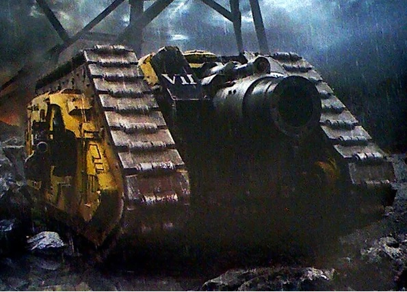
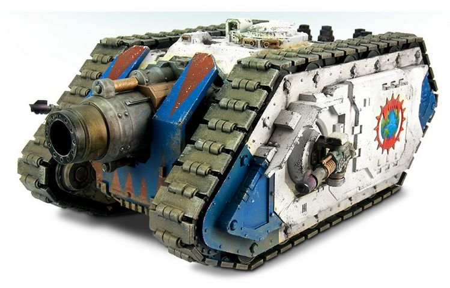

# 1527 提丰重型攻城坦克 Typhon Heavy Siege Tank

精校状态：中文行文已逐段精校，部分术语仍为暂定

分类：载具 / 地面 / 火炮

原文来源：https://www.bilibili.com/opus/1046643689966796820

原作者：帝国神选罐头

原文时间：编辑于 2025年09月24日 16:26

[返回分类目录](目录.md) · [全书目录](../../目录.md)

<!-- A1527-B0001 -->
**英文原文**

The Typhon Heavy Siege Tank was a heavy assault vehicle used by the Legio Astartes during the Great Crusade and Horus Heresy.

<!-- /A1527-B0001 -->

<!-- A1527-B0002 -->

原译文

提丰重型攻城坦克是阿斯塔特军团在大远征和荷鲁斯叛乱期间使用的一种重型突击载具。

**校订译文**

提丰重型攻城坦克是阿斯塔特军团在大远征和荷鲁斯之乱期间使用的一种重型突击载具。

<!-- /A1527-B0002 -->

<!-- A1527-B0003 图片 -->

<!-- A1527-B0004 -->

原译文

Imperial Fists Typhon Heavy Siege Tank 帝国之拳提丰重型攻城坦克

**校订译文**

Imperial Fists Typhon Heavy Siege Tank 帝国之拳提丰重型攻城坦克

<!-- /A1527-B0004 -->

<!-- A1527-B0005 -->
## Overview 概述

<!-- /A1527-B0005 -->

<!-- A1527-B0006 -->
**英文原文**

Named after the 'Great Beast' of Terran myth, it was developed by the Adeptus Mechanicus simultaneously with the Spartan Assault Tank and as a result shares its basic hull, armour, and chassis designs. The Typhon is a mobile gun and siege platform which operates a single massive Dreadhammer Cannon.

<!-- /A1527-B0006 -->

<!-- A1527-B0007 -->

原译文

它以人类神话中的“巨兽”命名，由机械神教与斯巴达突击坦克同时开发，因此共享其基本的车体、装甲和底盘设计。提丰是一种移动式火炮和攻城平台，操作着一门巨大的恐惧之锤加农炮。

**校订译文**

提丰以泰拉神话中的“巨兽”命名，由机械修会与斯巴达突击坦克同步研发，因此采用相同的基本车体、装甲和底盘设计。它是一种机动火炮与攻城平台，主武器为一门巨大的恐惧之锤加农炮。

<!-- /A1527-B0007 -->

<!-- A1527-B0008 -->
**英文原文**

The design itself was created in response to a request from Perturabo, Primarch of the Iron Warriors, who demanded a vehicle that could deploy rapidly but also carry heavy fortress-breaking firepower. As with many other classes of heavy tank, the Typhon fell out of use in the aftermath of the Horus Heresy. Some Chapters still have small numbers of Typhons in service; still a lot of Masters of the Forge are reluctant to use Typhons in all but the direst circumstances, believing that their creation's bonds with Perturabo may stain their machine-spirits forever.

<!-- /A1527-B0008 -->

<!-- A1527-B0009 -->

原译文

该设计本身是应钢铁勇士原体佩图拉博的要求而制造的，他要求一种能够快速部署但也能携带重型火力突破堡垒的车辆。与许多其他类型的重型坦克一样，提丰在荷鲁斯叛乱后停止使用。一些战团仍然有少量的提丰在服役；尽管如此，许多铸造大师仍不愿在除最恶劣的情况外的所有情况下使用提丰，他们认为它们的制造与佩图拉博的联系可能会永远玷污他们的机魂。

**校订译文**

钢铁勇士原体佩图拉博要求制造一种既能迅速部署、又有重型破垒火力的载具，提丰因此诞生。与许多重型坦克一样，它在荷鲁斯之乱后逐渐退出常规使用。部分战团仍有少量提丰服役，但许多铸造大师认为，它的诞生与佩图拉博有关，机魂可能因此永远遭到玷污；除非形势极其危急，否则不愿动用。

<!-- /A1527-B0009 -->

<!-- A1527-B0010 -->
**英文原文**

The main weapon of the Typhon is a Dreadhammer Cannon, which can demolish any enemy fortifications and since the Great Crusade has proved a strong addition to any Space Marine army for sieges. Those belonging to the Dark Angels' Dreadwing were known to employ esoteric void munitions.

<!-- /A1527-B0010 -->

<!-- A1527-B0011 -->

原译文

提丰的主要武器是恐惧之锤加农炮，它可以摧毁任何敌人的防御工事，自大远征以来，它已被证明是任何星际战士攻城的有力补充。众所周知，那些属于黑暗天使恐翼的人会使用隐秘的虚空弹药。

**校订译文**

恐惧之锤加农炮能够摧毁敌方工事，自大远征以来一直是星际战士攻城部队的强大助力。黑暗天使恐翼所属的提丰，还曾使用秘传的虚空弹药。

<!-- /A1527-B0011 -->

<!-- A1527-B0012 图片 -->

<!-- A1527-B0013 -->

原译文

World Eaters Typhon Heavy Siege Tank 吞世者提丰重型攻城坦克

**校订译文**

World Eaters Typhon Heavy Siege Tank 吞世者提丰重型攻城坦克

<!-- /A1527-B0013 -->

<!-- A1527-B0014 -->
**英文原文**

Chaos Space Marine warbands are still known to use Typhons, but these are relics of the Great Crusade and have long since been Daemonically corrupted.

<!-- /A1527-B0014 -->

<!-- A1527-B0015 -->

原译文

混沌星际战士仍然使用提丰，但这些是大远征的遗物，早已被恶魔腐蚀。

**校订译文**

混沌星际战士战帮也仍在使用提丰；这些大远征时期的遗物早已遭恶魔力量腐化。

<!-- /A1527-B0015 -->

<!-- A1527-B0016 -->
**英文原文**

Typhons could further be outfitted with Flare Shields.

<!-- /A1527-B0016 -->

<!-- A1527-B0017 -->

原译文

提丰还可以配备闪光护盾。

**校订译文**

提丰还可以配备闪光护盾。

<!-- /A1527-B0017 -->

<!-- A1527-B0018 -->
## Technical Information 技术资料

原题：Technical Information 技术信息

<!-- /A1527-B0018 -->

<!-- A1527-B0019 -->
**英文原文**

Vehicle Name:Typhon Heavy Siege Tank

<!-- /A1527-B0019 -->

<!-- A1527-B0020 -->

原译文

车辆名称：提丰重型攻城坦克

**校订译文**

车辆名称：提丰重型攻城坦克

<!-- /A1527-B0020 -->

<!-- A1527-B0021 -->
**英文原文**

Forge World of Origin:Mars/Anvilus Nine

<!-- /A1527-B0021 -->

<!-- A1527-B0022 -->

原译文

起源铸造世界：火星/安维鲁斯九号

**校订译文**

起源铸造世界：火星/安维鲁斯九号

<!-- /A1527-B0022 -->

<!-- A1527-B0023 -->
**英文原文**

Known Patterns:I-III

<!-- /A1527-B0023 -->

<!-- A1527-B0024 -->

原译文

已知型号：I-III

**校订译文**

已知型号：I-III

<!-- /A1527-B0024 -->

<!-- A1527-B0025 -->
**英文原文**

Crew:Commander, Driver, Gunner

<!-- /A1527-B0025 -->

<!-- A1527-B0026 -->

原译文

乘员：指挥官、驾驶员、炮手

**校订译文**

乘员：车长、驾驶员、炮手

<!-- /A1527-B0026 -->

<!-- A1527-B0027 -->
**英文原文**

Powerplant:meta-thermic hybrid with auxiliary reactor

<!-- /A1527-B0027 -->

<!-- A1527-B0028 -->

原译文

动力装置：带辅助反应堆的超热混合动力

**校订译文**

动力装置：超热混合动力系统，配有辅助反应堆

<!-- /A1527-B0028 -->

<!-- A1527-B0029 -->
**英文原文**

Weight:170 tonnes

<!-- /A1527-B0029 -->

<!-- A1527-B0030 -->

原译文

重量：170吨

**校订译文**

重量：170吨

<!-- /A1527-B0030 -->

<!-- A1527-B0031 -->
**英文原文**

Length:10m

<!-- /A1527-B0031 -->

<!-- A1527-B0032 -->

原译文

长度：10米

**校订译文**

长度：10米

<!-- /A1527-B0032 -->

<!-- A1527-B0033 -->
**英文原文**

Width:6.1m

<!-- /A1527-B0033 -->

<!-- A1527-B0034 -->

原译文

宽度：6.1米

**校订译文**

宽度：6.1米

<!-- /A1527-B0034 -->

<!-- A1527-B0035 -->
**英文原文**

Height:5m

<!-- /A1527-B0035 -->

<!-- A1527-B0036 -->

原译文

高度：5米

**校订译文**

高度：5米

<!-- /A1527-B0036 -->

<!-- A1527-B0037 -->
**英文原文**

Ground Clearance:0.5m

<!-- /A1527-B0037 -->

<!-- A1527-B0038 -->

原译文

离地间隙：0.5m

**校订译文**

离地间隙：0.5米

<!-- /A1527-B0038 -->

<!-- A1527-B0039 -->
**英文原文**

Fording Depth:

<!-- /A1527-B0039 -->

<!-- A1527-B0040 -->

原译文

涉水深度：

**校订译文**

涉水深度：原文未提供

<!-- /A1527-B0040 -->

<!-- A1527-B0041 -->
**英文原文**

Max Speed - on road35kph

<!-- /A1527-B0041 -->

<!-- A1527-B0042 -->

原译文

最大速度-公路35公里/小时

**校订译文**

公路最高速度：35公里/小时

<!-- /A1527-B0042 -->

<!-- A1527-B0043 -->
**英文原文**

Max Speed - off road:30kph

<!-- /A1527-B0043 -->

<!-- A1527-B0044 -->

原译文

最大速度-越野：30公里/小时

**校订译文**

越野最高速度：30公里/小时

<!-- /A1527-B0044 -->

<!-- A1527-B0045 -->
**英文原文**

Transport Capacity:None

<!-- /A1527-B0045 -->

<!-- A1527-B0046 -->

原译文

运输能力：无

**校订译文**

运输能力：无

<!-- /A1527-B0046 -->

<!-- A1527-B0047 -->
**英文原文**

Access Points:N/A

<!-- /A1527-B0047 -->

<!-- A1527-B0048 -->

原译文

接入点：无

**校订译文**

出入口：不适用

<!-- /A1527-B0048 -->

<!-- A1527-B0049 -->
**英文原文**

Main Armament:Dreadhammer Cannon

<!-- /A1527-B0049 -->

<!-- A1527-B0050 -->

原译文

主武器：恐惧之锤加农炮

**校订译文**

主武器：恐惧之锤加农炮

<!-- /A1527-B0050 -->

<!-- A1527-B0051 -->
**英文原文**

Secondary Armament:Lascannon sponsons

<!-- /A1527-B0051 -->

<!-- A1527-B0052 -->

原译文

次要武器：激光炮

**校订译文**

次要武器：侧炮座激光炮

<!-- /A1527-B0052 -->

<!-- A1527-B0053 -->
**英文原文**

Traverse:N/A

<!-- /A1527-B0053 -->

<!-- A1527-B0054 -->

原译文

横向：无

**校订译文**

水平射界：不适用

<!-- /A1527-B0054 -->

<!-- A1527-B0055 -->
**英文原文**

Elevation:From -10-5° to +20°

<!-- /A1527-B0055 -->

<!-- A1527-B0056 -->

原译文

仰角：-10-5°至+20°

**校订译文**

俯仰角：-10-5°至+20°（原文数值存疑）

**校注：** 英文写From -10-5° to +20°，下限格式不明；未擅改为-10.5°或其他数值。

<!-- /A1527-B0056 -->

<!-- A1527-B0057 -->
**英文原文**

Main Ammunition:12 Rounds

<!-- /A1527-B0057 -->

<!-- A1527-B0058 -->

原译文

主要弹药：12发

**校订译文**

主要弹药：12发

<!-- /A1527-B0058 -->

<!-- A1527-B0059 -->
**英文原文**

Secondary Ammunition:Unlimited cell feed

<!-- /A1527-B0059 -->

<!-- A1527-B0060 -->

原译文

次要弹药：无限次电池供电

**校订译文**

次要武器弹药：持续由能量单元供给（原文称无限）

**校注：** Unlimited cell feed按原文保留持续供能说法，不推断现实能量无穷。

<!-- /A1527-B0060 -->

<!-- A1527-B0061 -->
### Armour 装甲

<!-- /A1527-B0061 -->

<!-- A1527-B0062 -->
**英文原文**

Superstructure:95mm

<!-- /A1527-B0062 -->

<!-- A1527-B0063 -->

原译文

上部结构：95毫米

**校订译文**

上部结构：95毫米

<!-- /A1527-B0063 -->

<!-- A1527-B0064 -->
**英文原文**

Hull:95mm

<!-- /A1527-B0064 -->

<!-- A1527-B0065 -->

原译文

车体：95毫米

**校订译文**

车体：95毫米

<!-- /A1527-B0065 -->

<!-- A1527-B0066 -->
**英文原文**

Gun Mantlet:N/A

<!-- /A1527-B0066 -->

<!-- A1527-B0067 -->

原译文

炮盾：无

**校订译文**

炮盾：无

<!-- /A1527-B0067 -->

<!-- A1527-B0068 -->
**英文原文**

Vehicle Designation:Unknown

<!-- /A1527-B0068 -->

<!-- A1527-B0069 -->

原译文

载具编号：未知

**校订译文**

载具编号：未知

<!-- /A1527-B0069 -->

<!-- A1527-B0070 -->
**英文原文**

Firing Ports:N/A

<!-- /A1527-B0070 -->

<!-- A1527-B0071 -->

原译文

开火口：无

**校订译文**

开火口：无

<!-- /A1527-B0071 -->

<!-- A1527-B0072 -->
**英文原文**

Turret:N/A

<!-- /A1527-B0072 -->

<!-- A1527-B0073 -->

原译文

炮塔：无

**校订译文**

炮塔：无

<!-- /A1527-B0073 -->

<!-- A1527-B0074 -->
## Known Named Vehicles 著名载具

<!-- /A1527-B0074 -->

<!-- A1527-B0075 -->
**英文原文**

Deathbringer — Death Guard

<!-- /A1527-B0075 -->

<!-- A1527-B0076 -->

原译文

死亡使者 — 死亡守卫

**校订译文**

死亡使者 — 死亡守卫

<!-- /A1527-B0076 -->

<!-- A1527-B0077 -->
**英文原文**

Voice of Fury — Imperial Fists

<!-- /A1527-B0077 -->

<!-- A1527-B0078 -->

原译文

愤怒之声 — 帝国之拳

**校订译文**

愤怒之声号——帝国之拳所属

<!-- /A1527-B0078 -->

本篇核心术语与暂定项

以下列出本篇出现的英文原形及核心术语表用词。同形词可能指不同对象，具体词义以本篇正文和校注为准；单复数、别名和仅见于图注的名称可能尚未列入。完整候选见[术语表](../../术语表/双语术语候选.csv)。

| 英文 | 采用中文 | 状态 |
| --- | --- | --- |
| Dark Angels | 黑暗天使 | 官方已核对 |
| Adeptus Mechanicus | 机械修会 | 官方已核对 |
| Death Guard | 死亡守卫 | 官方已核对 |
| Horus Heresy | 荷鲁斯之乱 | 官方已核对 |
| Imperial Fists | 帝国之拳 | 暂定 |
| Primarch | 原体 | 官方已核对 |
| Forge World | 铸造世界 | 暂定·官方待核 |
| Iron Warriors | 钢铁勇士 | 暂定·官方待核 |
| Great Crusade | 大远征 | 暂定·官方待核 |
| Horus | 荷鲁斯 | 暂定·官方待核 |
| Mars | 火星 | 暂定·官方待核 |
| Dreadwing | 恐翼 | 暂定·官方待核 |
| Space Marine | 星际战士 | 暂定·官方待核 |
| Gun | 甘 | 暂定·官方待核 |
| The Dark | 《黑暗》 | 暂定·官方待核 |
| Anvilus Nine | 安维鲁斯九号 | 暂定·官方待核 |
| Dreadhammer Cannon | 恐惧之锤加农炮 | 暂定·官方待核 |
| Anvilus | 安维鲁斯 | 暂定·官方待核 |
| Lascannon | 激光炮 | 官方已核对 |
| Typhon Heavy Siege Tank | 提丰重型攻城坦克 | 暂定·官方待核 |
| Flare Shields | 闪光护盾 | 暂定·官方待核 |
| Voice of Fury | 愤怒之声号 | 暂定·官方待核 |
| Spartan Assault Tank | 斯巴达突击坦克 | 暂定·官方待核 |

