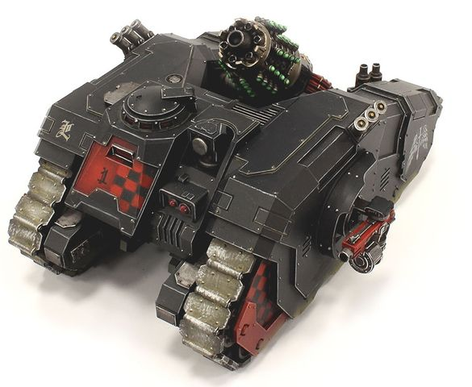
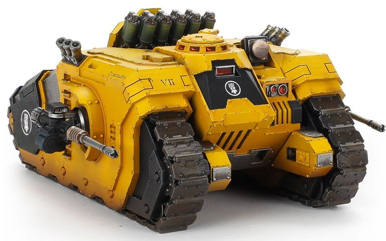
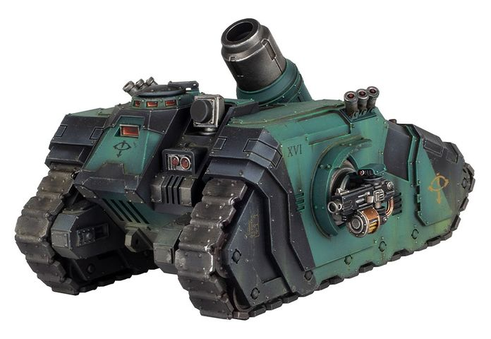

# 1528 曲射手臼炮火炮坦克 Arquitor Bombard Artillery Tank

精校状态：中文行文已逐段精校，部分术语仍为暂定

分类：载具 / 地面 / 火炮

原文来源：https://www.bilibili.com/opus/1044125958637879304

原作者：帝国神选罐头

原文时间：2025年03月14日 17:01

[返回分类目录](目录.md) · [全书目录](../../目录.md)

<!-- A1528-B0001 -->
**英文原文**

The Arquitor Bombard was a type of artillery tank used by the Legiones Astartes during the Great Crusade and Horus Heresy.

<!-- /A1528-B0001 -->

<!-- A1528-B0002 -->

原译文

曲射手臼炮是阿斯塔特军团在大远征和荷鲁斯叛乱期间使用的一种火炮坦克。

**校订译文**

曲射手臼炮是阿斯塔特军团在大远征和荷鲁斯之乱期间使用的一种火炮坦克。

<!-- /A1528-B0002 -->

<!-- A1528-B0003 图片 -->

<!-- A1528-B0004 -->

原译文

Dark Angels Arquitor Bombard with Graviton Charge Cannon 黑暗天使曲射手臼炮配备重力充能炮

**校订译文**

Dark Angels Arquitor Bombard with Graviton Charge Cannon 黑暗天使曲射手臼炮配备重力充能炮

<!-- /A1528-B0004 -->

<!-- A1528-B0005 -->
## Overview 概述

<!-- /A1528-B0005 -->

<!-- A1528-B0006 -->
**英文原文**

The Arquitor was designed to operate at the forefront of a Space Marine advance and was equipped with a reinforced chassis and brutal short range firepower. It was usually called upon to break the most stubborn enemy fortifications or to annihilate massed infantry and armour. As an infantry support platform, it lacked the speed of some other armour employed by the Space Marines but this was intentionally designed in order to allow it to be locked in formation with the warriors it supported.

<!-- /A1528-B0006 -->

<!-- A1528-B0007 -->

原译文

曲射手的设计目的是在星际战士前进的最前沿作战，并配备了加固的底盘和残酷的短程火力。它通常被要求打破敌人最顽固的防御工事，或歼灭大批步兵和装甲部队。作为步兵支援平台，它缺乏星际战士使用的其他一些装甲的速度，但这是有意设计的，以便与它所支援的战士保持编队。

**校订译文**

曲射手专为星际战士推进部队的前沿作战设计，底盘经过加固，拥有猛烈的近程火力，通常负责突破最顽固的敌方工事，或歼灭集结的步兵和装甲部队。作为步兵支援平台，它的速度低于星际战士的部分其他装甲载具；这是有意为之，以便与受其支援的战士保持队形。

<!-- /A1528-B0007 -->

<!-- A1528-B0008 图片 -->

<!-- A1528-B0009 -->

原译文

Imperial Fists Arquitor Bombard with Spicula Rocket System 帝国之拳曲射手臼炮配备长针火箭系统

**校订译文**

Imperial Fists Arquitor Bombard with Spicula Rocket System 帝国之拳曲射手臼炮配备长针火箭系统

<!-- /A1528-B0009 -->

<!-- A1528-B0010 -->
**英文原文**

The Bombard could be equipped with a variety of weapons, most notably the Graviton Charge Cannon, Morbus Heavy Bombard, or Spicula Rocket System. It also wielded sponson-mounted Heavy Bolters or Autocannons and a pintle-mounted twin-linked Bolter, Havoc Launcher or Combi-Weapon.

<!-- /A1528-B0010 -->

<!-- A1528-B0011 -->

原译文

臼炮可以配备各种武器，最著名的是重力充能炮、疾病重型臼炮或长针火箭系统。它还使用了安装在舷侧的重型爆矢枪或自动炮，以及安装在枢轴上的双联爆矢枪、浩劫发射器或复合武器。

**校订译文**

曲射手可选装多种武器，主要包括重力充能炮、疫病重型臼炮和长针火箭系统。侧炮座可安装重型爆矢枪或自动炮，枢轴枪架则可安装双联爆矢枪、浩劫发射器或复合武器。

<!-- /A1528-B0011 -->

<!-- A1528-B0012 图片 -->

<!-- A1528-B0013 -->

原译文

Sons of Horus Arquitor Bombard with Morbus Heavy Bombard 荷鲁斯之子曲射手臼炮配备疾病重型臼炮

**校订译文**

Sons of Horus Arquitor Bombard with Morbus Heavy Bombard 荷鲁斯之子曲射手臼炮载具，配备疫病重型臼炮

<!-- /A1528-B0013 -->

本篇核心术语与暂定项

以下列出本篇出现的英文原形及核心术语表用词。同形词可能指不同对象，具体词义以本篇正文和校注为准；单复数、别名和仅见于图注的名称可能尚未列入。完整候选见[术语表](../../术语表/双语术语候选.csv)。

| 英文 | 采用中文 | 状态 |
| --- | --- | --- |
| Space Marines | 星际战士 | 官方已核对 |
| Horus Heresy | 荷鲁斯之乱 | 官方已核对 |
| Great Crusade | 大远征 | 暂定·官方待核 |
| Horus | 荷鲁斯 | 暂定·官方待核 |
| Legiones Astartes | 阿斯塔特军团 | 暂定·官方待核 |
| Space Marine | 星际战士 | 暂定·官方待核 |
| System | 星系（恒星系统） | 暂定·官方待核 |
| Combi-weapon | 复合武器 | 暂定·官方待核 |
| Morbus Heavy Bombard | 疫病重型臼炮 | 暂定·官方待核 |
| Arquitor Bombard | 曲射手臼炮载具 | 暂定·官方待核 |
| Havoc Launcher | 浩劫发射器 | 暂定·官方待核 |
| Spicula Rocket System | 长针火箭系统 | 暂定·官方待核 |
| Bolter | 爆矢枪 | 暂定·官方待核 |
| Graviton Charge Cannon | 重力充能炮 | 暂定·官方待核 |

