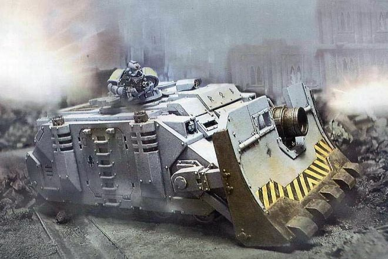
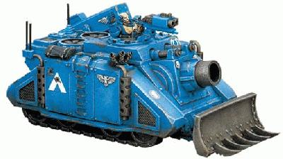
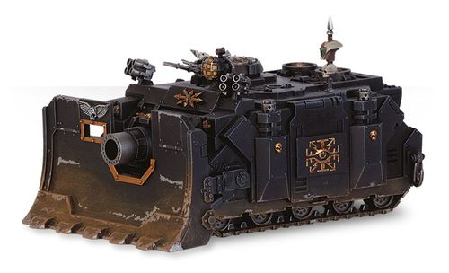
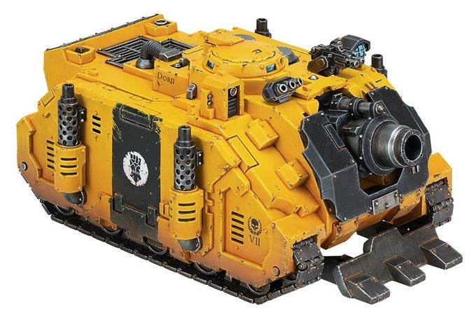
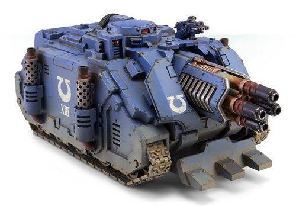

# 1529 维护者短程攻城坦克 Vindicator Short Ranged Siege Tank

精校状态：中文行文已逐段精校，部分术语仍为暂定

分类：载具 / 地面 / 火炮

原文来源：https://www.bilibili.com/opus/1040706468889755648

原作者：帝国神选罐头

原文时间：2025年03月05日 11:52

[返回分类目录](目录.md) · [全书目录](../../目录.md)

<!-- A1529-B0001 -->
**英文原文**

The Vindicator is a short ranged siege tank used by Space Marine Chapters. Based upon the Rhino chassis, it shares many of the same design features, though with equipment and armament optimized to deliver heavy ordnance at short range.

<!-- /A1529-B0001 -->

<!-- A1529-B0002 -->

原译文

维护者是星际战士使用的短程攻城坦克。基于犀牛底盘，它具有许多相同的设计特征，尽管其设备和武器经过优化，可以在短距离内运送重型弹药。

**校订译文**

维护者是星际战士战团使用的近程攻城坦克。它采用犀牛底盘，保留了许多相同的设计特征，但装备与武器专门针对近距离重火力打击进行了调整。

<!-- /A1529-B0002 -->

<!-- A1529-B0003 图片 -->

<!-- A1529-B0004 -->

原译文

Vindicator Siege Tank 维护者攻城坦克

**校订译文**

Vindicator Siege Tank 维护者攻城坦克

<!-- /A1529-B0004 -->

<!-- A1529-B0005 -->
## History 历史

<!-- /A1529-B0005 -->

<!-- A1529-B0006 -->
**英文原文**

The origins of the Vindicator are fragmentary, although the earliest records show it was developed along with the other Rhino STC variants during the Dark Age of Technology. The fragments at the request of General Vindictis were recovered from the Librarius Omnis and within this request the General asked for a self-mobile weapon of high calibre, capable of following up with advancing armies and able to engage well-protected targets with a high angle of fire. It is believed that General Vindictus was personally responsible for instigating the idea of the 'Vindicator' so the vehicle was thus named in his honour. The record states that on the planet Rostern 10 assembled Vindicators fought against raiding Orks and though 9 out of 10 were ultimately destroyed in the process, Imperial forces were victorious. Other records show that the Vindicator was first fielded during the early years of the Horus Heresy on Rothern I, when massive Thunderer Cannons were mounted onto remodeled Rhinos and used to blast heavily dug-in Traitor positions among the urban rubble.

<!-- /A1529-B0006 -->

<!-- A1529-B0007 -->

原译文

尽管最早的记录显示它是在黑暗技术时代与其他犀牛STC变体一起开发的，但维护者的起源是零碎的。应温迪克斯将军的要求，从火星大图书馆中找到了碎片，在这一要求中，将军要求提供一种高口径的自移动武器，能够跟上前进的军队，并能够以高角度攻击受到良好保护的目标。据信，温迪克斯将军亲自促成了 “维护者”这一构想的产生，因此这辆坦克便以他的名字命名。记录显示，在罗斯特恩星球上，10辆集结的维护者与突袭的欧克蛮人作战，尽管10辆中有9辆最终被摧毁，但帝国军队取得了胜利。其他记录显示，维护者最早是在荷鲁斯叛乱早期的罗斯特恩一号投入使用的，当时巨大的雷霆炮被安装在经过改造的犀牛身上，用于在城市废墟中炸毁深掘的叛徒阵地。

**校订译文**

有关维护者起源的记录十分零散。最早的记载称，它与其他犀牛标准模板构造衍生车型一样，诞生于黑暗科技时代。全知图书馆保存的残篇记载了温迪克斯将军的要求：制造一种能够伴随大军推进、以较大仰角轰击坚固目标的大口径自行武器。据说将军亲自推动了这一构想，因此车辆以他命名。在罗斯特恩，10辆维护者曾迎战来袭的欧克，虽然最终损失9辆，帝国仍取得胜利。另一种记录则称，它首次投入战场是在荷鲁斯之乱初期的罗瑟恩一号：改装犀牛装上巨型雷霆炮，用来轰击城市废墟中构筑坚固阵地的叛军。

**校注：** 起源记录在科技时代、荷鲁斯之乱初期及随后停产/重现之间存在矛盾，按英文并列保留。Vindictis/Vindictus为同段姓名异拼，中文统一；Rostern与Rothern I暂分译，不擅自视为同一地名。

<!-- /A1529-B0007 -->

<!-- A1529-B0008 图片 -->

<!-- A1529-B0009 -->

原译文

Vindicator 维护者

**校订译文**

Vindicator 维护者战车

<!-- /A1529-B0009 -->

<!-- A1529-B0010 -->
**英文原文**

Later records stated that Vindicators were mentioned very little and it's assumed that these machines fell out of favor. It seems that the production of Vindicators was halted during the Great Crusade and Horus Heresy or that the manufacturing site was destroyed. Only when the mighty Primarch Guilliman mentioned the Vindicator in the Codex Astartes did the Siege tank reappear in the Space Marine Armies. Since the Heresy, the bulky Thunderer Cannon has been replaced with the more compact, but no less potent, Demolisher Cannon, along with other minor modifications to armouring, fire control and driving systems. The Vindicator has become a vital part of a Chapter's siege and urban combat capabilities, with most retaining a dozen or so vehicles within their Armoury.

<!-- /A1529-B0010 -->

<!-- A1529-B0011 -->

原译文

后来的记录表明，对维护者的提及很少，人们认为这些机械已经不再受欢迎。看来维护者的生产在大远征和荷鲁斯叛乱期间停止了，或者生产基地被摧毁了。只有当强大的原体基里曼在阿斯塔特圣典中提到维护者时，攻城坦克才重新出现在星际战士中。自叛乱以来，笨重的雷霆炮已被更紧凑但同样强大的粉碎者加农炮所取代，同时对装甲、火控和驱动系统进行了其他细微修改。维护者已经成为一个部队攻城和城市作战能力的重要组成部分，大多数部队在其军械库内保留了十几辆左右的载具。

**校订译文**

后续记录很少提到维护者，因此人们推测它一度不再受青睐。它可能在大远征和荷鲁斯之乱期间停产，也可能是制造基地被毁。直到原体基里曼在《阿斯塔特圣典》中提及它，这种攻城坦克才重新出现在星际战士部队中。叛乱之后，体积更小、威力却不减的破坏者加农炮取代了笨重的雷霆炮，装甲、火控与驱动系统也有小幅改进。如今，维护者是战团攻城与城市作战力量的重要部分，多数战团军械库中保有约十余辆。

<!-- /A1529-B0011 -->

<!-- A1529-B0012 -->
## Tactical Use 战术使用

<!-- /A1529-B0012 -->

<!-- A1529-B0013 -->
**英文原文**

As laid down by the Codex Astartes, the Vindicator's chief role is in urban combat, to provide assault and tactical squads with destructive firepower against enemy strongpoints and snipers. Standard combat doctrine has the Vindicator advance down a street towards the target structure, supported by Space Marine squads advancing from building to building on either side of it, blasting holes in the walls if necessary. Once in position, the Vindicator opens fire on the target building, reducing much of it to rubble and opening the way for subsequent assault by Space Marines with close-combat weaponry.

<!-- /A1529-B0013 -->

<!-- A1529-B0014 -->

原译文

根据阿斯塔特圣典的规定，维护者的主要作用是在城市战斗中，为突击小队和战术小队提供毁灭性火力，以对抗敌人的据点和狙击手。标准作战理论要求维护者沿着街道向目标结构前进，由星际战士小队在目标结构两侧的建筑物之间推进，必要时在墙上炸洞。一旦就位，维护者就会向目标建筑开火，将其大部分夷为平地，并为随后太星际战士使用近战武器的攻击开辟道路。

**校订译文**

《阿斯塔特圣典》规定，维护者主要在城市作战中为突击小队和战术小队提供重火力，摧毁敌方据点和狙击阵地。按标准战术，它沿街道驶向目标建筑，星际战士小队则在车辆两侧的建筑之间逐栋推进、提供掩护，必要时炸开墙壁。到达射击位置后，维护者将目标建筑的大部分轰成废墟，为手持近战武器的星际战士随后突击开路。

<!-- /A1529-B0014 -->

<!-- A1529-B0015 -->
**英文原文**

Outside of urban combat, the Vindicator also sees a limited role in tank warfare, with many armoured thrusts containing at least one Vindicator for close-quarter engagements. It is especially effective against transport and reconnaissance vehicles. In a memorable incident, a single Vindicator managed to stop a rebel armoured column of the Thessaly Regime for eight days by blocking a roadway at a narrow gorge situated just beyond a blind turn. It destroyed every rebel vehicle coming into range, until the Vindicator itself was destroyed by infantry outflanking from the rear. For particularly hardened targets, Vindicators will form into Line Breaker Squadrons, combining their firepower for devastating effects.

<!-- /A1529-B0015 -->

<!-- A1529-B0016 -->

原译文

在城市作战之外，维护者在坦克战中的作用也很有限，许多装甲要点中至少有一个维护者用于近距离交战。它对运输和侦察车特别有效。在一次令人难忘的事件中，一名维护者成功阻止了色萨利政权的一支反叛装甲纵队八天，它封锁了一条位于看不见的转弯后的狭窄峡谷的道路。它摧毁了所有进入射程的叛军车辆，直到维护者被步兵从后方侧翼摧毁。对于特别坚固的目标，维护者将组成战线毁灭中队，将他们的火力结合起来，产生毁灭性的效果。

**校订译文**

它在城市之外也有限度地参与坦克战。许多装甲突击部队至少编入一辆维护者，负责近距离交战，尤其适合对付运输和侦察载具。一次著名战例中，一辆维护者占据狭窄峡谷内、被急弯遮挡视线的一段道路，将色萨利政权的叛军装甲纵队阻挡了整整八天。它摧毁每一辆进入射程的叛军车辆，直到敌方步兵绕至后方将其摧毁。遇到特别坚固的目标时，维护者会编成破阵者中队，集中火力实施毁灭性打击。

<!-- /A1529-B0016 -->

<!-- A1529-B0017 -->
## Technical Information 技术资料

原题：Technical Information 技术信息

<!-- /A1529-B0017 -->

<!-- A1529-B0018 -->
### Armament 军备

<!-- /A1529-B0018 -->

<!-- A1529-B0019 -->
**英文原文**

The Demolisher Cannon gives the Vindicator immense destructive capabilities. Firing rocket-assisted siege shells blessed before each battle with the Litany of Demolition, the Demolisher Cannon can reduce a building to rubble in a matter of moments, crushing the enemies taking shelter under tonnes of rubble. The Demolisher Cannon is loaded by an automated crane and ramp system. It incorporates hydro-compressive recoil absorption rams to manage the recoil. The cannon's two exhaust vents for vacating rocket back-blast are located behind its multi-spectral targeting array. The Rhino chassis's transport capacity is given over completely to ammunition storage, of which it can carry 16 shells in its racks. That number is normally increased by two, with one shell preloaded and a second stored on the collapsible loading ramp. Some variants of the Vindicator are equipped with a crane-winch which helps it reload faster. The Vindicator is also armed with a Storm Bolter for close defense.

<!-- /A1529-B0019 -->

<!-- A1529-B0020 -->

原译文

粉碎者加农炮赋予了维护者巨大的破坏力。毁灭者加农炮发射火箭助推的攻城炮弹，每一场战斗前这些炮弹都经过了毁灭祷告的祝福加持，粉碎者加农炮可以在短时间内将建筑物夷为平地，粉碎躲在数吨瓦砾下的敌人。粉碎者加农炮由自动起重机和坡道系统装载。它结合了液压压缩反冲吸收柱来控制反冲。加农炮的两个排气口位于其多光谱瞄准阵列后面，用于释放火箭的爆炸。犀牛底盘的运输能力完全用于弹药储存，其框架可容纳16发炮弹。这个数字通常会增加两个，一个炮弹被预加载，另一个被存放在可折叠的装载坡道上。维护者的一些变体配备了起重机绞车，这有助于它更快地重新装载。维护者还配备了风暴爆矢枪，用于近身防御。

**校订译文**

破坏者加农炮赋予维护者惊人的毁伤能力。它发射火箭助推攻城炮弹，战前以《摧毁祷文》祝祷，转瞬间便能将建筑轰成废墟，让躲藏其中的敌人被成吨瓦砾压碎。炮弹通过自动吊机和装填坡道送入炮膛，液压缓冲装置吸收后坐力。多光谱瞄准阵列后方有两个排气口，用来排出火箭尾焰。犀牛底盘原本的载员空间全部改作弹药库，弹架可放16发；通常另在炮膛预装一发、折叠装填坡道上放置一发，使总数达到18发。部分型号还装有吊机绞盘，以加快补充弹药。维护者另配一挺风暴爆矢枪，用于近距离防御。

<!-- /A1529-B0020 -->

<!-- A1529-B0021 图片 -->

<!-- A1529-B0022 -->

原译文

Vindicator 维护者

**校订译文**

Vindicator 维护者战车

<!-- /A1529-B0022 -->

<!-- A1529-B0023 -->
### Armour 装甲

<!-- /A1529-B0023 -->

<!-- A1529-B0024 -->
**英文原文**

In order to survive the brutal close-combat fighting typical of urban warfare, Vindicators have much thicker armour compared to the standard Rhino, especially along its front and top facings. This armour is further supported by extra bracing, which adds additional weight to the frame. Even the side hull is extensively armoured, to withstand the recoil forces generated by the Demolisher Cannon.

<!-- /A1529-B0024 -->

<!-- A1529-B0025 -->

原译文

为了在城市战争中典型的残酷近战中幸存下来，维护者的装甲甲比标准犀牛要厚得多，尤其是在正面和顶部。这种装甲由额外的支持进一步支撑，这增加了框架的额外重量。即使是侧面也有广泛的装甲，以承受粉碎者加农炮产生的反冲力。

**校订译文**

为了在激烈的城市近战中生存，维护者的装甲比标准犀牛厚得多，正面和顶部尤其如此。额外支撑结构进一步加固装甲，也增加了车体重量。两侧同样大幅加强防护，以承受破坏者加农炮产生的后坐力。

<!-- /A1529-B0025 -->

<!-- A1529-B0026 -->
### Engine 引擎

<!-- /A1529-B0026 -->

<!-- A1529-B0027 -->
**英文原文**

The Vindicator is powered by the standard Quad MkII adaptable thermic combustor reactor.

<!-- /A1529-B0027 -->

<!-- A1529-B0028 -->

原译文

维护者由标准的阔德MkII自适应热燃烧室反应堆提供动力。

**校订译文**

维护者使用标准的四台 Mk.II 自适应热燃烧反应堆。

<!-- /A1529-B0028 -->

<!-- A1529-B0029 -->
### Equipment 装备

原题：Equipment 设备

<!-- /A1529-B0029 -->

<!-- A1529-B0030 -->
**英文原文**

Dozer Blades in combination with a Siege Shield are typical on most Vindicators, allowing them to easily clear a path through rubble-strewn streets. The Dozer Blade is made from super-thick plasteel and also helps to protect the Vindicator's front from heavy firepower. It is ejectable.

<!-- /A1529-B0030 -->

<!-- A1529-B0031 -->

原译文

推土机铲刀与攻城盾相结合是大多数维护者的典型特征，使他们能够轻松地在瓦砾遍布的街道上清理道路。推土机铲刀由超厚塑钢制成，也有助于保护维护者的前部免受重型火力的攻击。它是可拆卸的。

**校订译文**

多数维护者同时配备推土铲与攻城盾，便于清理布满瓦砾的街道。推土铲由超厚塑钢制成，也能增强正面防护，抵御重型火力；必要时可以抛离。

<!-- /A1529-B0031 -->

<!-- A1529-B0032 -->
**英文原文**

Other standard equipment includes a narrow band long range communications antenna, a wide-band local communications antenna, a Searchlight and Smoke Launchers. It can be further upgraded with a Hunter-killer Missile, Extra Armour, and a pintle-mounted Storm Bolter.

<!-- /A1529-B0032 -->

<!-- A1529-B0033 -->

原译文

其他标准设备包括窄带远程通信天线、宽带本地通信天线、探照灯和烟雾发射器。它可以进一步升级猎杀飞弹、额外装甲和枢轴式风暴爆矢枪。

**校订译文**

标准装备还包括窄带远程通讯天线、宽带近程通讯天线、探照灯和烟幕发射器。还可加装猎杀导弹、附加装甲及枢轴枪架上的风暴爆矢枪。

<!-- /A1529-B0033 -->

<!-- A1529-B0034 -->
## Technical Information 技术资料

原题：Technical Information 技术信息

<!-- /A1529-B0034 -->

<!-- A1529-B0035 -->
**英文原文**

Technical statistics for the Vindicator are:

<!-- /A1529-B0035 -->

<!-- A1529-B0036 -->

原译文

维护者的技术统计数据如下：

**校订译文**

维护者的技术统计数据如下：

<!-- /A1529-B0036 -->

<!-- A1529-B0037 -->
**英文原文**

Vehicle Name:Vindicator

<!-- /A1529-B0037 -->

<!-- A1529-B0038 -->

原译文

载具名称：维护者

**校订译文**

载具名称：维护者

<!-- /A1529-B0038 -->

<!-- A1529-B0039 -->
**英文原文**

Forge World of Origin:Lucius

<!-- /A1529-B0039 -->

<!-- A1529-B0040 -->

原译文

起源铸造世界：卢修斯

**校订译文**

起源铸造世界：卢修斯

<!-- /A1529-B0040 -->

<!-- A1529-B0041 -->
**英文原文**

Known Patterns:II-XXVI

<!-- /A1529-B0041 -->

<!-- A1529-B0042 -->

原译文

已知型号：II - XXVI

**校订译文**

已知型号：II - XXVI

<!-- /A1529-B0042 -->

<!-- A1529-B0043 -->
**英文原文**

Crew:Driver & Gunner

<!-- /A1529-B0043 -->

<!-- A1529-B0044 -->

原译文

乘员：驾驶员，炮手

**校订译文**

乘员：驾驶员、炮手

<!-- /A1529-B0044 -->

<!-- A1529-B0045 -->
**英文原文**

Powerplant:Quad MkIII adaptable thermic combustor reactor

<!-- /A1529-B0045 -->

<!-- A1529-B0046 -->

原译文

动力装置：阔德MkIII适应性热燃烧反应堆

**校订译文**

动力装置：四台 Mk.III 自适应热燃烧反应堆

**校注：** 正文引擎为Mk.II，技术表为Mk.III，按原文保留差异。

<!-- /A1529-B0046 -->

<!-- A1529-B0047 -->
**英文原文**

Weight:42 tonnes

<!-- /A1529-B0047 -->

<!-- A1529-B0048 -->

原译文

重量：42吨

**校订译文**

重量：42吨

<!-- /A1529-B0048 -->

<!-- A1529-B0049 -->
**英文原文**

Length:7.5m

<!-- /A1529-B0049 -->

<!-- A1529-B0050 -->

原译文

长度：7.5米

**校订译文**

长度：7.5米

<!-- /A1529-B0050 -->

<!-- A1529-B0051 -->
**英文原文**

Width:4.5m

<!-- /A1529-B0051 -->

<!-- A1529-B0052 -->

原译文

宽度：4.5米

**校订译文**

宽度：4.5米

<!-- /A1529-B0052 -->

<!-- A1529-B0053 -->
**英文原文**

Height:3.6m

<!-- /A1529-B0053 -->

<!-- A1529-B0054 -->

原译文

高度：3.6米

**校订译文**

高度：3.6米

<!-- /A1529-B0054 -->

<!-- A1529-B0055 -->
**英文原文**

Ground Clearance:0.44m

<!-- /A1529-B0055 -->

<!-- A1529-B0056 -->

原译文

离地间隙：0.44m

**校订译文**

离地间隙：0.44米

<!-- /A1529-B0056 -->

<!-- A1529-B0057 -->
**英文原文**

Fording Depth:

<!-- /A1529-B0057 -->

<!-- A1529-B0058 -->

原译文

涉水深度：

**校订译文**

涉水深度：原文未提供

<!-- /A1529-B0058 -->

<!-- A1529-B0059 -->
**英文原文**

Max Speed - on road64kph

<!-- /A1529-B0059 -->

<!-- A1529-B0060 -->

原译文

最大速度-公路上64公里/小时

**校订译文**

公路最高速度：64公里/小时

<!-- /A1529-B0060 -->

<!-- A1529-B0061 -->
**英文原文**

Max Speed - off road:48kph

<!-- /A1529-B0061 -->

<!-- A1529-B0062 -->

原译文

最大速度-越野：48公里/小时

**校订译文**

越野最高速度：48公里/小时

<!-- /A1529-B0062 -->

<!-- A1529-B0063 -->
**英文原文**

Transport Capacity:

<!-- /A1529-B0063 -->

<!-- A1529-B0064 -->

原译文

运输能力：

**校订译文**

运输能力：原文未提供

<!-- /A1529-B0064 -->

<!-- A1529-B0065 -->
**英文原文**

Access Points:

<!-- /A1529-B0065 -->

<!-- A1529-B0066 -->

原译文

接入点：

**校订译文**

出入口：原文未提供

<!-- /A1529-B0066 -->

<!-- A1529-B0067 -->
**英文原文**

Main Armament:Demolisher Cannon

<!-- /A1529-B0067 -->

<!-- A1529-B0068 -->

原译文

主武器：破坏者加农炮

**校订译文**

主武器：破坏者加农炮

<!-- /A1529-B0068 -->

<!-- A1529-B0069 -->
**英文原文**

Secondary Armament:N/A

<!-- /A1529-B0069 -->

<!-- A1529-B0070 -->

原译文

次要武器：无

**校订译文**

次要武器：无

<!-- /A1529-B0070 -->

<!-- A1529-B0071 -->
**英文原文**

Traverse:

<!-- /A1529-B0071 -->

<!-- A1529-B0072 -->

原译文

跨越：

**校订译文**

水平射界：原文未提供

<!-- /A1529-B0072 -->

<!-- A1529-B0073 -->
**英文原文**

Elevation:

<!-- /A1529-B0073 -->

<!-- A1529-B0074 -->

原译文

攀升：

**校订译文**

俯仰角：原文未提供

<!-- /A1529-B0074 -->

<!-- A1529-B0075 -->
**英文原文**

Main Ammunition:800 rounds

<!-- /A1529-B0075 -->

<!-- A1529-B0076 -->

原译文

主要弹药：800发

**校订译文**

主武器载弹量：800发（原文如此，与正文冲突）

**校注：** 英文技术表载弹800发，正文为弹架16发、通常总计18发；技术表其他字段也疑似错配，未猜改。

<!-- /A1529-B0076 -->

<!-- A1529-B0077 -->
**英文原文**

Secondary Ammunition:N/A

<!-- /A1529-B0077 -->

<!-- A1529-B0078 -->

原译文

次要弹药：无

**校订译文**

次要弹药：无

<!-- /A1529-B0078 -->

<!-- A1529-B0079 -->
### Armour 装甲

<!-- /A1529-B0079 -->

<!-- A1529-B0080 -->
**英文原文**

Superstructure:60mm

<!-- /A1529-B0080 -->

<!-- A1529-B0081 -->

原译文

上部结构：60毫米

**校订译文**

上部结构：60毫米

<!-- /A1529-B0081 -->

<!-- A1529-B0082 -->
**英文原文**

Hull:55mm

<!-- /A1529-B0082 -->

<!-- A1529-B0083 -->

原译文

车体：55毫米

**校订译文**

车体：55毫米

<!-- /A1529-B0083 -->

<!-- A1529-B0084 -->
**英文原文**

Gun Mantlet:N/A

<!-- /A1529-B0084 -->

<!-- A1529-B0085 -->

原译文

炮盾：无

**校订译文**

炮盾：无

<!-- /A1529-B0085 -->

<!-- A1529-B0086 -->
**英文原文**

Vehicle Designation:

<!-- /A1529-B0086 -->

<!-- A1529-B0087 -->

原译文

载具编号：

**校订译文**

载具编号：原文未提供

<!-- /A1529-B0087 -->

<!-- A1529-B0088 -->
**英文原文**

Firing Ports:

<!-- /A1529-B0088 -->

<!-- A1529-B0089 -->

原译文

开火口：

**校订译文**

射击孔：原文未提供

<!-- /A1529-B0089 -->

<!-- A1529-B0090 -->
**英文原文**

Turret:65mm

<!-- /A1529-B0090 -->

<!-- A1529-B0091 -->

原译文

炮塔：65毫米

**校订译文**

炮塔：65毫米

**校注：** 正文无炮塔且副武器有风暴爆矢枪，技术表却列炮塔装甲65毫米、副武器N/A；保留并提示原表可能错配。

<!-- /A1529-B0091 -->

<!-- A1529-B0092 -->
### Variants 变体

<!-- /A1529-B0092 -->

<!-- A1529-B0093 -->
### Chaos Vindicators 混沌维护者

<!-- /A1529-B0093 -->

<!-- A1529-B0094 -->
**英文原文**

Vindicators were used extensively by the Traitor Legions during the Horus Heresy, specifically in the Siege of the Imperial Palace, and have remained in service with Chaos Space Marine forces since then. The Iron Warriors in particular, field many squadrons of Vindicators and deface them with defaced statuary of fallen cities they have conquered. The Vindicator can also be possessed by a bound daemon.

<!-- /A1529-B0094 -->

<!-- A1529-B0095 -->

原译文

在荷鲁斯叛乱期间，叛徒军团广泛使用了维护者，特别是在围攻皇宫期间，自那以后，他们一直在混沌星际战士服役。特别是钢铁勇士，他们派出了许多维护者中队，并用他们征服的堕落城市的破损雕像来污损它们。维护者也可以由绑定的恶魔占据。

**校订译文**

叛徒军团在荷鲁斯之乱期间大量使用维护者，围攻皇宫时尤其如此；此后，它一直在混沌星际战士中服役。钢铁勇士部署了许多维护者中队，并将从征服城市掠来的残破雕像装在车上，加以亵渎。维护者还可能被束缚其中的恶魔附体。

<!-- /A1529-B0095 -->

<!-- A1529-B0096 图片 -->

<!-- A1529-B0097 -->

原译文

Chaos Space Marine Vindicator 混沌星际战士维护者

**校订译文**

Chaos Space Marine Vindicator 混沌星际战士维护者

<!-- /A1529-B0097 -->

<!-- A1529-B0098 -->
### Deimos Pattern Vindicator 迪莫斯型维护者

原题：Deimos Pattern Vindicator 火卫二型维护者

<!-- /A1529-B0098 -->

<!-- A1529-B0099 -->
**英文原文**

The Deimos Pattern Vindicator was an early type of Vindicator used by the Legiones Astartes during the Great Crusade and Horus Heresy, although many still operate as of M41 in Space Marine Chapters.

<!-- /A1529-B0099 -->

<!-- A1529-B0100 -->

原译文

火卫二型维护者是阿斯塔特军团士兵在大远征和荷鲁斯叛乱期间使用的早期类型的维护者，尽管许多仍然在M41的星际战士战团中运行。

**校订译文**

迪莫斯型是大远征和荷鲁斯之乱期间阿斯塔特军团使用的早期维护者型号。到了M41，仍有许多在星际战士战团中服役。

<!-- /A1529-B0100 -->

<!-- A1529-B0101 图片 -->

<!-- A1529-B0102 -->

原译文

Deimos Pattern Vindicator with Demolisher Cannon 配备粉碎者加农炮的火卫二型维护者

**校订译文**

Deimos Pattern Vindicator with Demolisher Cannon 配备破坏者加农炮的迪莫斯型维护者

<!-- /A1529-B0102 -->

<!-- A1529-B0103 -->
**英文原文**

It could be equipped with a Magna Laser Destroyer array, allowing him to tear through the armour plating of enemy vehicles. The laser destroyer's rate of fire could be greatly increase through mounting a power capacitor in the vehicle's internal volume, which is normally taken up with a munitions store for the more common Vindicator's Demolisher cannon. Stability is required for this overcharged firing however, and it is possible for the capacitor to overload the vehicle's energy grid with disastrous consequences.

<!-- /A1529-B0103 -->

<!-- A1529-B0104 -->

原译文

它可以配备巨型激光毁灭炮阵列，使他能够撕裂敌方车辆的装甲。通过在车辆内部安装一个功率电容器，激光毁灭炮的射速可以大大提高，该电容器位置通常是用于更常见的维护者粉碎者加农炮的弹药库。然而，这种过度充电的开火需要稳定性，电容器可能会使车辆的电网过载，从而造成灾难性的后果。

**校订译文**

它可安装巨型激光毁灭炮阵列，击穿敌方载具的装甲。通常用于存放破坏者加农炮弹药的车内空间，也可改装供能电容器，大幅提高激光毁灭炮射速。不过，过载射击需要稳定的平台；电容器也可能使全车供能网络过载，造成灾难。

<!-- /A1529-B0104 -->

<!-- A1529-B0105 图片 -->

<!-- A1529-B0106 -->

原译文

Deimos Vindicator with a Laser Destroyer 配备激光毁灭炮的火卫二维护者

**校订译文**

Deimos Vindicator with a Laser Destroyer 配备激光毁灭炮的迪莫斯型维护者

<!-- /A1529-B0106 -->

<!-- A1529-B0107 -->
**英文原文**

Several Legions took to fielding this variant as a mainline battle tank, proving itself on many occasions as an able tank hunter.

<!-- /A1529-B0107 -->

<!-- A1529-B0108 -->

原译文

几个军团开始将这种变体作为主战线战斗坦克进行部署，在许多场合证明了自己是一名能干的坦克猎手。

**校订译文**

一些军团将这种改型作为一线主战坦克使用，它也多次证明自己是出色的坦克猎手。

<!-- /A1529-B0108 -->

<!-- A1529-B0109 -->
## Named Vindicators 著名维护者

<!-- /A1529-B0109 -->

<!-- A1529-B0110 -->
**英文原文**

Reaper — Scythes of the Emperor. Destroyed by the Tyranids of Hive Fleet Kraken in the defence of Miral Prime.

<!-- /A1529-B0110 -->

<!-- A1529-B0111 -->

原译文

收割者 — 帝皇之镰。被克拉肯虫巢舰队的泰伦摧毁，以保卫米拉尔主星。

**校订译文**

收割者号——帝皇之镰所属，在保卫米拉尔主星时被克拉肯虫巢舰队的泰伦摧毁。

<!-- /A1529-B0111 -->

<!-- A1529-B0112 -->
**英文原文**

Thunderheart — White Scars. Supported the 3rd Company Task Force Nomad in the Hunt for Voldorius.

<!-- /A1529-B0112 -->

<!-- A1529-B0113 -->

原译文

雷霆之心 — 白色疤痕。支援第三连游牧特遣队追捕沃尔多里乌斯。

**校订译文**

雷霆之心号——白疤所属，曾支援第三连的游牧特遣队，追捕沃尔多里乌斯。

<!-- /A1529-B0113 -->

<!-- A1529-B0114 -->
**英文原文**

Vulcanus — Salamanders. Took part in the Third War for Armageddon.

<!-- /A1529-B0114 -->

<!-- A1529-B0115 -->

原译文

火神星 — 火蜥蜴。参加了第三次阿玛吉多顿战争。

**校订译文**

火神号——火蜥蜴所属，曾参加第三次阿玛吉多顿战争。

<!-- /A1529-B0115 -->

本篇核心术语与暂定项

以下列出本篇出现的英文原形及核心术语表用词。同形词可能指不同对象，具体词义以本篇正文和校注为准；单复数、别名和仅见于图注的名称可能尚未列入。完整候选见[术语表](../../术语表/双语术语候选.csv)。

| 英文 | 采用中文 | 状态 |
| --- | --- | --- |
| Space Marines | 星际战士 | 官方已核对 |
| Tyranids | 泰伦虫族 | 官方已核对 |
| Orks | 欧克蛮人 | 官方已核对 |
| Horus Heresy | 荷鲁斯之乱 | 官方已核对 |
| Dark Age of Technology | 黑暗科技时代 | 暂定 |
| Librarius | 智库（机构）／智库学派（灵能学派） | 语境定译·官方待核 |
| Equipment | 装备 | 编辑用语已统一 |
| Emperor | 帝皇 | 官方已核对 |
| Primarch | 原体 | 官方已核对 |
| Forge World | 铸造世界 | 暂定·官方待核 |
| Iron Warriors | 钢铁勇士 | 暂定·官方待核 |
| Great Crusade | 大远征 | 暂定·官方待核 |
| Horus | 荷鲁斯 | 暂定·官方待核 |
| STC | 标准建造模板 | 暂定·官方待核 |
| Hunter-Killer | 猎杀者 | 暂定·官方待核 |
| Legiones Astartes | 阿斯塔特军团 | 暂定·官方待核 |
| Salamanders | 火蜥蜴 | 暂定·官方待核 |
| Armageddon | 阿玛吉多顿 | 暂定·官方待核 |
| Lucius | 卢修斯 | 暂定·官方待核 |
| Deimos | 迪莫斯 | 暂定·官方待核 |
| Clear | 清明 | 暂定·官方待核 |
| Librarius Omnis | 全知图书馆 | 暂定·官方待核 |
| Rhino | 犀牛战车 | 官方已核对 |
| Vindicator | 维护者战车 | 官方已核对 |
| White Scars | 白疤 | 官方已核 |
| Scars | 伤疤 | 暂定·官方待核 |
| Destroyer | 毁灭者 | 暂定·官方待核 |
| Space Marine | 星际战士 | 暂定·官方待核 |
| Chapter | 战团 | 暂定·官方待核 |
| Codex Astartes | 阿斯塔特圣典 | 暂定·官方待核 |
| Scythes of the Emperor | 帝皇之镰 | 暂定·官方待核 |
| Armoury | 军械库 | 暂定·官方待核 |
| Rhinos | 犀牛 | 暂定·官方待核 |
| Vindicators | 维护者 | 暂定·官方待核 |
| Tactical Squads | 战术小队 | 暂定·官方待核 |
| Litany of Demolition | 摧毁祷文 | 暂定·官方待核 |
| Combat Doctrine | 作战理论 | 暂定·官方待核 |
| Reaper | 收割者号 | 暂定·官方待核 |
| Vulcanus | 火神号 | 暂定·官方待核 |
| Gun | 甘 | 暂定·官方待核 |
| The Dark | 《黑暗》 | 暂定·官方待核 |
| System | 星系（恒星系统） | 暂定·官方待核 |
| Rothern I | 罗瑟恩一号 | 暂定·官方待核 |
| Demolisher Cannon | 破坏者加农炮 | 暂定·官方待核 |
| Hunter-killer missile | 猎杀导弹 | 官方已核对 |
| Bolter | 爆矢枪 | 暂定·官方待核 |
| Storm bolter | 风暴爆矢枪 | 官方已核对 |
| Laser Destroyer | 激光毁灭炮 | 暂定·官方待核 |
| Magna Laser Destroyer | 巨型激光毁灭炮 | 暂定·官方待核 |
| Vindictis | 温迪克斯 | 暂定·官方待核 |
| Vindictus | 温迪克斯 | 暂定·官方待核 |
| Rostern | 罗斯特恩 | 暂定·官方待核 |
| Thessaly Regime | 色萨利政权 | 暂定·官方待核 |
| Deimos Pattern Vindicator | 迪莫斯型维护者 | 暂定·官方待核 |
| Thunderheart | 雷霆之心号 | 暂定·官方待核 |
| Miral Prime | 米拉尔主星 | 暂定·官方待核 |
| Kraken | 克拉肯 | 暂定·官方待核 |
| Dozer Blade | 推土铲刀 | 暂定·官方待核 |
| Siege Shield | 攻城盾 | 暂定·官方待核 |
| Extra Armour | 额外装甲 | 暂定·官方待核 |
| The Librarius Omnis | 全知图书馆 | 暂定·官方待核 |

