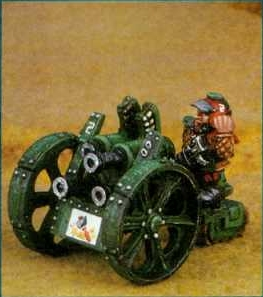
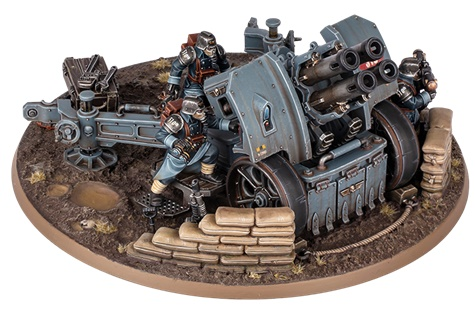
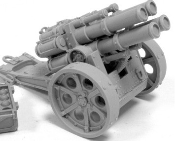

# 1531 重型四管发射器轻型野战火炮 Heavy Quad-Launcher Light Field Artillery

精校状态：中文行文已逐段精校，部分术语仍为暂定

分类：载具 / 地面 / 火炮

原文来源：https://www.bilibili.com/opus/1012147101009707030

原作者：帝国神选罐头

原文时间：2024年12月18日 12:47

[返回分类目录](目录.md) · [全书目录](../../目录.md)

<!-- A1531-B0001 -->
**英文原文**

Heavy Quad-Launchers, also known as Thudd Guns, are four-barreled light field artillery pieces originally produced by the Squats.

<!-- /A1531-B0001 -->

<!-- A1531-B0002 -->

原译文

重型四管发射器，也称为砰砰炮，是最初由矮人生产的四管轻型野战火炮。

**校订译文**

重型四管发射器，也称为砰砰炮，是最初由矮人生产的四管轻型野战火炮。

<!-- /A1531-B0002 -->

<!-- A1531-B0003 图片 -->

<!-- A1531-B0004 -->

原译文

Squat Thudd Gun mounted on a tractor unit 安装在牵引装置上的矮人砰砰炮

**校订译文**

Squat Thudd Gun mounted on a tractor unit 安装在牵引装置上的矮人砰砰炮

<!-- /A1531-B0004 -->

<!-- A1531-B0005 -->
## Overview 概述

<!-- /A1531-B0005 -->

<!-- A1531-B0006 -->
**英文原文**

Invented by the Engineers Guilds on the Squat Homeworlds, the design was later shared with the Adeptus Mechanicus, who copied and produced their own version for use by the Imperial Guard. The weapon received its nickname from the distinctive and rhythmic "thud" sound produced as each barrel fires in rapid succession. More commonly used by the Imperial Guard in the past, the heavy quad-launcher has been largely relegated to Siege Regiments and garrison forces. The weapon was employed by Space Marines during the Horus Heresy in defence of the Imperial Palace and has seen recent use in the Badab War as well as the Tyrannic Wars.

<!-- /A1531-B0006 -->

<!-- A1531-B0007 -->

原译文

该设计由矮人家园世界工程师行会发明，后来与机械神教共享，后者复制并制作了自己的版本供帝国卫队使用。这种武器之所以得名，是因为每支炮管快速连续射击时都会发出独特而有节奏的“砰砰”声。在过去，重四联发射器更多地被帝国卫队所使用，但现在它在很大程度上已被降级为攻城团和卫戍部队所使用。该武器在荷鲁斯叛乱时期被星际战士用于保卫皇宫，最近在巴达布战争和泰伦战争中也有使用。

**校订译文**

这种火炮由矮人母星的工程师行会发明，后来将设计分享给机械修会。机械修会仿制了供帝国卫队使用的版本。四根炮管依次快速发射，发出独特而有节奏的“砰砰”声，因此得名“砰砰炮”。过去，帝国卫队广泛使用重型四管发射器，如今主要将其配给攻城团和驻军。荷鲁斯之乱期间，星际战士曾用它保卫皇宫；后来在巴达布战争和泰伦战争中也曾使用。

<!-- /A1531-B0007 -->

<!-- A1531-B0008 图片 -->

<!-- A1531-B0009 -->

原译文

Death Korps of Krieg Heavy Quad-Launcher 克里格死亡军团的重型四管发射器

**校订译文**

Death Korps of Krieg Heavy Quad-Launcher 克里格死亡军团的重型四管发射器

<!-- /A1531-B0009 -->

<!-- A1531-B0010 -->
**英文原文**

Essentially four Mortars mounted on a single weapons carriage, the Heavy Quad-Launcher boasts a high rate of fire that makes it an excellent suppression weapon and in a direct-fire role against enemy infantry. One of its primary drawbacks however is the long reload time after all four barrels have been fired, requiring the loader to hand-crank the breech close in order to feed in a new round for each barrel. The launcher also lacks the range of heavier Imperial Guard artillery, limiting its viability in the counter-battery role.

<!-- /A1531-B0010 -->

<!-- A1531-B0011 -->

原译文

从本质上讲，四个迫击炮安装在一个武器托架上，重型四管发射器拥有高射速，使其成为一种出色的压制武器，可以直接对敌方步兵开火。然而，它的一个主要缺点是在四个炮管都发射后，重新装填的时间很长，需要装填手手动转动炮闩关闭，以便为每个炮管装入新一轮弹药。该发射器也缺乏重型帝国卫队火炮的射程，限制了其在反炮兵作用中的可行性。

**校订译文**

它实际上是将四门迫击炮装在同一炮架上，射速很高，既适合压制敌人，也可直接瞄准敌方步兵射击。主要缺点是四管全部射击之后，需要较长时间重新装填：装填手必须手摇炮闩机构，为每根炮管装入新弹。它的射程也比帝国卫队重型火炮短，因此不适合承担反炮兵任务。

**校注：** 原文对手摇炮闩与供弹动作的表述不够清楚；译为操作炮闩机构，未增补无法确定的机械步骤。

<!-- /A1531-B0011 -->

<!-- A1531-B0012 图片 -->

<!-- A1531-B0013 -->

原译文

Heavy Quad Launcher by Forge World 来自铸造世界的重型四管发射器

**校订译文**

Heavy Quad Launcher by Forge World Forge World制作的重型四管发射器模型

**校注：** 本处Forge World指模型品牌，不是设定中的铸造世界。

<!-- /A1531-B0013 -->

<!-- A1531-B0014 -->
**英文原文**

The original thudd guns were mounted on a special motorized tractor, which could be controlled by the gun crew with a radio control box. However, later models used by the Imperial Guard, such as the Lucius Pattern, must be towed into place, either by a Trojan or Centaur vehicle.

<!-- /A1531-B0014 -->

<!-- A1531-B0015 -->

原译文

最初的砰砰炮安装在一台特殊的机动拖拉机上，可以由炮手用无线电控制箱控制。然而，帝国卫队使用的后期型号，如卢修斯型，必须由特洛伊或半人马载具拖到位。

**校订译文**

最早的砰砰炮装在专用的机动牵引底座上，炮组可通过无线电控制盒操纵。帝国卫队后来的型号，例如卢修斯型，则须由特洛伊或半人马载具牵引到位。

<!-- /A1531-B0015 -->

<!-- A1531-B0016 -->

原译文

Vehicle Name:Quad Launcher 载具名称：四管发射器

**校订译文**

Vehicle Name:Quad Launcher 载具名称：四管发射器

<!-- /A1531-B0016 -->

<!-- A1531-B0017 -->

原译文

Forge World of Origin:Lucius 起源铸造世界：卢修斯

**校订译文**

Forge World of Origin:Lucius 起源铸造世界：卢修斯

<!-- /A1531-B0017 -->

<!-- A1531-B0018 -->

原译文

Known Patterns:II-IX 已知型号：II-IX

**校订译文**

Known Patterns:II-IX 已知型号：II-IX

<!-- /A1531-B0018 -->

<!-- A1531-B0019 -->

原译文

Crew:4 x Gunners 班组：四名枪手

**校订译文**

Crew:4 x Gunners 炮组：4名炮手

<!-- /A1531-B0019 -->

<!-- A1531-B0020 -->

原译文

Powerplant:N/A 动力装置：无

**校订译文**

Powerplant:N/A 动力装置：无

<!-- /A1531-B0020 -->

<!-- A1531-B0021 -->

原译文

Weight:3.8 tonnes 重量：3.8吨

**校订译文**

Weight:3.8 tonnes 重量：3.8吨

<!-- /A1531-B0021 -->

<!-- A1531-B0022 -->

原译文

Length:4.6m 长：4.6米

**校订译文**

Length:4.6m 长：4.6米

<!-- /A1531-B0022 -->

<!-- A1531-B0023 -->

原译文

Width:2.3m 宽：2.3米

**校订译文**

Width:2.3m 宽：2.3米

<!-- /A1531-B0023 -->

<!-- A1531-B0024 -->

原译文

Height:2.2m 高：2.2米

**校订译文**

Height:2.2m 高：2.2米

<!-- /A1531-B0024 -->

<!-- A1531-B0025 -->

原译文

Ground Clearance:0.44m 离地间隙：0.44米

**校订译文**

Ground Clearance:0.44m 离地间隙：0.44米

<!-- /A1531-B0025 -->

<!-- A1531-B0026 -->

原译文

Fording Depth: 涉水深度：

**校订译文**

Fording Depth: 涉水深度：原文未提供

<!-- /A1531-B0026 -->

<!-- A1531-B0027 -->

原译文

Max Speed - on road:N/A 最大速度-公路：无

**校订译文**

Max Speed - on road:N/A 最大速度-公路：无

<!-- /A1531-B0027 -->

<!-- A1531-B0028 -->

原译文

Max Speed - off road:N/A 最大速度-越野：无

**校订译文**

Max Speed - off road:N/A 最大速度-越野：无

<!-- /A1531-B0028 -->

<!-- A1531-B0029 -->

原译文

Transport Capacity:N/A 运输能力：无

**校订译文**

Transport Capacity:N/A 运输能力：无

<!-- /A1531-B0029 -->

<!-- A1531-B0030 -->

原译文

Access Points:N/A 接入点：无

**校订译文**

Access Points:N/A 出入口：不适用

<!-- /A1531-B0030 -->

<!-- A1531-B0031 -->

原译文

Main Armament:4 x Mortars 主武器：4门迫击炮

**校订译文**

Main Armament:4 x Mortars 主武器：4门迫击炮

<!-- /A1531-B0031 -->

<!-- A1531-B0032 -->

原译文

Secondary Armament:N/A 副武器：无

**校订译文**

Secondary Armament:N/A 副武器：无

<!-- /A1531-B0032 -->

<!-- A1531-B0033 -->

原译文

Traverse:0° 横向：0°

**校订译文**

Traverse:0° 水平射界：0°

<!-- /A1531-B0033 -->

<!-- A1531-B0034 -->

原译文

Elevation:From +10° to +42° 仰角：从+10°到+42°

**校订译文**

Elevation:From +10° to +42° 仰角：从+10°到+42°

<!-- /A1531-B0034 -->

<!-- A1531-B0035 -->

原译文

Main Ammunition:N/A 主要弹药：无

**校订译文**

Main Ammunition:N/A 主要弹药：无

<!-- /A1531-B0035 -->

<!-- A1531-B0036 -->

原译文

Secondary Ammunition:N/A 副弹药：无

**校订译文**

Secondary Ammunition:N/A 副弹药：无

<!-- /A1531-B0036 -->

<!-- A1531-B0037 -->
### Armour 装甲

<!-- /A1531-B0037 -->

<!-- A1531-B0038 -->

原译文

Superstructure:N/A 上部结构：无

**校订译文**

Superstructure:N/A 上部结构：无

<!-- /A1531-B0038 -->

<!-- A1531-B0039 -->

原译文

Hull:N/A 船体：无

**校订译文**

Hull:N/A 车体装甲：不适用

<!-- /A1531-B0039 -->

<!-- A1531-B0040 -->

原译文

Gun Mantlet:30mm 枪盾：30mm

**校订译文**

Gun Mantlet:30mm 炮盾：30毫米

<!-- /A1531-B0040 -->

<!-- A1531-B0041 -->

原译文

Vehicle Designation:2312-673-7609-HQL3 载具编号：2312-673-7609-HQL3

**校订译文**

Vehicle Designation:2312-673-7609-HQL3 载具编号：2312-673-7609-HQL3

<!-- /A1531-B0041 -->

<!-- A1531-B0042 -->

原译文

Firing Ports:N/A 发射端口：无

**校订译文**

Firing Ports:N/A 射击孔：不适用

<!-- /A1531-B0042 -->

<!-- A1531-B0043 -->

原译文

Turret:N/A 炮塔：无

**校订译文**

Turret:N/A 炮塔：无

<!-- /A1531-B0043 -->

<!-- A1531-B0044 -->
## Known Patterns 已知型号

<!-- /A1531-B0044 -->

<!-- A1531-B0045 -->

原译文

Lucius pattern 卢修斯型

**校订译文**

Lucius pattern 卢修斯型

<!-- /A1531-B0045 -->

本篇核心术语与暂定项

以下列出本篇出现的英文原形及核心术语表用词。同形词可能指不同对象，具体词义以本篇正文和校注为准；单复数、别名和仅见于图注的名称可能尚未列入。完整候选见[术语表](../../术语表/双语术语候选.csv)。

| 英文 | 采用中文 | 状态 |
| --- | --- | --- |
| Space Marines | 星际战士 | 官方已核对 |
| Adeptus Mechanicus | 机械修会 | 官方已核对 |
| Imperial Guard | 帝国卫队 | 暂定·语境区分 |
| Horus Heresy | 荷鲁斯之乱 | 官方已核对 |
| Horus | 荷鲁斯 | 暂定·官方待核 |
| Squats | 矮人 | 暂定·官方待核 |
| Badab | 巴达布 | 暂定·官方待核 |
| Lucius | 卢修斯 | 暂定·官方待核 |
| The Weapon | 武器 | 暂定·官方待核 |
| Gun | 甘 | 暂定·官方待核 |
| Trojan | 特洛伊 | 暂定·官方待核 |
| Heavy Quad-Launcher | 重型四管发射器 | 暂定·官方待核 |
| Engineers Guilds | 工程师行会 | 暂定·官方待核 |

