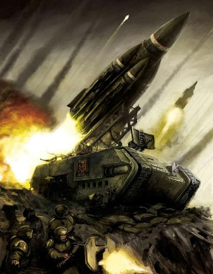
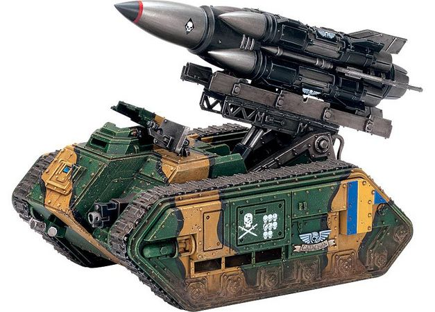
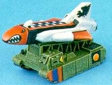
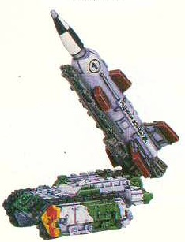

# 1532 死亡直击导弹车 Deathstrike Missile Launcher

精校状态：中文行文已逐段精校，部分术语仍为暂定

分类：载具 / 地面 / 火炮

原文来源：https://www.bilibili.com/opus/1164963012367351843

原作者：帝国神选罐头

原文时间：2026年02月03日 08:11

[返回分类目录](目录.md) · [全书目录](../../目录.md)

原篇名：死亡直击导弹发射车 Deathstrike Missile Launcher

<!-- A1532-B0001 -->
**英文原文**

The Deathstrike Missile Launcher is an Imperial Guard artillery vehicle based on the Chimera chassis. Its ability to fire a massive payload over extreme ranges is the Deathstrike's main advantage over other artillery systems. Only ever seeing deployment during the most vicious battles, each Deathstrike missile launcher is a force multiplier whose payload causes fear in even the most experienced enemies of the Imperium. The Deathstrike is designated an Ordnance Extremis by the Departmento Munitorum and requires special authorization to deploy.

<!-- /A1532-B0001 -->

<!-- A1532-B0002 -->

原译文

死亡打击导弹发射车是一种基于奇美拉底盘的帝国卫队火炮载具。它能够在超距范围内发射大量装载，这是死亡打击相对于其他火炮系统的主要优势。只有在最激烈的战斗中才能看到部署，每个死亡打击导弹发射车都是一个力量倍增器，其装载甚至会让帝国最有经验的敌人感到恐惧。死亡打击被军务部指定为极端军械，需要特别授权才能部署。

**校订译文**

死亡直击导弹车是使用奇美拉底盘的帝国卫队炮兵载具。与其他火炮相比，它最大的优势，是能将威力巨大的战斗部送到极远处的目标。它只在最惨烈的战役中部署；每一辆都能显著增强己方战力，其弹头足以令帝国最老练的敌人也心生畏惧。军务部将其列为“绝境兵器”，必须获得特别授权方可动用。

**校注：** GW04/GW11第95页对应Deathstrike死亡直击导弹车、Deathstrike missile死亡直击导弹；第96页对应Ordnance Extremis绝境兵器。

<!-- /A1532-B0002 -->

<!-- A1532-B0003 图片 -->

<!-- A1532-B0004 -->

原译文

Deathstrike Missile Launcher 死亡打击导弹发射车

**校订译文**

Deathstrike Missile Launcher 死亡直击导弹车

<!-- /A1532-B0004 -->

<!-- A1532-B0005 -->
## Overview 概述

<!-- /A1532-B0005 -->

<!-- A1532-B0006 -->
**英文原文**

The Deathstrike launcher represents the largest threat offered by any mobile Imperial Guard missile system. Mounted on the Chimera chassis is a single Deathstrike Missile, an inter-continental solid fuel rocket with a range measured in thousands of kilometers, capable of hitting a target half a world away. This missile can carry a variety of payloads, though by far the most common is a plasma warhead: Upon detonation these missiles can annihilate entire armies in a raging fireball that vaporises flesh in an instant. Others can carry deadly biological pathogens or specialised Titan-killer warheads, while the rarest of all are the deadly Vortex Missiles. These doomsday weapons of apocalyptic capability use Dark Age of Technology knowledge to tear holes within the fabric of reality upon their explosion, creating a warp rift which destroys everything it touches.

<!-- /A1532-B0006 -->

<!-- A1532-B0007 -->

原译文

死亡打击发射车是任何帝国卫队移动导弹系统提供的最大威胁。奇美拉底盘上安装着一枚死亡打击导弹，这是一种洲际固体燃料火箭，射程可达数千公里，能够击中半个行星之外的目标。这种导弹可以携带各种装载，尽管到目前为止最常见的是等离子弹头：引爆后，这些导弹可以在瞬间蒸发肉体的扩散火球中消灭整个军队。其他可以携带致命的生物病原体或专门的泰坦杀手弹头，而最稀有的是致命的涡旋导弹。这些具有启示录级能力的末日武器在爆炸时利用黑暗技术时代的知识在现实结构中撕开洞，形成亚空间裂隙，摧毁它所触及的一切。

**校订译文**

在帝国卫队所有机动导弹系统中，死亡直击的威胁最大。奇美拉底盘承载一枚洲际固体燃料死亡直击导弹，射程以数千公里计，能打击半颗行星之外的目标。它可装载多种战斗部，最常见的是等离子弹头，爆炸形成的烈焰火球能瞬间汽化血肉、歼灭整支大军。其他型号可携带致命病原体或专门猎杀泰坦的弹头；最罕见的是涡旋导弹。这种末日武器运用黑暗科技时代的技术，在爆炸时撕裂现实，制造亚空间裂隙，摧毁触及的一切。

<!-- /A1532-B0007 -->

<!-- A1532-B0008 图片 -->

<!-- A1532-B0009 -->

原译文

Deathstrike Missile Launcher 死亡打击导弹发射车

**校订译文**

Deathstrike Missile Launcher 死亡直击导弹车

<!-- /A1532-B0009 -->

<!-- A1532-B0010 -->
**英文原文**

Most of the missiles carried by Titans can be modified to be fired from the Deathstrike launcher as well.

<!-- /A1532-B0010 -->

<!-- A1532-B0011 -->

原译文

泰坦携带的大多数导弹也可以改装为从死亡打击发射车发射。

**校订译文**

泰坦携带的大多数导弹也可经过改装，由死亡直击发射装置发射。

<!-- /A1532-B0011 -->

<!-- A1532-B0012 -->
**英文原文**

The deployment of a single Deathstrike Missile Launcher is a complicated procedure that requires a huge investment of resources and many religious and administrative rituals by the Adeptus Mechanicus and Administratum respectively. As such, the deployment can take months to complete. Moreover the large lumbering launch vehicles often require their own dedicated escort and presents foes with a valuable and soft target. For the Departmento Munitorum, simple logistics has precluded its deployment in all but the most extreme circumstances.

<!-- /A1532-B0012 -->

<!-- A1532-B0013 -->

原译文

部署单个死亡打击导弹发射车是一个复杂的过程，需要机械神教和内务部分别投入大量资源和许多宗教和行政仪式。因此，部署可能需要数月时间才能完成。此外，笨重的大型运载火箭通常需要自己的专门护卫队，并为敌人提供了一个有价值的软目标。对于内务部来说，简单的后勤保障使其无法在除最极端情况外的所有情况下部署。

**校订译文**

仅部署一辆死亡直击导弹车，就需要投入大量资源，并由机械修会和内政部分别完成繁复的宗教仪式与行政程序，往往耗时数月。庞大笨重的发射车通常还需要专门护卫；对敌人而言，它是价值极高却容易遭受攻击的目标。仅后勤负担这一点，就足以让军务部只在最极端的情况下部署它。

<!-- /A1532-B0013 -->

<!-- A1532-B0014 -->
**英文原文**

Use of these weapons is strictly controlled, with sanction for their use controlled by Segmentum Command and the launch codes held by loyal and iron-willed Lord Commissars.

<!-- /A1532-B0014 -->

<!-- A1532-B0015 -->

原译文

这些武器的使用受到严格控制，对其使用的许可由星域指挥部控制，发射代码由忠诚和意志坚定的领主政委持有。

**校订译文**

这些武器的使用受到严格控制，对其使用的许可由星域指挥部控制，发射代码由忠诚和意志坚定的领主政委持有。

<!-- /A1532-B0015 -->

<!-- A1532-B0016 -->
**英文原文**

Tactical Deathstrike missiles are equipped with complex robotic guidance systems allowing them to choose and pursue their own targets. When fired the missile climbs high into the air, up to where its cameras can survey the whole battlefield; the onboard computer then selects an objective and dives back to the surface. Reentry is very inaccurate, and if the missile fails to hit the target directly in its fall it will remain 10-20m above the ground, dodging terrain and incoming fire in order to reach its goal in a slow nap-of-the-earth flight. As a result the missile never misses, except when running out of fuel.

<!-- /A1532-B0016 -->

<!-- A1532-B0017 -->

原译文

战术死亡打击导弹配备了复杂的类机器人制导系统，使其能够选择和追击自己的目标。导弹发射后，会高高地飞向空中，其摄像头可以俯瞰整个战场；然后，机载计算机选择一个目标并潜回表面。折返非常不准确，如果导弹在坠落时未能直接击中目标，它将保持在离地面10-20m的高度，避开地形和来袭火力，以便在贴地飞行的缓慢过程中到达目标。因此，除非燃料耗尽，否则导弹永远不会不击中。

**校订译文**

战术型死亡直击导弹装有复杂的自动制导系统，可以自行选择并追踪目标。发射后，它升至能够用摄像系统俯瞰整个战场的高空，再由弹载计算机选择目标，俯冲回地面。返回时精度很低；若未能直接命中，它就会保持在离地10至20米的高度，避开地形和来袭火力，缓慢贴地飞向目标。因此，按本条目的描述，除非燃料耗尽，否则它最终总能命中。

**校注：** 原文描述属于条目中的战术导弹设定，未以现实制导常识擅改，也不推定适用于其他规则版本。

<!-- /A1532-B0017 -->

<!-- A1532-B0018 图片 -->

<!-- A1532-B0019 -->

原译文

1st Edition Epic Scale Deathstrike Missile Launcher 第一版epic比例死亡打击导弹发射车

**校订译文**

1st Edition Epic Scale Deathstrike Missile Launcher 第一版《史诗》比例的死亡直击导弹车模型

<!-- /A1532-B0019 -->

<!-- A1532-B0020 -->
## History 历史

<!-- /A1532-B0020 -->

<!-- A1532-B0021 -->
**英文原文**

The Deathstrike missile launcher finds itself an uncommon sight on the modern battlefield, as over the years the Imperium has slowly moved on to more mobile forms of artillery that are smaller and require less logistical support. Due to their size and damage potential, Deathstrike batteries are mostly used for the total obliteration of key targets or those beyond the range of conventional artillery.

<!-- /A1532-B0021 -->

<!-- A1532-B0022 -->

原译文

死亡打击导弹发射车在现在的战场上是一种罕见的景象，因为多年来帝国已经慢慢转向更机动的火炮，这些火炮更小，需要更少的后勤支援。由于其尺寸和潜在的破坏力，死亡打击群主要用于完全摧毁关键目标或常规火炮射程之外的目标。

**校订译文**

如今，死亡直击导弹车已不常见。多年来，帝国逐渐转用体积更小、机动性更强、后勤需求更低的火炮。考虑到死亡直击的体型和毁伤能力，其炮兵连主要负责彻底摧毁关键目标，或打击常规火炮射程之外的目标。

<!-- /A1532-B0022 -->

<!-- A1532-B0023 -->
**英文原文**

On Armageddon, Deathstrike batteries located at Hive Helsreach were frequently used to provide support for the defenders of Hive Volcanus during the Third War for Armageddon, despite the latter's location on the opposite side of the planet.

<!-- /A1532-B0023 -->

<!-- A1532-B0024 -->

原译文

在阿玛吉多顿，位于赫尔斯利奇巢都的死亡打击群经常被用来在第三次阿玛吉多顿战争期间为伏尔坎努斯巢都的防御者提供支援，尽管后者位于行星的另一边。

**校订译文**

第三次阿玛吉多顿战争期间，赫尔斯利奇巢都的死亡直击炮兵连，经常为行星另一侧伏尔坎努斯巢都的守军提供支援。

<!-- /A1532-B0024 -->

<!-- A1532-B0025 -->
**英文原文**

During the Ork raid on Baric Six in 994.M40, a band of Lootas somehow managed to infiltrate and steal one of three Deathstrike missile launchers from the Army 52 artillery park. They would use it shortly after, resulting in the loss of two entire armoured companies of the Mordian 278th and the Baneblade Steel Might, not to mention over a hundred surprised Orks. A dozen Imperial generals would be executed for dereliction of duty following a two-year investigation into how the launcher was stolen.

<!-- /A1532-B0025 -->

<!-- A1532-B0026 -->

原译文

M40.994，在欧克对巴里克六星的突袭中，一伙拾荒小子不知怎么地潜入并偷走了陆军52炮兵阵地的三个死亡打击导弹发射车中的一个。不久后，他们就使用了它，导致莫迪安第278兵团的两个装甲连队和毒刃钢铁力量号全部损失，更不用说一百多个惊讶的欧克了。经过两年对发射车被盗原因的调查，十几名帝国将军将因渎职被处决。

**校订译文**

994.M40，欧克突袭巴里克六号时，一伙蛮人拾荒者不知如何潜入第52军的炮兵集结场，偷走了三辆死亡直击导弹车中的一辆。它们很快发射导弹，摧毁了莫迪安第278团的整整两个装甲连、毒刃坦克钢铁力量号，以及一百多名猝不及防的欧克。调查持续两年，最终十余名帝国将军因渎职被处决。

<!-- /A1532-B0026 -->

<!-- A1532-B0027 图片 -->

<!-- A1532-B0028 -->

原译文

3rd Edition Epic Scale Deathstrike Missile Launcher 第三版epic比例死亡打击导弹发射车

**校订译文**

3rd Edition Epic Scale Deathstrike Missile Launcher 第三版《史诗》比例的死亡直击导弹车模型

<!-- /A1532-B0028 -->

<!-- A1532-B0029 -->
## Payloads 战斗部

原题：Payloads 装载

<!-- /A1532-B0029 -->

<!-- A1532-B0030 -->
**英文原文**

Barrage Missile - Containing multiple Plasma warheads to vaporize a vast area of land or deplete a Titan's Void shields.

<!-- /A1532-B0030 -->

<!-- A1532-B0031 -->

原译文

弹幕导弹 - 包含多个等离子弹头，用于蒸发大片区域或耗尽泰坦的虚空盾。

**校订译文**

弹幕导弹 - 包含多个等离子弹头，用于蒸发大片区域或耗尽泰坦的虚空盾。

<!-- /A1532-B0031 -->

<!-- A1532-B0032 -->

原译文

Godspear Warhead 神矛弹头

**校订译文**

Godspear Warhead 神矛弹头

<!-- /A1532-B0032 -->

<!-- A1532-B0033 -->
**英文原文**

Harpoon Missile - Designed to penetrate a Titan's armour plating and short-circuit its systems. The onboard computer brain can even control the impacted target to some extent. Smaller targets are outright destroyed by the powerful electromagnetic pulse

<!-- /A1532-B0033 -->

<!-- A1532-B0034 -->

原译文

鱼叉导弹 - 旨在穿透泰坦的装甲板并使其系统短路。机载计算机大脑甚至可以在一定程度上控制受影响的目标。较小的目标被强大的电磁脉冲彻底摧毁

**校订译文**

鱼叉导弹——穿透泰坦装甲后使其系统短路，弹载计算机甚至能够在一定程度上控制被击中的目标。较小的目标则会被强烈的电磁脉冲直接摧毁。

<!-- /A1532-B0034 -->

<!-- A1532-B0035 -->
**英文原文**

Haywire Missile - When this weapon detonates, it unleashes an electromagnetic pulse (EMP) that disables all nearby enemy machinery.

<!-- /A1532-B0035 -->

<!-- A1532-B0036 -->

原译文

失控导弹 - 当这种武器引爆时，它会释放一个电磁脉冲（EMP），使附近的所有敌方机器失效。

**校订译文**

紊乱导弹——引爆时释放电磁脉冲，使附近敌方机械全部瘫痪。

<!-- /A1532-B0036 -->

<!-- A1532-B0037 -->

原译文

Nuclear Missile 核导弹

**校订译文**

Nuclear Missile 核导弹

<!-- /A1532-B0037 -->

<!-- A1532-B0038 -->
**英文原文**

Solfire Missile - A pattern of Plasma Warhead, designed for precision strikes, particularily designed for killing Titan class engines. As such its blast radius won't extend over one hundred feet.

<!-- /A1532-B0038 -->

<!-- A1532-B0039 -->

原译文

阳炎导弹 - 一种等离子弹头，专为精确打击而设计，特别是为杀死泰坦级引擎而设计。因此，它的爆炸半径不会超过一百英尺。

**校订译文**

阳炎导弹——一种专门用于精确打击、尤其是猎杀泰坦级战争机器的等离子弹头。因此，其爆炸半径不超过100英尺。

<!-- /A1532-B0039 -->

<!-- A1532-B0040 -->
**英文原文**

Stasis Missile - Freezes time and traps any within its radius of effect.

<!-- /A1532-B0040 -->

<!-- A1532-B0041 -->

原译文

静滞导弹 - 冻结时间，并将任何东西困在其影响范围内。

**校订译文**

静滞导弹 - 冻结时间，并将任何东西困在其影响范围内。

<!-- /A1532-B0041 -->

<!-- A1532-B0042 -->
**英文原文**

Surface-to-Air Missile - Anti-aircraft weapon

<!-- /A1532-B0042 -->

<!-- A1532-B0043 -->

原译文

地对空导弹 - 防空武器

**校订译文**

地对空导弹 - 防空武器

<!-- /A1532-B0043 -->

<!-- A1532-B0044 -->

原译文

Vortex Missile 涡旋导弹

**校订译文**

Vortex Missile 涡旋导弹

<!-- /A1532-B0044 -->

<!-- A1532-B0045 -->
**英文原文**

Warp Missile - Equipped with a miniature Warp Drive, the missile rematerializes directly inside the target before exploding, bypassing shields and armour

<!-- /A1532-B0045 -->

<!-- A1532-B0046 -->

原译文

亚空间导弹 - 配备微型亚空间驱动器，导弹在爆炸前直接在目标内部重新物质化，绕过护盾和装甲

**校订译文**

亚空间导弹——配有微型亚空间引擎，绕过护盾与装甲，在目标内部重新显形后爆炸。

<!-- /A1532-B0046 -->

<!-- A1532-B0047 -->
## Technical Specifications 技术规格

<!-- /A1532-B0047 -->

<!-- A1532-B0048 -->
**英文原文**

The Death Strike Missile Launcher, besides its main payload, is armed with a hull mounted weapon - either a Heavy Bolter or Heavy Flamer — and includes a Searchlight and Smoke Launchers. It may also be upgraded with Camo Netting, Dozer Blades, Extra Armour, a Hunter-Killer Missile and a pintle-mounted Storm Bolter or Heavy Stubber.

<!-- /A1532-B0048 -->

<!-- A1532-B0049 -->

原译文

死亡打击导弹发射车除了其主要装载外，还配备了车体安装的武器 — 重型爆矢枪或重型火焰枪 — 并包括探照灯和烟雾发射器。它还可以升级迷彩网、推土机铲刀、额外装甲、猎杀导弹和枢轴式风暴爆矢枪或重型伐木枪。

**校订译文**

除主导弹外，死亡直击导弹车还在车体上安装一挺重型爆矢枪或一具重型火焰喷射器，并配有探照灯和烟幕发射器。它还可加装伪装网、推土铲、附加装甲、猎杀导弹，以及枢轴枪架上的风暴爆矢枪或重机枪。

<!-- /A1532-B0049 -->

本篇核心术语与暂定项

以下列出本篇出现的英文原形及核心术语表用词。同形词可能指不同对象，具体词义以本篇正文和校注为准；单复数、别名和仅见于图注的名称可能尚未列入。完整候选见[术语表](../../术语表/双语术语候选.csv)。

| 英文 | 采用中文 | 状态 |
| --- | --- | --- |
| Adeptus Mechanicus | 机械修会 | 官方已核对 |
| Imperial Guard | 帝国卫队 | 暂定·语境区分 |
| Orks | 欧克蛮人 | 官方已核对 |
| Chimera | 奇美拉 | 官方已核对 |
| Warp | 亚空间 | 官方已核对 |
| Imperium | 帝国 | 暂定·简称 |
| Dark Age of Technology | 黑暗科技时代 | 暂定 |
| Warp Drive | 亚空间驱动装置 | 暂定 |
| Administratum | 内政部 | 暂定 |
| Departmento Munitorum | 军务部 | 暂定 |
| Hunter-Killer | 猎杀者 | 暂定·官方待核 |
| Segmentum | 星域 | 暂定·官方待核 |
| Armageddon | 阿玛吉多顿 | 暂定·官方待核 |
| Mordian | 莫迪安 | 暂定·官方待核 |
| Titan | 泰坦 | 暂定·官方待核 |
| Death Strike | 死亡打击 | 暂定·官方待核 |
| Missile Launchers | 导弹发射器 | 暂定·官方待核 |
| Baneblade | 毒刃 | 官方已核对 |
| Lootas | 蛮人拾荒者 | 官方已核对 |
| System | 星系（恒星系统） | 暂定·官方待核 |
| Hive Helsreach | 赫尔斯利奇巢都 | 暂定·官方待核 |
| Missile Launcher | 导弹发射器 | 暂定·官方待核 |
| Hunter-killer missile | 猎杀导弹 | 官方已核对 |
| Heavy stubber | 重机枪 | 官方已核对 |
| Bolter | 爆矢枪 | 暂定·官方待核 |
| Heavy bolter | 重型爆矢枪 | 官方已核对 |
| Storm bolter | 风暴爆矢枪 | 官方已核对 |
| Flamer | 火焰喷射器（武器）／火妖（奸奇单位） | 语境定译·对应官译已核 |
| Heavy flamer | 重型火焰喷射器 | 官方已核对 |
| Deathstrike Missile Launcher | 死亡直击导弹车 | 暂定·官方待核 |
| Baric Six | 巴里克六号 | 暂定·官方待核 |
| Steel Might | 钢铁力量号 | 暂定·官方待核 |
| Haywire Missile | 紊乱导弹 | 暂定·官方待核 |
| Solfire Missile | 阳炎导弹 | 暂定·官方待核 |
| Harpoon Missile | 鱼叉导弹 | 暂定·官方待核 |
| Barrage Missile | 弹幕导弹 | 暂定·官方待核 |
| Deathstrike | 死亡直击导弹车 | 官方已核对 |
| Deathstrike Missile | 死亡直击导弹 | 官方已核对 |
| Ordnance Extremis | 绝境兵器 | 官方已核对 |
| The Loss | 失落 | 暂定·官方待核 |
| Extra Armour | 额外装甲 | 暂定·官方待核 |

