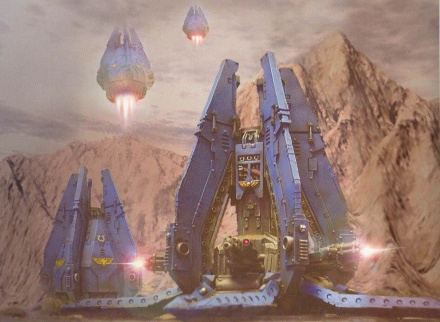
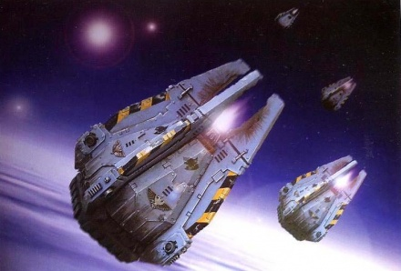
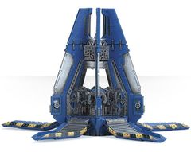
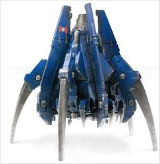
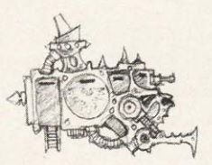
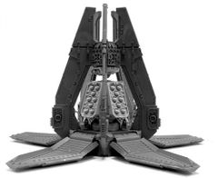
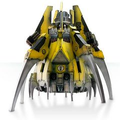
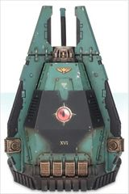
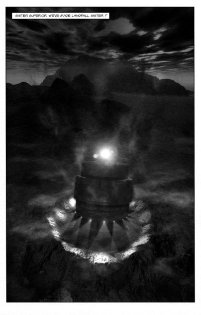

# 1534 空降舱 Drop Pod

精校状态：中文行文已逐段精校，部分术语仍为暂定

分类：载具 / 飞行 / 运输

原文来源：https://www.bilibili.com/opus/1037408221794402313

原作者：帝国神选罐头

原文时间：编辑于 2025年09月24日 13:44

[返回分类目录](目录.md) · [全书目录](../../目录.md)

原篇名：空投舱 Drop Pod

<!-- A1534-B0001 -->
**英文原文**

Drop Pods are transports used primarily by Space Marines and Chaos Marines for orbital insertion and one-way rides.

<!-- /A1534-B0001 -->

<!-- A1534-B0002 -->

原译文

空投舱是星际战士和混沌星际战士主要用于轨道空投和单向飞行的运输工具。

**校订译文**

空降舱主要由星际战士和混沌星际战士使用，是进行轨道突入的单程运输工具。

<!-- /A1534-B0002 -->

<!-- A1534-B0003 图片 -->

<!-- A1534-B0004 -->

原译文

Ultramarines Deathstorm pattern Drop Pods with Assault Cannons 配备突击炮的极限战士死亡风暴型空投舱

**校订译文**

Ultramarines Deathstorm pattern Drop Pods with Assault Cannons 配备突击炮的极限战士死亡风暴型空降舱

<!-- /A1534-B0004 -->

<!-- A1534-B0005 -->
## Space Marines 星际战士

<!-- /A1534-B0005 -->

<!-- A1534-B0006 -->
**英文原文**

Adeptus Astartes have used Drop Pods since the time of the Great Crusade. The Drop Pods of the Adeptus Astartes look and work similarly to a ship's Life Pod and can carry either twelve normal Marines, a single Dreadnought or a single Thunderfire Cannon. They are launched from a Strike Cruiser or Battle Barge in low orbit towards the drop zone, usually amidst or near a battlefield. Once launched, they plummet through the atmosphere until retro jets fire to slow their descent. A machine spirit guides the pod to its destination and can receive further commands from the mother ship. Although the Pods become immobile after having landed they can be recovered by the Chapter's Techmarines and reused. Drop Pods are usually extracted by using far larger vessels that not intended to operate in a war zone. After that they are transported to the ships that deployed them, repaired if needed and used in the next battle, so many Drop Pods have been in service for centuries. Some Space Marine Chapters inscribe records of each drop onto the interior bulkheads of their Drop Pods, so other brothers can read them and take heart in the insuing battles.

<!-- /A1534-B0006 -->

<!-- A1534-B0007 -->

原译文

阿斯塔特修会自大远征以来一直使用空投舱。阿斯塔特修会的空投舱外观和工作原理与船上的救生舱相似，可以携带十二名普通星际战士、一艘无畏舰或一门雷火炮。它们从低轨道的打击巡洋舰或战斗驳船发射到投放区，通常在战场中或附近。一旦发射，它们就会在大气层中坠落，直到制动喷气火箭启动以减缓下降速度。机魂将空投舱引导到目的地，并可以从母舰接收进一步的命令。虽然空投舱在着陆后变得不动，但它们可以被战团的技术军士回收并重新使用。空降舱通常是通过使用不打算在战区作业的更大的船只来运输的。之后，它们被运送到部署它们的船只上，必要时进行维修并在下一场战斗中使用，因此许多空降舱已经服役了几个世纪。一些星际战士战团将每次空投的记录刻在他们的空投舱的内部舱壁上，这样其他兄弟就可以阅读这些记录，并在空投战斗中振作起来。

**校订译文**

阿斯塔特自大远征时代起便使用空降舱。它的外观与工作方式类似舰船救生舱，可运送12名普通星际战士、一台无畏机甲，或一门雷火炮。打击巡洋舰或战斗驳船在低轨道上将其射向战场内或附近的着陆区。空降舱穿越大气层急速下坠，再由反推喷口减速；机魂负责导航，也可接收母舰进一步指令。着陆后，它不能自行移动，但战团科技战士可以回收并再次使用。回收通常由不适合进入交战区的大型运输舰艇完成，再送回原投放舰，必要时维修，供下一场战斗使用。因此，许多空降舱已经服役数百年。有些战团会把历次空降记录刻在内舱壁上，让后来的战斗兄弟阅读，从中获得迎战的勇气。

<!-- /A1534-B0007 -->

<!-- A1534-B0008 图片 -->

<!-- A1534-B0009 -->

原译文

Space Wolf Drop Pods entering the atmosphere 太空野狼空投仓进入大气层

**校订译文**

Space Wolf Drop Pods entering the atmosphere 太空野狼空降舱进入大气层

<!-- /A1534-B0009 -->

<!-- A1534-B0010 -->
**英文原文**

Standard Drop-Pods are most frequently armed with an array of either Storm Bolters or Deathwind Missile Launchers.

<!-- /A1534-B0010 -->

<!-- A1534-B0011 -->

原译文

标准空投舱最常配备风暴爆矢枪或死风导弹发射器阵列。

**校订译文**

标准空降舱最常配备风暴爆矢枪或死风导弹发射器阵列。

<!-- /A1534-B0011 -->

<!-- A1534-B0012 图片 -->

<!-- A1534-B0013 -->

原译文

Drop Pod 空投舱

**校订译文**

Drop Pod 空降舱

<!-- /A1534-B0013 -->

<!-- A1534-B0014 -->
**英文原文**

There are also cargo-carrying pods that deliver a much needed ammunition to fighting troops even in the heat of battle.

<!-- /A1534-B0014 -->

<!-- A1534-B0015 -->

原译文

还有一些载货舱，即使在战斗最激烈的时候，也能为战斗部队运送急需的弹药。

**校订译文**

还有一些载货舱，即使在战斗最激烈的时候，也能为战斗部队运送急需的弹药。

<!-- /A1534-B0015 -->

<!-- A1534-B0016 图片 -->

<!-- A1534-B0017 -->

原译文

Anvillus Pattern Drop Pod 安维鲁斯型空投舱

**校订译文**

Anvillus Pattern Drop Pod 安维鲁斯型空降舱

<!-- /A1534-B0017 -->

<!-- A1534-B0018 -->
### Variant Patterns 变体型号

<!-- /A1534-B0018 -->

<!-- A1534-B0019 -->
**英文原文**

Corvus Assault Pod: A variant pattern of drop pod used in a similar manner to a Boarding Torpedo; corvus assault pods are used to assault other ships or Space Stations in the void. A variant is also used by Warlord Titans to deliver troops on enemy walls.

<!-- /A1534-B0019 -->

<!-- A1534-B0020 -->

原译文

渡鸦突击舱：一种与跳帮鱼雷类似的空投舱变体；渡鸦突击舱用于攻击太空中的其他船只或空间站。军阀泰坦也使用一种变体向敌人的堡垒运送部队。

**校订译文**

渡鸦突击舱——用途类似跳帮鱼雷，用来攻击虚空中的其他舰船或空间站。战将级泰坦也可使用一种改型，将部队送上敌方城墙。

<!-- /A1534-B0020 -->

<!-- A1534-B0021 图片 -->

<!-- A1534-B0022 -->

原译文

Corvus Assault Pod 渡鸦突击舱

**校订译文**

Corvus Assault Pod 渡鸦突击舱

<!-- /A1534-B0022 -->

<!-- A1534-B0023 -->
**英文原文**

Deathstorm Drop Pods,(also known as Deathwind Drop Pods) are a variant pattern that don't carry troops; instead they have weapon systems installed to rake the enemy with high levels of fire once they have landed and opened. They can be armed with either Whirlwind Launchers or Assault Cannons. Deathwinds can be directly dropped into the heart of an enemy position, in preparation for an attack.

<!-- /A1534-B0023 -->

<!-- A1534-B0024 -->

原译文

死亡风暴空投舱（也称为死风空投舱）是一种不携带部队的变体型号；相反，他们安装了武器系统，一旦着陆并打开，就会用高强度的火力对敌人进行扫射。他们可以装备旋风发射器或突击炮。死风可以直接落入敌方阵地的中心，为进攻做准备。

**校订译文**

死亡风暴空降舱——也称死风空降舱，不搭载部队，而是装有旋风发射器或突击炮。着陆展开后，它会以猛烈火力扫射敌人，可以直接投向敌阵中心，为随后的进攻作准备。

<!-- /A1534-B0024 -->

<!-- A1534-B0025 图片 -->

<!-- A1534-B0026 -->

原译文

Deathstorm Pattern Drop Pod 死亡风暴型空投舱

**校订译文**

Deathstorm Pattern Drop Pod 死亡风暴型空降舱

<!-- /A1534-B0026 -->

<!-- A1534-B0027 -->
**英文原文**

Kharybdis Assault Claw, a monstrous Drop Pod and transport craft used by the Legiones Astartes during the Great Crusade and Horus Heresy.

<!-- /A1534-B0027 -->

<!-- A1534-B0028 -->

原译文

卡律布狄斯突击爪，一种巨大的空投舱和运输船，在大远征和荷鲁斯叛乱期间被阿斯塔特军团士兵使用。

**校订译文**

卡律布狄斯突击爪——大远征和荷鲁斯之乱期间，阿斯塔特军团使用的巨型空降舱兼运输艇。

<!-- /A1534-B0028 -->

<!-- A1534-B0029 图片 -->

<!-- A1534-B0030 -->

原译文

Kharybdis Assault Claw 卡律布狄斯突击爪

**校订译文**

Kharybdis Assault Claw 卡律布狄斯突击爪

<!-- /A1534-B0030 -->

<!-- A1534-B0031 -->
**英文原文**

Dreadnought Drop Pod, allows a single Dreadnought to be deployed into the battle with minimal delay

<!-- /A1534-B0031 -->

<!-- A1534-B0032 -->

原译文

无畏空投舱，允许在最小延迟的情况下将单个无畏部署到战斗中

**校订译文**

无畏机甲空降舱——用于尽快将一台无畏机甲投入战场。

<!-- /A1534-B0032 -->

<!-- A1534-B0033 图片 -->

<!-- A1534-B0034 -->

原译文

Dreadnought Drop Pod 无畏空降舱

**校订译文**

Dreadnought Drop Pod 无畏机甲空降舱

<!-- /A1534-B0034 -->

<!-- A1534-B0035 -->
**英文原文**

Support Drop Pods are similar in role to Deathwind Drop Pods, carrying automated weaponry instead of troops. Upon landing, the pod opens to a turret-mounted plasma cannon. Unlike the Deathwind it is however capable of sustained operation.

<!-- /A1534-B0035 -->

<!-- A1534-B0036 -->

原译文

支援空投舱的作用类似于死风空投舱，携带自动武器而不是部队。着陆后，空投舱打开，露出一门装在炮塔上的等离子炮。然而，与死风不同，它能够持续运行。

**校订译文**

支援空降舱的作用类似于死风空降舱，携带自动武器而不是部队。着陆后，空降舱打开，露出一门装在炮塔上的等离子炮。然而，与死风不同，它能够持续运行。

<!-- /A1534-B0036 -->

<!-- A1534-B0037 -->
**英文原文**

Carrier Ascent Pods were used during the Horus Heresy and were fired at warships from moons or planetoids held by the Space Marine Legions. Their engines allowed them to climb up a modest gravity well and once in space, they could be quickly steered into a new direction if need be. The Ascent Pods were also equipped with armored cowls at their front, which provided protection for the Legionaries they carried, as the Pods collided with their targets.

<!-- /A1534-B0037 -->

<!-- A1534-B0038 -->

原译文

运载上升舱在荷鲁斯叛乱期间被使用，并从星际战士控制的卫星或小行星上向舰船发射。他们的发动机使他们能够攀登一个适度的重力井，一旦进入太空，如果需要，他们可以迅速转向一个新的方向。上升舱的前部还配备了装甲罩，当舱体与目标碰撞时，为他们携带的老兵提供保护。

**校订译文**

运载上升舱——荷鲁斯之乱期间，从星际战士军团控制的卫星或小型天体上向敌舰发射。其引擎能够克服较弱的引力，升入太空后又能按需迅速变向。前端装甲罩可以在撞击目标时保护舱内的军团战士。

<!-- /A1534-B0038 -->

<!-- A1534-B0039 -->
**英文原文**

Legion Palisade Drop Pod were used by the Space Marine Legions and carried powerful Shield Generators that projected energy forcefields. They were deployed to protect other Drop Pods and their contents from enemy fire.

<!-- /A1534-B0039 -->

<!-- A1534-B0040 -->

原译文

军团帕利塞德空降舱被星际战士使用，并携带强大的护盾发生器，可以投射能量力场。他们被部署来保护其他空降舱及其内容物免受敌人的攻击。

**校订译文**

军团帕利塞德空降舱——搭载强大的护盾发生器，投射能量力场，保护其他空降舱及其搭载的部队和物资。

<!-- /A1534-B0040 -->

<!-- A1534-B0041 -->
## Chaos Space Marines 混沌星际战士

<!-- /A1534-B0041 -->

<!-- A1534-B0042 -->
### Dreadclaw 恐怖爪

<!-- /A1534-B0042 -->

<!-- A1534-B0043 -->
**英文原文**

The Dreadclaw is an ancient Drop Pod variant that can also be used as an assault boat for ship-to-ship combat. Unlike other Drop Pods it is able to take off after landing. Dreadclaws are exclusively used by Chaos Space Marines.

<!-- /A1534-B0043 -->

<!-- A1534-B0044 -->

原译文

恐怖爪是一种古老的空降舱变体，也可以用作舰对舰战斗的突击艇。与其他空降舱不同，它能够在着陆后起飞。恐怖爪仅由混沌星际战士使用。

**校订译文**

恐怖爪是一种古老的空降舱变体，也可以用作舰对舰战斗的突击艇。与其他空降舱不同，它能够在着陆后起飞。恐怖爪仅由混沌星际战士使用。

**校注：** 本段描述现时代仅混沌使用恐怖爪；不据此否认大远征/荷鲁斯之乱中的早期使用。

<!-- /A1534-B0044 -->

<!-- A1534-B0045 -->
## Other Forces 其他部队

<!-- /A1534-B0045 -->

<!-- A1534-B0046 -->
**英文原文**

The assassins of the Eversor Temple are deployed in special Drop Pods that prepare them for their missions. These Pods are equipped with neuro-links that feed the details of the mission to the assassin while remote links activate and begin to prepare his body for the task at hand.

<!-- /A1534-B0046 -->

<!-- A1534-B0047 -->

原译文

艾弗森神庙的刺客被部署在特殊的空投舱中，为他们的任务做好准备。这些舱体配备了神经链接，可以向刺客提供任务的细节，同时远程链接会激活并开始为他的身体准备手头的任务。

**校订译文**

艾弗森神庙刺客使用特制空降舱部署。舱内神经接口会向刺客传输任务详情，远程连接则唤醒并调节他的身体，使其做好执行任务的准备。

<!-- /A1534-B0047 -->

<!-- A1534-B0048 -->
**英文原文**

The Battle Sisters of the Adepta Sororitas occasionally deploy via Dominica-pattern Drop Pods, a pattern of Drop Pod that can carry five unaugmented humans, when undertaking special high risk missions such as infiltrations behind enemy lines, chirurgical strikes against high value targets, or disabling the command structure of a renegade Space Marine chapter. Such operations are usually requested by the Ordo Hereticus, with support of the Imperial Navy. Each Order Militant maintains a small number of Drop Pods exclusively for those operations, and their use is reserved to elite troops such as the Celestians and Dominions. This includes a variant of the Deathwind Drop Pod, which will then be armed with weapons favored by the Sororitas, either five twin Heavy Bolters or Multi-Meltas.

<!-- /A1534-B0048 -->

<!-- A1534-B0049 -->

原译文

修女会的战斗姐妹偶尔会通过多米尼卡型空降舱部署，这是一种可以携带五名未增强人类的空降舱型号，用于执行特殊的高风险任务，如渗透敌后、对高价值目标进行外科手术式打击或使叛变的星际战士的指挥结构失效。此类行动通常是由攘外修会在帝国海军的支持下请求的。每个修会武装都保留了少量专门用于这些行动的空投舱，它们的使用仅限于洁天使和权天使等精英部队。这包括一种死风空投舱的变体，配备修女青睐的武器，五个双重型爆矢枪或多管热熔。

**校订译文**

战斗修女在执行特殊高风险任务时，偶尔会使用多米尼卡型空降舱，可搭载5名未经强化的人类。任务包括敌后渗透、精确打击高价值目标，以及瘫痪叛变星际战士战团的指挥体系。这类行动通常由异端审判庭提出请求，帝国海军提供支援。各战斗修会都保留少量专用空降舱，仅供洁天使、御天使等精锐使用。她们也使用死风空降舱的改型，武器换成修女偏好的五组双联重型爆矢枪，或多管热熔。

**校注：** 原译将Ordo Hereticus误作攘外修会，已按用户选定的异端审判庭修正；Dominion依官方Dominion Squad御天使小队统一词根。

<!-- /A1534-B0049 -->

<!-- A1534-B0050 图片 -->

<!-- A1534-B0051 -->

原译文

Mission of Sisters of Battle and their Rhinos landing via a drop pod 战斗修女的任务和她们的犀牛装甲车通空投舱着陆

**校订译文**

Mission of Sisters of Battle and their Rhinos landing via a drop pod 一支战斗修女分队及其犀牛装甲车通过空降舱着陆

<!-- /A1534-B0051 -->

<!-- A1534-B0052 -->
**英文原文**

Some Ecclesiarchy vessels such as the Hammer of Thor are also equipped with gigantic Drop Pods able to hold several vehicles and the accompanying infantry, shot directly from Macro cannons. These pods sport numerous searchlights on their exterior hull to illuminate the surroundings after landing.

<!-- /A1534-B0052 -->

<!-- A1534-B0053 -->

原译文

一些教会战舰，如雷神之锤，也配备了巨大的空投舱，可以容纳几辆车和随行的步兵，直接从宏炮射击。这些空投舱在其外部舱体上安装了许多探照灯，以便在着陆后照亮周围环境。

**校订译文**

部分国教舰船，例如雷神之锤号，还装有能容纳数辆载具及随行步兵的巨型空降舱，可直接由宏炮发射。舱体外部设有许多探照灯，着陆后用来照亮周围。

<!-- /A1534-B0053 -->

<!-- A1534-B0054 -->
## Technical Information 技术资料

原题：Technical Information 技术信息

<!-- /A1534-B0054 -->

<!-- A1534-B0055 -->
**英文原文**

Type:Orbital Drop Pod, personnel

<!-- /A1534-B0055 -->

<!-- A1534-B0056 -->

原译文

类型：轨道空投舱，人员

**校订译文**

类型：载员轨道空降舱

<!-- /A1534-B0056 -->

<!-- A1534-B0057 -->
**英文原文**

Vehicle Name:Drop Pod

<!-- /A1534-B0057 -->

<!-- A1534-B0058 -->

原译文

载具名称：空投舱

**校订译文**

载具名称：空降舱

<!-- /A1534-B0058 -->

<!-- A1534-B0059 -->
**英文原文**

Forge World of Origin:Lucius

<!-- /A1534-B0059 -->

<!-- A1534-B0060 -->

原译文

起源铸造世界：卢修斯

**校订译文**

起源铸造世界：卢修斯

<!-- /A1534-B0060 -->

<!-- A1534-B0061 -->
**英文原文**

Known Patterns:IV-XXXVI

<!-- /A1534-B0061 -->

<!-- A1534-B0062 -->

原译文

已知型号：IV - XXXVI

**校订译文**

已知型号：IV - XXXVI

<!-- /A1534-B0062 -->

<!-- A1534-B0063 -->
**英文原文**

Crew:None

<!-- /A1534-B0063 -->

<!-- A1534-B0064 -->

原译文

组员：无

**校订译文**

乘员：无

<!-- /A1534-B0064 -->

<!-- A1534-B0065 -->
**英文原文**

Powerplant:31 x FV-50-75 retro-rocket

<!-- /A1534-B0065 -->

<!-- A1534-B0066 -->

原译文

动力装置：31枚FV-50-75制动火箭

**校订译文**

动力装置：31枚FV-50-75制动火箭

<!-- /A1534-B0066 -->

<!-- A1534-B0067 -->
**英文原文**

Weight:14 tonnes

<!-- /A1534-B0067 -->

<!-- A1534-B0068 -->

原译文

重量：14吨

**校订译文**

重量：14吨

<!-- /A1534-B0068 -->

<!-- A1534-B0069 -->
**英文原文**

Length:5.2 m

<!-- /A1534-B0069 -->

<!-- A1534-B0070 -->

原译文

长度：5.2米

**校订译文**

长度：5.2米

<!-- /A1534-B0070 -->

<!-- A1534-B0071 -->
**英文原文**

Wingspan:N/A

<!-- /A1534-B0071 -->

<!-- A1534-B0072 -->

原译文

翼展：无

**校订译文**

翼展：无

<!-- /A1534-B0072 -->

<!-- A1534-B0073 -->
**英文原文**

Height:7.7 m

<!-- /A1534-B0073 -->

<!-- A1534-B0074 -->

原译文

高度：7.7米

**校订译文**

高度：7.7米

<!-- /A1534-B0074 -->

<!-- A1534-B0075 -->
**英文原文**

Operational Ceiling:N/A

<!-- /A1534-B0075 -->

<!-- A1534-B0076 -->

原译文

操作上限：无

**校订译文**

实用升限：不适用

<!-- /A1534-B0076 -->

<!-- A1534-B0077 -->
**英文原文**

Max Speed:12,000kph descent

<!-- /A1534-B0077 -->

<!-- A1534-B0078 -->

原译文

最大速度：12000千米每小时下降

**校订译文**

最高下降速度：12,000公里/小时

<!-- /A1534-B0078 -->

<!-- A1534-B0079 -->
**英文原文**

Range:Unlimited

<!-- /A1534-B0079 -->

<!-- A1534-B0080 -->

原译文

范围：无限制

**校订译文**

航程：无限制（原文如此）

**校注：** 参数表写Unlimited，照译并保留原文；不推定其能源无限。

<!-- /A1534-B0080 -->

<!-- A1534-B0081 -->
**英文原文**

Main Armament:None, Automated Whirlwind Launchers/Assault Cannon (Deathstorm)

<!-- /A1534-B0081 -->

<!-- A1534-B0082 -->

原译文

主武器：无，自动旋风发射器/突击炮（死亡风暴）

**校订译文**

主武器：无，自动旋风发射器/突击炮（死亡风暴）

<!-- /A1534-B0082 -->

<!-- A1534-B0083 -->
**英文原文**

Secondary Armament:None

<!-- /A1534-B0083 -->

<!-- A1534-B0084 -->

原译文

次要武器：无

**校订译文**

次要武器：无

<!-- /A1534-B0084 -->

<!-- A1534-B0085 -->
**英文原文**

Main Ammunition:N/A

<!-- /A1534-B0085 -->

<!-- A1534-B0086 -->

原译文

主要弹药：无

**校订译文**

主要弹药：无

<!-- /A1534-B0086 -->

<!-- A1534-B0087 -->
**英文原文**

Secondary Ammunition:N/A

<!-- /A1534-B0087 -->

<!-- A1534-B0088 -->

原译文

次要弹药：无

**校订译文**

次要弹药：无

<!-- /A1534-B0088 -->

<!-- A1534-B0089 -->
## Armour 装甲

<!-- /A1534-B0089 -->

<!-- A1534-B0090 -->
**英文原文**

Superstructure:60 mm

<!-- /A1534-B0090 -->

<!-- A1534-B0091 -->

原译文

上层结构：60毫米

**校订译文**

上层结构：60毫米

<!-- /A1534-B0091 -->

<!-- A1534-B0092 -->
**英文原文**

Hull:70 mm

<!-- /A1534-B0092 -->

<!-- A1534-B0093 -->

原译文

舱体：70毫米

**校订译文**

舱体：70毫米

<!-- /A1534-B0093 -->

本篇核心术语与暂定项

以下列出本篇出现的英文原形及核心术语表用词。同形词可能指不同对象，具体词义以本篇正文和校注为准；单复数、别名和仅见于图注的名称可能尚未列入。完整候选见[术语表](../../术语表/双语术语候选.csv)。

| 英文 | 采用中文 | 状态 |
| --- | --- | --- |
| Space Marines | 星际战士 | 官方已核对 |
| Adeptus Astartes | 阿斯塔特修会 | 官方已核对 |
| Adepta Sororitas | 修女会 | 官方已核对 |
| Chaos Space Marines | 混沌星际战士 | 官方已核对 |
| Horus Heresy | 荷鲁斯之乱 | 官方已核对 |
| Imperial Navy | 帝国海军 | 暂定 |
| Ecclesiarchy | 国教会 | 暂定 |
| Battle Barge | 战斗驳船 | 暂定·官方待核 |
| Forge World | 铸造世界 | 暂定·官方待核 |
| Great Crusade | 大远征 | 暂定·官方待核 |
| Horus | 荷鲁斯 | 暂定·官方待核 |
| Eversor | 艾弗森 | 暂定·官方短名对应 |
| Ordo Hereticus | 异端审判庭 | 用户指定 |
| Legiones Astartes | 阿斯塔特军团 | 暂定·官方待核 |
| Lucius | 卢修斯 | 暂定·官方待核 |
| Mission | 教团／传教机构 | 暂定 |
| Ancient | 旗手 | 官方已核对 |
| Drop Pod | 空降舱 | 官方已核·中英对照 |
| Whirlwind | 旋风战车 | 官方已核对 |
| Space Marine | 星际战士 | 暂定·官方待核 |
| Chapter | 战团 | 暂定·官方待核 |
| Strike Cruiser | 打击巡洋舰 | 暂定·官方待核 |
| Dreadclaw | 恐怖爪 | 暂定·官方待核 |
| Kharybdis Assault Claw | 卡律布狄斯突击爪 | 暂定·官方待核 |
| Torpedo | 鱼雷 | 暂定·官方待核 |
| Missile Launchers | 导弹发射器 | 暂定·官方待核 |
| Dreadnought | 无畏机甲 | 暂定·官方待核 |
| Boarding Torpedo | 跳帮鱼雷 | 暂定·官方待核 |
| Assault Cannon | 突击炮 | 暂定·官方待核 |
| claw | 利爪分队 | 暂定·官方待核 |
| Plasma cannon | 等离子炮 | 官方已核对 |
| Corvus Assault Pod | 渡鸦突击舱 | 暂定·官方待核 |
| Deathwind Drop Pod | 死风空降舱 | 暂定·官方待核 |
| Dreadnought Drop Pod | 无畏机甲空降舱 | 暂定·官方待核 |
| Legion Palisade Drop Pod | 军团帕利塞德空降舱 | 暂定·官方待核 |
| Hammer of Thor | 雷神之锤号 | 暂定·官方待核 |

