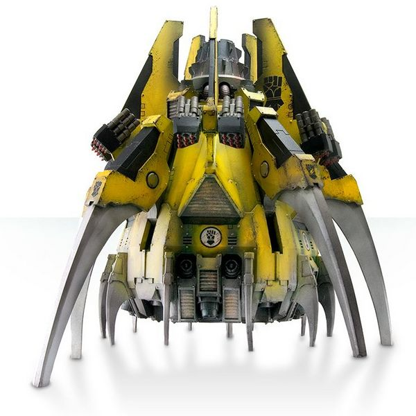

# 1535 卡律布狄斯突击爪 Kharybdis Assault Claw

精校状态：中文行文已逐段精校，部分术语仍为暂定

分类：载具 / 飞行 / 运输

原文来源：https://www.bilibili.com/opus/1047408735311364104

原作者：帝国神选罐头

原文时间：2025年03月23日 13:20

[返回分类目录](目录.md) · [全书目录](../../目录.md)

<!-- A1535-B0001 -->
**英文原文**

The Kharybdis Assault Claw was a type of Drop Pod used by the Legiones Astartes during the Great Crusade and Horus Heresy.

<!-- /A1535-B0001 -->

<!-- A1535-B0002 -->

原译文

卡律布狄斯突击爪是阿斯塔特老兵在大远征和荷鲁斯叛乱期间使用的一种空投舱。

**校订译文**

卡律布狄斯突击爪是大远征和荷鲁斯之乱期间阿斯塔特军团使用的一种空降舱。

<!-- /A1535-B0002 -->

<!-- A1535-B0003 图片 -->

<!-- A1535-B0004 -->

原译文

Kharybdis Assault Claw 卡律布狄斯突击爪

**校订译文**

Kharybdis Assault Claw 卡律布狄斯突击爪

<!-- /A1535-B0004 -->

<!-- A1535-B0005 -->
## Description 描述

<!-- /A1535-B0005 -->

<!-- A1535-B0006 -->
**英文原文**

The Kharybdis is a monstrous drop pod capable of carrying large assault forces through the void and mounting significant firepower to blast a path through defending small craft. As a fully operational dropship, these craft serve as orbit-to-surface transports, a role that allows them to use the firepower of their storm launchers and melta cutters to scour clean their chosen landing zone before disembarking their deadly cargo.

<!-- /A1535-B0006 -->

<!-- A1535-B0007 -->

原译文

卡律布狄斯是一个巨大的空投舱，能够携带大型突击部队穿过虚空，并安装强大的火力，在防御的小型船只中炸出一条路径。作为一艘完全可操作的空投舱，这些飞船充当轨道到地面的运输工具，这一角色使它们能够在卸下致命货物之前，使用风暴发射器和热熔切割枪的火力来清理选定的着陆区。

**校订译文**

卡律布狄斯体型庞大，能搭载大批突击部队穿越虚空，并以强大火力击穿敌方小型飞行器的拦截。它也是功能完整的登陆艇，能够往返轨道与地面；舱内部队出击之前，可以先用风暴发射器和热熔切割器扫清着陆区。

<!-- /A1535-B0007 -->

<!-- A1535-B0008 -->
**英文原文**

Some aggressive commanders employed the Kharybdis as a tank hunter, ramming enemy armour in low-altitude attack runs.

<!-- /A1535-B0008 -->

<!-- A1535-B0009 -->

原译文

一些侵略性的指挥官使用卡律布狄斯作为坦克猎手，在低空攻击中锤击敌人的装甲。

**校订译文**

一些进取好战的指挥官还将它用于猎杀坦克，以低空突击直接撞击敌方装甲载具。

<!-- /A1535-B0009 -->

<!-- A1535-B0010 -->
**英文原文**

The hatch is beneath the hull, and passengers can disembark at ground level.

<!-- /A1535-B0010 -->

<!-- A1535-B0011 -->

原译文

舱口在舱体下方，乘客可以在地面出舱。

**校订译文**

舱口在舱体下方，乘客可以在地面出舱。

<!-- /A1535-B0011 -->

<!-- A1535-B0012 -->
## Machine Spirit 机魂

<!-- /A1535-B0012 -->

<!-- A1535-B0013 -->
**英文原文**

The Kharybdis was the product of the same machine-lore that had produced the Dreadclaw. At some point, the vessel's machine core developed some manner of intelligence. The Kharybdis became attached to individual masters, and grew unpredictable when those were not close to hand: after the master left or died, the machine might open its hatch during atmospheric descent, incinerating its occupants.

<!-- /A1535-B0013 -->

<!-- A1535-B0014 -->

原译文

卡律布狄斯是制造恐怖爪的同一机魂的产物。在某一时刻，该舱的机械核心发展出了某种智能。卡律布狄斯变得依附于个体主人，当这些主人不在身边时，它变得不可预测：主人离开或牺牲后，机器可能会在大气层空降时打开舱门，焚烧其乘员。

**校订译文**

卡律布狄斯与恐怖爪源自同一套机械技术。后来，其机械核心发展出某种智能，对特定主人产生依恋。主人一旦离开或阵亡，机器便可能做出难以预测的举动，例如在穿越大气层下降时打开舱门，让舱内人员被烧死。

**校注：** machine-lore是机械知识/技术，不是同一个机魂；Legiones Astartes是阿斯塔特军团，不是阿斯塔特老兵。

<!-- /A1535-B0014 -->

<!-- A1535-B0015 -->
**英文原文**

During the Scouring, Loyalist Space Marines ceased employing the Kharybdis. However, it remained in use within the Traitor Legions and the bitter machine anima at the heart of the Kharybdis became a thing of darkly sentient and malefic intent, keeping with the nature of the Traitor legions themselves.

<!-- /A1535-B0015 -->

<!-- A1535-B0016 -->

原译文

在大清洗期间，忠诚的星际战士停止使用卡律布狄斯。然而，它仍然在叛徒军团中使用，卡律布狄斯心中的痛苦机魂变成了一种具有黑暗感知和恶意的东西，与叛徒军团本身的性质相一致。

**校订译文**

大清洗期间，忠诚派星际战士停止使用卡律布狄斯，但叛徒军团仍保留这种载具。核心中愤恨的机魂逐渐变成具有黑暗意识与恶意的存在，与叛徒军团愈发相称。

<!-- /A1535-B0016 -->

本篇核心术语与暂定项

以下列出本篇出现的英文原形及核心术语表用词。同形词可能指不同对象，具体词义以本篇正文和校注为准；单复数、别名和仅见于图注的名称可能尚未列入。完整候选见[术语表](../../术语表/双语术语候选.csv)。

| 英文 | 采用中文 | 状态 |
| --- | --- | --- |
| Space Marines | 星际战士 | 官方已核对 |
| Horus Heresy | 荷鲁斯之乱 | 官方已核对 |
| Great Crusade | 大远征 | 暂定·官方待核 |
| Horus | 荷鲁斯 | 暂定·官方待核 |
| Legiones Astartes | 阿斯塔特军团 | 暂定·官方待核 |
| Master | 导师（审判庭职衔）／舰务官（舰员职务） | 语境定译·官方待核 |
| Drop Pod | 空降舱 | 官方已核·中英对照 |
| Dreadclaw | 恐怖爪 | 暂定·官方待核 |
| Kharybdis Assault Claw | 卡律布狄斯突击爪 | 暂定·官方待核 |
| claw | 利爪分队 | 暂定·官方待核 |

