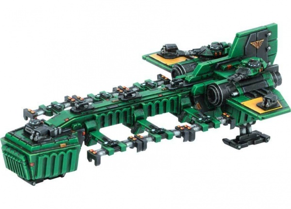

# 1536 登陆艇 Landing Craft

精校状态：中文行文已逐段精校，部分术语仍为暂定

分类：载具 / 飞行 / 运输

原文来源：https://www.bilibili.com/opus/1043315068838608899

原作者：帝国神选罐头

原文时间：2025年03月12日 12:35

[返回分类目录](目录.md) · [全书目录](../../目录.md)

<!-- A1536-B0001 -->
**英文原文**

Space Marine Landing Craft are large orbital-assault vehicles designed to quickly deliver vehicles and troops to a planets surface. Within twenty or thirty seconds of leaving their spacecraft, any troops and vehicles will be on the ground and in action.

<!-- /A1536-B0001 -->

<!-- A1536-B0002 -->

原译文

星际战士登陆艇是大型轨道突击载具，旨在将车辆和部队快速运送到行星表面。在离开舰船的二三十秒内，任何部队和车辆都将送至地面。

**校订译文**

星际战士登陆艇是大型轨道突击载具，用于迅速把载具和部队送到行星表面。按本条目的描述，离开母舰后仅二三十秒，部队与载具便能着地投入战斗。

**校注：** 二三十秒为英文原文的设定说法，未依现实轨道飞行时间自行改数。

<!-- /A1536-B0002 -->

<!-- A1536-B0003 图片 -->

<!-- A1536-B0004 -->

原译文

Space Marine Landing Craft 星际战士登陆艇

**校订译文**

Space Marine Landing Craft 星际战士登陆艇

<!-- /A1536-B0004 -->

<!-- A1536-B0005 -->
**英文原文**

The Landing Craft is armed with various weapon systems such as multiple Storm Bolters, twin-linked Heavy Bolters and a pair of turret-mounted Lascannons and is equipped with large hydraulic clamps to transport Space Marine tanks in a similar fashion to the Thunderhawk transporter.

<!-- /A1536-B0005 -->

<!-- A1536-B0006 -->

原译文

登陆艇配备了各种武器系统，如多个风暴爆矢枪、双联重型爆矢枪和一对安装在炮塔上的激光炮，并配备了大型液压夹具，以类似于雷鹰运输机的方式运输星际战士坦克。

**校订译文**

登陆艇配有多挺风暴爆矢枪、双联重型爆矢枪和一对炮塔激光炮等武器，并装有大型液压夹具，以类似雷鹰运输机的方式运载星际战士坦克。

<!-- /A1536-B0006 -->

本篇核心术语与暂定项

以下列出本篇出现的英文原形及核心术语表用词。同形词可能指不同对象，具体词义以本篇正文和校注为准；单复数、别名和仅见于图注的名称可能尚未列入。完整候选见[术语表](../../术语表/双语术语候选.csv)。

| 英文 | 采用中文 | 状态 |
| --- | --- | --- |
| Space Marine | 星际战士 | 暂定·官方待核 |
| Landing Craft | 登陆艇 | 暂定·官方待核 |
| Space Marine Landing Craft | 星际战士登陆艇 | 暂定·官方待核 |
| Thunderhawk Transporter | 雷鹰运输机 | 暂定·官方待核 |

