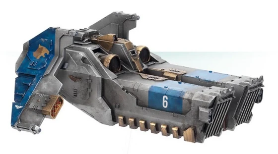

# 1538 拳套突击撞击艇 Caestus Assault Ram

精校状态：中文行文已逐段精校，部分术语仍为暂定

分类：载具 / 飞行 / 运输

原文来源：https://www.bilibili.com/opus/1041098603691507716

原作者：帝国神选罐头

原文时间：编辑于 2025年05月26日 11:29

[返回分类目录](目录.md) · [全书目录](../../目录.md)

原篇名：拳套突击艇 Caestus Assault Ram

<!-- A1538-B0001 -->
**英文原文**

The Caestus Assault Ram is one of several assault rams found throughout the Imperium of Man and the most common one used by Space Marine Chapters. Smaller in size compared to a Thunderhawk or Boarding Torpedo, the Caestus and other assault rams are designed to participate in close range boarding actions in space. This Attack Craft's compact and heavily-armoured frame can not only survive but is intended to directly collide with another space craft in order to deliver its cargo.

<!-- /A1538-B0001 -->

<!-- A1538-B0002 -->

原译文

拳套突击艇是人类帝国中发现的几种突击艇之一，也是星际战士最常用的突击艇。拳套和其他突击艇的尺寸比雷鹰或跳帮鱼雷小，旨在参与太空中的近距离跳帮行动。这种突击艇的紧凑和重型装甲框架不仅可以生存，而且旨在直接与另一艘太空船碰撞以运送货物。

**校订译文**

拳套突击撞击艇是人类帝国多种突击撞击艇之一，也是星际战士战团最常用的型号。它比雷鹰和跳帮鱼雷小，用于太空中的近距离跳帮作战。紧凑的艇体有厚重装甲保护，设计目的就是直接撞入敌方舰船，将突击部队送入其中。

<!-- /A1538-B0002 -->

<!-- A1538-B0003 图片 -->

<!-- A1538-B0004 -->

原译文

Caestus Assault Ram 拳套突击艇

**校订译文**

Caestus Assault Ram 拳套突击撞击艇

<!-- /A1538-B0004 -->

<!-- A1538-B0005 -->
## History 历史

<!-- /A1538-B0005 -->

<!-- A1538-B0006 -->
**英文原文**

Caestus has been in Imperium service as ship-to-ship boarding vessel since the Great Crusade. Going through the time of Horus Heresy and all of the wars that followed this dim and ancient period, it is still used in the Space Marines armies in 41st Millennium.

<!-- /A1538-B0006 -->

<!-- A1538-B0007 -->

原译文

自大远征以来，拳套突击艇一直在帝国服役，担任船对船登舰船。经历了荷鲁斯叛乱时代以及这个昏暗而古老的时期之后的所有战争，它在第41个千年仍然被用于星际战士。

**校订译文**

自大远征以来，拳套便作为舰对舰跳帮艇在帝国服役。经历荷鲁斯之乱和此后的无数战争，到了第41个千年，它仍是星际战士的现役装备。

<!-- /A1538-B0007 -->

<!-- A1538-B0008 -->
## Technical Information 技术资料

原题：Technical Information 技术信息

<!-- /A1538-B0008 -->

<!-- A1538-B0009 -->
**英文原文**

The Caestus' chief advantages over other boarding methods is its incredible speed and durability, thanks to extra armouring and additional short-fire rocket-motors and afterburners, although it has less range and versatility. Operated from a blast shielded cockpit, the Caestus' principle armament is a Magna-Melta supported by two wing-mounted Firefury Missile Launchers, while its twin heavily-armoured prows can together carry an entire Space Marine squad. In order to properly fulfill its assault ram role the Caestus' forward superstructure is further buttressed by a near-unique inertial and recoil compensation system. This 'misericorde' (or 'Misericordia') system consists of multiple retractable inertia suppression clamps which connect with a Space Marine's Terminator Armour or Power Armour, locking them in place and protecting them from any impact short of one which could destroy the entire craft. It is capable of carrying ten fully armored Space Marines.

<!-- /A1538-B0009 -->

<!-- A1538-B0010 -->

原译文

与其他跳帮方式相比，拳套的主要优势在于其令人难以置信的速度和耐用性，这要归功于额外的装甲和额外的短火火箭发动机和加力燃烧室，尽管它的航程和多功能性较小。拳套由一个设有防爆盾的驾驶舱操控。其主要武器是一门巨型热熔，另有两门安装在机翼上的炽怒型导弹发射器作为辅助。此外，它那一对重型装甲舰首能够搭载整整一支星际战士小队。为了正确地发挥其突击撞锤的作用，拳套的前部上部结构进一步得到了近乎独特的惯性和后坐力补偿系统的支撑。这种“托臂”（或“仁慈”）系统由多个可伸缩的惯性抑制夹具组成，这些夹具与星际战士的终结者盔甲或动力盔甲连接，将他们锁定在适当的位置，并保护他们免受任何可能摧毁整艘飞船的冲击。它能够搭载10名全副武装的星际战士。

**校订译文**

与其他跳帮方式相比，拳套凭借加厚装甲、短时助推火箭和加力发动机，拥有惊人的速度与坚固程度，但航程和用途较为有限。乘员在有防爆护盾的驾驶舱中操纵它；主武器为巨型热熔，另有两具翼装炽怒导弹发射器。双联重装甲艇首共能搭载一支10人的全副武装星际战士小队。前部还装有几乎独有的惯性与后坐力补偿系统，称为“仁慈”系统（misericorde，亦作Misericordia）。多组可伸缩惯性抑制夹具与动力盔甲或终结者盔甲相连，将战士固定；只要冲击尚不足以摧毁整艘艇，它就能保护乘员。

**校注：** 原译把保护范围译反：short of one which could destroy the entire craft表示无法保证承受足以毁掉全艇的撞击。“仁慈”是艇载系统，不能套为禁军同名的怜悯之刃。

<!-- /A1538-B0010 -->

<!-- A1538-B0011 -->
**英文原文**

While it was originally constructed only for boarding operations, the rediscoveries of Arkhan Land has allowed the Caestus to be fitted with anti-gravitic plating for participation in groundside operations. Common upgrades for the craft include a Teleport Homer and Frag Assault Launchers.

<!-- /A1538-B0011 -->

<!-- A1538-B0012 -->

原译文

虽然它最初只是为跳帮行动而制造的，但对阿坎·兰德的重新发现使拳套能够安装反重力板，以参与地面作业。该飞船的常见升级包括传送信标和破片突击发射器。

**校订译文**

拳套原本只用于跳帮。阿坎·兰德重新发现的技术，使它能够加装反重力板，参与地面行动。常见升级包括传送信标和破片突击发射器。

<!-- /A1538-B0012 -->

<!-- A1538-B0013 -->
## Deployment Strategy 部署策略

<!-- /A1538-B0013 -->

<!-- A1538-B0014 -->
**英文原文**

In its typical role of assault ram the Caestus uses its Mega-Melta to weaken an enemy spacecraft's hull armour, allowing for the armoured prows to more easily penetrate and disgorge their passengers, who exit through the forward assault ramps. However since the addition of grav coils the craft can also participate in orbital insertions and provide ground support; acting as a heavy battle skimmer its' massive melta weapon can be devastating against enemy tanks and bunkers. However most Chapters still maintain Thunderhawks and Drop Pods for these missions, reserving their assault rams for space operations or only the most dangerous drop zones. Fleet-bound chapters in particular make heavy use of the Caestus for combating the likes of asteroid bases and Space Hulks.

<!-- /A1538-B0014 -->

<!-- A1538-B0015 -->

原译文

在其典型的突击艇角色中，拳套使用其巨型热熔来削弱敌方太空船的船体装甲，使装甲船首更容易穿透并释放乘员，乘员通过前方的突击坡道离开。然而，由于增加了反重力线圈，该飞行器还可以参与轨道空降并提供地面支持；作为一种重型战斗悬浮载具，其巨大的热熔武器对敌方坦克和掩体具有毁灭性。然而，大多数战团仍然为这些任务保留雷鹰和空投舱，将其突击艇保留用于太空行动或仅用于最危险的空投区。特别是那些舰基战团，他们大量使用拳套来对抗行星基地和太空废船。

**校订译文**

执行撞击突击时，拳套先用巨型热熔削弱敌舰装甲，再以装甲艇首撞穿舰体，让乘员经前方突击坡道登舰。安装反重力线圈之后，它也可参与轨道空降并提供地面支援，作为重型战斗悬浮载具，以大型热熔武器摧毁敌方坦克和地堡。不过，多数战团仍将这些任务交给雷鹰和空降舱，将拳套留作太空战或最危险的着陆区突击之用。舰基战团尤其常用它攻击小行星基地和太空废船。

**校注：** 英文前文Magna-Melta、本段Mega-Melta用词不一致；按同一艇载武器统一巨型热熔并保留英文异写。

<!-- /A1538-B0015 -->

<!-- A1538-B0016 -->
**英文原文**

Despite the damage that Caestus Assault Rams sustains in the run of operations, the reverence that Space Marines hold to this holy devices is such that Caestus' always recovered from the battle lines, even if it is a guts of an enemy vessel or fortress.

<!-- /A1538-B0016 -->

<!-- A1538-B0017 -->

原译文

尽管拳套突击艇在行动中受到了破坏，但星际战士对这种神圣装置的崇敬使拳套总是从战线上恢复过来，即使它是敌方船只或堡垒的核心部分。

**校订译文**

即使拳套在行动中受损，星际战士也会始终坚持将这件备受崇敬的神圣器械从战场回收，哪怕它深陷敌舰或堡垒内部。

**校注：** 复查英文细节与数量，补明对象、地点或程度，避免精简中文时削弱原意。

<!-- /A1538-B0017 -->

<!-- A1538-B0018 -->
## Technical Information 技术资料

原题：Technical Information 技术信息

<!-- /A1538-B0018 -->

<!-- A1538-B0019 -->
**英文原文**

Type:Assault Ram

<!-- /A1538-B0019 -->

<!-- A1538-B0020 -->

原译文

类型：突击艇

**校订译文**

类型：突击撞击艇

<!-- /A1538-B0020 -->

<!-- A1538-B0021 -->
**英文原文**

Vehicle Name:Caestus

<!-- /A1538-B0021 -->

<!-- A1538-B0022 -->

原译文

载具名称：拳套

**校订译文**

载具名称：拳套

<!-- /A1538-B0022 -->

<!-- A1538-B0023 -->
**英文原文**

Forge World of Origin:Mars

<!-- /A1538-B0023 -->

<!-- A1538-B0024 -->

原译文

起源铸造世界：火星

**校订译文**

起源铸造世界：火星

<!-- /A1538-B0024 -->

<!-- A1538-B0025 -->
**英文原文**

Known Patterns:I-XI

<!-- /A1538-B0025 -->

<!-- A1538-B0026 -->

原译文

已知型号：I - XI

**校订译文**

已知型号：I - XI

<!-- /A1538-B0026 -->

<!-- A1538-B0027 -->
**英文原文**

Crew:Pilot, Gunner

<!-- /A1538-B0027 -->

<!-- A1538-B0028 -->

原译文

乘员：驾驶员，炮手

**校订译文**

乘员：驾驶员，炮手

<!-- /A1538-B0028 -->

<!-- A1538-B0029 -->
**英文原文**

Powerplant:3 x RX-98-25 combination rocket/afterburning turbofans

<!-- /A1538-B0029 -->

<!-- A1538-B0030 -->

原译文

动力装置：3台RX-98-25火箭/加力涡扇发动机

**校订译文**

动力装置：3台RX-98-25火箭/加力涡扇发动机

<!-- /A1538-B0030 -->

<!-- A1538-B0031 -->
**英文原文**

Weight:85 tonnes

<!-- /A1538-B0031 -->

<!-- A1538-B0032 -->

原译文

重量：85吨

**校订译文**

重量：85吨

<!-- /A1538-B0032 -->

<!-- A1538-B0033 -->
**英文原文**

Length:16.8 m

<!-- /A1538-B0033 -->

<!-- A1538-B0034 -->

原译文

长度：16.8米

**校订译文**

长度：16.8米

<!-- /A1538-B0034 -->

<!-- A1538-B0035 -->
**英文原文**

Wingspan:12.5 m

<!-- /A1538-B0035 -->

<!-- A1538-B0036 -->

原译文

翼展：12.5米

**校订译文**

翼展：12.5米

<!-- /A1538-B0036 -->

<!-- A1538-B0037 -->
**英文原文**

Height:6.5 m

<!-- /A1538-B0037 -->

<!-- A1538-B0038 -->

原译文

高度：6.5米

**校订译文**

高度：6.5米

<!-- /A1538-B0038 -->

<!-- A1538-B0039 -->
**英文原文**

Operational Ceiling:N/A

<!-- /A1538-B0039 -->

<!-- A1538-B0040 -->

原译文

操作升限：无

**校订译文**

实用升限：不适用

<!-- /A1538-B0040 -->

<!-- A1538-B0041 -->
**英文原文**

Max Speed:1,800 kph approx.

<!-- /A1538-B0041 -->

<!-- A1538-B0042 -->

原译文

最大速度：约1800公里/小时

**校订译文**

最大速度：约1800公里/小时

<!-- /A1538-B0042 -->

<!-- A1538-B0043 -->
**英文原文**

Range:22,000 km in atmosphere

<!-- /A1538-B0043 -->

<!-- A1538-B0044 -->

原译文

射程：大气层内22000公里

**校订译文**

航程：大气层内22,000公里

<!-- /A1538-B0044 -->

<!-- A1538-B0045 -->
**英文原文**

Main Armament:Dual-mounted Haephestus pattern Magna-Melta

<!-- /A1538-B0045 -->

<!-- A1538-B0046 -->

原译文

主武器：双联装式赫菲斯托斯型巨型热熔

**校订译文**

主武器：双联装式赫菲斯托斯型巨型热熔

<!-- /A1538-B0046 -->

<!-- A1538-B0047 -->
**英文原文**

Secondary Armament:2x Firefury Missile Launchers

<!-- /A1538-B0047 -->

<!-- A1538-B0048 -->

原译文

二级武器：2个炽怒导弹发射器

**校订译文**

次要武器：两具炽怒导弹发射器

<!-- /A1538-B0048 -->

<!-- A1538-B0049 -->
**英文原文**

Main Ammunition:24 rounds

<!-- /A1538-B0049 -->

<!-- A1538-B0050 -->

原译文

主要弹药：24发

**校订译文**

主要弹药：24发

<!-- /A1538-B0050 -->

<!-- A1538-B0051 -->
**英文原文**

Secondary Ammunition:N/A

<!-- /A1538-B0051 -->

<!-- A1538-B0052 -->

原译文

次要弹药：无

**校订译文**

次要弹药：无

<!-- /A1538-B0052 -->

<!-- A1538-B0053 -->
### Armour 装甲

<!-- /A1538-B0053 -->

<!-- A1538-B0054 -->
**英文原文**

Superstructure:60 mm

<!-- /A1538-B0054 -->

<!-- A1538-B0055 -->

原译文

上部结构：60毫米

**校订译文**

上部结构：60毫米

<!-- /A1538-B0055 -->

<!-- A1538-B0056 -->
**英文原文**

Hull:60 mm

<!-- /A1538-B0056 -->

<!-- A1538-B0057 -->

原译文

船体：60毫米

**校订译文**

船体：60毫米

<!-- /A1538-B0057 -->

<!-- A1538-B0058 -->
## Known Named Caestus Assault Rams 著名拳套突击撞击艇

原题：Known Named Caestus Assault Rams 著名拳套突击艇

<!-- /A1538-B0058 -->

<!-- A1538-B0059 -->
**英文原文**

Amaranth Fang — of the Salamanders

<!-- /A1538-B0059 -->

<!-- A1538-B0060 -->

原译文

不朽獠牙 — 火蜥蜴

**校订译文**

不朽獠牙号——火蜥蜴所属

<!-- /A1538-B0060 -->

<!-- A1538-B0061 -->
**英文原文**

Gore Dagger — of the Space Wolves

<!-- /A1538-B0061 -->

<!-- A1538-B0062 -->

原译文

戈尔匕首 — 太空野狼

**校订译文**

血腥匕首号——太空野狼所属

<!-- /A1538-B0062 -->

<!-- A1538-B0063 -->
**英文原文**

Secutor Crimson — of the Red Hunters

<!-- /A1538-B0063 -->

<!-- A1538-B0064 -->

原译文

绯红追击者 — 红色猎手

**校订译文**

绯红追击者号——红色猎手所属

<!-- /A1538-B0064 -->

<!-- A1538-B0065 -->
**英文原文**

Spectre of Death — of the Star Phantoms

<!-- /A1538-B0065 -->

<!-- A1538-B0066 -->

原译文

死亡怨灵 — 星辰幻影

**校订译文**

死亡怨灵号——星辰幻影所属

<!-- /A1538-B0066 -->

本篇核心术语与暂定项

以下列出本篇出现的英文原形及核心术语表用词。同形词可能指不同对象，具体词义以本篇正文和校注为准；单复数、别名和仅见于图注的名称可能尚未列入。完整候选见[术语表](../../术语表/双语术语候选.csv)。

| 英文 | 采用中文 | 状态 |
| --- | --- | --- |
| Space Marines | 星际战士 | 官方已核对 |
| Space Wolves | 太空野狼 | 官方已核对 |
| Terminator | 终结者 | 官方已核对 |
| Horus Heresy | 荷鲁斯之乱 | 官方已核对 |
| Imperium of Man | 人类帝国 | 官方已核对 |
| Imperium | 帝国 | 暂定·简称 |
| Teleport Homer | 传送信标 | 暂定·官方待核 |
| Forge World | 铸造世界 | 暂定·官方待核 |
| Great Crusade | 大远征 | 暂定·官方待核 |
| Horus | 荷鲁斯 | 暂定·官方待核 |
| Salamanders | 火蜥蜴 | 暂定·官方待核 |
| Mars | 火星 | 暂定·官方待核 |
| Arkhan Land | 阿坎·兰德 | 暂定·官方待核 |
| Ancient | 旗手 | 官方已核对 |
| Power Armour | 动力盔甲 | 暂定·官方待核 |
| Space Marine | 星际战士 | 暂定·官方待核 |
| Star Phantoms | 星辰幻影 | 暂定·官方待核 |
| Bound Chapters | 束缚战团 | 暂定·官方待核 |
| Red Hunters | 红色猎手 | 暂定·官方待核 |
| Caestus Assault Ram | 拳套突击撞击艇 | 暂定·官方待核 |
| Torpedo | 鱼雷 | 暂定·官方待核 |
| Missile Launchers | 导弹发射器 | 暂定·官方待核 |
| Gore Dagger | 血腥匕首号 | 暂定·官方待核 |
| Misericordia | 怜悯之刃 | 暂定·官方待核 |
| System | 星系（恒星系统） | 暂定·官方待核 |
| Boarding Torpedo | 跳帮鱼雷 | 暂定·官方待核 |
| Melta Weapon | 热熔武器 | 暂定·官方待核 |
| Magna-Melta | 巨型热熔 | 暂定·官方待核 |
| Terminator Armour | 终结者盔甲 | 暂定·官方待核 |
| Amaranth Fang | 不朽獠牙号 | 暂定·官方待核 |
| Secutor Crimson | 绯红追击者号 | 暂定·官方待核 |
| Spectre of Death | 死亡怨灵号 | 暂定·官方待核 |

