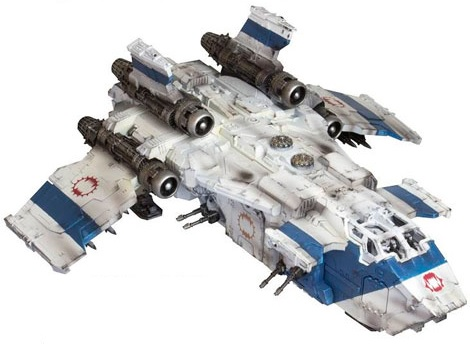
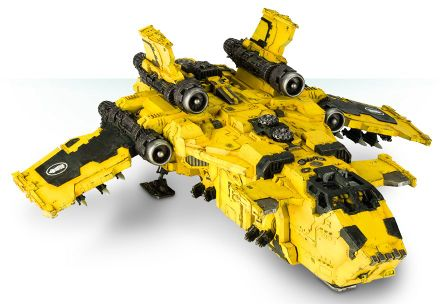

# 1539 风暴鸟空降艇 Stormbird Dropship

精校状态：中文行文已逐段精校，部分术语仍为暂定

分类：载具 / 飞行 / 运输

原文来源：https://www.bilibili.com/opus/1046311560143699974

原作者：帝国神选罐头

原文时间：编辑于 2026年05月07日 05:32

[返回分类目录](目录.md) · [全书目录](../../目录.md)

<!-- A1539-B0001 -->
**英文原文**

The Stormbird dropship was an assault and transport aircraft used by the Space Marine Legions during the Great Crusade (and in some cases - even before it begins), before the introduction of the smaller Thunderhawk pattern.

<!-- /A1539-B0001 -->

<!-- A1539-B0002 -->

原译文

风暴鸟空降艇是在引入较小的雷鹰型号之前，星际战士在大远征期间（在某些情况下甚至在开始之前）使用的突击和运输飞机。

**校订译文**

风暴鸟是星际战士军团在大远征期间使用的突击运输机，有些型号甚至早于大远征；后来才出现体型较小的雷鹰。

<!-- /A1539-B0002 -->

<!-- A1539-B0003 图片 -->

<!-- A1539-B0004 -->

原译文

World Eaters Sokar Pattern Stormbird 吞世者索卡型风暴鸟

**校订译文**

World Eaters Sokar Pattern Stormbird 吞世者索卡型风暴鸟

<!-- /A1539-B0004 -->

<!-- A1539-B0005 -->
###### Overview 概述

<!-- /A1539-B0005 -->

<!-- A1539-B0006 -->
**英文原文**

The Stormbird was developed to replace the older Skylance gunships of the Unification Wars. Capable of both void and atmospheric flight, the Stormbird was first manufactured on Terra, by the Yndonesic Bloc for use against the Panpacific tribes, during the end stages of the Unification Wars. The Stormbird could carry at least 50 fully armored marines into battles. Alternatively it could carry up to 5 Dreadnoughts, including the mighty Leviathan; Jump-pack equipped infantry; Rapier batteries; bikes; jetbikes; a Rhino armoured transport; or a mixed force. The Stormbird’s standard armament was four turret-mounted twin linked lascannons, three twin-linked heavy bolters, and a complement of six dreadstrike missiles. It was also equipped with particularly dense composite armour plating, and is further protected by a series of void shield generators which it can extend to protect disembarking troops and war machines. Its shields allowed it to be impervious to all ground fire save Defense Lasers.

<!-- /A1539-B0006 -->

<!-- A1539-B0007 -->

原译文

风暴鸟是为了取代统一战争中较旧的天空长枪炮艇而开发的。风暴鸟既能在太空中飞行，也能在大气层内飞行，在统一战争的最后阶段，因德尼赛克集团首次在泰拉上制造，用于对抗泛太平洋部落。风暴鸟可以携带至少50名全副武装的星际战士参加战斗。或者，它可以携带多达5名无畏，包括强大的利维坦；装备跳跃背包的步兵；细剑排炮；摩托；悬浮摩托；犀牛装甲运输车；或混合部队。风暴鸟的标准武器是四门安装在炮塔上的双联激光炮、三门双联重型爆矢枪和六枚恐怖打击导弹。它还配备了特别密集的复合装甲板，并进一步受到一系列虚空盾发生器的保护，这些发生器可以延伸以保护登陆的部队和战争机械。它的防护罩使其能够抵御除防御激光以外的所有地面火力。

**校订译文**

风暴鸟原本用于取代统一战争时期较老的天空长枪炮艇，既能在虚空中航行，也能在大气层内飞行。统一战争末期，因德尼赛克集团首先在泰拉制造它，用来对付泛太平洋部落。它至少可搭载50名全副武装的星际战士；也可改运最多5台无畏机甲，包括强大的利维坦，或搭载跳跃步兵、细剑炮组、摩托、喷气摩托、一辆犀牛装甲运输车，以及混合编组。标准武装为四组炮塔双联激光炮、三组双联重型爆矢枪和六枚恐惧打击导弹。它采用高密度复合装甲，并有多台虚空盾发生器提供保护；护盾还能向外延伸，掩护下机的部队和战争机器。除防御激光炮之外，地面火力都难以穿透其护盾。

<!-- /A1539-B0007 -->

<!-- A1539-B0008 -->
**英文原文**

They were in use throughout the Great Crusade, although by the time of the Horus Heresy, most of the Legions had switched to the smaller, more agile Thunderhawk. The Luna Wolves were one of the few Legions that deliberately kept Stormbirds in service, since these ships had carried them into battle since the beginning. A Stormbird was piloted by two Marines sitting back-to-back, along with two hard-wired servitors. During the Heresy, Nathaniel Garro, former Captain of the Death Guard Legion, used a Stormbird to travel to various planets, on the orders of Malcador the Sigillite. Like Garro's Power Armour, the ship bore no Legion insignia or colours, and was a uniform grey.

<!-- /A1539-B0008 -->

<!-- A1539-B0009 -->

原译文

它们在整个大远征期间都在使用，尽管到荷鲁斯叛乱时期，大多数军团已经改用更小、更敏捷的雷鹰。影月苍狼是少数几个故意保持风暴鸟服役的军团之一，自从这些船只从一开始就把他们带入战斗。一架风暴鸟由两名背靠背坐着的星际战士驾驶，还有两名硬连线机仆。在叛乱时期，前死亡守卫队军团连长纳撒尼尔·伽罗根据掌印者马卡多的命令，使用风暴鸟前往各个星球。与伽罗的动力盔甲一样，这艘船没有军团徽章或颜色，而是统一的灰色。

**校订译文**

风暴鸟贯穿整个大远征时期。到了荷鲁斯之乱，多数军团已经改用更小、更灵活的雷鹰；影月苍狼却有意将风暴鸟留在现役，因为它自军团初创时便载着战士奔赴沙场。驾驶舱内，两名星际战士背靠背而坐，另有两名以固定接口连接的机仆辅助。叛乱时期，前死亡守卫连长纳撒尼尔·伽罗遵照掌印者马卡多的命令，乘风暴鸟前往各个星球。与伽罗的盔甲一样，这架飞机没有军团徽记和涂色，通体为灰色。

<!-- /A1539-B0009 -->

<!-- A1539-B0010 图片 -->

<!-- A1539-B0011 -->

原译文

Imperial Fists Stormbird 帝国之拳风暴鸟

**校订译文**

Imperial Fists Stormbird 帝国之拳风暴鸟

<!-- /A1539-B0011 -->

<!-- A1539-B0012 -->
**英文原文**

All but a legend by the final years of the 41st Millennium, no new examples of the Stormbird have been constructed in almost a millennia, for much of the technology that allows such a behemoth to function is no longer understood. However some aging Stormbirds are still utilized by some Chaos Space Marine forces such as the Word Bearers and the Iron Warriors.

<!-- /A1539-B0012 -->

<!-- A1539-B0013 -->

原译文

在第41个千年的最后几年，除了传说之外，几乎一千年来没有建造过新的风暴鸟，因为让这种庞然大物发挥作用的大部分技术都不再被理解。 然而，一些老化的暴风鸟仍被一些混沌星际战士使用，如怀言者和钢铁勇士。

**校订译文**

第41个千年末期，风暴鸟几乎只存在于传说中。近千年来已无新机制造，因为让这种庞然大物运作的许多技术早已失传。不过，怀言者、钢铁勇士等混沌星际战士仍在使用一些古老的风暴鸟。

<!-- /A1539-B0013 -->

<!-- A1539-B0014 -->
### Sokar Pattern Stormbird 索卡型风暴鸟

<!-- /A1539-B0014 -->

<!-- A1539-B0015 -->
**英文原文**

The Sokar Pattern Stormbird, known as the Death Bird to the Imperial Army was a dedicated landing craft variant of the Stormbird, developed from Warhawk and Nephoros class assault craft. It was used by the Yndonesic Bloc during the Unification Wars and later adopted by the Imperium. The design was one of the larger craft used by the Imperium and was the direct precursor to the Thunderhawk.

<!-- /A1539-B0015 -->

<!-- A1539-B0016 -->

原译文

索卡型风暴鸟，被帝国军队称为死亡鸟，是风暴鸟的专用登陆艇变体，由战鹰和内普罗斯级攻击艇发展而来。它在统一战争期间被因德尼赛克集团使用，后来被帝国采用。该设计是帝国使用的较大飞船之一，是雷鹰的直接前身。

**校订译文**

索卡型是风暴鸟的专用登陆艇改型，帝国军称其为“死亡鸟”。它由战鹰和内普罗斯级突击艇发展而来，因德尼赛克集团在统一战争中使用，后来帝国也予以采用。它是帝国较大型的飞行器之一，也是雷鹰的直接前身。

**校注：** Imperial Army 沿第18篇定译帝国军；旧制包括后来拆出的海军，与普通陆军及后世帝国卫队区分。

<!-- /A1539-B0016 -->

<!-- A1539-B0017 -->
### Other Known Patterns 其他已知型号

<!-- /A1539-B0017 -->

<!-- A1539-B0018 -->
**英文原文**

Apophis pattern - One of the largest known patterns of stormbirds, it was widely known for their vast wingspan and ominious appearance, which earned it the title of "Sunkiller". The Space Wolves Legion used 30 of these transports during the Battle of Prospero.

<!-- /A1539-B0018 -->

<!-- A1539-B0019 -->

原译文

阿波菲斯型 - 已知最大的风暴鸟型号之一，以其巨大的翼展和不祥的外观而闻名，这为其赢得了“太阳杀手”的称号。太空野狼军团在普罗斯佩罗之战中使用了30架这种运输机。

**校订译文**

阿波菲斯型 - 已知最大的风暴鸟型号之一，以其巨大的翼展和不祥的外观而闻名，这为其赢得了“太阳杀手”的称号。太空野狼军团在普罗斯佩罗之战中使用了30架这种运输机。

<!-- /A1539-B0019 -->

<!-- A1539-B0020 -->
**英文原文**

Sykri pattern - The Chaos Lord Thagus Daravek was known to use a stormbird of this pattern during the Legion Wars.

<!-- /A1539-B0020 -->

<!-- A1539-B0021 -->

原译文

西克里型 - 混沌领主塔古斯·达拉维克在军团战争期间使用了这种型号的暴风鸟。

**校订译文**

西克里型——混沌领主塔古斯·达拉维克曾在军团战争中使用。

<!-- /A1539-B0021 -->

<!-- A1539-B0022 -->
**英文原文**

Warhawk VI pattern - used by Yndonesic Bloc during the Unification Wars (against the Panpacific tribes) and by the Luna Wolves during the Great Crusade.

<!-- /A1539-B0022 -->

<!-- A1539-B0023 -->

原译文

战鹰VI型 - 在统一战争期间（针对泛太平洋部落）被因德尼赛克集团使用，在大远征期间被影月苍狼使用。

**校订译文**

战鹰VI型 - 在统一战争期间（针对泛太平洋部落）被因德尼赛克集团使用，在大远征期间被影月苍狼使用。

<!-- /A1539-B0023 -->

<!-- A1539-B0024 -->
**英文原文**

Firebird - Personal transport of Fulgrim.

**校注：** Other Known Patterns标题下混列型号及具名运输机；保留原结构，不将所有名字都视为批量生产型号。

<!-- /A1539-B0024 -->

<!-- A1539-B0025 -->

原译文

火鸟 - 福格瑞姆的个人交通工具。

**校订译文**

火鸟号——福格瑞姆的专用运输机。

<!-- /A1539-B0025 -->

<!-- A1539-B0026 -->
**英文原文**

Heilmark - Space Wolves Legion.

<!-- /A1539-B0026 -->

<!-- A1539-B0027 -->

原译文

海尔马克 - 太空野狼军团。

**校订译文**

海尔马克 - 太空野狼军团。

<!-- /A1539-B0027 -->

<!-- A1539-B0028 -->
**英文原文**

Hugin - Personal transport of Leman Russ.

<!-- /A1539-B0028 -->

<!-- A1539-B0029 -->

原译文

休金 - 黎曼鲁斯的个人交通工具。

**校订译文**

福金号——黎曼·鲁斯的专用运输机。

<!-- /A1539-B0029 -->

<!-- A1539-B0030 -->
**英文原文**

Bloodstrike - Personal transport of Huron Blackheart.

<!-- /A1539-B0030 -->

<!-- A1539-B0031 -->

原译文

鲜血打击 - 休伦·黑心的个人运输工具。

**校订译文**

鲜血打击号——休伦·黑心的专用运输机。

<!-- /A1539-B0031 -->

本篇核心术语与暂定项

以下列出本篇出现的英文原形及核心术语表用词。同形词可能指不同对象，具体词义以本篇正文和校注为准；单复数、别名和仅见于图注的名称可能尚未列入。完整候选见[术语表](../../术语表/双语术语候选.csv)。

| 英文 | 采用中文 | 状态 |
| --- | --- | --- |
| Space Wolves | 太空野狼 | 官方已核对 |
| Imperial Army | 帝国军 | 暂定·官方待核 |
| Death Guard | 死亡守卫 | 官方已核对 |
| Horus Heresy | 荷鲁斯之乱 | 官方已核对 |
| Imperium | 帝国 | 暂定·简称 |
| Word Bearers | 怀言者 | 暂定·官方待核 |
| Legion Wars | 军团战争 | 暂定·官方待核 |
| Iron Warriors | 钢铁勇士 | 暂定·官方待核 |
| Great Crusade | 大远征 | 暂定·官方待核 |
| Terra | 泰拉 | 暂定·官方待核 |
| Luna Wolves | 影月苍狼 | 暂定·官方待核 |
| Horus | 荷鲁斯 | 暂定·官方待核 |
| Fulgrim | 福格瑞姆 | 官方已核对 |
| Unification Wars | 统一战争 | 暂定·官方待核 |
| Malcador the Sigillite | 掌印者马卡多 | 暂定·官方待核 |
| Luna | 月球 | 暂定·官方待核 |
| Rhino | 犀牛战车 | 官方已核对 |
| The Sigillite | 掌印者 | 暂定·官方待核 |
| Nathaniel Garro | 纳撒尼尔·伽罗 | 暂定·官方待核 |
| Power Armour | 动力盔甲 | 暂定·官方待核 |
| Space Marine | 星际战士 | 暂定·官方待核 |
| Captain | 连长 | 暂定·官方待核 |
| Landing Craft | 登陆艇 | 暂定·官方待核 |
| Stormbird | 风暴鸟 | 暂定·官方待核 |
| Skylance | 天空长枪 | 暂定·官方待核 |
| Bikes | 摩托 | 暂定·官方待核 |
| Thagus Daravek | 塔古斯·达拉维克 | 暂定·官方待核 |
| Hugin | 福金号 | 暂定·官方待核 |
| Yndonesic Bloc | 因德尼赛克集团 | 暂定·官方待核 |
| Huron Blackheart | 休伦·黑心 | 官方已核对 |
| Firebird | 火鸟号 | 暂定·官方待核 |
| Stormbird Dropship | 风暴鸟空降艇 | 暂定·官方待核 |
| Sokar Pattern Stormbird | 索卡型风暴鸟 | 暂定·官方待核 |
| Nephoros Class Assault Craft | 内普罗斯级突击艇 | 暂定·官方待核 |
| Warhawk VI | 战鹰 VI 型 | 暂定·官方待核 |
| Heilmark | 海尔马克 | 暂定·官方待核 |

