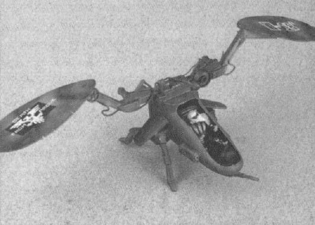

# 1541 奥格斯飞行器 Orgus Flyer

精校状态：中文行文已逐段精校，部分术语仍为暂定

分类：载具 / 飞行 / 攻击机

原文来源：https://www.bilibili.com/opus/1051472418575482915

原作者：帝国神选罐头

原文时间：2025年04月03日 12:10

[返回分类目录](目录.md) · [全书目录](../../目录.md)

<!-- A1541-B0001 -->
**英文原文**

The Orgus Flyer was an Imperial anti-gravity vehicle used by the Legiones Astartes during the Great Crusade.

<!-- /A1541-B0001 -->

<!-- A1541-B0002 -->

原译文

奥格斯飞行器是一辆帝国反重力载具，在大远征期间被阿斯塔特军团使用。

**校订译文**

奥格斯飞行器是大远征期间阿斯塔特军团使用的一种帝国反重力载具。

<!-- /A1541-B0002 -->

<!-- A1541-B0003 图片 -->

<!-- A1541-B0004 -->

原译文

Orgus Flyer 奥格斯飞行器

**校订译文**

Orgus Flyer 奥格斯飞行器

<!-- /A1541-B0004 -->

<!-- A1541-B0005 -->
**英文原文**

It has lascannon and a missile launcher as standard weapons.

<!-- /A1541-B0005 -->

<!-- A1541-B0006 -->

原译文

它有激光炮和导弹发射器作为标准武器。

**校订译文**

标准武器包括激光炮和导弹发射器。

<!-- /A1541-B0006 -->

本篇核心术语与暂定项

以下列出本篇出现的英文原形及核心术语表用词。同形词可能指不同对象，具体词义以本篇正文和校注为准；单复数、别名和仅见于图注的名称可能尚未列入。完整候选见[术语表](../../术语表/双语术语候选.csv)。

| 英文 | 采用中文 | 状态 |
| --- | --- | --- |
| Great Crusade | 大远征 | 暂定·官方待核 |
| Legiones Astartes | 阿斯塔特军团 | 暂定·官方待核 |
| Orgus Flyer | 奥格斯飞行器 | 暂定·官方待核 |
| Missile Launcher | 导弹发射器 | 暂定·官方待核 |
| Lascannon | 激光炮 | 官方已核对 |

