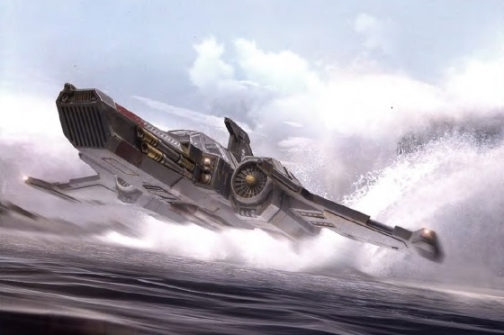
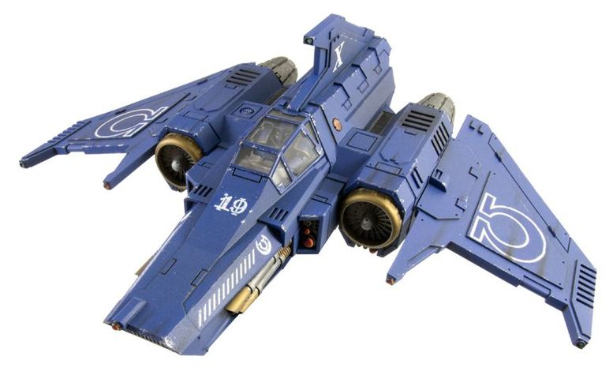

# 1542 剑尾截击机 Xiphon Pattern Interceptor

精校状态：中文行文已逐段精校，部分术语仍为暂定

分类：载具 / 飞行 / 攻击机

原文来源：https://www.bilibili.com/opus/1042558450229313536

原作者：帝国神选罐头

原文时间：2025年03月10日 11:39

[返回分类目录](目录.md) · [全书目录](../../目录.md)

<!-- A1542-B0001 -->
**英文原文**

The Xiphon Pattern Interceptor was a fighter aircraft first used by the Legiones Astartes during the Horus Heresy.

<!-- /A1542-B0001 -->

<!-- A1542-B0002 -->

原译文

剑尾型截击机是一种战斗机，最早在荷鲁斯叛乱时期由阿斯塔特军团使用。

**校订译文**

剑尾型截击机是一种战斗机，最早在荷鲁斯之乱时期由阿斯塔特军团使用。

**校注：** 首段称最早于荷鲁斯之乱使用，正文则明确806.M30引进、大远征结束前退出现役；保留英文自身的时间矛盾。

<!-- /A1542-B0002 -->

<!-- A1542-B0003 图片 -->

<!-- A1542-B0004 -->

原译文

Xiphon Interceptor 剑尾截击机

**校订译文**

Xiphon Interceptor 剑尾截击机

<!-- /A1542-B0004 -->

<!-- A1542-B0005 -->
## Overview 概述

<!-- /A1542-B0005 -->

<!-- A1542-B0006 -->
**英文原文**

The origins of the fighter are long lost, but it shares similarities to the STC patterns with craft such as the Thunderbolt and Amhut Voyager. The design itself was brought into Imperial service in 806.M30 from the Rhadamanthys Enclave. The fighter's performance puts great stress on its pilot, something Space Marines were naturally able to withstand.

<!-- /A1542-B0006 -->

<!-- A1542-B0007 -->

原译文

战斗机的起源早已失传，但它与霹雳和安哈特航行者等飞行器的STC模式有相似之处。该设计于806.M30从拉达曼迪斯飞地投入帝国使用。战斗机的性能给飞行员带来了巨大的压力，这是星际战士自然能够承受的。

**校订译文**

剑尾的起源早已失传，但设计与霹雳、安哈特航行者等飞行器所用的标准模板构造有相似之处。806.M30，帝国从拉达曼迪斯飞地引进了这一型号。它的飞行性能会给驾驶员身体带来极大负担，而星际战士天生具备承受这种负荷的能力。

<!-- /A1542-B0007 -->

<!-- A1542-B0008 -->
**英文原文**

Capable of both atmospheric and space flight, a Xiphon carries two pairs of twin-linked Lascannons and a Xiphon Rotary Missile Launcher into battle. This firepower, combined with the interceptor's speed and agility, makes it a deadly opponent. However, the design was complex, had limited range, and was ill-favored by the Mechanicum, which preferred the larger Wrath fighter. Thus, by the end of the Great Crusade it had fallen out of frontline service in all Space Marine Legions except the Dark Angels and Ultramarines, though the demands of the Horus Heresy forced many Legions to press them into service once more.

<!-- /A1542-B0008 -->

<!-- A1542-B0009 -->

原译文

剑尾既能进行大气层飞行，也能进行太空飞行，它携带两对双联激光炮和一个剑尾旋转导弹发射器进入战斗。这种火力，再加上截击机的速度和敏捷性，使其成为一个致命的对手。然而，该设计复杂，射程有限，不受机械神教的青睐，机械师更喜欢更大的愤怒战斗机。因此，到大远征结束时，它已经退出了除黑暗天使和极限战士之外的所有星际战士的前线服役，尽管荷鲁斯叛乱的要求迫使许多军团再次让它们服役。

**校订译文**

剑尾可在大气层及太空中作战，配有两对双联激光炮和一具剑尾旋转导弹发射器。强大火力加上出色的速度与灵活性，使它成为致命对手。但其结构复杂、航程有限，机械教也更青睐体型较大的愤怒战斗机。因此，大远征末期，除黑暗天使与极限战士外，各军团都已将它撤出一线；荷鲁斯之乱的战时需求，又迫使许多军团重新启用它。

<!-- /A1542-B0009 -->

<!-- A1542-B0010 -->
**英文原文**

The Xiphon was a high-performance machine that required constant micro-management by its Astartes pilot to maintain equilibrium in the aircraft due to an engine system that was designed to operate both in the void and a wide variety of atmospheres. In addition, it was too lightweight and under-powered. This often frustrated Xiphon pilots, though they still appreciated its excellent turning speeds, agility, and touch responsive controls.

<!-- /A1542-B0010 -->

<!-- A1542-B0011 -->

原译文

剑尾是一台高性能机器，由于其发动机系统设计为在虚空和各种大气中运行，因此需要其阿斯塔特飞行员进行持续的微观管理，以保持飞机的平衡。此外，它太轻，动力不足。这经常让剑尾的飞行员感到沮丧，尽管他们仍然欣赏其出色的转弯速度、敏捷性和触敏控制。

**校订译文**

剑尾性能很高，但发动机需要兼顾真空及多种大气环境，阿斯塔特驾驶员必须不断细调，才能保持飞机平衡。此外，机体过于轻巧，动力也不足，经常让驾驶员苦恼。不过，他们仍十分欣赏它迅捷的转弯、灵活性和对操纵输入的敏锐响应。

<!-- /A1542-B0011 -->

<!-- A1542-B0012 图片 -->

<!-- A1542-B0013 -->

原译文

Xiphon Interceptor 剑尾截击机

**校订译文**

Xiphon Interceptor 剑尾截击机

<!-- /A1542-B0013 -->

<!-- A1542-B0014 -->
**英文原文**

While introduced during the Great Crusade-era, the Xiphon continues to be used by modern Space Marine Chapters as an integral part of the arsenal, thanks to its adaptable armament, which allows the Xiphon to successfully engage both air and ground targets. It is piloted by an experienced battle-brother.

<!-- /A1542-B0014 -->

<!-- A1542-B0015 -->

原译文

虽然是在大远征时期引入的，但由于其适应性强的武器，剑尾仍然被现代星际战士战团用作军械库的一个组成部分，这使得剑尾能够成功地打击空中和地面目标。它由一位经验丰富的战斗兄弟驾驶。

**校订译文**

虽然诞生于大远征时代，剑尾仍是当代星际战士战团军械库的重要部分。可适配多种任务的武装，使它能有效打击空中与地面目标。它由经验丰富的战斗兄弟驾驶。

<!-- /A1542-B0015 -->

<!-- A1542-B0016 -->
**英文原文**

Xiphon Interceptors were further outfitted with Ramjet Diffraction Grids, Tracking Auguries and Chaff Launchers.

<!-- /A1542-B0016 -->

<!-- A1542-B0017 -->

原译文

剑尾截击机还配备了冲压喷气衍射栅格、跟踪鸟卜仪和箔条发射器。

**校订译文**

剑尾截击机还配备了冲压喷气衍射栅格、跟踪鸟卜仪和箔条发射器。

<!-- /A1542-B0017 -->

本篇核心术语与暂定项

以下列出本篇出现的英文原形及核心术语表用词。同形词可能指不同对象，具体词义以本篇正文和校注为准；单复数、别名和仅见于图注的名称可能尚未列入。完整候选见[术语表](../../术语表/双语术语候选.csv)。

| 英文 | 采用中文 | 状态 |
| --- | --- | --- |
| Space Marines | 星际战士 | 官方已核对 |
| Dark Angels | 黑暗天使 | 官方已核对 |
| Ultramarines | 极限战士 | 官方已核对 |
| Horus Heresy | 荷鲁斯之乱 | 官方已核对 |
| Mechanicum | 机械教 | 暂定·历史称谓 |
| Great Crusade | 大远征 | 暂定·官方待核 |
| Horus | 荷鲁斯 | 暂定·官方待核 |
| STC | 标准建造模板 | 暂定·官方待核 |
| Legiones Astartes | 阿斯塔特军团 | 暂定·官方待核 |
| Space Marine | 星际战士 | 暂定·官方待核 |
| Brother | 修士 | 暂定·官方待核 |
| Battle-Brother | 战斗兄弟 | 暂定·官方待核 |
| Interceptors | 拦截者 | 暂定·官方待核 |
| The Dark | 《黑暗》 | 暂定·官方待核 |
| System | 星系（恒星系统） | 暂定·官方待核 |
| Xiphon | 剑尾 | 暂定·官方待核 |
| Missile Launcher | 导弹发射器 | 暂定·官方待核 |
| Xiphon Rotary Missile Launcher | 剑尾旋转导弹发射器 | 暂定·官方待核 |
| Xiphon Pattern Interceptor | 剑尾型截击机 | 暂定·官方待核 |
| Amhut Voyager | 安哈特航行者 | 暂定·官方待核 |
| Rhadamanthys Enclave | 拉达曼迪斯飞地 | 暂定·官方待核 |
| Wrath fighter | 愤怒战斗机 | 暂定·官方待核 |

