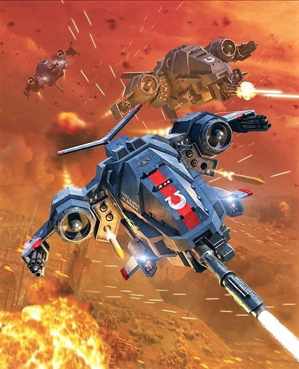
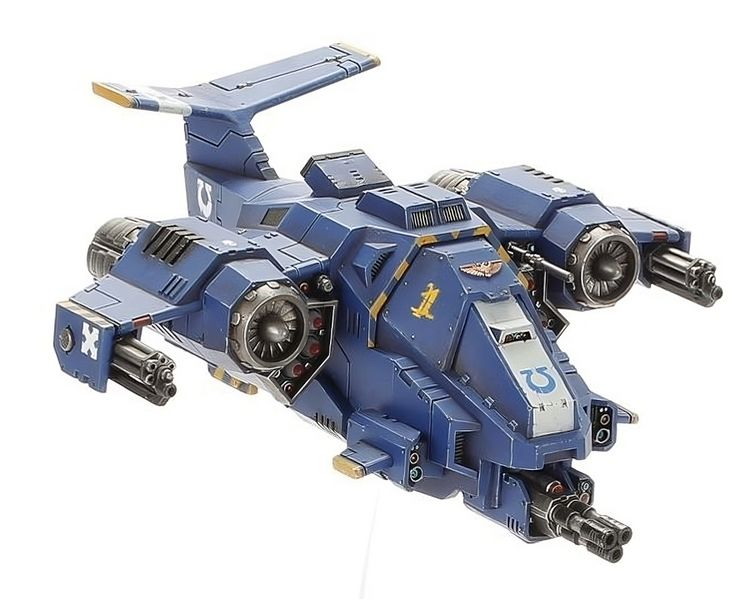

# 1543 风暴鹰拦截者战机 Stormhawk Interceptor

精校状态：中文行文已逐段精校，部分术语仍为暂定

分类：载具 / 飞行 / 攻击机

原文来源：https://www.bilibili.com/opus/1041426528757350403

原作者：帝国神选罐头

原文时间：2025年03月07日 10:26

[返回分类目录](目录.md) · [全书目录](../../目录.md)

原篇名：风暴隼截击机 Stormhawk Interceptor

<!-- A1543-B0001 -->
**英文原文**

The Stormhawk Interceptor is a fighter aircraft and gunship of the Space Marines

<!-- /A1543-B0001 -->

<!-- A1543-B0002 -->

原译文

风暴隼截击机是星际战士的战斗机和炮艇

**校订译文**

风暴鹰拦截者战机是星际战士使用的战斗机兼炮艇。

<!-- /A1543-B0002 -->

<!-- A1543-B0003 图片 -->

<!-- A1543-B0004 -->

原译文

Stormhawk Interceptor 风暴隼截击机

**校订译文**

Stormhawk Interceptor 风暴鹰拦截者战机

<!-- /A1543-B0004 -->

<!-- A1543-B0005 -->
## Overview 概述

<!-- /A1543-B0005 -->

<!-- A1543-B0006 -->
**英文原文**

Stormhawk Interceptors are specialized gunships closely related to the Stormtalon pattern that excels in aerial superiority. The frontal armour and huge firepower makes of the Stormhawk makes them excellent dogfighters, hurtling through the clouds to execute target after target in a blazing display of incendiary defiance. Stormhawk squadrons and their golden haloes of flares discharged to gently dissuade incoming fire are a signal that whatever planet the skies are over, they belong to the Emperor. Stormhawks are also capable of operating in the void of space as Attack Craft. They are dropped from mag-cradles by their carrying spacecrafts.

<!-- /A1543-B0006 -->

<!-- A1543-B0007 -->

原译文

风暴隼截击机是与风暴爪型号密切相关的专用炮艇，在制空方面表现出色。正面装甲和巨大的火力使其成为优秀的狗斗战机，呼啸着穿过云层，在一连串炽热的、充满挑衅意味的燃烧景象中，一个接一个地对目标展开攻击。风暴隼中队及其发射的金色光晕信号弹是一个信号，表明无论哪个星球的天空，它们都属于帝皇。风暴隼也能在太空中作为攻击机运行。它们被运载它们的战舰从磁力吊架上投放下来。

**校订译文**

它与风暴爪同源，专门用于夺取制空权。厚重的正面装甲与强大火力让它擅长近距空战，能穿越云层，接连击落目标。机群释放的干扰弹在空中形成金色光环，诱偏来袭火力，也向敌人宣告：这片天空属于帝皇。它还能在虚空中充当攻击机，由母舰的磁力挂架释放。

<!-- /A1543-B0007 -->

<!-- A1543-B0008 -->
**英文原文**

Stormhawks are armoured in a thick ceramite layer that protects against reentry heat. Even their cockpit is armoured, foregoing a clear canopy for front-mounted lens clusters conveying visual informations to the pilot. Furthermore, Stormhawks boast sophisticated countermeasures to confound enemy weapons.

<!-- /A1543-B0008 -->

<!-- A1543-B0009 -->

原译文

风暴隼采用厚陶钢层进行防护，抵御进入大气层时产生的热量。甚至他们的驾驶舱也装有装甲，前面有一个清晰的顶棚，用于向飞行员传达视觉信息。此外，风暴隼还拥有复杂的对抗措施来混淆敌方武器。

**校订译文**

机体覆盖厚重陶钢，用来抵御重返大气层时的高温。驾驶舱也采用装甲防护，舍弃透明座舱盖，改由前置镜头组向飞行员传输图像。它还配有复杂的防御干扰系统，迷惑敌方武器。

**校注：** foregoing a clear canopy意为舍弃透明座舱盖，原译意思相反。

<!-- /A1543-B0009 -->

<!-- A1543-B0010 图片 -->

<!-- A1543-B0011 -->

原译文

Stormhawk Interceptor 风暴隼截击机

**校订译文**

Stormhawk Interceptor 风暴鹰拦截者战机

<!-- /A1543-B0011 -->

<!-- A1543-B0012 -->
**英文原文**

Stormhawks boast impressive firepower, including twin Assault Cannons, Icarus Stormcannon or Las-Talon, twin Heavy Bolters, Typhoon Missile Launchers, or Skyhammer Missile Launchers, and a Infernum Halo Launcher. The weapons are guided by a targeting system.

<!-- /A1543-B0012 -->

<!-- A1543-B0013 -->

原译文

风暴隼拥有令人印象深刻的火力，包括双联突击炮、伊卡洛斯风暴炮或激光爪、双联重型爆矢、台风导弹发射器或天锤导弹发射器，以及炼狱光环发射器。这些武器由瞄准系统引导。

**校订译文**

其武装包括双联突击炮、伊卡洛斯风暴炮或激光爪，以及双联重型爆矢枪、台风导弹发射器或天锤导弹发射器等，另有炼狱光环发射器。武器由目标瞄准系统引导。

<!-- /A1543-B0013 -->

<!-- A1543-B0014 -->
## Famous Stormhawk Pilots 著名风暴鹰驾驶员

原题：Famous Stormhawk Pilots 著名风暴隼驾驶员

<!-- /A1543-B0014 -->

<!-- A1543-B0015 -->
**英文原文**

Kyrolius — Raven Guard

<!-- /A1543-B0015 -->

<!-- A1543-B0016 -->

原译文

基洛留斯 — 暗鸦守卫

**校订译文**

基洛留斯 — 暗鸦守卫

<!-- /A1543-B0016 -->

本篇核心术语与暂定项

以下列出本篇出现的英文原形及核心术语表用词。同形词可能指不同对象，具体词义以本篇正文和校注为准；单复数、别名和仅见于图注的名称可能尚未列入。完整候选见[术语表](../../术语表/双语术语候选.csv)。

| 英文 | 采用中文 | 状态 |
| --- | --- | --- |
| Space Marines | 星际战士 | 官方已核对 |
| Emperor | 帝皇 | 官方已核对 |
| Clear | 清明 | 暂定·官方待核 |
| Raven Guard | 暗鸦守卫 | 官方已核 |
| Interceptors | 拦截者 | 暂定·官方待核 |
| Stormhawk Interceptor | 风暴鹰拦截者战机 | 官方已核 |
| Stormhawk | 风暴隼 | 暂定·官方待核 |
| Missile Launchers | 导弹发射器 | 暂定·官方待核 |
| System | 星系（恒星系统） | 暂定·官方待核 |
| Defiance | 反抗号 | 暂定·官方待核 |
| Icarus Stormcannon | 伊卡洛斯风暴炮 | 暂定·官方待核 |
| Las-Talon | 激光爪 | 暂定·官方待核 |
| Infernum Halo Launcher | 炼狱光环发射器 | 暂定·官方待核 |
| Kyrolius | 基洛留斯 | 暂定·官方待核 |

