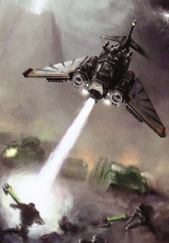
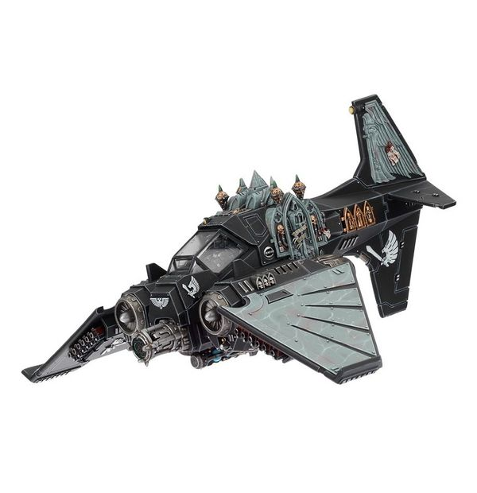

# 1547 黑暗之爪战斗机 Dark Talons Fighter

精校状态：中文行文已逐段精校，部分术语仍为暂定

分类：载具 / 飞行 / 攻击机

原文来源：https://www.bilibili.com/opus/1041098762606346278

原作者：帝国神选罐头

原文时间：2025年03月06日 13:14

[返回分类目录](目录.md) · [全书目录](../../目录.md)

原篇名：暗爪战斗机 Dark Talons Fighter

<!-- A1547-B0001 -->
**英文原文**

Dark Talons are fighter aircraft used by the Dark Angels and their successors' Ravenwing formations.

<!-- /A1547-B0001 -->

<!-- A1547-B0002 -->

原译文

暗爪是黑暗天使及其子战团鸦翼编队使用的战斗机。

**校订译文**

黑暗之爪是黑暗天使及其子战团鸦翼编队使用的战斗机。

<!-- /A1547-B0002 -->

<!-- A1547-B0003 图片 -->

<!-- A1547-B0004 -->

原译文

Dark Talon attacks Necron infantry 暗爪攻击死灵步兵

**校订译文**

Dark Talon attacks Necron infantry 黑暗之爪攻击太空死灵步兵

<!-- /A1547-B0004 -->

<!-- A1547-B0005 -->
## Overview 概述

<!-- /A1547-B0005 -->

<!-- A1547-B0006 -->
**英文原文**

A close air-support aircraft armed with two Hurricane Bolters, a Rift Cannon, and a Stasis Bomb, the Dark Talon is thought to be the deadliest weapon in the Ravenwing's arsenal. It plays a pivotal role in the 2nd Company's eternal hunt. Dark Talons are ornately and finely decorated with artefacts recovered from Caliban itself. Dark Talons usually fly low in attack runs, following the contours of the surrounding terrain and hitting their ground-facing boot jets to hang in the air and more accurately target their prey below.

<!-- /A1547-B0006 -->

<!-- A1547-B0007 -->

原译文

暗爪是一架近距离空中支援飞机，配备了两架飓风爆矢枪、一门裂隙加农炮和一枚停滞炸弹，被认为是鸦翼军械库中最致命的武器。它在第二连的永恒狩猎中起着关键作用。暗爪装饰华丽而精致，采用了从卡利班本身发现的遗物。黑爪通常在攻击中低空飞行，跟随周围地形的轮廓，启动他们面向地面的后备喷气装置悬停在空中，以便更精准地瞄准下方的猎物。

**校订译文**

黑暗之爪是近距空中支援飞机，配有两套飓风爆矢枪、一门裂隙加农炮和一枚静滞炸弹，被认为是鸦翼最致命的武器。它在第二连永无止境的猎捕中至关重要，机身饰有从卡利班回收的遗物，装潢精细而华丽。攻击时，它通常随地势贴地飞行，再启动朝向地面的喷口悬停，以便更准确地瞄准下方猎物。

<!-- /A1547-B0007 -->

<!-- A1547-B0008 图片 -->

<!-- A1547-B0009 -->

原译文

Ravenwing Dark Talon 鸦翼暗爪战机

**校订译文**

Ravenwing Dark Talon 鸦翼黑暗之爪战机

<!-- /A1547-B0009 -->

<!-- A1547-B0010 -->
**英文原文**

The Dark Talon also carries a stasis-crypt holding cell used to transport captives and ultimately deliver them to the dreaded dungeons of The Rock.

<!-- /A1547-B0010 -->

<!-- A1547-B0011 -->

原译文

暗爪还搭载着一个静滞囚牢，用于运送俘虏，并最终将他们送至令人畏惧的巨石修道院地牢。

**校订译文**

黑暗之爪还配有静滞囚室，用来运送俘虏，最终将他们送入巨石令人畏惧的地牢。

<!-- /A1547-B0011 -->

<!-- A1547-B0012 -->
## Known Dark Talons著名黑暗之爪

原题：Known Dark Talons著名暗爪

<!-- /A1547-B0012 -->

<!-- A1547-B0013 -->

原译文

Caliban's Vengeance 卡利班的复仇

**校订译文**

Caliban's Vengeance 卡利班的复仇

<!-- /A1547-B0013 -->

本篇核心术语与暂定项

以下列出本篇出现的英文原形及核心术语表用词。同形词可能指不同对象，具体词义以本篇正文和校注为准；单复数、别名和仅见于图注的名称可能尚未列入。完整候选见[术语表](../../术语表/双语术语候选.csv)。

| 英文 | 采用中文 | 状态 |
| --- | --- | --- |
| Dark Angels | 黑暗天使 | 官方已核对 |
| Caliban | 卡利班 | 暂定·官方待核 |
| Dark Talon | 黑暗之爪 | 暂定·官方待核 |
| The Dark | 《黑暗》 | 暂定·官方待核 |
| Rift Cannon | 裂隙加农炮 | 暂定·官方待核 |

