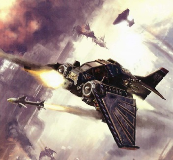
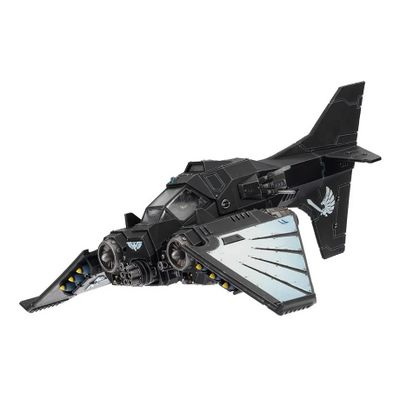

# 1549 涅菲里姆战机 Nephilim Jetfighter

精校状态：中文行文已逐段精校，部分术语仍为暂定

分类：载具 / 飞行 / 攻击机

原文来源：https://www.bilibili.com/opus/1041098844239036420

原作者：帝国神选罐头

原文时间：2025年03月06日 13:15

[返回分类目录](目录.md) · [全书目录](../../目录.md)

原篇名：拿非利喷气战斗机 Nephilim Jetfighter

<!-- A1549-B0001 -->
**英文原文**

The Nephilim Jetfighter is a fighter aircraft utilized by the Dark Angels and their Successor Chapters. Employed by their Ravenwing formations, the main role of the Nephilim Jetfighter is to conduct interceptor or air superiority missions over the battlefield, clearing the skies to allow their brethren on the ground to operate without fear of enemy air attacks. Of a robust and sturdy design, they are most commonly armed with twin-linked Heavy Bolters, twin-linked Lascannons, and six Blacksword Missiles. Some are also equipped with Avenger Mega Bolters.

<!-- /A1549-B0001 -->

<!-- A1549-B0002 -->

原译文

拿非利喷气式战斗机是黑暗天使及其子战团使用的战斗机。拿非利喷气式战斗机应用于他们的鸦翼编队，其主要作用是在战场上执行拦截或制空权任务，清理天空，使他们的地面兄弟能够在不担心敌人空袭的情况下作战。它们的设计坚固耐用，最常见的是配备双联重型爆矢枪、双联激光炮和六枚黑剑导弹。有些还配备了复仇者巨型爆矢枪。

**校订译文**

涅菲里姆战机由黑暗天使及其子战团的鸦翼使用，主要执行战场拦截和制空任务，使地面兄弟能够作战而不受敌方空袭威胁。它结构坚固，通常配有双联重型爆矢枪、双联激光炮和六枚黑剑导弹；部分飞机还装有复仇者巨型爆矢枪。

<!-- /A1549-B0002 -->

<!-- A1549-B0003 图片 -->

<!-- A1549-B0004 -->

原译文

Nephilim Jetfighter 拿非利喷气式战斗机

**校订译文**

Nephilim Jetfighter 涅菲里姆战机

<!-- /A1549-B0004 -->

<!-- A1549-B0005 -->
## History 历史

<!-- /A1549-B0005 -->

<!-- A1549-B0006 -->
**英文原文**

The Nephilim Jetfighter has only been used by the Unforgiven since M40, when the STC for improved jet engines was discovered by the Dark Angels while hunting a suspected Fallen known as Baelor the Imposter in the Nephilim Sector. Designated the Lionheart Engine, the technology was used to modify older aircraft designs and the end product was an agile fighter with improved speed. The Nephilim has proven itself on innumerable occasions, perhaps most notably during the Piscina IV campaign, when a trio of Nephilim Jetfighters were able to shoot down four dozen Ork aircraft. By keeping the skies clear of foes, they allowed the Dark Angels and local PDF to hold out against the Greenskin advance.

<!-- /A1549-B0006 -->

<!-- A1549-B0007 -->

原译文

拿非利喷气式战斗机自M40以来才被不可饶恕者使用，当时黑暗天使在拿非利区追捕一名被称为冒名者贝勒的疑似堕天使时发现了改进喷气发动机的STC。该技术被命名为狮心引擎，用于修改旧飞机的设计，最终产品是一款速度更快的敏捷战斗机。拿非利已经在无数场合证明了自己，也许最值得注意的是在皮希纳四号战役中，当时三架拿非利喷气式战斗机能够击落四十架欧克飞机。通过保持天空没有敌人，他们允许黑暗天使和当地人民保卫部队抵抗绿皮的进攻。

**校订译文**

戴罪者从M40起才开始使用涅菲里姆。当时，黑暗天使在拿非利星区追捕疑似堕天使“冒名者贝勒”，发现了改进型喷气发动机的标准模板构造。该技术被命名为狮心引擎，用来改造旧式飞行器，最终造出速度更快、机动灵活的战斗机。它在无数战斗中证明了自己；皮希纳四号战役尤其著名，三架涅菲里姆击落了48架欧克飞机，清除了空中威胁，使黑暗天使与当地行星防卫军得以抵挡绿皮推进。

**校注：** four dozen为48，原译四十架漏算；PDF是Planetary Defence Force行星防卫军。战机采用已核官方名称，Nephilim Sector地名仍沿拿非利星区，不据模型名称自动认定地名官译。

<!-- /A1549-B0007 -->

<!-- A1549-B0008 图片 -->

<!-- A1549-B0009 -->

原译文

Nephilim Jetfighter 拿非利喷气式战斗机

**校订译文**

Nephilim Jetfighter 涅菲里姆战机

<!-- /A1549-B0009 -->

<!-- A1549-B0010 -->
**英文原文**

Since then, the Nephilim has been a common sight in Unforgiven hands. In 146.M41 the Ravenwing formation was tasked with special reconnaissance missions during a massive tank battle between the Imperial Guard and Eldar on Kundra. After pressing deep into Eldar territory, the Dark Angels found themselves beset on all sides by the xenos' Grav-tanks. However with the aid of Nephilim jetfighters, the Ravenwing was able to clear the skies of the flying tanks and Jetbikes and win the day.

<!-- /A1549-B0010 -->

<!-- A1549-B0011 -->

原译文

从那时起，拿非利就成为了不可饶恕者手中的常见景象。146.M41，在帝国卫队和昆德拉的灵族之间的一场大规模坦克战中，鸦翼编队被赋予了特殊的侦察任务。在深入灵族领地后，黑暗天使发现自己被异型的反重力坦克四面包围。然而，在拿非利喷气式战斗机的帮助下，鸦翼得以清除空中的飞行坦克和喷气摩托，并赢得了胜利。

**校订译文**

此后，涅菲里姆便成为戴罪者的常用装备。146.M41，帝国卫队与灵族在昆德拉展开大规模坦克战，鸦翼受命执行特殊侦察任务。深入灵族控制区后，黑暗天使被敌方反重力坦克四面包围；涅菲里姆及时支援，清除了空中的坦克与喷气摩托，帮助鸦翼赢得胜利。

<!-- /A1549-B0011 -->

本篇核心术语与暂定项

以下列出本篇出现的英文原形及核心术语表用词。同形词可能指不同对象，具体词义以本篇正文和校注为准；单复数、别名和仅见于图注的名称可能尚未列入。完整候选见[术语表](../../术语表/双语术语候选.csv)。

| 英文 | 采用中文 | 状态 |
| --- | --- | --- |
| Dark Angels | 黑暗天使 | 官方已核对 |
| Imperial Guard | 帝国卫队 | 暂定·语境区分 |
| Eldar | 灵族 | 暂定·语境区分 |
| STC | 标准建造模板 | 暂定·官方待核 |
| Nephilim Sector | 拿非利星区 | 暂定·官方待核 |
| Sector | 星区 | 暂定·官方待核 |
| Piscina IV | 皮希纳四号 | 暂定·官方待核 |
| Nephilim Jetfighter | 涅菲里姆战机 | 官方已核 |
| Clear | 清明 | 暂定·官方待核 |
| Unforgiven | 戴罪者 | 暂定·官方待核 |
| Xenos | 异形 | 暂定·官方待核 |
| The Dark | 《黑暗》 | 暂定·官方待核 |
| Piscina | 皮希纳 | 暂定·官方待核 |
| Avenger | 复仇者号 | 暂定·官方待核 |
| Baelor the Imposter | 冒名者贝勒 | 暂定·官方待核 |
| Lionheart Engine | 狮心引擎 | 暂定·官方待核 |
| Kundra | 昆德拉 | 暂定·官方待核 |

