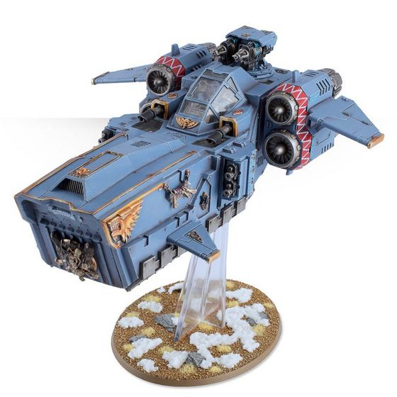
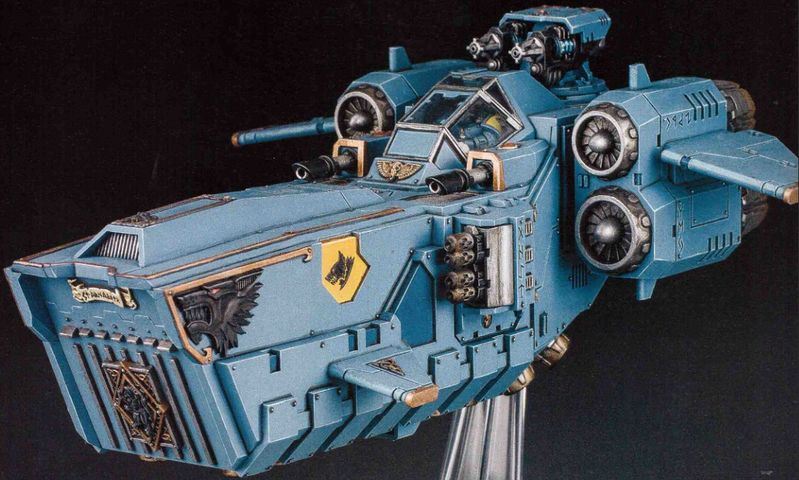

# 1550 风暴狼突击艇 Stormwolf Assault Craft

精校状态：中文行文已逐段精校，部分术语仍为暂定

分类：载具 / 飞行 / 攻击机

原文来源：https://www.bilibili.com/opus/1042558050780577833

原作者：帝国神选罐头

原文时间：2025年03月10日 11:37

[返回分类目录](目录.md) · [全书目录](../../目录.md)

原篇名：风暴狼攻击艇 Stormwolf Assault Craft

<!-- A1550-B0001 -->
**英文原文**

The Stormwolf is a specialized type of assault craft used by the Space Wolves.

<!-- /A1550-B0001 -->

<!-- A1550-B0002 -->

原译文

风暴狼是太空野狼使用的一种特殊类型的攻击飞行器。

**校订译文**

风暴狼是太空野狼使用的专用突击艇。

<!-- /A1550-B0002 -->

<!-- A1550-B0003 图片 -->

<!-- A1550-B0004 -->

原译文

Stormwolf 风暴狼

**校订译文**

Stormwolf 风暴狼

<!-- /A1550-B0004 -->

<!-- A1550-B0005 -->
## Overview 概述

<!-- /A1550-B0005 -->

<!-- A1550-B0006 -->
**英文原文**

The Stormwolf is the Chapter’s foremost assault craft, enabling the Space Wolves to bring the fight to the enemy wherever they may be found. Combining breathtaking speed with the freedom of altitude, a Stormwolf can swiftly close on its prey before setting loose its deadly cargo right in amongst the enemy lines, and bears sufficient firepower to ensure their landing is uncontested. The wolf’s head silhouette of the Stormwolf strikes fear into the hearts of any who face the Sons of Russ, for their presence signals the imminent arrival of some of the deadliest warriors in the Imperium. Such foreboding is not without good cause, for the Stormwolf is the favoured transport of packs of battle-hungry Blood Claws, who are renowned for not holding back once committed to battle. It can carry 16 Space Wolves.

<!-- /A1550-B0006 -->

<!-- A1550-B0007 -->

原译文

风暴狼是本战团最重要的攻击飞船，使太空野狼能够在任何地方与敌人作战。将惊人的速度与高度的自由相结合，风暴狼可以迅速接近猎物，然后将致命的货物撒在敌人的战线上，并拥有足够的火力来确保它们的着陆不受阻抗。风暴狼的狼头轮廓让任何面对鲁斯之子的人都感到恐惧，因为他们的出现预示着帝国中一些最致命的战士即将到来。这种不祥的预感并非没有充分的理由，因为风暴狼是渴望战斗的血爪的首选运输工具，血爪以一旦投入战斗就不会退缩而闻名。它可以携带16名太空野狼。

**校订译文**

风暴狼是战团最重要的突击艇，凭借惊人速度和立体机动能力迅速接敌，将舱内战士直接送入敌阵，并以充足火力保障着陆。它的狼首轮廓令鲁斯之子的敌人胆寒，因为这意味着帝国最致命的一批战士即将到来。这样的恐惧并非多虑：风暴狼深受渴战的血爪小队喜爱，而血爪一旦投入战斗便会全力猛攻。它可搭载16名太空野狼。

<!-- /A1550-B0007 -->

<!-- A1550-B0008 -->
**英文原文**

Stormwolf craft are equipped with a choice of twin-linked Heavy Bolters, Skyhammer Missiles, Multi-Meltas, or lascannons.

<!-- /A1550-B0008 -->

<!-- A1550-B0009 -->

原译文

风暴狼飞船配备了双联重型爆矢枪、天锤导弹、多管热熔或激光炮。

**校订译文**

风暴狼可选配双联重型爆矢枪、天锤导弹、多管热熔或激光炮。

<!-- /A1550-B0009 -->

<!-- A1550-B0010 -->
## Notable Stormwolves 著名风暴狼

<!-- /A1550-B0010 -->

<!-- A1550-B0011 -->
**英文原文**

Hrangnir's Vengeance — Blood Claws transport.

<!-- /A1550-B0011 -->

<!-- A1550-B0012 -->

原译文

赫朗格尼尔的复仇 — 运输血爪

**校订译文**

赫朗格尼尔的复仇号——用于运送血爪

<!-- /A1550-B0012 -->

<!-- A1550-B0013 -->
**英文原文**

Jorek — the noble craft tasked with transporting Erik Sverngson's Bloodclaw pack into the rage of battle. It bears the symbol of the Ravening Jaw on its flank, marking it out as a part of Harald Deathwolf's Great Company.

<!-- /A1550-B0013 -->

<!-- A1550-B0014 -->

原译文

乔瑞克 — 这艘高贵的飞船的任务是将埃里克·斯韦恩松的血爪小队运送到狂怒战斗中。它的侧面有凶猛下颌的符号，标志着它是哈拉尔德·死狼大连的一部分。

**校订译文**

乔瑞克号——负责运送埃里克·斯韦恩松的血爪小队投入激战。机身侧面的凶颌标志表明，它隶属于哈拉尔德·死狼的大连。

<!-- /A1550-B0014 -->

<!-- A1550-B0015 -->
**英文原文**

Star Boat — A beloved war machine in the Blackmanes Great Company. It is honoured for carrying battle-ready packs safely into the fray.

<!-- /A1550-B0015 -->

<!-- A1550-B0016 -->

原译文

星舟 — 黑鬃大连中备受喜爱的战争机器。它很荣幸能够安全地携带准备战斗的小队进入战场。

**校订译文**

星舟号——黑鬃大连珍爱的战争机器，因屡次将整装待战的小队安全送入战场而备受敬重。

<!-- /A1550-B0016 -->

<!-- A1550-B0017 图片 -->

<!-- A1550-B0018 -->

原译文

Star Boat 星舟

**校订译文**

Star Boat 星舟号

<!-- /A1550-B0018 -->

本篇核心术语与暂定项

以下列出本篇出现的英文原形及核心术语表用词。同形词可能指不同对象，具体词义以本篇正文和校注为准；单复数、别名和仅见于图注的名称可能尚未列入。完整候选见[术语表](../../术语表/双语术语候选.csv)。

| 英文 | 采用中文 | 状态 |
| --- | --- | --- |
| Space Wolves | 太空野狼 | 官方已核对 |
| Imperium | 帝国 | 暂定·简称 |
| Chapter | 战团 | 暂定·官方待核 |
| Harald Deathwolf | 哈拉尔德·死狼 | 暂定·官方待核 |
| Stormwolf | 风暴狼 | 暂定·官方待核 |
| Blood Claws | 血爪 | 官方已核对 |
| Vengeance | 复仇号 | 暂定·官方待核 |
| Ravening Jaw | 凶颌 | 暂定·官方待核 |
| Hrangnir's Vengeance | 赫朗格尼尔的复仇号 | 暂定·官方待核 |
| Jorek | 乔瑞克号 | 暂定·官方待核 |
| Erik Sverngson | 埃里克·斯韦恩松 | 暂定·官方待核 |
| Star Boat | 星舟号 | 暂定·官方待核 |

