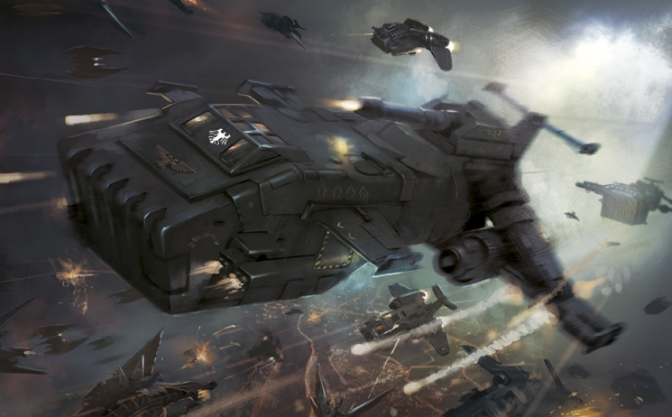
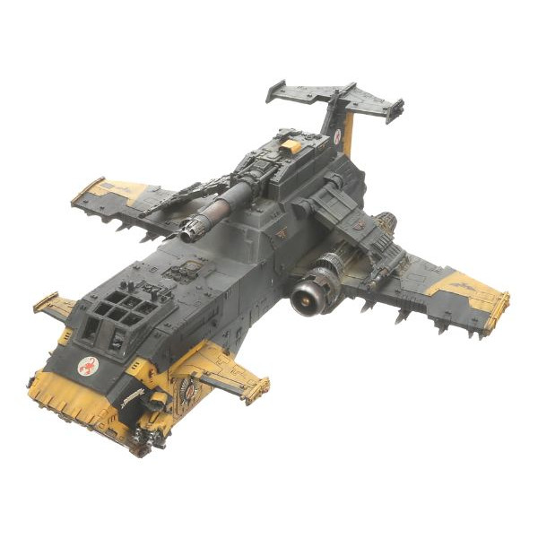
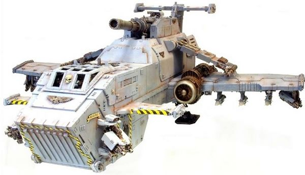
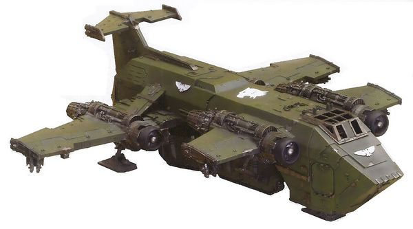

# 1553 雷鹰炮艇 Thunderhawk Gunship

精校状态：中文行文已逐段精校，部分术语仍为暂定

分类：载具 / 飞行 / 炮艇

原文来源：https://www.bilibili.com/opus/1042558274127265795

原作者：帝国神选罐头

原文时间：编辑于 2025年09月24日 15:18

[返回分类目录](目录.md) · [全书目录](../../目录.md)

<!-- A1553-B0001 -->
**英文原文**

The Thunderhawk gunship is a multi-use aircraft in wide use by Space Marine Chapters and the Sisters of Battle. Each Chapter of the Space Marines maintains its own fleet of Thunderhawks. Normally reserved for large-scale battles, time and time again its use in the various fields of war has been proven. With such might like this, only a great threat to the Imperium can demand use of these mighty craft.

<!-- /A1553-B0001 -->

<!-- A1553-B0002 -->

原译文

雷鹰炮艇是一种多用途飞机，被星际战士战团和战斗修女广泛使用。星际战士的每一战团都有自己的雷鹰机队。它通常用于大规模战斗，一次又一次地被证明在各个战争领域的使用。有了这样的力量，只有对帝国的巨大威胁才能要求使用这些强大的飞船。

**校订译文**

雷鹰炮艇是星际战士战团和战斗修女广泛使用的多用途飞行器。各星际战士战团都保有自己的雷鹰机队，通常在大规模战斗中投入使用。它在各类战场上反复证明了价值；只有帝国面临重大威胁时，才需要出动这种强大的飞行器。

<!-- /A1553-B0002 -->

<!-- A1553-B0003 图片 -->

<!-- A1553-B0004 -->

原译文

Raven Guard Thunderhawk 暗鸦守卫雷鹰

**校订译文**

Raven Guard Thunderhawk 暗鸦守卫雷鹰

<!-- /A1553-B0004 -->

<!-- A1553-B0005 -->
## History 历史

<!-- /A1553-B0005 -->

<!-- A1553-B0006 -->
**英文原文**

The Thunderhawk was first deployed during the last years of the Great Crusade as a cheaper-to-produce replacement for the Warhawk VI "Stormbird" gunship. Armed to the teeth with a Thunderhawk cannon and various other weapons, its use became more and more widespread.

<!-- /A1553-B0006 -->

<!-- A1553-B0007 -->

原译文

雷鹰在大远征的最后几年首次部署，作为战鹰VI“风暴鸟”炮艇的廉价替代品。用雷鹰加农炮和其他各种武器武装到牙齿，它的使用变得越来越广泛。

**校订译文**

大远征末期，雷鹰首次部署，作为战鹰 VI 型“风暴鸟”炮艇的低成本替代品。它配备雷鹰加农炮等多种武器，火力充足，随后愈发普及。

<!-- /A1553-B0007 -->

<!-- A1553-B0008 -->
**英文原文**

Many Marines who rode in the newly-deployed Thunderhawks felt uncomfortable, finding them lighter and flimsier compared to the more dependable Stormbirds. During the Horus Heresy, Captain Remus Ventanus of the Ultramarines predicted that the Thunderhawk was just a "stopgap" design, and the Legions would develop a better design, or revert to the more reliable Stormbird, before long.

<!-- /A1553-B0008 -->

<!-- A1553-B0009 -->

原译文

许多乘坐新部署的雷鹰的星际战士感到不舒服，发现与更可靠的风暴鸟相比，它们更轻、更脆弱。在荷鲁斯叛乱期间，极限战士的雷穆斯·文塔努斯连长预测，雷鹰只是一种“权宜之计”的设计，不久之后，军团将开发出更好的设计，或者恢复到更可靠的风暴鸟。

**校订译文**

许多乘坐新部署的雷鹰的星际战士感到不舒服，发现与更可靠的风暴鸟相比，它们更轻、更脆弱。在荷鲁斯之乱期间，极限战士的雷穆斯·文坦努斯连长预测，雷鹰只是一种“权宜之计”的设计，不久之后，军团将开发出更好的设计，或者恢复到更可靠的风暴鸟。

<!-- /A1553-B0009 -->

<!-- A1553-B0010 -->
## Design 设计

<!-- /A1553-B0010 -->

<!-- A1553-B0011 -->
**英文原文**

Thunderhawks are among the most technologically sophisticated vehicles employed by any Imperial force, and as such benefit from a number of advanced systems.

<!-- /A1553-B0011 -->

<!-- A1553-B0012 -->

原译文

雷鹰是帝国军队使用的技术最先进的载具之一，因此受益于许多先进的系统。

**校订译文**

雷鹰是帝国军队使用的技术最先进的载具之一，因此受益于许多先进的系统。

<!-- /A1553-B0012 -->

<!-- A1553-B0013 -->
### Armament 军备

<!-- /A1553-B0013 -->

<!-- A1553-B0014 -->
**英文原文**

The Thunderhawk is armed with a large number of weapons, though the configuration varies. Its primary weapon is fitted on a limited traverse dorsal mount and can mount either a Turbo-laser Destructor, powerful enough to strike down even a Scout Titan with an accurate shot, or a modified Battle Cannon useful for ground bombardment.

<!-- /A1553-B0014 -->

<!-- A1553-B0015 -->

原译文

雷鹰配备了大量武器，但配置各不相同。它的主要武器安装在一个有限的横向背架上，可以安装一个涡轮激光破坏炮，其威力足以用精确的射击击毁侦察泰坦，也可以安装一门用于地面轰炸的改进型战斗炮。

**校订译文**

雷鹰的武器很多，具体配置各异。主武器位于背部、水平转动范围有限的挂架上，可选择涡轮激光破坏炮或改装战斗炮：前者准确命中时，连侦察泰坦都能击毁；后者适合对地轰击。

<!-- /A1553-B0015 -->

<!-- A1553-B0016 图片 -->

<!-- A1553-B0017 -->

原译文

Thunderhawk gunship 雷鹰炮艇

**校订译文**

Thunderhawk gunship 雷鹰炮艇

<!-- /A1553-B0017 -->

<!-- A1553-B0018 -->
**英文原文**

It also has two Lascannons mounted on either attack wing and at least four Heavy Bolters in hull-mounted twin-linked sponsons, with room for four additional Heavy Bolters under the main wing tips.

<!-- /A1553-B0018 -->

<!-- A1553-B0019 -->

原译文

它还有两个安装在攻击翼上的激光炮，以及至少四个安装在船体上的双联舷侧重型爆矢枪，主翼尖端下还有四个额外的重型爆矢枪的空间。

**校订译文**

两侧攻击翼上共装有两门激光炮，机体侧炮座至少装有四挺双联配置的重型爆矢枪，主翼翼尖下还能再安装四挺。

<!-- /A1553-B0019 -->

<!-- A1553-B0020 -->
**英文原文**

In addition each wing has three bomb pylons, each of which carry one Hellstrike Missile, three Bombs or Smart Bombs, or an external fuel pod, for a total of six missiles/pods or eighteen bombs. All of the Thunderhawk's weapon systems are controlled by the gunner through remote multi-spectrum surveyors from the flight deck with assistance provided by the Machine Spirit.

<!-- /A1553-B0020 -->

<!-- A1553-B0021 -->

原译文

此外，每个机翼有三个炸弹挂架，每个挂架携带一枚地狱打击导弹、三枚炸弹或智能炸弹，或一个外部燃料舱，总共六枚导弹/吊舱或十八枚炸弹。雷鹰的所有武器系统都由炮手通过飞行甲板上的远程多光谱测量仪在机魂的协助下进行控制。

**校订译文**

每侧机翼另有三个挂架，各可携带一枚地狱打击导弹、三枚普通或智能炸弹，或一个外挂油箱；总载量为六枚导弹、六个油箱，或18枚炸弹。炮手在驾驶舱内借助远程多光谱探测仪控制所有武器系统，机魂提供辅助。

<!-- /A1553-B0021 -->

<!-- A1553-B0022 图片 -->

<!-- A1553-B0023 -->

原译文

Thunderhawk gunship 雷鹰炮艇

**校订译文**

Thunderhawk gunship 雷鹰炮艇

<!-- /A1553-B0023 -->

<!-- A1553-B0024 -->
### Control Systems 控制系统

<!-- /A1553-B0024 -->

<!-- A1553-B0025 -->
**英文原文**

The pilot, co-pilot, navigator and gunner are all located in the gunship's flight deck above the forward hold and in front of the upper hold. The navigator and co-pilot also control the primary narrow-band, long-range communications transmitter located on top of the fuselage, along with the sensor array and electronic counter-measures. The navigational equipment also transmits information to Space Marine command units, while an emergency location beacon will automatically begin broadcasting should the Thunderhawk be shot down. The Thunderhawk has external gun cameras, some of which are situated on the forward fuselage and linked to the heavy bolters. The images captured by the picter are displayed on a screen in the cockpit. The cameras allow for magnification far beyond normal Space Marine vision, having enough resolution to show objects tens of thousands of miles distant like the wreckage surrounding a destroyed spaceship in great detail.

<!-- /A1553-B0025 -->

<!-- A1553-B0026 -->

原译文

驾驶员、副驾驶、领航员和炮手都位于炮艇前舱上方和上舱前方的飞行甲板上。领航员和副驾驶还控制着位于机身顶部的主要窄带远程通信发射机，以及传感器阵列和电子对抗设备。导航设备还将信息传输到星际战士指挥部，而如果雷鹰被击落，紧急位置信标将自动开始广播。雷鹰有外部枪支摄像头，其中一些位于机身前部，与重型爆矢枪相连。摄影师拍摄的图像显示在驾驶舱的屏幕上。这些相机的放大倍数远远超出了正常的星际战士视觉，具有足够的分辨率，可以非常详细地显示数万英里外的物体，比如被摧毁的宇宙飞船周围的残骸。

**校订译文**

驾驶员、副驾驶、领航员和炮手位于前货舱上方、上货舱前方的驾驶舱内。领航员与副驾驶还控制机身顶部的窄带远程通讯发射机、传感器阵列及电子对抗设备。导航设备会将信息传给星际战士指挥单位；雷鹰若被击落，应急定位信标会自动发出信号。机外设有武器摄像头，其中一些位于前机身，与重型爆矢枪相连，拍摄画面显示在驾驶舱屏幕上。其放大能力远超星际战士肉眼，分辨率足以清楚呈现数万英里外的物体，甚至被毁星舰周围残骸的细节。

<!-- /A1553-B0026 -->

<!-- A1553-B0027 -->
**英文原文**

Despite their complexity the Thunderhawk's systems are rugged and reliable, and are all controlled by an M33 'Cygnus' class Machine Spirit. Utilizing aetheric and phlogiston feed coils, alembic shielding and pseudo-synaptic relays, the Cygnus has a cognition speed of 40,000 co/sec with a maximum contemplation capacity of 10,000 kilobrains, making it comparable to that found in a Reaver Battle Titan.

<!-- /A1553-B0027 -->

<!-- A1553-B0028 -->

原译文

尽管雷鹰的系统很复杂，但它们坚固可靠，全部由M33“天鹅座”级机魂控制。利用以太和燃素馈送线圈、净化防护和伪突触中继器，天鹅座的认知速度为40000次每秒，最大思考能力为10000千脑，与掠夺者泰坦的认知速度相当。

**校订译文**

雷鹰的系统虽然复杂，却坚固可靠，统一由 M33“天鹅座”级机魂控制。该系统采用以太与燃素供能线圈、蒸馏式屏蔽和仿突触中继，认知速度为每秒40,000 co，最大思考容量为10,000千脑，可与掠夺者战斗泰坦的机魂相媲美。

**校注：** co/sec及kilobrains为底稿中的设定计量，保留其单位，不换算成现实处理器性能；alembic shielding暂按词面译为蒸馏式屏蔽，技术含义待核。

<!-- /A1553-B0028 -->

<!-- A1553-B0029 -->
### Defensive Measures 防御措施

<!-- /A1553-B0029 -->

<!-- A1553-B0030 -->
**英文原文**

Armour for the Thunderhawk is constructed in a similar manner to that of a Land Raider, giving it an unprecedented level of protection. An adamantium inner hull is layered on top by titanium rolled plates, followed by a thermoplas fibre mesh, and then two layers of ceramite, the second of which is ablative. The ceramite and thermplas fibre layers are increased in depth to provide the craft with additional protection in order to perform repeated atmospheric entries, making them thicker than those on a Land Raider, at the expense of thinning the titanium and adamantium layers. These armour layers makes the Thunderhawk very well-protected and particularly resistant to Melta Weapons.

<!-- /A1553-B0030 -->

<!-- A1553-B0031 -->

原译文

雷鹰的装甲结构与兰德掠袭者相似，为其提供了前所未有的保护。精金内壳由钛轧制板层叠在顶部，然后是热塑性玻璃纤维网，然后是两层陶钢，第二层是烧蚀的。陶钢和热塑性塑料纤维层的深度增加，为飞行器提供了额外的保护，以便进行重复的大气突入，使其比兰德掠袭者上的更厚，代价是钛和精金层变薄。这些装甲层使雷鹰受到很好的保护，特别能抵抗热熔武器。

**校订译文**

雷鹰的装甲结构与兰德掠袭者战车相似，防护极强。精金内壳外依次覆盖轧制钛板、热塑纤维网及两层陶钢，外层陶钢具有烧蚀功能。为承受反复穿越大气层，陶钢与纤维层比兰德掠袭者更厚，钛与精金层则相应减薄。这种复合防护尤其擅长抵御热熔武器。

<!-- /A1553-B0031 -->

<!-- A1553-B0032 -->
**英文原文**

In addition to its armouring, Thunderhawks also come equipped with a Decoy Flare Launcher located in the lower rear fuselage, along with additional electronic counter-measures used to jam enemy sensors and tracking equipment, as well as an advanced electronic baffling suit. Thunderhawks could further be outfitted with Flare Shields or a Ramjet Diffraction Grid.

<!-- /A1553-B0032 -->

<!-- A1553-B0033 -->

原译文

除了装甲外，雷鹰还配备了位于机身后部下部的诱饵弹发射器，以及用于干扰敌方传感器和跟踪设备的额外电子对抗设备，以及先进的电子防护层。雷鹰还可以配备闪光护盾或冲压喷气衍射栅格。

**校订译文**

除了装甲外，雷鹰还配备了位于机身后部下部的诱饵弹发射器，以及用于干扰敌方传感器和跟踪设备的额外电子对抗设备，以及先进的电子防护层。雷鹰还可以配备闪光护盾或冲压喷气衍射栅格。

<!-- /A1553-B0033 -->

<!-- A1553-B0034 -->
### Engines 引擎

<!-- /A1553-B0034 -->

<!-- A1553-B0035 -->
**英文原文**

The Thunderhawk is powered by triple RX-92-00 Mars pattern, combination rocket/afterburning turbofans mounted on each wing and under the fuselage. In an atmosphere the turbofans provide enough thrust to propel the craft to approximately 2,000 kilometers per hour at 5,000 feet, reaching near-hypersonic velocities during suborbital flights. During the process of leaving the atmosphere, the Thunderhawk accelerates to hypersonic speed, until it finally reaches orbital velocity. When operating in space the forward turbofan section is isolated from the exhaust and combustion chambers, where fuel from the onboard fusion reactor is pumped in to create a high-pressure, high-velocity stream of gasses which provide thrust.

<!-- /A1553-B0035 -->

<!-- A1553-B0036 -->

原译文

雷鹰由三重RX-92-00火星型提供动力，火箭/加力涡轮风扇组合安装在每个机翼和机身下方。在大气层中，涡扇发动机提供足够的推力，将飞行器在5000英尺的高空推进到每小时约2000公里，在亚轨道飞行中达到接近超音速的速度。在离开大气层的过程中，雷鹰加速到超音速，直到最终达到轨道速度。当在太空中运行时，前涡扇发动机部分与排气室和燃烧室隔离开来，在那里，来自机载聚变反应堆的燃料被泵入，产生高压、高速的气体流，提供推力。

**校订译文**

雷鹰由三台火星型 RX-92-00 火箭／加力涡扇组合发动机推进，分别安装在两翼及机身下方。在大气层内，涡扇可使其在5,000英尺高度达到约2,000公里/小时；亚轨道飞行时则接近高超声速。离开大气层时，它继续加速至高超声速，最终达到轨道速度。进入太空后，前端涡扇与燃烧室、排气室隔离，机载聚变反应堆提供的燃料被泵入后部，产生高压高速气流，提供推力。

**校注：** hypersonic是高超声速，原译超音速不够准确；原文的聚变反应堆与燃料叙述照译，不补造技术解释。

<!-- /A1553-B0036 -->

<!-- A1553-B0037 -->
**英文原文**

Additional retro exhaust nozzles are located around the Thunderhawk's hull to provide maneuverability in zero-gravity conditions. They also allow the craft to operate in hover mode when in an atmosphere. For improved atmospheric handling the gunship features two 'attack' wings located above the main wings, which provide additional directional stability when making gun attacks. Their movement is synchronized and, during normal flight, are locked into position by bracing on the upper main wings, which are released when the Thunderhawk approaches a target.

<!-- /A1553-B0037 -->

<!-- A1553-B0038 -->

原译文

额外的反向排气喷口位于雷鹰船体周围，以在零重力条件下提供机动性。它们还允许飞行器在大气层中以悬停模式运行。为了提高大气操控性，炮艇在主翼上方配备了两个“攻击”翼，在进行枪械攻击时提供了额外的方向稳定性。它们的运动是同步的，在正常飞行过程中，通过上主翼的支撑锁定到位，当雷鹰接近目标时，上主翼会被释放。

**校订译文**

机体周围另设反推喷口，用来在零重力环境中机动，也能在大气层内悬停。主翼上方的一对“攻击翼”能提升对地射击时的方向稳定性。两翼同步动作，平飞时由主翼上方支撑机构锁定；接近目标时再解除锁定。

<!-- /A1553-B0038 -->

<!-- A1553-B0039 -->
### Transport Capacity 运输能力

<!-- /A1553-B0039 -->

<!-- A1553-B0040 -->
**英文原文**

At full capacity a Thunderhawk gunship can carry thirty power armoured Space Marines, or half as many in Terminator Armour, divided between the upper and forward holds. It can also carry a single Dreadnought in the forward hold, which takes the space of five Space Marines, or Space Marine Bike and Attack Bikes, which take up space equivalent to three and four Space Marines, respectively. Embarked troops can enter and exit through a forward assault ramp or two access doors on either side of the forward hull.

<!-- /A1553-B0040 -->

<!-- A1553-B0041 -->

原译文

雷鹰炮艇满负荷运行时，可搭载30名动力盔甲星际战士，或一半的终结者盔甲，分为上舱和前舱。它还可以在前沿舱携带一名无畏，这需要五名星际战士的空间，或者星际战士摩托和攻击摩托，它们分别占用相当于三名和四名星际战士的空间。跳帮部队可以通过前方突击坡道或前方船体两侧的两个通道门进出。

**校订译文**

雷鹰满载时可运送30名穿动力盔甲的星际战士，或15名穿终结者盔甲的战士，分别安置在上舱与前舱。前舱也能容纳一台无畏机甲，占用五名星际战士的空间；星际战士摩托与攻击摩托则分别占用三人和四人的空间。搭载部队可通过前方突击坡道，或前机体左右两侧的舱门进出。

<!-- /A1553-B0041 -->

<!-- A1553-B0042 -->
### Specifications 规格

<!-- /A1553-B0042 -->

<!-- A1553-B0043 -->
### Technical Specifications 技术信息

<!-- /A1553-B0043 -->

<!-- A1553-B0044 -->
**英文原文**

Type:Orbital Dropship

<!-- /A1553-B0044 -->

<!-- A1553-B0045 -->

原译文

类型：轨道空降飞船

**校订译文**

类型：轨道空降艇

<!-- /A1553-B0045 -->

<!-- A1553-B0046 -->
**英文原文**

Vehicle Name:Thunderhawk Gunship

<!-- /A1553-B0046 -->

<!-- A1553-B0047 -->

原译文

载具名称：雷鹰炮艇

**校订译文**

载具名称：雷鹰炮艇

<!-- /A1553-B0047 -->

<!-- A1553-B0048 -->
**英文原文**

Forge World of Origin:Mars

<!-- /A1553-B0048 -->

<!-- A1553-B0049 -->

原译文

起源铸造世界：火星

**校订译文**

起源铸造世界：火星

<!-- /A1553-B0049 -->

<!-- A1553-B0050 -->
**英文原文**

Known Patterns:I-XXI

<!-- /A1553-B0050 -->

<!-- A1553-B0051 -->

原译文

已知型号：I-XXI

**校订译文**

已知型号：I-XXI

<!-- /A1553-B0051 -->

<!-- A1553-B0052 -->
**英文原文**

Crew:Pilot, Co-Pilot, Gunner, Navigator

<!-- /A1553-B0052 -->

<!-- A1553-B0053 -->

原译文

乘员：飞行员、副驾驶、炮手、领航员

**校订译文**

乘员：飞行员、副驾驶、炮手、领航员

<!-- /A1553-B0053 -->

<!-- A1553-B0054 -->
**英文原文**

Powerplant:3 x RX-92-00 Combination Rocket/Afterburning Turbofans

<!-- /A1553-B0054 -->

<!-- A1553-B0055 -->

原译文

动力装置：3台RX-92-00火箭/加力涡扇发动机

**校订译文**

动力装置：3台RX-92-00火箭/加力涡扇发动机

<!-- /A1553-B0055 -->

<!-- A1553-B0056 -->
**英文原文**

Weight:121 tonnes

<!-- /A1553-B0056 -->

<!-- A1553-B0057 -->

原译文

重量：121吨

**校订译文**

重量：121吨

<!-- /A1553-B0057 -->

<!-- A1553-B0058 -->
**英文原文**

Length:26.6 m

<!-- /A1553-B0058 -->

<!-- A1553-B0059 -->

原译文

长度：26.6米

**校订译文**

长度：26.6米

<!-- /A1553-B0059 -->

<!-- A1553-B0060 -->
**英文原文**

Wingspan:26.65 m

<!-- /A1553-B0060 -->

<!-- A1553-B0061 -->

原译文

翼展：26.65米

**校订译文**

翼展：26.65米

<!-- /A1553-B0061 -->

<!-- A1553-B0062 -->
**英文原文**

Height:9.8 m

<!-- /A1553-B0062 -->

<!-- A1553-B0063 -->

原译文

高度：9.8米

**校订译文**

高度：9.8米

<!-- /A1553-B0063 -->

<!-- A1553-B0064 -->
**英文原文**

Operational Ceiling:N/A

<!-- /A1553-B0064 -->

<!-- A1553-B0065 -->

原译文

操作升限：无

**校订译文**

实用升限：不适用

<!-- /A1553-B0065 -->

<!-- A1553-B0066 -->
**英文原文**

Max Speed:2000 kph approx. at 5,000 feet

<!-- /A1553-B0066 -->

<!-- A1553-B0067 -->

原译文

最大速度：5000英尺处约2000公里/小时

**校订译文**

最大速度：5000英尺处约2000公里/小时

<!-- /A1553-B0067 -->

<!-- A1553-B0068 -->
**英文原文**

Range:28,000 km in atmosphere

<!-- /A1553-B0068 -->

<!-- A1553-B0069 -->

原译文

射程：大气层内28000公里

**校订译文**

航程：大气层内28,000公里

<!-- /A1553-B0069 -->

<!-- A1553-B0070 -->
**英文原文**

Main Armament:Thunderhawk cannon or Turbo-laser Destructor, twin-linked Lascannons

<!-- /A1553-B0070 -->

<!-- A1553-B0071 -->

原译文

主武器：雷鹰加农炮或涡轮激光破坏炮，双联激光炮

**校订译文**

主武器：雷鹰加农炮或涡轮激光破坏炮，双联激光炮

<!-- /A1553-B0071 -->

<!-- A1553-B0072 -->
**英文原文**

Secondary Armament:4x twin-linked Heavy Bolters

<!-- /A1553-B0072 -->

<!-- A1553-B0073 -->

原译文

二级武器：4x双联重型爆矢枪

**校订译文**

次要武器：四组双联重型爆矢枪

<!-- /A1553-B0073 -->

<!-- A1553-B0074 -->
**英文原文**

Main Ammunition:28 rounds

<!-- /A1553-B0074 -->

<!-- A1553-B0075 -->

原译文

主要弹药：28发

**校订译文**

主要弹药：28发

<!-- /A1553-B0075 -->

<!-- A1553-B0076 -->
**英文原文**

Secondary Ammunition:2400 rounds

<!-- /A1553-B0076 -->

<!-- A1553-B0077 -->

原译文

二级弹药：2400发

**校订译文**

次要武器载弹量：2,400发

<!-- /A1553-B0077 -->

<!-- A1553-B0078 -->
### Armour 装甲

原题：Armour 盔甲

<!-- /A1553-B0078 -->

<!-- A1553-B0079 -->
**英文原文**

Superstructure:55 mm

<!-- /A1553-B0079 -->

<!-- A1553-B0080 -->

原译文

上部结构：55毫米

**校订译文**

上部结构：55毫米

<!-- /A1553-B0080 -->

<!-- A1553-B0081 -->
**英文原文**

Hull:65 mm

<!-- /A1553-B0081 -->

<!-- A1553-B0082 -->

原译文

船体：65毫米

**校订译文**

船体：65毫米

<!-- /A1553-B0082 -->

<!-- A1553-B0083 -->
## Various uses and strategies used 用途与战术

原题：Various uses and strategies used 使用的各种用途和策略

<!-- /A1553-B0083 -->

<!-- A1553-B0084 -->
**英文原文**

As the Thunderhawk's engines allow it to drop to lower atmosphere without landing, it proves to be one of the most useful craft employed by the Space Marines. With the ability to carry three full tactical squads, with precision a Drop Pod can't match, the Thunderhawk is used to insert marines into the thick of it, not just destroy the enemy. Whereas some chapters would prefer to simply launch a full-scale assault on the enemy, or use Drop Pods, many, many Chapters use Thunderhawks. Its tactical range and huge amount of firepower prove it to be one of the most useful vehicles ever created. Not only this, but the Adeptus Mechanicus and the Techmarines still hold the secrets to the creation of the Thunderhawk.

<!-- /A1553-B0084 -->

<!-- A1553-B0085 -->

原译文

由于雷鹰的发动机允许它在不着陆的情况下降落到较低的大气层，它被证明是星际战士使用的最有用的飞行器之一。雷鹰能够携带三个完整的战术小队，其精确度是空投舱无法比拟的，它被用来将星际战士投入其中，而不仅仅是摧毁敌人。虽然有些战团更喜欢对敌人发动全面攻击，或者使用空投舱，但许多战团都使用雷鹰。它的战术范围和巨大的火力证明它是有史以来最有用的载具之一。不仅如此，机械神教和技术军士仍然掌握着雷鹰制造的秘密。

**校订译文**

雷鹰能够降至低空而无须着陆，是星际战士最实用的飞行器之一。它能以空降舱难以达到的精度，把三个完整战术小队送入激战区域，同时提供强大火力。有些战团偏爱全面突击或空降舱作战，但许多战团大量使用雷鹰。广泛的战术用途、强大火力，以及机械修会和科技战士仍掌握制造技术，使其一直保持重要地位。

<!-- /A1553-B0085 -->

<!-- A1553-B0086 -->
### Thunderhawks as Attack Craft 雷鹰作为攻击艇

<!-- /A1553-B0086 -->

<!-- A1553-B0087 -->
**英文原文**

Thunderhawks are not just used for ground attacks. Indeed, they are often launched into a space battle much like "normal" Attack craft where their firepower and Space Marine cargo make them potent additions to a Space Marine fleet.

<!-- /A1553-B0087 -->

<!-- A1553-B0088 -->

原译文

雷鹰不仅仅用于地面攻击。事实上，它们经常被投入到太空战斗中，就像“正常”的攻击艇一样，它们的火力和星际战士货物使它们成为星际战士舰队的有力补充。

**校订译文**

雷鹰也常参加太空战。与其他攻击机一样，它可以投入舰队交锋，凭借自身火力和搭载的星际战士，为战团舰队增添强大力量。

<!-- /A1553-B0088 -->

<!-- A1553-B0089 -->
**英文原文**

While slower than dedicated interceptors like the Fury, Thunderhawks are able to out-fight and out-last such craft, usually going twice as long as "regular" fighters before being forced to return to their mother ship for refueling and re-arming. While very useful in its own right, this strength and endurance also means that unlike most assault boats, Thunderhawks are more than capable of punching their way through enemy fighter screens and delivering their deadly payload to a warship for a devastating hit-and-run boarding action without the need for dedicated fighter escorts to pave the way for them.

<!-- /A1553-B0089 -->

<!-- A1553-B0090 -->

原译文

虽然比像狂怒这样的专用拦截机慢，但雷鹰能够击败这样的飞机，通常比“常规”战斗机飞行时间长一倍，然后被迫返回母舰加油和重新武装。虽然其本身非常有用，但这种力量和耐力也意味着，与大多数攻击艇不同，雷鹰完全有能力穿越敌方战斗机的屏障，并将致命的运载运送到舰船上，进行毁灭性的撞击和跑打跳帮行动，而不需要专门的战斗机护航为它们铺平道路。

**校订译文**

虽然速度不及狂怒等专用截击机，雷鹰却往往有更强的战斗力与续航力，通常能执行相当于普通战斗机两倍时长的任务，再返回母舰补充燃料弹药。这也使它不同于多数突击艇：无须专用战斗机先行开路，便能自行突破敌机拦截，将部队送上敌舰，实施打完即撤的猛烈跳帮突袭。

<!-- /A1553-B0090 -->

<!-- A1553-B0091 -->
### Thunderhawk Payloads 雷鹰载荷配置

原题：Thunderhawk Payloads 雷鹰运载

<!-- /A1553-B0091 -->

<!-- A1553-B0092 -->
**英文原文**

Thunderhawks can alter the type of payload carried depending on which specific mission they are tasked to accomplish, making it a truly formidable weapons platform.

<!-- /A1553-B0092 -->

<!-- A1553-B0093 -->

原译文

雷鹰可以根据它们要完成的具体任务改变携带的运载类型，使其成为一个真正强大的武器平台。

**校订译文**

雷鹰可以按任务改变载荷，因此是强大的多用途武器平台。

<!-- /A1553-B0093 -->

<!-- A1553-B0094 -->
### Troop Insertion Mission 部队投入任务

<!-- /A1553-B0094 -->

<!-- A1553-B0095 -->
**英文原文**

1 x dorsal mounted turbo-laser destructor or thunderhawk cannon

<!-- /A1553-B0095 -->

<!-- A1553-B0096 -->

原译文

1门背装式涡轮激光破坏炮或雷鹰加农炮

**校订译文**

1门背装式涡轮激光破坏炮或雷鹰加农炮

<!-- /A1553-B0096 -->

<!-- A1553-B0097 -->
**英文原文**

2 x lascannons on attack wings

<!-- /A1553-B0097 -->

<!-- A1553-B0098 -->

原译文

攻击翼上安装2门激光炮

**校订译文**

攻击翼上安装2门激光炮

<!-- /A1553-B0098 -->

<!-- A1553-B0099 -->
**英文原文**

4 x heavy bolters in twin-linked mounts on forward fuselage

<!-- /A1553-B0099 -->

<!-- A1553-B0100 -->

原译文

前机身上双联安装的4个重型爆矢枪

**校订译文**

前机身上双联安装的4个重型爆矢枪

<!-- /A1553-B0100 -->

<!-- A1553-B0101 -->
**英文原文**

4 x heavy bolters in twin-linked mounts under wing tips

<!-- /A1553-B0101 -->

<!-- A1553-B0102 -->

原译文

4个重型爆矢枪，安装在机翼尖端下方的双联支架上

**校订译文**

4个重型爆矢枪，安装在机翼尖端下方的双联支架上

<!-- /A1553-B0102 -->

<!-- A1553-B0103 -->
### Close Air Support Mission 近距空中支援任务

原题：Close Air Support Mission 近空支援任务

<!-- /A1553-B0103 -->

<!-- A1553-B0104 -->
**英文原文**

1 x dorsal mounted turbo-laser destructor or thunderhawk cannon

<!-- /A1553-B0104 -->

<!-- A1553-B0105 -->

原译文

1门背装式涡轮激光破坏炮或雷鹰加农炮

**校订译文**

1门背装式涡轮激光破坏炮或雷鹰加农炮

<!-- /A1553-B0105 -->

<!-- A1553-B0106 -->
**英文原文**

2 x lascannons on attack wings

<!-- /A1553-B0106 -->

<!-- A1553-B0107 -->

原译文

攻击翼上安装2门激光炮

**校订译文**

攻击翼上安装2门激光炮

<!-- /A1553-B0107 -->

<!-- A1553-B0108 -->
**英文原文**

4 x heavy bolters in twin-linked mounts on forward fuselage

<!-- /A1553-B0108 -->

<!-- A1553-B0109 -->

原译文

前机身上双联安装的4个重型爆矢枪

**校订译文**

前机身上双联安装的4个重型爆矢枪

<!-- /A1553-B0109 -->

<!-- A1553-B0110 -->
**英文原文**

4 x heavy bolters in twin-linked mounts under wing tips

<!-- /A1553-B0110 -->

<!-- A1553-B0111 -->

原译文

4个重型爆矢枪，安装在机翼尖端下方的双联支架上

**校订译文**

4个重型爆矢枪，安装在机翼尖端下方的双联支架上

<!-- /A1553-B0111 -->

<!-- A1553-B0112 -->
**英文原文**

6 x hellstrike missiles under wings

<!-- /A1553-B0112 -->

<!-- A1553-B0113 -->

原译文

机翼下6枚地狱打击导弹

**校订译文**

机翼下6枚地狱打击导弹

<!-- /A1553-B0113 -->

<!-- A1553-B0114 -->
### Saturation Bombing Mission 饱和轰炸任务

<!-- /A1553-B0114 -->

<!-- A1553-B0115 -->
**英文原文**

1 x dorsal mounted turbo-laser destructor or thunderhawk cannon

<!-- /A1553-B0115 -->

<!-- A1553-B0116 -->

原译文

1门背装式涡轮激光破坏炮或雷鹰加农炮

**校订译文**

1门背装式涡轮激光破坏炮或雷鹰加农炮

<!-- /A1553-B0116 -->

<!-- A1553-B0117 -->
**英文原文**

2 x lascannons on attack wings

<!-- /A1553-B0117 -->

<!-- A1553-B0118 -->

原译文

攻击翼上安装2门激光炮

**校订译文**

攻击翼上安装2门激光炮

<!-- /A1553-B0118 -->

<!-- A1553-B0119 -->
**英文原文**

4 x heavy bolters in twin-linked mounts on forward fuselage

<!-- /A1553-B0119 -->

<!-- A1553-B0120 -->

原译文

前机身上双联安装的4个重型爆矢枪

**校订译文**

前机身上双联安装的4个重型爆矢枪

<!-- /A1553-B0120 -->

<!-- A1553-B0121 -->
**英文原文**

4 x heavy bolters in twin-linked mounts under wing tips

<!-- /A1553-B0121 -->

<!-- A1553-B0122 -->

原译文

4个重型爆矢枪，安装在机翼尖端下方的双联支架上

**校订译文**

4个重型爆矢枪，安装在机翼尖端下方的双联支架上

<!-- /A1553-B0122 -->

<!-- A1553-B0123 -->
**英文原文**

18 x high explosive and incendiary bombs under wings

<!-- /A1553-B0123 -->

<!-- A1553-B0124 -->

原译文

机翼下18枚高爆和燃烧炸弹

**校订译文**

机翼下18枚高爆和燃烧炸弹

<!-- /A1553-B0124 -->

<!-- A1553-B0125 -->
### Long-Range Bombing Mission 长距轰炸任务

<!-- /A1553-B0125 -->

<!-- A1553-B0126 -->
**英文原文**

1 x dorsal mounted turbo-laser destructor or thunderhawk cannon

<!-- /A1553-B0126 -->

<!-- A1553-B0127 -->

原译文

1门背装式涡轮激光破坏炮或雷鹰加农炮

**校订译文**

1门背装式涡轮激光破坏炮或雷鹰加农炮

<!-- /A1553-B0127 -->

<!-- A1553-B0128 -->
**英文原文**

2 x lascannons on attack wings

<!-- /A1553-B0128 -->

<!-- A1553-B0129 -->

原译文

攻击翼上安装2门激光炮

**校订译文**

攻击翼上安装2门激光炮

<!-- /A1553-B0129 -->

<!-- A1553-B0130 -->
**英文原文**

4 x heavy bolters in twin-linked mounts on forward fuselage

<!-- /A1553-B0130 -->

<!-- A1553-B0131 -->

原译文

前机身上双联安装的4个重型爆矢枪

**校订译文**

前机身上双联安装的4个重型爆矢枪

<!-- /A1553-B0131 -->

<!-- A1553-B0132 -->
**英文原文**

2 x external auxiliary fuel pods under wings

<!-- /A1553-B0132 -->

<!-- A1553-B0133 -->

原译文

机翼下2个外部辅助燃料舱

**校订译文**

机翼下2个外部辅助燃料舱

<!-- /A1553-B0133 -->

<!-- A1553-B0134 -->
**英文原文**

4 x large guided bombs under wings (delayed fuse)

<!-- /A1553-B0134 -->

<!-- A1553-B0135 -->

原译文

机翼下4枚大型制导炸弹（延迟引信）

**校订译文**

机翼下4枚大型制导炸弹（延迟引信）

<!-- /A1553-B0135 -->

<!-- A1553-B0136 -->
**英文原文**

2 x large guided bombs under wing tips (melta warheads)

<!-- /A1553-B0136 -->

<!-- A1553-B0137 -->

原译文

翼尖下2枚大型制导炸弹（热熔弹头）

**校订译文**

翼尖下2枚大型制导炸弹（热熔弹头）

<!-- /A1553-B0137 -->

<!-- A1553-B0138 -->
### Spaceship Intercept 星舰截击

原题：Spaceship Intercept 空舰截击

<!-- /A1553-B0138 -->

<!-- A1553-B0139 -->
**英文原文**

1 x dorsal mounted turbo-laser destructor or thunderhawk cannon

<!-- /A1553-B0139 -->

<!-- A1553-B0140 -->

原译文

1门背装式涡轮激光破坏炮或雷鹰加农炮

**校订译文**

1门背装式涡轮激光破坏炮或雷鹰加农炮

<!-- /A1553-B0140 -->

<!-- A1553-B0141 -->
**英文原文**

2 x lascannons on attack wings

<!-- /A1553-B0141 -->

<!-- A1553-B0142 -->

原译文

攻击翼上安装2门激光炮

**校订译文**

攻击翼上安装2门激光炮

<!-- /A1553-B0142 -->

<!-- A1553-B0143 -->
**英文原文**

4 x heavy bolters in twin-linked mounts on forward fuselage

<!-- /A1553-B0143 -->

<!-- A1553-B0144 -->

原译文

前机身上双联安装的4个重型爆矢枪

**校订译文**

前机身上双联安装的4个重型爆矢枪

<!-- /A1553-B0144 -->

<!-- A1553-B0145 -->
**英文原文**

6 x large guided bombs under wings (plasma warheads)

<!-- /A1553-B0145 -->

<!-- A1553-B0146 -->

原译文

机翼下6枚大型制导炸弹（等离子弹头）

**校订译文**

机翼下6枚大型制导炸弹（等离子弹头）

<!-- /A1553-B0146 -->

<!-- A1553-B0147 -->
**英文原文**

2 x large guide bombs under wing tips (melta warheads)

<!-- /A1553-B0147 -->

<!-- A1553-B0148 -->

原译文

翼尖下2枚大型制导炸弹（热熔弹头）

**校订译文**

翼尖下2枚大型制导炸弹（热熔弹头）

<!-- /A1553-B0148 -->

<!-- A1553-B0149 -->
## Famous wars and battles 著名战争和战斗

<!-- /A1553-B0149 -->

<!-- A1553-B0150 -->

原译文

Assault on Black Reach 黑峡突击

**校订译文**

Assault on Black Reach 黑域突击

<!-- /A1553-B0150 -->

<!-- A1553-B0151 -->

原译文

The Damnos Incident 达姆诺斯事件

**校订译文**

The Damnos Incident 达姆诺斯事件

<!-- /A1553-B0151 -->

<!-- A1553-B0152 -->

原译文

The hunt for Kernax Voldorius 狩猎克纳克斯·沃尔多里乌斯

**校订译文**

The hunt for Kernax Voldorius 狩猎克纳克斯·沃尔多里乌斯

<!-- /A1553-B0152 -->

<!-- A1553-B0153 -->

原译文

Vorlinghat's Bane 沃林哈特之灾

**校订译文**

Vorlinghat's Bane 沃林哈特之灾

<!-- /A1553-B0153 -->

<!-- A1553-B0154 -->
## Notable Thunderhawks 著名雷鹰

<!-- /A1553-B0154 -->

<!-- A1553-B0155 -->
**英文原文**

Ætos Dios - Imperial Fists. Personal Thunderhawk of Rogal Dorn.

<!-- /A1553-B0155 -->

<!-- A1553-B0156 -->

原译文

神鹰 - 帝国之拳。罗格·多恩的个人雷鹰。

**校订译文**

神鹰 - 帝国之拳。罗格·多恩的个人雷鹰。

<!-- /A1553-B0156 -->

<!-- A1553-B0157 -->
**英文原文**

Gladius - Ultramarines. Personal Thunderhawk of Captain Cato Sicarius.

**校注：** Gladius在此是西卡留斯的具名雷鹰，沿原格雷迪厄斯；不能套用同名舰级或一般短剑的译名。

<!-- /A1553-B0157 -->

<!-- A1553-B0158 -->

原译文

格雷迪厄斯 - 极限战士。卡托·西卡留斯连长的个人雷鹰。

**校订译文**

格雷迪厄斯 - 极限战士。卡托·西卡留斯连长的个人雷鹰。

<!-- /A1553-B0158 -->

<!-- A1553-B0159 -->
**英文原文**

Herald IV - Ultramarines.

<!-- /A1553-B0159 -->

<!-- A1553-B0160 -->

原译文

先驱四号 - 极限战士

**校订译文**

先驱四号 - 极限战士

<!-- /A1553-B0160 -->

<!-- A1553-B0161 -->
**英文原文**

Masali Spear - Ultramarines.

<!-- /A1553-B0161 -->

<!-- A1553-B0162 -->

原译文

马萨里长矛 - 极限战士

**校订译文**

马萨里长矛 - 极限战士

<!-- /A1553-B0162 -->

<!-- A1553-B0163 -->
**英文原文**

Morkai - Space Wolves.

<!-- /A1553-B0163 -->

<!-- A1553-B0164 -->

原译文

莫凯 - 太空野狼

**校订译文**

莫凯 - 太空野狼

<!-- /A1553-B0164 -->

<!-- A1553-B0165 -->
**英文原文**

Oath of Guilliman - Ultramarines

<!-- /A1553-B0165 -->

<!-- A1553-B0166 -->

原译文

基里曼之誓 - 极限战士

**校订译文**

基里曼之誓 - 极限战士

<!-- /A1553-B0166 -->

<!-- A1553-B0167 -->
**英文原文**

Pilum - Ultramarines 2nd Company.

<!-- /A1553-B0167 -->

<!-- A1553-B0168 -->

原译文

重标枪 - 极限战士第二连

**校订译文**

重标枪 - 极限战士第二连

<!-- /A1553-B0168 -->

<!-- A1553-B0169 -->
**英文原文**

Reign of Vengeance - Blood Angels.

<!-- /A1553-B0169 -->

<!-- A1553-B0170 -->

原译文

复仇统治 - 圣血天使

**校订译文**

复仇统治 - 圣血天使

<!-- /A1553-B0170 -->

<!-- A1553-B0171 -->
**英文原文**

Roar of Vengeance - Dark Angels. Personal Thunderhawk of Supreme Grand Master Azrael.

<!-- /A1553-B0171 -->

<!-- A1553-B0172 -->

原译文

复仇咆哮 - 黑暗天使。至高大导师阿兹瑞尔的个人雷鹰。

**校订译文**

复仇咆哮 - 黑暗天使。至高大导师阿兹瑞尔的个人雷鹰。

<!-- /A1553-B0172 -->

<!-- A1553-B0173 -->
**英文原文**

Spatha - Ultramarines 2nd Company.

<!-- /A1553-B0173 -->

<!-- A1553-B0174 -->

原译文

长剑 - 极限战士第二连

**校订译文**

长剑 - 极限战士第二连

<!-- /A1553-B0174 -->

<!-- A1553-B0175 -->
**英文原文**

Votive IX - Imperial Talons.

<!-- /A1553-B0175 -->

<!-- A1553-B0176 -->

原译文

誓言九号 - 帝国之爪

**校订译文**

誓言九号 - 帝国之爪

<!-- /A1553-B0176 -->

<!-- A1553-B0177 -->
**英文原文**

Xiphos - Ultramarines 2nd Company.

<!-- /A1553-B0177 -->

<!-- A1553-B0178 -->

原译文

短剑 - 极限战士第二连

**校订译文**

短剑 - 极限战士第二连

<!-- /A1553-B0178 -->

<!-- A1553-B0179 -->
## Variants 变体

<!-- /A1553-B0179 -->

<!-- A1553-B0180 -->
### Thunderhawk Transporter 雷鹰运输机

<!-- /A1553-B0180 -->

<!-- A1553-B0181 -->
**英文原文**

The Thunderhawk Transporter is a logistical variation of the normal Thunderhawk gunship. It has many of the same basic design features as the original but is armed with only four twin-linked Heavy Bolters, though it can carry as many as six Hellstrike missiles on its wing hardpoints, and is propelled by four RX-92-00 combination rocket/afterburning turbofans. The most noticeable difference is that it is missing the normal transport holds found on the Thunderhawk gunship, equipped instead with four massive magnetic clamping arms mounted on runners underneath the fuselage. These allow the Transporter to carry two Rhino or one Land Raider-sized vehicles, or an under-slung pod for carrying ammunition, fuel and other supplies. These items can be loaded and unloaded in quick order, minimizing the amount of time the Transporter is vulnerable while one the ground. A Thunderhawk Transport is also equipped with a winch to recover drop pods.

<!-- /A1553-B0181 -->

<!-- A1553-B0182 -->

原译文

雷鹰运输机是普通雷鹰炮艇的后勤变体。它具有许多与原版相同的基本设计特征，但只配备了四个双联重型爆矢枪，尽管它的机翼可以携带多达六枚地狱打击导弹，并由四个RX-92-00组合火箭/加力涡扇发动机推进。最明显的区别是，它缺少了雷鹰炮艇上的正常运输舱，而是配备了安装在机身下方滑道上的四个巨大的磁性夹臂。这些允许运输机携带两辆犀牛或一辆兰德掠袭者大小的车辆，或一个用于携带弹药、燃料和其他物资的悬挂式吊舱。这些物品可以快速装卸，最大限度地减少运输机在地面上易受攻击的时间。雷鹰运输机还配备了一个绞车来回收空投舱。

**校订译文**

雷鹰运输机是雷鹰炮艇的后勤改型，保留许多基本设计。固定武装只有四组双联重型爆矢枪，翼下挂点还可携带最多六枚地狱打击导弹，动力则来自四台 RX-92-00 火箭／加力涡扇组合发动机。最明显的区别是取消了常规载员舱，改为在机腹滑轨上安装四条大型磁力夹臂。它们可以吊运两辆犀牛大小的载具、一辆兰德掠袭者大小的载具，或装有弹药、燃料等物资的货舱。快速装卸能够缩短飞机在地面暴露的时间；运输机还装有用于回收空降舱的绞盘。

<!-- /A1553-B0182 -->

<!-- A1553-B0183 图片 -->

<!-- A1553-B0184 -->

原译文

Thunderhawk transporter 雷鹰运输机

**校订译文**

Thunderhawk transporter 雷鹰运输机

<!-- /A1553-B0184 -->

<!-- A1553-B0185 -->
### Technical Specifications 技术信息

<!-- /A1553-B0185 -->

<!-- A1553-B0186 -->
**英文原文**

Type:Orbital Transporter

<!-- /A1553-B0186 -->

<!-- A1553-B0187 -->

原译文

类型：轨道运输机

**校订译文**

类型：轨道运输机

<!-- /A1553-B0187 -->

<!-- A1553-B0188 -->
**英文原文**

Vehicle Name:Thunderhawk Transporter

<!-- /A1553-B0188 -->

<!-- A1553-B0189 -->

原译文

载具名称：雷鹰运输机

**校订译文**

载具名称：雷鹰运输机

<!-- /A1553-B0189 -->

<!-- A1553-B0190 -->
**英文原文**

Forge World of Origin:Mars

<!-- /A1553-B0190 -->

<!-- A1553-B0191 -->

原译文

起源铸造世界：火星

**校订译文**

起源铸造世界：火星

<!-- /A1553-B0191 -->

<!-- A1553-B0192 -->
**英文原文**

Known Patterns:I-XI

<!-- /A1553-B0192 -->

<!-- A1553-B0193 -->

原译文

已知型号：I - XI

**校订译文**

已知型号：I - XI

<!-- /A1553-B0193 -->

<!-- A1553-B0194 -->
**英文原文**

Crew:Pilot, Co-Pilot

<!-- /A1553-B0194 -->

<!-- A1553-B0195 -->

原译文

乘员：飞行员、副驾驶

**校订译文**

乘员：飞行员、副驾驶

<!-- /A1553-B0195 -->

<!-- A1553-B0196 -->
**英文原文**

Powerplant:4 x RX-92-00 Combination Rocket/Afterburning Turbofans

<!-- /A1553-B0196 -->

<!-- A1553-B0197 -->

原译文

动力装置：4台RX-92-00火箭/加力涡扇发动机

**校订译文**

动力装置：4台RX-92-00火箭/加力涡扇发动机

<!-- /A1553-B0197 -->

<!-- A1553-B0198 -->
**英文原文**

Weight:105 tonnes

<!-- /A1553-B0198 -->

<!-- A1553-B0199 -->

原译文

重量：105吨

**校订译文**

重量：105吨

<!-- /A1553-B0199 -->

<!-- A1553-B0200 -->
**英文原文**

Length:28.8 m

<!-- /A1553-B0200 -->

<!-- A1553-B0201 -->

原译文

长度：28.8米

**校订译文**

长度：28.8米

<!-- /A1553-B0201 -->

<!-- A1553-B0202 -->
**英文原文**

Wingspan:26.65 m

<!-- /A1553-B0202 -->

<!-- A1553-B0203 -->

原译文

翼展：26.65米

**校订译文**

翼展：26.65米

<!-- /A1553-B0203 -->

<!-- A1553-B0204 -->
**英文原文**

Height:8.6 m

<!-- /A1553-B0204 -->

<!-- A1553-B0205 -->

原译文

高度：8.6米

**校订译文**

高度：8.6米

<!-- /A1553-B0205 -->

<!-- A1553-B0206 -->
**英文原文**

Operational Ceiling:N/A

<!-- /A1553-B0206 -->

<!-- A1553-B0207 -->

原译文

操作升限：无

**校订译文**

实用升限：不适用

<!-- /A1553-B0207 -->

<!-- A1553-B0208 -->
**英文原文**

Max Speed:2000 kph approx. at 5,000 feet

<!-- /A1553-B0208 -->

<!-- A1553-B0209 -->

原译文

最大速度：5000英尺处约2000公里/小时

**校订译文**

最大速度：5000英尺处约2000公里/小时

<!-- /A1553-B0209 -->

<!-- A1553-B0210 -->
**英文原文**

Range:28,000 km in atmosphere

<!-- /A1553-B0210 -->

<!-- A1553-B0211 -->

原译文

射程：大气层内28000公里

**校订译文**

航程：大气层内28,000公里

<!-- /A1553-B0211 -->

<!-- A1553-B0212 -->
**英文原文**

Main Armament:4x twin-linked Heavy Bolters

<!-- /A1553-B0212 -->

<!-- A1553-B0213 -->

原译文

主武器：4x双联重型爆矢枪

**校订译文**

主武器：四组双联重型爆矢枪

<!-- /A1553-B0213 -->

<!-- A1553-B0214 -->
**英文原文**

Secondary Armament:N/A

<!-- /A1553-B0214 -->

<!-- A1553-B0215 -->

原译文

次要武器：无

**校订译文**

次要武器：无

<!-- /A1553-B0215 -->

<!-- A1553-B0216 -->
**英文原文**

Main Ammunition:2200 rounds

<!-- /A1553-B0216 -->

<!-- A1553-B0217 -->

原译文

主要弹药：2200发

**校订译文**

主要弹药：2200发

<!-- /A1553-B0217 -->

<!-- A1553-B0218 -->
**英文原文**

Secondary Ammunition:N/A

<!-- /A1553-B0218 -->

<!-- A1553-B0219 -->

原译文

次要弹药：无

**校订译文**

次要弹药：无

<!-- /A1553-B0219 -->

<!-- A1553-B0220 -->
### Armour 装甲

原题：Armour 盔甲

<!-- /A1553-B0220 -->

<!-- A1553-B0221 -->
**英文原文**

Superstructure:45 mm

<!-- /A1553-B0221 -->

<!-- A1553-B0222 -->

原译文

上部结构：45毫米

**校订译文**

上部结构：45毫米

<!-- /A1553-B0222 -->

<!-- A1553-B0223 -->
**英文原文**

Hull:45 mm

<!-- /A1553-B0223 -->

<!-- A1553-B0224 -->

原译文

船体：45毫米

**校订译文**

船体：45毫米

<!-- /A1553-B0224 -->

<!-- A1553-B0225 -->
## Notable Thunderhawk Transporters 著名雷鹰运输机

<!-- /A1553-B0225 -->

<!-- A1553-B0226 -->
**英文原文**

Maledictor Audax - Mantis Warriors

<!-- /A1553-B0226 -->

<!-- A1553-B0227 -->

原译文

无畏诅咒者 - 螳螂勇士

**校订译文**

无畏诅咒者 - 螳螂勇士

<!-- /A1553-B0227 -->

<!-- A1553-B0228 -->
**英文原文**

Umbra Scion - Raven Guard

<!-- /A1553-B0228 -->

<!-- A1553-B0229 -->

原译文

影裔 - 暗鸦守卫

**校订译文**

影裔 - 暗鸦守卫

<!-- /A1553-B0229 -->

<!-- A1553-B0230 -->
**英文原文**

Wings of Deliverance - Blood Angels

<!-- /A1553-B0230 -->

<!-- A1553-B0231 -->

原译文

拯救之翼 - 圣血天使

**校订译文**

拯救之翼号 - 圣血天使

<!-- /A1553-B0231 -->

<!-- A1553-B0232 -->
### Thunderhawk Annihilator 雷鹰歼灭者

<!-- /A1553-B0232 -->

<!-- A1553-B0233 -->
**英文原文**

The Thunderhawk Annihilator is a special void combat variant of the Thunderhawk used only by crusading chapters. It is equipped with a powerful Annihilator Cannon, foregoing all transport capacities to provide firepower usually wielded by Imperial Navy bombers and Mechanicus titans.

<!-- /A1553-B0233 -->

<!-- A1553-B0234 -->

原译文

雷鹰歼灭者是雷鹰的一种特殊的虚空战斗变体，只供远征战团使用。它配备了一门强大的歼灭加农炮，放弃了所有运输能力，提供了帝国海军轰炸机和机械教泰坦通常使用的火力。

**校订译文**

雷鹰歼灭者是仅由远征战团使用的虚空战专用改型。它取消全部运输能力，搭载强大的歼灭加农炮，提供通常只有帝国海军轰炸机或机械修会泰坦才具备的火力。

<!-- /A1553-B0234 -->

<!-- A1553-B0235 -->
### Shadowhawk 影鹰

<!-- /A1553-B0235 -->

<!-- A1553-B0236 -->
**英文原文**

The Shadowhawk is a stealth variant of the Thunderhawk used by the Raven Guard.

<!-- /A1553-B0236 -->

<!-- A1553-B0237 -->

原译文

影鹰是暗鸦守卫使用的雷鹰的隐形变体。

**校订译文**

影鹰是暗鸦守卫使用的雷鹰的隐形变体。

<!-- /A1553-B0237 -->

<!-- A1553-B0238 -->
### Chaos Thunderhawk 混沌雷鹰

<!-- /A1553-B0238 -->

<!-- A1553-B0239 -->
**英文原文**

Chaos Space Marine warbands still employ Thunderhawks in great numbers, either dating back to the Great Crusade or aquired since the Horus Heresy. The Chaos Forge World of Xana II still produces Thunderhawks for the legions of Chaos, though these are usually daemonically corrupted.

<!-- /A1553-B0239 -->

<!-- A1553-B0240 -->

原译文

混沌星际战士仍然大量使用雷鹰，要么可以追溯到大远征，要么是自荷鲁斯叛乱以来获得的。夏纳二号的混沌铸造世界仍然为混沌军团生产雷鹰，尽管这些通常是恶魔腐化的。

**校订译文**

混沌星际战士战帮仍大量使用雷鹰，其中有些源自大远征，有些则是荷鲁斯之乱以后取得。混沌铸造世界夏娜二号仍为混沌军团制造雷鹰，但这些飞机通常都遭到了恶魔腐化。

<!-- /A1553-B0240 -->

<!-- A1553-B0241 -->
### Adepta Sororitas 修女会

<!-- /A1553-B0241 -->

<!-- A1553-B0242 -->
**英文原文**

Many Orders of the Adepta Sororitas use the Thunderhawk as an orbit to ground shuttle and a frontline transport. The exact models and armament configurations haven't been specified so far.

<!-- /A1553-B0242 -->

<!-- A1553-B0243 -->

原译文

修女会的许多修会使用雷鹰作为轨道到地面的穿梭机和前线运输工具。到目前为止，确切的型号和武器配置尚未明确。

**校订译文**

修女会的许多修会使用雷鹰作为轨道到地面的穿梭机和前线运输工具。到目前为止，确切的型号和武器配置尚未明确。

<!-- /A1553-B0243 -->

<!-- A1553-B0244 -->
### Grey Knights Thunderhawk 灰骑士雷鹰

<!-- /A1553-B0244 -->

<!-- A1553-B0245 -->
**英文原文**

The Grey Knights deploy their own Thunderhawk variant which incorporates a number of specialised features. The armour features psycho reactive plating with an interlaced Aegis system to protect the vessel from psychic attacks.

<!-- /A1553-B0245 -->

<!-- A1553-B0246 -->

原译文

灰骑士部署了他们自己的雷鹰变体，其中包含了许多专门的功能。装甲的特点是灵能反应镀层和交错的宙斯盾系统，以保护船只免受灵能攻击。

**校订译文**

灰骑士使用自己的雷鹰改型，带有多种专用设备。其灵能反应装甲内交织着神盾系统，用来抵御灵能攻击。

<!-- /A1553-B0246 -->

<!-- A1553-B0247 -->
**英文原文**

The Thunderhawk's armament is also modified. The standard heavy bolters are replaced with psycannons and the Hellstrike Missiles are supplemented with Mindstrike Missiles.

<!-- /A1553-B0247 -->

<!-- A1553-B0248 -->

原译文

雷鹰的武器也进行了改装。标准重型爆矢枪被灵能炮取代，地狱打击导弹被精神打击导弹补充。

**校订译文**

武装也经过调整：标准重型爆矢枪换成灵能炮，在地狱打击导弹之外，再增配精神打击导弹。

<!-- /A1553-B0248 -->

本篇核心术语与暂定项

以下列出本篇出现的英文原形及核心术语表用词。同形词可能指不同对象，具体词义以本篇正文和校注为准；单复数、别名和仅见于图注的名称可能尚未列入。完整候选见[术语表](../../术语表/双语术语候选.csv)。

| 英文 | 采用中文 | 状态 |
| --- | --- | --- |
| Space Marines | 星际战士 | 官方已核对 |
| Blood Angels | 圣血天使 | 官方已核对 |
| Dark Angels | 黑暗天使 | 官方已核对 |
| Grey Knights | 灰骑士 | 官方已核对 |
| Space Wolves | 太空野狼 | 官方已核对 |
| Adepta Sororitas | 修女会 | 官方已核对 |
| Adeptus Mechanicus | 机械修会 | 官方已核对 |
| Terminator | 终结者 | 官方已核对 |
| Ultramarines | 极限战士 | 官方已核对 |
| Horus Heresy | 荷鲁斯之乱 | 官方已核对 |
| Navigator | 导航员 | 官方已核对 |
| Imperium | 帝国 | 暂定·简称 |
| Imperial Navy | 帝国海军 | 暂定 |
| Equipment | 装备 | 编辑用语已统一 |
| Imperial Fists | 帝国之拳 | 暂定 |
| Forge World | 铸造世界 | 暂定·官方待核 |
| Great Crusade | 大远征 | 暂定·官方待核 |
| Horus | 荷鲁斯 | 暂定·官方待核 |
| Sisters of Battle | 战斗修女 | 暂定·官方待核 |
| Endurance | 坚韧 | 暂定·官方待核 |
| Mars | 火星 | 暂定·官方待核 |
| Masali | 马萨里 | 暂定·官方待核 |
| Deliverance | 拯救星 | 暂定·官方待核 |
| Titan | 泰坦 | 暂定·官方待核 |
| Land Raider | 兰德掠袭者战车 | 官方已核对 |
| Master | 导师（审判庭职衔）／舰务官（舰员职务） | 语境定译·官方待核 |
| Mission | 教团／传教机构 | 暂定 |
| Rhino | 犀牛战车 | 官方已核对 |
| Drop Pod | 空降舱 | 官方已核·中英对照 |
| Raven Guard | 暗鸦守卫 | 官方已核 |
| Herald | 传令官 | 暂定·官方待核 |
| Space Marine | 星际战士 | 暂定·官方待核 |
| Chapter | 战团 | 暂定·官方待核 |
| Captain | 连长 | 暂定·官方待核 |
| Scout | 侦察兵 | 暂定·官方待核 |
| Cato Sicarius | 卡托·西卡留斯 | 暂定·官方待核 |
| Azrael | 阿兹瑞尔 | 官方已核 |
| Mantis Warriors | 螳螂勇士 | 暂定·官方待核 |
| Supreme Grand Master | 至高大导师 | 暂定·官方待核 |
| Tactical Squads | 战术小队 | 暂定·官方待核 |
| Imperial Talons | 帝国之爪 | 暂定·官方待核 |
| Interceptors | 拦截者 | 暂定·官方待核 |
| Space Marine Fleet | 星际战士舰队 | 暂定·官方待核 |
| Thunderhawk Gunship | 雷鹰炮艇 | 暂定·官方待核 |
| Stormbird | 风暴鸟 | 暂定·官方待核 |
| Umbra | 本影 | 暂定·官方待核 |
| Remus Ventanus | 雷穆斯·文坦努斯 | 暂定·官方待核 |
| Destructor | 破坏者（史洛斯类别） | 暂定·官方待核 |
| Xana II | 夏娜二号 | 暂定·官方待核 |
| Raider | 掠袭者飞艇 | 官方已核对 |
| Pylons | 方尖碑 | 暂定·官方待核 |
| Dreadnought | 无畏机甲 | 暂定·官方待核 |
| Vengeance | 复仇号 | 暂定·官方待核 |
| Bikes | 摩托 | 暂定·官方待核 |
| Wings of Deliverance | 拯救之翼号 | 暂定·官方待核 |
| Umbra Scion | 影裔 | 暂定·官方待核 |
| Grand Master | 大导师 | 暂定·官方待核 |
| The Warhawk | 战鹰 | 暂定·官方待核 |
| Ætos Dios | 神鹰 | 暂定·官方待核 |
| Gun | 甘 | 暂定·官方待核 |
| Zero | 零世界 | 暂定·官方待核 |
| System | 星系（恒星系统） | 暂定·官方待核 |
| Xana | 夏娜 | 暂定·官方待核 |
| Battle Cannon | 战斗炮 | 暂定·官方待核 |
| Thunderhawk Cannon | 雷鹰加农炮 | 暂定·官方待核 |
| Melta Weapons | 热熔武器 | 暂定·官方待核 |
| Turbo-laser Destructor | 涡轮激光破坏炮 | 暂定·官方待核 |
| Terminator Armour | 终结者盔甲 | 暂定·官方待核 |
| Flare Shields | 闪光护盾 | 暂定·官方待核 |
| Warhawk VI | 战鹰 VI 型 | 暂定·官方待核 |
| Thunderhawk Transporter | 雷鹰运输机 | 暂定·官方待核 |
| Thunderhawk Annihilator | 雷鹰歼灭者 | 暂定·官方待核 |
| Shadowhawk | 影鹰 | 暂定·官方待核 |
| Hellstrike Missile | 地狱打击导弹 | 暂定·官方待核 |
| Annihilator Cannon | 歼灭加农炮 | 暂定·官方待核 |
| Herald IV | 先驱四号 | 暂定·官方待核 |
| Masali Spear | 马萨里长矛 | 暂定·官方待核 |
| Oath of Guilliman | 基里曼之誓 | 暂定·官方待核 |
| Reign of Vengeance | 复仇统治 | 暂定·官方待核 |
| Roar of Vengeance | 复仇咆哮 | 暂定·官方待核 |
| Votive IX | 誓言九号 | 暂定·官方待核 |
| Maledictor Audax | 无畏诅咒者 | 暂定·官方待核 |

