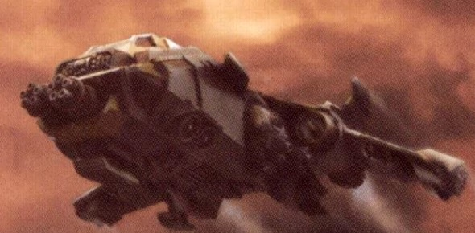
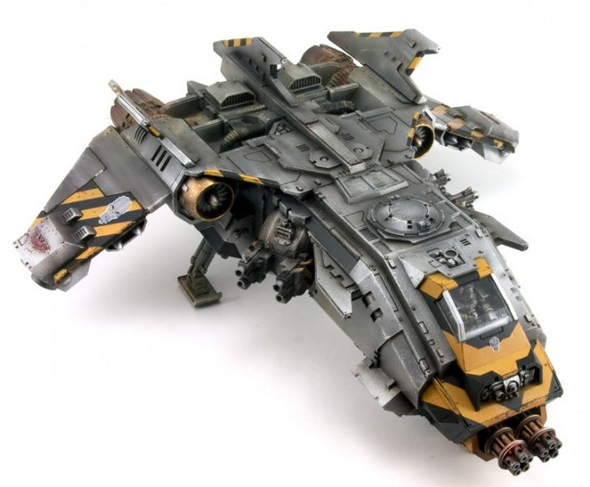

# 1555 火猛禽炮艇 Fire Raptor Gunship

精校状态：中文行文已逐段精校，部分术语仍为暂定

分类：载具 / 飞行 / 炮艇

原文来源：https://www.bilibili.com/opus/1041426198052208641

原作者：帝国神选罐头

原文时间：2025年03月07日 10:25

[返回分类目录](目录.md) · [全书目录](../../目录.md)

原篇名：火隼炮艇 Fire Raptor Gunship

<!-- A1555-B0001 -->
**英文原文**

The Fire Raptor is a Space Marine attack gunship based upon the Storm Eagle design.

<!-- /A1555-B0001 -->

<!-- A1555-B0002 -->

原译文

火隼是一种基于风暴鹰设计的星际战士攻击炮艇。

**校订译文**

火猛禽是以风暴鹰为基础设计的星际战士攻击炮艇。

<!-- /A1555-B0002 -->

<!-- A1555-B0003 图片 -->

<!-- A1555-B0004 -->

原译文

Fire Raptor Gunship 火隼炮艇

**校订译文**

Fire Raptor Gunship 火猛禽炮艇

<!-- /A1555-B0004 -->

<!-- A1555-B0005 -->
## Overview 概述

<!-- /A1555-B0005 -->

<!-- A1555-B0006 -->
**英文原文**

Known to have its origins long in the Imperium's past, the Fire Raptor is configured to to maximize ammunition storage in order to feed its numerous weapons systems. This is accomplished by sacrificing the Storm Eagle's transport capacity. As a result, the Fire Raptor carries a range of formidable weapons, most notably twin-linked Avenger Bolt Cannons. Additional armament includes a pair of waist-mounted ball turrets, fitted with either reaper batteries,quad-heavy bolters,or lascannons,capable of engaging targets independently of one another and wing-mounted Hellstrike Missiles.

<!-- /A1555-B0006 -->

<!-- A1555-B0007 -->

原译文

众所周知，火隼的起源可以追溯到帝国的过去，它被配置为最大限度地储存弹药，以满足其众多武器系统的需求。这是通过牺牲风暴鹰的运输能力来实现的。因此，火隼携带了一系列强大的武器，最著名的是双联复仇者爆矢加农炮。额外的武器包括一对安装在中部的球型炮塔，配备有收割者排炮·、四联重型爆矢枪或激光炮，能够相互独立地打击目标，以及安装在机翼上的地狱打击导弹。

**校订译文**

火猛禽源自帝国悠久的历史。它牺牲了风暴鹰的载员空间，尽可能增加弹药储量，供多套武器持续射击。其主要武装为双联复仇者爆矢加农炮；机体两侧各有一座球形炮塔，可装收割者炮组、四联重型爆矢枪或激光炮，独立攻击不同目标，翼下另挂地狱打击导弹。

<!-- /A1555-B0007 -->

<!-- A1555-B0008 图片 -->

<!-- A1555-B0009 -->

原译文

Fire Raptor Gunship 火隼炮艇

**校订译文**

Fire Raptor Gunship 火猛禽炮艇

<!-- /A1555-B0009 -->

<!-- A1555-B0010 -->
**英文原文**

Like the Storm Eagle on which it is based, the Fire Raptor was once utilized by the Legiones Astartes during the era of the Great Crusade and Horus Heresy, but it has largely vanished from Imperial arsenals for the last several thousand years. However, it is now being fielded in increasing numbers as of the 41st Millennium, suggesting that some yet unidentified Adeptus Mechanicus Forge World or Space Marine Chapter Forge has come into possession of a complete Fire Raptor STC. A small number of old Fire Raptors, some dating back to the Great Crusade itself, exist in the armories of a small number of Chapters where they are treated as precious relics.

<!-- /A1555-B0010 -->

<!-- A1555-B0011 -->

原译文

就像它所基于的风暴鹰一样，火隼在大远征和荷鲁斯叛乱时期曾被阿斯塔特军团使用过，但在过去的几千年里，它在很大程度上已经从帝国军械库中消失了。然而，自第41个千年以来，它的部署数量越来越多，这表明一些尚未确定的机械神教铸造世界或星际战士战团铸造厂已经拥有了一个完整的火隼STC。少数古老的火隼，有些可以追溯到大远征本身，存在于少数战团的军械库中，在那里它们被视为珍贵的圣物。

**校订译文**

与风暴鹰一样，火猛禽曾在大远征和荷鲁斯之乱期间供阿斯塔特军团使用，但此后数千年里几乎从帝国军械库中消失。进入M41后，部署数量又开始增加，令人推测某个尚不知名的机械修会铸造世界或战团铸造厂，已掌握完整的火猛禽标准模板构造。少数战团仍保存着古老机体，有些甚至可追溯到大远征，被视作珍贵遗物。

<!-- /A1555-B0011 -->

<!-- A1555-B0012 -->
**英文原文**

There are a lot of Chapters in M41 that have in their possession a number of old Fire Raptors preserved from the time of the Great Crusade. The Charnel Guard, for example, is in possession of a big fleet of Fire Raptors. Other chapters, like the Minotaurs and Star Phantoms, have reportedly massed 3-4 of the gunships into formations of one Fire Raptor and three Storm Eagles thus devastating a route through even the heaviest resistance of enemy troops for following Space Marine forces to attack.

<!-- /A1555-B0012 -->

<!-- A1555-B0013 -->

原译文

M41有很多战团拥有许多从大远征时期保存下来的旧火隼。例如，遗骸守卫拥有一支庞大的火隼舰队。其他战团，如米诺陶和星辰幻影，已经将3-4架炮艇集结成一架火隼和三架风暴鹰的编队，从而摧毁了一条穿过敌军最激烈抵抗的路线，以跟随星际战士进攻。

**校订译文**

在M41，一些战团拥有保存自大远征时期的火猛禽，墓葬守卫甚至保有庞大机队。据报道，米诺陶、星辰幻影等战团会将少量炮艇组成一架火猛禽配三架风暴鹰的编队，以猛烈火力突破敌方最顽强的抵抗，为后续星际战士开路。

**校注：** 英文同时写3—4架与一架火猛禽加三架风暴鹰，具体数量表述不一致；按明确的编组构成翻译，保留原文对照。

<!-- /A1555-B0013 -->

<!-- A1555-B0014 -->
**英文原文**

Chaos Space Marine warbands are also known to still employ Fire Raptors. These vehicles date back to the Great Crusade and are often Daemonically corrupted.

<!-- /A1555-B0014 -->

<!-- A1555-B0015 -->

原译文

混沌星际战士也已知仍在使用火隼。这些载具可以追溯到大远征，并且经常被恶魔腐蚀。

**校订译文**

混沌星际战士战帮也在使用火猛禽。这些大远征时代的载具往往已经遭到恶魔腐化。

<!-- /A1555-B0015 -->

本篇核心术语与暂定项

以下列出本篇出现的英文原形及核心术语表用词。同形词可能指不同对象，具体词义以本篇正文和校注为准；单复数、别名和仅见于图注的名称可能尚未列入。完整候选见[术语表](../../术语表/双语术语候选.csv)。

| 英文 | 采用中文 | 状态 |
| --- | --- | --- |
| Adeptus Mechanicus | 机械修会 | 官方已核对 |
| Horus Heresy | 荷鲁斯之乱 | 官方已核对 |
| Imperium | 帝国 | 暂定·简称 |
| Forge World | 铸造世界 | 暂定·官方待核 |
| Great Crusade | 大远征 | 暂定·官方待核 |
| Horus | 荷鲁斯 | 暂定·官方待核 |
| STC | 标准建造模板 | 暂定·官方待核 |
| Legiones Astartes | 阿斯塔特军团 | 暂定·官方待核 |
| Minotaurs | 米诺陶 | 暂定·官方待核 |
| Space Marine | 星际战士 | 暂定·官方待核 |
| Chapter | 战团 | 暂定·官方待核 |
| Raptors | 猛禽 | 暂定·官方待核 |
| Charnel Guard | 墓葬守卫 | 暂定·官方待核 |
| Star Phantoms | 星辰幻影 | 暂定·官方待核 |
| Reaper | 收割者号 | 暂定·官方待核 |
| Avenger | 复仇者号 | 暂定·官方待核 |
| Bolt | 爆矢 | 暂定·官方待核 |

