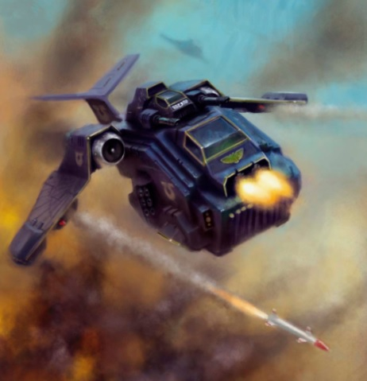
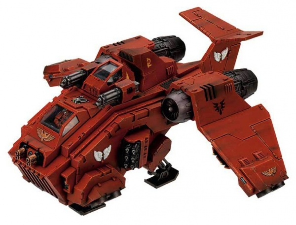

# 1557 风暴鸦炮艇 Stormraven Gunship

精校状态：中文行文已逐段精校，部分术语仍为暂定

分类：载具 / 飞行 / 炮艇

原文来源：https://www.bilibili.com/opus/1041426447146680339

原作者：帝国神选罐头

原文时间：2025年03月07日 10:26

[返回分类目录](目录.md) · [全书目录](../../目录.md)

<!-- A1557-B0001 -->
**英文原文**

The Stormraven Gunship is a relatively new addition to the armouries of many Space Marine Chapters, such as the Blood Angels and Ultramarines, seamlessly combining the roles of dedicated gunship, dropship, and strike aircraft.

<!-- /A1557-B0001 -->

<!-- A1557-B0002 -->

原译文

风暴鸦炮艇是许多星际战士战团军械库中相对较新的成员，如圣血天使和极限战士，无缝结合了专用炮艇、空降船和攻击机的作用。

**校订译文**

风暴鸦炮艇是圣血天使、极限战士等许多战团相对较新的装备，兼具专用炮艇、空降艇和攻击机的功能。

<!-- /A1557-B0002 -->

<!-- A1557-B0003 图片 -->

<!-- A1557-B0004 -->

原译文

Stormraven 风暴鸦

**校订译文**

Stormraven 风暴鸦

<!-- /A1557-B0004 -->

<!-- A1557-B0005 -->
## Overview 概述

<!-- /A1557-B0005 -->

<!-- A1557-B0006 -->
**英文原文**

It is unclear just how the craft came into being; there are rumors of its STC file being discovered early in the 41st Millennium in a forgotten Martian archive, but the Stormraven has been in service with the Grey Knights for millennia before that. As the situation for the Imperium has become increasingly desperate and since the Adeptus Mechanicus has judged its performance satisfactory, many Space Marine Chapters and the Inquisition now employ the Stormraven.

<!-- /A1557-B0006 -->

<!-- A1557-B0007 -->

原译文

目前尚不清楚这艘飞船是如何形成的；有传言称，它的STC文件在41千年初被遗忘的火星档案中发现，但在此之前，风暴鸦已经在灰骑士服役了数千年。随着帝国的形势变得越来越绝望，而且机械神教已经判断其表现令人满意，许多星际战士战团和审判庭现在都使用了风暴鸦。

**校订译文**

其确切起源仍不清楚。有传言称，它的标准模板构造档案于M41初期在一处被遗忘的火星档案库中发现；但灰骑士早在那之前数千年就已使用风暴鸦。随着帝国处境愈发危急，加上机械修会认可其性能，如今许多战团和审判庭都开始使用它。

<!-- /A1557-B0007 -->

<!-- A1557-B0008 -->
**英文原文**

Smaller than the Thunderhawk Gunship, the Stormraven is, not surprisingly, much more agile than its more well-known sibling, thanks to its wide array of vectored thrusters. It is this maneuverability that makes it an ideal support craft in environs (such as the crowded spires of a Hive City) where the deployment of Thunderhawks would be impractical or simply foolish.

<!-- /A1557-B0008 -->

<!-- A1557-B0009 -->

原译文

毫不奇怪，由于其五花八门的矢量推进器，风暴鸦比雷鹰炮艇小，比其知名的兄弟更敏捷。正是这种机动性使其成为环境中（如巢都城拥挤的尖顶）的理想支援飞行器，在这些环境中部署雷鹰是不切实际或愚蠢的。

**校订译文**

风暴鸦小于雷鹰，并凭借多组矢量推进器拥有更强的机动性。在巢都密集尖塔之间等雷鹰难以活动的环境中，它是理想的支援飞机。

<!-- /A1557-B0009 -->

<!-- A1557-B0010 图片 -->

<!-- A1557-B0011 -->

原译文

Stormraven Gunship 风暴鸦炮艇

**校订译文**

Stormraven Gunship 风暴鸦炮艇

<!-- /A1557-B0011 -->

<!-- A1557-B0012 -->
## Weapons 武器

<!-- /A1557-B0012 -->

<!-- A1557-B0013 -->
**英文原文**

The Stormraven's default load-out is a Twin-linked Heavy Bolter, a twin-linked Assault Cannon, and four Bloodstrike Missiles or Stormstrike Missiles, but this can be reconfigured depending on the required mission parameters (or simply the commander's personality). It may replace the heavy bolter with either a Typhoon Missile Launcher or a twin-linked Multi-Melta, and the assault cannon for either a twin-linked plasma cannon or lascannons. Finally there is the choice of adding a pair of Hurricane Bolters on its side sponsons.

<!-- /A1557-B0013 -->

<!-- A1557-B0014 -->

原译文

风暴鸦的默认装载是双联重型爆矢枪、双联突击炮和四枚鲜血打击导弹或风暴打击导弹，但这可以根据所需的任务参数（或只是指挥官的个性）进行重新配置。它可能会用台风导弹发射器或双联多管热熔代替重型爆矢枪，用双联等离子炮或激光炮代替突击炮。最后，可以选择在其侧舷上添加一对飓风爆矢枪。

**校订译文**

标准武装为双联重型爆矢枪、双联突击炮，以及四枚鲜血打击或风暴打击导弹；可按任务需求，甚至指挥官喜好调整。重型爆矢枪可换成台风导弹发射器或双联多管热熔；突击炮可换成双联等离子炮或激光炮。两侧炮座还可加装一对飓风爆矢枪。

<!-- /A1557-B0014 -->

<!-- A1557-B0015 -->
## Transport Capacity 运输能力

<!-- /A1557-B0015 -->

<!-- A1557-B0016 -->
**英文原文**

The Stormraven can carry a squad of up to 12 Power Armoured Space Marines or a half-dozen jump pack-equipped Assault Marines, as well as a Dreadnought in the vehicle's rear magna-grapple.

<!-- /A1557-B0016 -->

<!-- A1557-B0017 -->

原译文

风暴鸦可以携带多达12名动力盔甲星际战士或六名配备跳跃背包的突击星际战士，以及一位无畏在载具后部的大型抓钩中。

**校订译文**

机舱可运送最多12名穿动力盔甲的星际战士，或6名配备跳跃背包的突击星际战士；后部磁力夹具还可吊载一台无畏机甲。

<!-- /A1557-B0017 -->

<!-- A1557-B0018 -->
## Notable Stormravens 著名风暴鸦

<!-- /A1557-B0018 -->

<!-- A1557-B0019 -->
**英文原文**

Angelsword - Death Company Stormraven Gunship, took part in the Diamor Campaign on the planet Amethal

<!-- /A1557-B0019 -->

<!-- A1557-B0020 -->

原译文

天使之剑 - 死亡连风暴鸦炮艇，参加了阿梅萨尔星球上的迪亚莫尔之战

**校订译文**

天使之剑 - 死亡连风暴鸦炮艇，参加了阿梅萨尔星球上的迪亚莫尔之战

<!-- /A1557-B0020 -->

<!-- A1557-B0021 -->
**英文原文**

Clarion Dawn - Death Company Stormraven Gunship, took part in the Diamor Campaign on the planet Amethal

<!-- /A1557-B0021 -->

<!-- A1557-B0022 -->

原译文

号角黎明 - 死亡连风暴鸦炮艇，参加了阿梅萨尔星球上的迪亚莫尔之战

**校订译文**

号角黎明 - 死亡连风暴鸦炮艇，参加了阿梅萨尔星球上的迪亚莫尔之战

<!-- /A1557-B0022 -->

<!-- A1557-B0023 -->
**英文原文**

Fury of Macragge - Ultramarines

<!-- /A1557-B0023 -->

<!-- A1557-B0024 -->

原译文

马库拉格之怒 - 极限战士

**校订译文**

马库拉格之怒 - 极限战士

<!-- /A1557-B0024 -->

<!-- A1557-B0025 -->
**英文原文**

Purgation's Sword - Grey Knights

<!-- /A1557-B0025 -->

<!-- A1557-B0026 -->

原译文

净化之剑 - 灰骑士

**校订译文**

净化之剑号 - 灰骑士

<!-- /A1557-B0026 -->

<!-- A1557-B0027 -->
**英文原文**

Sword of the Emperor - Inquisition (Inquisitor Ebron Valdermar)

<!-- /A1557-B0027 -->

<!-- A1557-B0028 -->

原译文

帝皇之剑 - 审判庭（审判官埃布伦·瓦尔德马尔）

**校订译文**

帝皇之剑 - 审判庭（审判官埃布伦·瓦尔德马尔）

<!-- /A1557-B0028 -->

本篇核心术语与暂定项

以下列出本篇出现的英文原形及核心术语表用词。同形词可能指不同对象，具体词义以本篇正文和校注为准；单复数、别名和仅见于图注的名称可能尚未列入。完整候选见[术语表](../../术语表/双语术语候选.csv)。

| 英文 | 采用中文 | 状态 |
| --- | --- | --- |
| Space Marines | 星际战士 | 官方已核对 |
| Blood Angels | 圣血天使 | 官方已核对 |
| Grey Knights | 灰骑士 | 官方已核对 |
| Adeptus Mechanicus | 机械修会 | 官方已核对 |
| Ultramarines | 极限战士 | 官方已核对 |
| Inquisition | 审判庭 | 暂定 |
| Inquisitor | 审判官 | 官方已核对 |
| Imperium | 帝国 | 暂定·简称 |
| Emperor | 帝皇 | 官方已核对 |
| STC | 标准建造模板 | 暂定·官方待核 |
| Macragge | 马库拉格 | 暂定·官方待核 |
| Mission | 教团／传教机构 | 暂定 |
| Space Marine | 星际战士 | 暂定·官方待核 |
| Thunderhawk Gunship | 雷鹰炮艇 | 暂定·官方待核 |
| Stormraven Gunship | 风暴鸦炮艇 | 官方已核 |
| Diamor | 迪亚莫尔 | 暂定·官方待核 |
| Dreadnought | 无畏机甲 | 暂定·官方待核 |
| Purgation's Sword | 净化之剑号 | 暂定·官方待核 |
| The Blood | 鲜血 | 暂定·官方待核 |
| Hive City | 巢都城市 | 暂定·官方待核 |
| Missile Launcher | 导弹发射器 | 暂定·官方待核 |
| Assault Cannon | 突击炮 | 暂定·官方待核 |
| Bolter | 爆矢枪 | 暂定·官方待核 |
| Heavy bolter | 重型爆矢枪 | 官方已核对 |
| Multi-melta | 多管热熔 | 官方已核对 |
| Plasma cannon | 等离子炮 | 官方已核对 |
| Jump Pack | 跳跃背包 | 暂定·官方待核 |
| Angelsword | 天使之剑 | 暂定·官方待核 |
| Clarion Dawn | 号角黎明 | 暂定·官方待核 |
| Fury of Macragge | 马库拉格之怒 | 暂定·官方待核 |
| Ebron Valdermar | 埃布伦·瓦尔德马尔 | 暂定·官方待核 |

