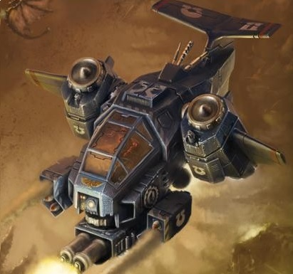
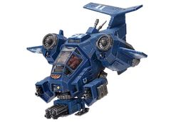
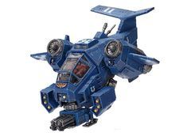

# 1558 风暴爪炮艇 Stormtalon Gunship

精校状态：中文行文已逐段精校，部分术语仍为暂定

分类：载具 / 飞行 / 炮艇

原文来源：https://www.bilibili.com/opus/1042556538924826626

原作者：帝国神选罐头

原文时间：2025年03月10日 11:31

[返回分类目录](目录.md) · [全书目录](../../目录.md)

<!-- A1558-B0001 -->
**英文原文**

The Stormtalon Gunship is a small one-man flyer employed by Space Marine forces.

<!-- /A1558-B0001 -->

<!-- A1558-B0002 -->

原译文

风暴爪炮艇是星际战士使用的小型单人飞行器。

**校订译文**

风暴爪炮艇是星际战士使用的小型单人飞行器。

<!-- /A1558-B0002 -->

<!-- A1558-B0003 图片 -->

<!-- A1558-B0004 -->

原译文

Stormtalon Gunship 风暴爪炮艇

**校订译文**

Stormtalon Gunship 风暴爪炮艇

<!-- /A1558-B0004 -->

<!-- A1558-B0005 -->
## Overview 概述

<!-- /A1558-B0005 -->

<!-- A1558-B0006 -->
**英文原文**

The Stormtalon is flown by a Techmarine pilot. It is used by the Space Marines as both an air-to-air interceptor and ground attack aircraft. Swift enough to engage most enemy aircraft, it also packs a heavy armament of Assault Cannons, Missile Launchers, Heavy Bolters, and other weapons. The Stormtalon is a versatile vehicle, capable of serving as an escort fighter to protect Space Marine assets on the battlefield or as a close air support attack craft. By rotating its engine ponds, the Stormtalon can continue to fly while facing backwards and even engage pursuing enemies.

<!-- /A1558-B0006 -->

<!-- A1558-B0007 -->

原译文

风暴爪由技术军士飞行员驾驶。它被星际战士用作空对空拦截机和地面攻击机。它足够迅速，可以与大多数敌机交战，还配备了突击炮、导弹发射器、重型爆矢枪和其他重型武器。风暴爪是一种多功能飞行器，能够作为护航战斗机在战场上保护星际战士资产，或作为近距离空中支援攻击艇。通过旋转其引擎喷口，风暴爪即便在倒飞的情况下也能继续飞行，甚至还能对追击的敌人发动攻击。

**校订译文**

风暴爪由科技战士驾驶，兼任空中截击机和对地攻击机。其速度足以与多数敌机交战，武装包括突击炮、导弹发射器和重型爆矢枪等。它既能护航、保护己方战场力量，也能提供近距空中支援。通过旋转发动机舱，它可以在继续向前飞行的同时把机首转向后方，攻击追兵。

**校注：** engine ponds疑为engine pods之误，按可旋转发动机舱理解；中文保留机首向后而继续沿原方向飞行的含义。

<!-- /A1558-B0007 -->

<!-- A1558-B0008 图片 -->

<!-- A1558-B0009 -->

原译文

Stormtalon with twin heavy bolters 配备双联重型爆矢枪的风暴爪

**校订译文**

Stormtalon with twin heavy bolters 配备双联重型爆矢枪的风暴爪

<!-- /A1558-B0009 -->

<!-- A1558-B0010 -->
**英文原文**

To a few chapters, such as the White Scars, Raven Guard, and Hawk Lords, the Stormtalon has potential beyond close air support and interdiction. For these Chapters, the Stormtalon excels as a vanguard strike aircraft, able to keep pace with Assault Marines and Land Speeders. In these operations the Stormtalon's role is reversed, being used as the principal attack vehicle as opposed to simply a support craft. The remainder of the Chapter's rapid-moving elements act as escorts, clearing the way of anti-aircraft fire.

<!-- /A1558-B0010 -->

<!-- A1558-B0011 -->

原译文

在白色伤疤、暗鸦守卫和天鹰领主等几个战团中，风暴爪的潜力超越了近距离空中支援和拦截。在这些战团中，风暴龙作为先锋攻击机表现出色，能够跟上突击星际战士和兰德速攻艇的步伐。在这些行动中，风暴爪的角色发生了逆转，被用作主要的攻击工具，而不仅仅是一艘支援船。该战团其余的快速移动部队充当护卫，清除防空火力。

**校订译文**

对白疤、暗鸦守卫和雄鹰领主等战团而言，风暴爪的用途还不止支援和遮断。它能够跟上突击星际战士与兰德速攻艇，作为先锋攻击机担当主攻。此时，战团其他快速部队反而充当其护卫，负责清除敌方防空火力。

<!-- /A1558-B0011 -->

<!-- A1558-B0012 图片 -->

<!-- A1558-B0013 -->

原译文

Stormtalon with Skyhammer missile launcher 配备天锤导弹发射器的风暴爪

**校订译文**

Stormtalon with Skyhammer missile launcher 配备天锤导弹发射器的风暴爪

<!-- /A1558-B0013 -->

<!-- A1558-B0014 -->
## Armaments 军备

<!-- /A1558-B0014 -->

<!-- A1558-B0015 -->
**英文原文**

The Stormtalon can be equipped with an array of weapons including:

<!-- /A1558-B0015 -->

<!-- A1558-B0016 -->

原译文

风暴爪可以配备一系列武器，包括：

**校订译文**

风暴爪可以配备一系列武器，包括：

<!-- /A1558-B0016 -->

<!-- A1558-B0017 -->
**英文原文**

A set of nose-mounted twin-linked assault cannons

<!-- /A1558-B0017 -->

<!-- A1558-B0018 -->

原译文

一套安装在机头上的双联突击炮

**校订译文**

一套安装在机头上的双联突击炮

<!-- /A1558-B0018 -->

<!-- A1558-B0019 -->
**英文原文**

One of the following hull-mounted weapon systems - a twin-linked heavy bolter, a twin-linked lascannon, a typhoon missile launcher or a Skyhammer missile launcher.

<!-- /A1558-B0019 -->

<!-- A1558-B0020 -->

原译文

以下舰载武器系统之一 - 双联重型爆矢枪、双联激光炮、台风导弹发射器或天锤导弹发射器。

**校订译文**

机体上可选装以下一种武器：双联重型爆矢枪、双联激光炮、台风导弹发射器或天锤导弹发射器。

<!-- /A1558-B0020 -->

<!-- A1558-B0021 -->
**英文原文**

The Stormtalon is equipped with a long-range auspex, able to interconnect with other similar system to provide an overview of the battlespace. Its cockpit canopy is made from armourglass.

<!-- /A1558-B0021 -->

<!-- A1558-B0022 -->

原译文

风暴爪配备了远程鸟卜仪，能够与其他类似系统互连，以提供作战空间的概览。它的驾驶舱顶盖是由装甲玻璃制成的。

**校订译文**

风暴爪配备了远程鸟卜仪，能够与其他类似系统互连，以提供作战空间的概览。它的驾驶舱顶盖是由装甲玻璃制成的。

<!-- /A1558-B0022 -->

<!-- A1558-B0023 -->
## Known Named Stormtalons 著名风暴爪

<!-- /A1558-B0023 -->

<!-- A1558-B0024 -->
**英文原文**

Guilliman's Arrow - Ultramarines

<!-- /A1558-B0024 -->

<!-- A1558-B0025 -->

原译文

基里曼之箭 - 极限战士

**校订译文**

基里曼之箭 - 极限战士

<!-- /A1558-B0025 -->

本篇核心术语与暂定项

以下列出本篇出现的英文原形及核心术语表用词。同形词可能指不同对象，具体词义以本篇正文和校注为准；单复数、别名和仅见于图注的名称可能尚未列入。完整候选见[术语表](../../术语表/双语术语候选.csv)。

| 英文 | 采用中文 | 状态 |
| --- | --- | --- |
| Space Marines | 星际战士 | 官方已核对 |
| Ultramarines | 极限战士 | 官方已核对 |
| Overview | 概述 | 编辑用语已统一 |
| Techmarine | 科技战士 | 官方已核对 |
| White Scars | 白疤 | 官方已核 |
| Raven Guard | 暗鸦守卫 | 官方已核 |
| Scars | 伤疤 | 暂定·官方待核 |
| Space Marine | 星际战士 | 暂定·官方待核 |
| Chapter | 战团 | 暂定·官方待核 |
| Vanguard | 先锋 | 暂定·官方待核 |
| Land Speeders | 兰德速攻艇 | 暂定·官方待核 |
| Hawk Lords | 雄鹰领主 | 暂定·官方待核 |
| Stormtalon Gunship | 风暴爪炮艇 | 官方已核 |
| Missile Launchers | 导弹发射器 | 暂定·官方待核 |
| Principal | 首席（史洛斯职衔） | 暂定·官方待核 |
| System | 星系（恒星系统） | 暂定·官方待核 |
| Missile Launcher | 导弹发射器 | 暂定·官方待核 |
| Skyhammer Missile Launcher | 天锤导弹发射器 | 暂定·官方待核 |
| Bolter | 爆矢枪 | 暂定·官方待核 |
| Heavy bolter | 重型爆矢枪 | 官方已核对 |
| Lascannon | 激光炮 | 官方已核对 |
| Auspex | 鸟卜仪 | 暂定·官方待核 |
| Guilliman's Arrow | 基里曼之箭 | 暂定·官方待核 |

