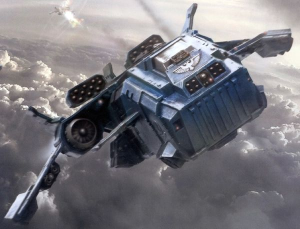
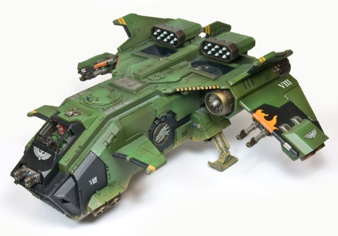
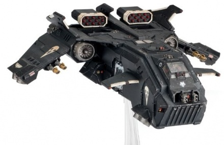

# 1560 风暴鹰突击炮艇 Storm Eagle Assault Gunship

精校状态：中文行文已逐段精校，部分术语仍为暂定

分类：载具 / 飞行 / 炮艇

原文来源：https://www.bilibili.com/opus/1041426378449223684

原作者：帝国神选罐头

原文时间：2025年03月07日 10:26

[返回分类目录](目录.md) · [全书目录](../../目录.md)

<!-- A1560-B0001 -->
**英文原文**

The Storm Eagle Assault Gunship is an aircraft used by Space Marines.

<!-- /A1560-B0001 -->

<!-- A1560-B0002 -->

原译文

风暴鹰突击炮艇是星际战士使用的一种飞机。

**校订译文**

风暴鹰突击炮艇是星际战士使用的一种飞机。

<!-- /A1560-B0002 -->

<!-- A1560-B0003 图片 -->

<!-- A1560-B0004 -->

原译文

Storm Eagle Assault Gunship 风暴鹰突击炮艇

**校订译文**

Storm Eagle Assault Gunship 风暴鹰突击炮艇

<!-- /A1560-B0004 -->

<!-- A1560-B0005 -->
## Overview 概述

<!-- /A1560-B0005 -->

<!-- A1560-B0006 -->
**英文原文**

The Storm Eagle dates back to the Great Crusade, designed to be a smaller attack craft to compliment the larger Stormbirds and Thunderhawks. The first Storm Birds were constructed on Terra, but primary production later transferred to Anvilus, Galatea, and Tigrus.

<!-- /A1560-B0006 -->

<!-- A1560-B0007 -->

原译文

风暴鹰的历史可以追溯到大远征，它被设计成一种较小的攻击艇，以补充较大的风暴鸟和雷鹰。第一批风暴鸟是在泰拉上建造的，但后来主要生产转移到了安维鲁斯、海卫六和泰格鲁斯。

**校订译文**

风暴鹰可追溯到大远征时期，原本是用来配合较大的风暴鸟与雷鹰的小型攻击艇。底稿接着写道，首批“风暴鸟”在泰拉制造，后来主要生产转移到安维鲁斯、伽拉忒亚和泰格鲁斯。

**校注：** 英文在Storm Eagle条目中忽然写The first Storm Birds，疑似误植；保留名称并明确标示，未擅改为Storm Eagles。Galatea此处是制造世界，暂音译伽拉忒亚，不直接套太阳系海卫六。

<!-- /A1560-B0007 -->

<!-- A1560-B0008 -->
**英文原文**

The legendary mobility of the Adeptus Astartes has won planet-spanning conflicts with a single strike; providing the precise application of deadly force at the point where it proved most decisive. A Chapter's fleet of attack craft is the keystone that makes this possible, and it is the iconic Thunderhawks and Drop Pods that are at the forefront. Craft such as the Storm Eagle Assault Gunship follow close behind to lend their weapons to the devastating assault. A formidable gunship, the Storm Eagle mounts fearsome firepower for a vehicle of its size and is capable of transporting twenty Space Marines directly into the thick of an assault. The exact provenance of the Storm Eagle is unknown, but it bears clear similarities to the Stormravens employed by the Blood Angels and Grey Knights. Certain sources place the principal manufacture of the Storm Eagle upon Tigrus and Anvilus IX, both primary-grade Forge Worlds that suffered catastrophic damage during the Horus Heresy.

<!-- /A1560-B0008 -->

<!-- A1560-B0009 -->

原译文

阿斯塔特修会的传奇机动性以一次打击赢得了跨越星球的冲突；在事实证明最具决定性的时刻，提供致命武力的精确应用。一个战团的攻击机队是实现这一目标的基石，而标志性的雷鹰和空投舱则处于最前沿。风暴鹰突击炮艇等战机紧随其后，为毁灭性的袭击提供武器支援。作为一架强大的炮艇，风暴鹰为其大小的车辆准备了可怕的火力，能够将20名星际战士直接运送到攻击的最深处。风暴鹰的确切来源尚不清楚，但它与圣血天使和灰骑士使用的风暴鸦有着明显的相似之处。某些消息来源称，风暴鹰的主要制造地是泰格鲁斯和安维鲁斯九号，这两个初级铸造世界在荷鲁斯叛乱期间遭受了灾难性的破坏。

**校订译文**

阿斯塔特以传奇般的机动性，在最具决定性的地点集中致命力量，一击赢得遍及行星的战争。战团攻击机队使这种战术成为可能：雷鹰和空降舱冲在最前，风暴鹰等飞行器紧随其后，以火力支援突击。风暴鹰相对于自身大小拥有可怕的火力，还能将20名星际战士直接送入激战。其确切起源不明，但设计明显类似圣血天使与灰骑士使用的风暴鸦。有些资料称，主要制造地为泰格鲁斯和安维鲁斯九号；两者都是顶级铸造世界，在荷鲁斯之乱中遭到灾难性破坏。

<!-- /A1560-B0009 -->

<!-- A1560-B0010 -->
**英文原文**

In recent decades the number of Storm Eagles in active service has begun to increase, especially amongst those Chapters known to have favourable relations with the Adeptus Mechanicus. But despite its increase in production, the Storm Eagle has yet to be deployed as widely as the Storm Raven. Chaos Space Marine warbands are also known to still employ the Storm Eagle, though these date back to the Great Crusade and have often since become Daemonically corrupted.

<!-- /A1560-B0010 -->

<!-- A1560-B0011 -->

原译文

近几十年来，现役风暴鹰的数量开始增加，尤其是那些与机械神教关系良好的战团。但尽管产量有所增加，风暴鹰尚未像风暴鸦那样广泛部署。混沌星际战士也被认为仍然使用风暴鹰，尽管这些可以追溯到大远征，并且此后经常被恶魔腐蚀。

**校订译文**

近几十年来，现役风暴鹰开始增多，尤其常见于与机械修会关系良好的战团。不过，它仍没有风暴鸦普及。混沌星际战士战帮也在使用源自大远征时代的风暴鹰，许多早已遭到恶魔腐化。

<!-- /A1560-B0011 -->

<!-- A1560-B0012 -->
## Armaments 军备

<!-- /A1560-B0012 -->

<!-- A1560-B0013 -->
**英文原文**

The Storm Eagle generally has the following weapon systems -

<!-- /A1560-B0013 -->

<!-- A1560-B0014 -->

原译文

风暴鹰通常具有以下武器系统-

**校订译文**

风暴鹰通常具有以下武器系统-

<!-- /A1560-B0014 -->

<!-- A1560-B0015 图片 -->

<!-- A1560-B0016 -->

原译文

Storm Eagle Gunship 风暴鹰炮艇

**校订译文**

Storm Eagle Gunship 风暴鹰炮艇

<!-- /A1560-B0016 -->

<!-- A1560-B0017 -->
**英文原文**

A hull-mounted set of either twin-linked heavy bolters, twin-linked multi-meltas or a typhoon missile launcher

<!-- /A1560-B0017 -->

<!-- A1560-B0018 -->

原译文

一套安装在机体上的双联重型爆矢枪、双联多管热熔或台风导弹发射器

**校订译文**

一套安装在机体上的双联重型爆矢枪、双联多管热熔或台风导弹发射器

<!-- /A1560-B0018 -->

<!-- A1560-B0019 -->
**英文原文**

A hull-mounted Vengeance launcher

<!-- /A1560-B0019 -->

<!-- A1560-B0020 -->

原译文

一个舰载复仇发射器

**校订译文**

一具机体安装的复仇发射器。

<!-- /A1560-B0020 -->

<!-- A1560-B0021 -->
**英文原文**

A pair of twin-linked lascannon or a set of four hellstrike missiles

<!-- /A1560-B0021 -->

<!-- A1560-B0022 -->

原译文

一对双联激光炮或一套四枚地狱打击导弹

**校订译文**

一对双联激光炮或一套四枚地狱打击导弹

<!-- /A1560-B0022 -->

<!-- A1560-B0023 -->
## Technical Information 技术资料

原题：Technical Information 技术信息

<!-- /A1560-B0023 -->

<!-- A1560-B0024 -->
**英文原文**

Type:Orbital Dropship

<!-- /A1560-B0024 -->

<!-- A1560-B0025 -->

原译文

类型：轨道空降舰船

**校订译文**

类型：轨道空降艇

<!-- /A1560-B0025 -->

<!-- A1560-B0026 -->
**英文原文**

Vehicle Name:Storm Eagle

<!-- /A1560-B0026 -->

<!-- A1560-B0027 -->

原译文

载具名称：风暴鹰

**校订译文**

载具名称：风暴鹰

<!-- /A1560-B0027 -->

<!-- A1560-B0028 -->
**英文原文**

Forge World of Origin:Unknown

<!-- /A1560-B0028 -->

<!-- A1560-B0029 -->

原译文

起源铸造世界：未知

**校订译文**

起源铸造世界：未知

<!-- /A1560-B0029 -->

<!-- A1560-B0030 -->
**英文原文**

Known Patterns:

<!-- /A1560-B0030 -->

<!-- A1560-B0031 -->

原译文

已知型号：

**校订译文**

已知型号：原文未提供

<!-- /A1560-B0031 -->

<!-- A1560-B0032 -->
**英文原文**

Crew:Pilot

<!-- /A1560-B0032 -->

<!-- A1560-B0033 -->

原译文

乘员：驾驶员

**校订译文**

乘员：驾驶员

<!-- /A1560-B0033 -->

<!-- A1560-B0034 -->
**英文原文**

Powerplant:2x combination rocket/afterburning turbofans

<!-- /A1560-B0034 -->

<!-- A1560-B0035 -->

原译文

动力装置：2台组合火箭/加力涡扇发动机

**校订译文**

动力装置：2台组合火箭/加力涡扇发动机

<!-- /A1560-B0035 -->

<!-- A1560-B0036 -->
**英文原文**

Weight:68 tonnes

<!-- /A1560-B0036 -->

<!-- A1560-B0037 -->

原译文

重量：68吨

**校订译文**

重量：68吨

<!-- /A1560-B0037 -->

<!-- A1560-B0038 -->
**英文原文**

Length:18 m

<!-- /A1560-B0038 -->

<!-- A1560-B0039 -->

原译文

长度：18米

**校订译文**

长度：18米

<!-- /A1560-B0039 -->

<!-- A1560-B0040 -->
**英文原文**

Wingspan:11.8m

<!-- /A1560-B0040 -->

<!-- A1560-B0041 -->

原译文

翼展：11.8米

**校订译文**

翼展：11.8米

<!-- /A1560-B0041 -->

<!-- A1560-B0042 -->
**英文原文**

Height:7.2m

<!-- /A1560-B0042 -->

<!-- A1560-B0043 -->

原译文

高度：7.2米

**校订译文**

高度：7.2米

<!-- /A1560-B0043 -->

<!-- A1560-B0044 -->
**英文原文**

Operational Ceiling:N/A

<!-- /A1560-B0044 -->

<!-- A1560-B0045 -->

原译文

操作升限：无

**校订译文**

实用升限：不适用

<!-- /A1560-B0045 -->

<!-- A1560-B0046 -->
**英文原文**

Max Speed:2000 kph approx.

<!-- /A1560-B0046 -->

<!-- A1560-B0047 -->

原译文

最大速度：约2000公里/小时

**校订译文**

最大速度：约2000公里/小时

<!-- /A1560-B0047 -->

<!-- A1560-B0048 -->
**英文原文**

Range:30,000 km in atmosphere

<!-- /A1560-B0048 -->

<!-- A1560-B0049 -->

原译文

射程：大气层内30000公里

**校订译文**

航程：大气层内30,000公里

<!-- /A1560-B0049 -->

<!-- A1560-B0050 -->
**英文原文**

Main Armament:Vengeance launcher

<!-- /A1560-B0050 -->

<!-- A1560-B0051 -->

原译文

主武器：复仇发射器

**校订译文**

主武器：复仇发射器

<!-- /A1560-B0051 -->

<!-- A1560-B0052 -->
**英文原文**

Secondary Armament:twin-linked Heavy Bolters

<!-- /A1560-B0052 -->

<!-- A1560-B0053 -->

原译文

二级武器：双联重型爆矢枪

**校订译文**

次要武器：双联重型爆矢枪

<!-- /A1560-B0053 -->

<!-- A1560-B0054 -->
**英文原文**

Main Ammunition:48 missiles

<!-- /A1560-B0054 -->

<!-- A1560-B0055 -->

原译文

主要弹药：48枚导弹

**校订译文**

主要弹药：48枚导弹

<!-- /A1560-B0055 -->

<!-- A1560-B0056 -->
**英文原文**

Secondary Ammunition:2000 rounds

<!-- /A1560-B0056 -->

<!-- A1560-B0057 -->

原译文

二级弹药：2000发

**校订译文**

次要武器载弹量：2,000发

<!-- /A1560-B0057 -->

<!-- A1560-B0058 -->
### Armour 装甲

<!-- /A1560-B0058 -->

<!-- A1560-B0059 -->
**英文原文**

Superstructure:45 mm

<!-- /A1560-B0059 -->

<!-- A1560-B0060 -->

原译文

上部结构：45毫米

**校订译文**

上部结构：45毫米

<!-- /A1560-B0060 -->

<!-- A1560-B0061 -->
**英文原文**

Hull:55 mm

<!-- /A1560-B0061 -->

<!-- A1560-B0062 -->

原译文

船体：55毫米

**校订译文**

船体：55毫米

<!-- /A1560-B0062 -->

<!-- A1560-B0063 -->
## Known Patterns 已知型号

<!-- /A1560-B0063 -->

<!-- A1560-B0064 -->
### Roc Pattern 神鹰型

<!-- /A1560-B0064 -->

<!-- A1560-B0065 -->
**英文原文**

The Roc Pattern Storm Eagle is used primarily by the Minotaurs and Red Templars, serving as a formidable tank hunter while sacrificing troop carrying capacity. It is armed primarily with a Vengeance launcher with Roc warheads.

<!-- /A1560-B0065 -->

<!-- A1560-B0066 -->

原译文

神鹰型风暴鹰主要由米诺陶和红色圣堂使用，在牺牲载兵能力的同时充当强大的坦克猎人。它主要装备了带有神鹰弹头的复仇发射器。

**校订译文**

神鹰型风暴鹰主要由米诺陶和红色圣堂使用，在牺牲载兵能力的同时充当强大的坦克猎人。它主要装备了带有神鹰弹头的复仇发射器。

<!-- /A1560-B0066 -->

<!-- A1560-B0067 -->
### Nighthawk-pattern 夜鹰型

<!-- /A1560-B0067 -->

<!-- A1560-B0068 -->
**英文原文**

Designed by Iron Father Sabik Wayland of the Iron Hands Legion. This pattern was in use by the time of the Horus Heresy despite not having been officially sanctioned by the Martian Mechanicum. It was noted for its superior maneuverability, high velocity and inbuilt stealth technologies.

<!-- /A1560-B0068 -->

<!-- A1560-B0069 -->

原译文

由钢铁之手军团的钢铁之父沙毕克·威兰德设计。尽管没有得到火星机械神教的正式批准，但这种型号在荷鲁斯叛乱时期就已使用。它以其卓越的机动性、高速和内置的隐形技术而闻名。

**校订译文**

由钢铁之手军团钢铁圣父萨比克·韦兰设计。荷鲁斯之乱时已投入使用，尽管尚未获得火星机械教正式认可。它以优越的机动性、高速和内置隐形技术见长。

<!-- /A1560-B0069 -->

<!-- A1560-B0070 -->
## Variants 变体

<!-- /A1560-B0070 -->

<!-- A1560-B0071 -->
### Fire Raptor 火猛禽

原题：Fire Raptor 火隼

<!-- /A1560-B0071 -->

<!-- A1560-B0072 -->
**英文原文**

The Fire Raptor is a dedicated gunship version of the Storm Eagle

<!-- /A1560-B0072 -->

<!-- A1560-B0073 -->

原译文

火隼是风暴鹰的专用炮艇版本

**校订译文**

火猛禽是风暴鹰的专用炮艇改型。

<!-- /A1560-B0073 -->

<!-- A1560-B0074 -->
### Darkwing 暗翼

<!-- /A1560-B0074 -->

<!-- A1560-B0075 -->
**英文原文**

The Darkwing was a specialized variant of the Storm Eagle used by the Raven Guard during the Horus Heresy and Great Crusade. These craft were constructed on Kiavahr and the technology that made them was not shared with the greater Adeptus Mechanicus. This aircraft was extremely stealthy and possessed systems barely understood to the Imperium such as rad-shrouded armour and quantum field repellors. The space these systems took up however reduced infantry-carrying capacity. Thus, these craft were often used to insert small elite units deep into enemy held territory.

<!-- /A1560-B0075 -->

<!-- A1560-B0076 -->

原译文

暗翼是暗鸦守卫在荷鲁斯叛乱和大十字军东征期间使用的风暴鹰的一种特殊变体。这些飞船是在基亚瓦尔建造的，制造它们的技术并没有与伟大的机械神教共享。这架飞机非常隐秘，拥有帝国几乎不了解的系统，如辐射覆盖的装甲和量子域排斥器。然而，这些系统占用的空间降低了步兵的运载能力。因此，这些飞行器经常被用来将小型精英部队深入敌方控制的领土。

**校订译文**

暗翼是大远征和荷鲁斯之乱时期暗鸦守卫使用的特殊改型，在基亚瓦尔制造，其技术未向机械修会其他机构公开。它极擅隐蔽，配有辐射遮蔽装甲、量子力场排斥装置等帝国几乎无法理解的系统。这些设备占用了载员空间，因此通常用来把小股精锐送入敌人腹地。

<!-- /A1560-B0076 -->

<!-- A1560-B0077 图片 -->

<!-- A1560-B0078 -->

原译文

Darkwing 暗翼

**校订译文**

Darkwing 暗翼

<!-- /A1560-B0078 -->

<!-- A1560-B0079 -->
### Alphawing 阿尔法翼

<!-- /A1560-B0079 -->

<!-- A1560-B0080 -->
**英文原文**

The Alphawing is a specialized variant of the Storm Eagle used by the Alpha Legion. It is a variant of the Raven Guard's Darkwing-pattern, which was among the schematics the Alpha Legion claimed after infiltrating the Legion, during the Horus Heresy.

<!-- /A1560-B0080 -->

<!-- A1560-B0081 -->

原译文

阿尔法翼是阿尔法军团使用的风暴鹰的一种特殊变体。这是暗鸦守卫暗翼型号的变体，在荷鲁斯叛乱期间，阿尔法军团在渗透军团后声称拥有该型号。

**校订译文**

阿尔法翼是阿尔法军团使用的特殊风暴鹰，由暗鸦守卫的暗翼型改进而成。荷鲁斯之乱期间，阿尔法军团渗透暗鸦守卫时取得了包括暗翼在内的设计图。

**校注：** claimed after infiltrating指渗透后取得设计图，不是声称拥有。

<!-- /A1560-B0081 -->

<!-- A1560-B0082 -->
### Spiderwidow 寡妇蛛

<!-- /A1560-B0082 -->

<!-- A1560-B0083 -->
**英文原文**

The Spiderwidow is an Inquisitorial void-capable variant of the Storm Eagle. It carries few armaments, lacking space in the enlarged plasma-housing for anything but engines and assorted sensor-baffling archeotech, but it retains wing-mounted lascannons and a pair of heavy bolters at the prow. It is armoured in plasteel and adamantium. Beating a Thunderbolt in range while being slower and less manoeuvrable, the Spiderwidow can still navigate through confined spaces when piloted by a capable enough person.

<!-- /A1560-B0083 -->

<!-- A1560-B0084 -->

原译文

寡妇蛛是风暴鹰的一种审判庭的虚空能变种。它携带的武器很少，在扩大的等离子外壳中除了发动机和各种令人困惑的传感器外，什么空间都没有，但它保留了安装在机翼上的激光炮和船首的一对重型爆矢枪。它由塑钢和精金制成。在射程内能击败霹雳战机，但速度较慢，机动性较差，寡妇蛛在有足够能力的人驾驶时仍然可以在狭窄的空间航行。

**校订译文**

寡妇蛛是审判庭使用、可在虚空航行的风暴鹰改型。扩大的等离子动力舱几乎被引擎和各类干扰传感器的古代科技设备占满，因此武装较少，只保留翼装激光炮和机首一对重型爆矢枪。装甲采用塑钢与精金。其航程胜过霹雳，但速度和机动性较差；即便如此，优秀驾驶员仍能驾驭它穿越狭窄空间。

<!-- /A1560-B0084 -->

<!-- A1560-B0085 -->
## Known Named Storm Eagles 著名风暴鹰

<!-- /A1560-B0085 -->

<!-- A1560-B0086 -->
**英文原文**

Barbed Angel - Flesh Tearers Chapter

<!-- /A1560-B0086 -->

<!-- A1560-B0087 -->

原译文

带刺天使 - 撕肉者战团

**校订译文**

带刺天使号 - 撕肉者战团

<!-- /A1560-B0087 -->

<!-- A1560-B0088 -->
**英文原文**

Blood Drinker - Flesh Tearers Chapter

<!-- /A1560-B0088 -->

<!-- A1560-B0089 -->

原译文

饮血者 - 撕肉者战团

**校订译文**

饮血者号——撕肉者战团所属

<!-- /A1560-B0089 -->

<!-- A1560-B0090 -->
**英文原文**

Herodal's Wrath - Roc Pattern Storm Eagle, Minotaurs Chapter

<!-- /A1560-B0090 -->

<!-- A1560-B0091 -->

原译文

赫罗达尔之怒 - 神鹰型风暴鹰，米诺陶战团

**校订译文**

赫罗达尔之怒 - 神鹰型风暴鹰，米诺陶战团

<!-- /A1560-B0091 -->

本篇核心术语与暂定项

以下列出本篇出现的英文原形及核心术语表用词。同形词可能指不同对象，具体词义以本篇正文和校注为准；单复数、别名和仅见于图注的名称可能尚未列入。完整候选见[术语表](../../术语表/双语术语候选.csv)。

| 英文 | 采用中文 | 状态 |
| --- | --- | --- |
| Space Marines | 星际战士 | 官方已核对 |
| Adeptus Astartes | 阿斯塔特修会 | 官方已核对 |
| Blood Angels | 圣血天使 | 官方已核对 |
| Grey Knights | 灰骑士 | 官方已核对 |
| Adeptus Mechanicus | 机械修会 | 官方已核对 |
| Horus Heresy | 荷鲁斯之乱 | 官方已核对 |
| Imperium | 帝国 | 暂定·简称 |
| Mechanicum | 机械教 | 暂定·历史称谓 |
| Archeotech | 古科技 | 暂定 |
| Forge World | 铸造世界 | 暂定·官方待核 |
| Great Crusade | 大远征 | 暂定·官方待核 |
| Terra | 泰拉 | 暂定·官方待核 |
| Horus | 荷鲁斯 | 暂定·官方待核 |
| Iron Hands | 钢铁之手 | 暂定·官方待核 |
| Kiavahr | 基亚瓦尔 | 暂定·官方待核 |
| Clear | 清明 | 暂定·官方待核 |
| Minotaurs | 米诺陶 | 暂定·官方待核 |
| Iron Father | 钢铁圣父 | 暂定·官方待核 |
| Alpha Legion | 阿尔法军团 | 暂定·官方待核 |
| Raven Guard | 暗鸦守卫 | 官方已核 |
| Sabik Wayland | 萨比克·韦兰 | 暂定·官方待核 |
| Space Marine | 星际战士 | 暂定·官方待核 |
| Chapter | 战团 | 暂定·官方待核 |
| Flesh Tearers | 撕肉者 | 暂定·官方待核 |
| Red Templars | 红色圣堂 | 暂定·官方待核 |
| Principal | 首席（史洛斯职衔） | 暂定·官方待核 |
| Barbed Angel | 带刺天使号 | 暂定·官方待核 |
| Blood Drinker | 饮血者号 | 暂定·官方待核 |
| Vengeance | 复仇号 | 暂定·官方待核 |
| The Blood | 鲜血 | 暂定·官方待核 |
| Tigrus | 泰格鲁斯 | 暂定·官方待核 |
| Missile Launcher | 导弹发射器 | 暂定·官方待核 |
| Vengeance Launcher | 复仇发射器 | 暂定·官方待核 |
| Anvilus | 安维鲁斯 | 暂定·官方待核 |
| Lascannon | 激光炮 | 官方已核对 |
| Storm Eagle Assault Gunship | 风暴鹰突击炮艇 | 暂定·官方待核 |
| Roc Pattern | 神鹰型 | 暂定·官方待核 |
| Darkwing | 暗翼 | 暂定·官方待核 |
| Alphawing | 阿尔法翼 | 暂定·官方待核 |
| Spiderwidow | 寡妇蛛 | 暂定·官方待核 |
| Herodal's Wrath | 赫罗达尔之怒 | 暂定·官方待核 |

