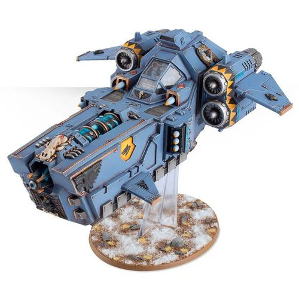

# 1562 风暴牙炮艇 Stormfang Gunship

精校状态：中文行文已逐段精校，部分术语仍为暂定

分类：载具 / 飞行 / 炮艇

原文来源：https://www.bilibili.com/opus/1042557964872843286

原作者：帝国神选罐头

原文时间：2025年03月10日 11:37

[返回分类目录](目录.md) · [全书目录](../../目录.md)

<!-- A1562-B0001 -->
**英文原文**

The Stormfang is a type of specialized Gunship used by the Space Wolves.

<!-- /A1562-B0001 -->

<!-- A1562-B0002 -->

原译文

风暴牙是太空野狼使用的一种专用炮舰。

**校订译文**

风暴牙是太空野狼使用的专用炮艇。

<!-- /A1562-B0002 -->

<!-- A1562-B0003 图片 -->

<!-- A1562-B0004 -->

原译文

Stormfang Gunship 风暴牙炮艇

**校订译文**

Stormfang Gunship 风暴牙炮艇

<!-- /A1562-B0004 -->

<!-- A1562-B0005 -->
**英文原文**

For the Space Wolves, the Stormfang Gunship is the final word in aerial superiority. Designed to dominate the skies in the manner of the dread ice wyrms of Fenris, a Stormfang’s ferocious armament mirrors the fighting qualities of the Space Wolves themselves. A Helfrost Destructor runs along the length of each of these deadly attack craft – a formidable weapon designed to freeze the target area to absolute zero in an instant. Even notoriously unyielding materials such as ceramite, ferrocrete or the wraithbone of the Eldar cannot hope to withstand the thermal shock of plummeting to such base temperatures, and shatter beneath the lance beam’s icy touch. Most Stormfang pilots are boastful of the deadly firepower at their command, and mark their craft with tallies of their fallen foes.

<!-- /A1562-B0005 -->

<!-- A1562-B0006 -->

原译文

对于太空野狼来说，风暴牙炮艇是空中优势的最终决定者。风暴牙的凶猛武器旨在以芬里斯可怕的冰妖的方式主宰天空，反映了太空野狼本身的战斗特性。霜狱毁灭炮安置在每艘致命攻击艇的中线，这是一种强大的武器，旨在瞬间将目标区域冻结到绝对零度。即使是出了名的坚硬材料，如陶钢、铁素混凝土或灵族的灵骨，也无法承受骤降到这种基础温度的热冲击，并在光矛光束的冰冷攻击下破碎。大多数风牙飞行员都吹嘘自己掌握着致命的火力，并用倒下的敌人的计数来标记他们的飞机。

**校订译文**

风暴牙是太空野狼夺取制空权的终极武器，如同芬里斯可怕的冰龙般统治天空，凶猛火力正契合战团的作战风格。每架飞机的机体纵轴上都装有霜狱毁灭炮，能瞬间将目标区域降至绝对零度。即使陶钢、铁混凝土或灵族灵骨等坚韧材料，也无法承受这种骤冷的热冲击，会在冰冷光束下碎裂。许多驾驶员以掌握这等火力为荣，在机身上标记战果。

**校注：** 绝对零度及其效果为作品原文设定，按原文翻译。

<!-- /A1562-B0006 -->

<!-- A1562-B0007 -->
**英文原文**

In addition to the Helfrost Destructor, the Stormfang is armed with sponson-mounted twin-linked Heavy Bolters, Skyhammer Missiles, or Multi-Meltas and hull-mounted Stormstrike Missiles or twin-linked Lascannons.

<!-- /A1562-B0007 -->

<!-- A1562-B0008 -->

原译文

除了霜狱毁灭炮之外，风暴牙还配备了安装在舷侧的双联重爆矢枪、天锤导弹或多管热熔以及安装在船体上的风暴打击导弹或双联激光炮。

**校订译文**

除霜狱毁灭炮外，侧炮座可配双联重型爆矢枪、天锤导弹或多管热熔，机体则可装风暴打击导弹或双联激光炮。

<!-- /A1562-B0008 -->

<!-- A1562-B0009 -->
## Notable Stormfangs 著名风暴牙

<!-- /A1562-B0009 -->

<!-- A1562-B0010 -->

原译文

Icetooth 冰牙

**校订译文**

Icetooth 冰牙

<!-- /A1562-B0010 -->

<!-- A1562-B0011 -->
**英文原文**

Stormgaze - transport of Ragnar Blackmane's Great Company.

<!-- /A1562-B0011 -->

<!-- A1562-B0012 -->

原译文

风暴潮 - 运输拉格纳·黑鬃的大连。

**校订译文**

风暴凝视号——拉格纳·黑鬃大连的运输机。

**校注：** Stormgaze含gaze凝视，原译风暴潮无对应词义；英文在炮艇条目称transport，照录而未补造载员能力。

<!-- /A1562-B0012 -->

本篇核心术语与暂定项

以下列出本篇出现的英文原形及核心术语表用词。同形词可能指不同对象，具体词义以本篇正文和校注为准；单复数、别名和仅见于图注的名称可能尚未列入。完整候选见[术语表](../../术语表/双语术语候选.csv)。

| 英文 | 采用中文 | 状态 |
| --- | --- | --- |
| Space Wolves | 太空野狼 | 官方已核对 |
| Eldar | 灵族 | 暂定·语境区分 |
| Fenris | 芬里斯 | 暂定·官方待核 |
| Lance | 骑士矛阵 | 暂定·官方待核 |
| Ragnar Blackmane | 拉格纳·黑鬃 | 官方已核 |
| Stormfang Gunship | 风暴牙炮艇 | 暂定·官方待核 |
| Absolute | 绝对号 | 暂定·官方待核 |
| Destructor | 破坏者（史洛斯类别） | 暂定·官方待核 |
| Wraithbone | 灵骨 | 暂定·官方待核 |
| helfrost | 霜狱 | 暂定·官方待核 |
| Zero | 零世界 | 暂定·官方待核 |
| Helfrost Destructor | 霜狱毁灭炮 | 暂定·官方待核 |
| Stormgaze | 风暴凝视号 | 暂定·官方待核 |

