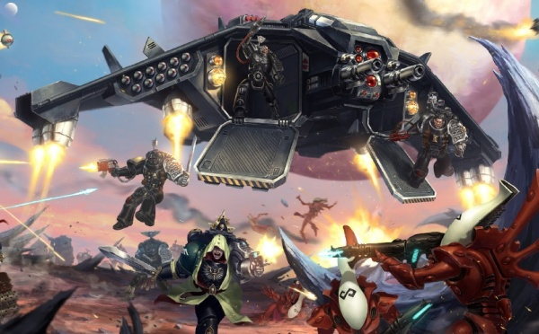
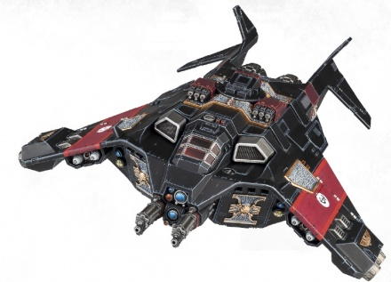

# 1563 黑星渡鸦炮艇 Corvus Blackstar Gunship

精校状态：中文行文已逐段精校，部分术语仍为暂定

分类：载具 / 飞行 / 炮艇

原文来源：https://www.bilibili.com/opus/1041098676713291778

原作者：帝国神选罐头

原文时间：2025年03月06日 13:14

[返回分类目录](目录.md) · [全书目录](../../目录.md)

原篇名：渡鸦黑星炮艇 Corvus Blackstar Gunship

<!-- A1563-B0001 -->
**英文原文**

The Corvus Blackstar is a type of gunship used by the Deathwatch Space Marines.

<!-- /A1563-B0001 -->

<!-- A1563-B0002 -->

原译文

渡鸦黑星是死亡守望星际战士使用的一种炮艇。

**校订译文**

黑星渡鸦是死亡守望星际战士使用的一种炮艇。

<!-- /A1563-B0002 -->

<!-- A1563-B0003 图片 -->

<!-- A1563-B0004 -->

原译文

Corvus Blackstar unloads its compliment of Space Marines Corvus 渡鸦黑星卸下了运载的星际战士

**校订译文**

Corvus Blackstar unloads its compliment of Space Marines Corvus 黑星渡鸦让搭载的星际战士下机

**校注：** 原图片说明英文末尾多出Corvus，保留英文存证，中文不重复插入。

<!-- /A1563-B0004 -->

<!-- A1563-B0005 -->
## Overview 概述

<!-- /A1563-B0005 -->

<!-- A1563-B0006 -->
**英文原文**

A sleek and deadly craft, it is designed to penetrate the outer defenses of alien hosts to strike directly at its heart. Though small enough to slip through sensor grids, its weapons systems are highly advanced, allowing the Blackstar to cause devastating impact for a craft its size. Primarily fulfilling the role of transport, its vectored engines are nimble enough to dart through winding terrain. Once in position it will switch from fighter craft to hovercraft, deploying the Deathwatch Space Marines held within. The pilot of each Blackstar is a veteran Techmarine who has earned the right to field it over long and arduous years of schooling. The pilot uses the same machine each time; so intense is this training that the Techmarines will link with the Machine Spirit of the aircraft.

<!-- /A1563-B0006 -->

<!-- A1563-B0007 -->

原译文

这是一艘光滑而致命的飞船，旨在穿透外星宿主的外部防御，直接击中其核心。虽然小到可以穿过传感器网格，但它的武器系统非常先进，使黑星能够对其大小的飞行器造成毁灭性的影响。它的矢量发动机主要起着运输的作用，足够灵活，可以在蜿蜒的地形中飞驰。一旦就位，它将从战斗机切换到气垫船，部署里面的死亡守望星际战士。每架黑星的驾驶员都是经验丰富的技术军士，经过多年艰苦的学习，他们有权驾驶它。飞行员每次使用同一台机械；这种训练是如此激烈，以至于技术军士将与飞机的机魂联系起来。

**校订译文**

黑星渡鸦线条流畅，火力致命，专为穿透异形军势的外围防线、直击核心而设计。它体型小，易于避开传感器网络，先进武器却能发挥远超其体量的毁伤效果。主要任务是运输部队；灵活的矢量发动机使它能沿曲折地形穿行，到达位置后从常规飞行转为悬停，放下舱内的死亡守望星际战士。驾驶员都是资深科技战士，经过多年艰苦训练才取得资格。每名驾驶员固定驾驶同一架飞机，训练深入到能与其机魂建立紧密联结。

**校注：** alien hosts此处是异形军势，不是宿主；hovercraft按悬停飞行模式理解，原译气垫船误读。

<!-- /A1563-B0007 -->

<!-- A1563-B0008 图片 -->

<!-- A1563-B0009 -->

原译文

Corvus Blackstar 渡鸦黑星

**校订译文**

Corvus Blackstar 黑星渡鸦

<!-- /A1563-B0009 -->

<!-- A1563-B0010 -->
**英文原文**

The Blackstar has advanced systems to ensure its survival. Its robust construction can shrug off even a direct hit from enemy anti-aircraft fire, and it is also equipped with Infernum Halo Launcher decoy flares and Interceptors. For armament, the Blackstar is most commonly armed with four Stormstrike Missiles and twin-linked Assault Cannons, though some are equipped with prow-mounted Lascannons in order to penetrate armored targets. Many of these craft also carry Blackstar Rocket Launcher arrays under each wing which can fire incendiary Dracos Air-to-Ground Missiles or air-to-air Corvid Rockets. It is also equipped with a Blackstar Cluster Launcher, auxiliary Grenade Launchers mounted in the rear to strafe smaller targets.

<!-- /A1563-B0010 -->

<!-- A1563-B0011 -->

原译文

黑星拥有先进的系统来确保其生存。它坚固的结构甚至可以抵御敌人防空火力的直接打击，它还配备了炼狱光环发射器发射诱饵弹和拦截器。在武器装备方面，黑星最常见的装备是四枚风暴打击导弹和双联突击炮，尽管有些装备了船首安装的激光炮，以穿透装甲目标。这些飞行器中的许多在每个机翼下都装有黑星火箭发射器阵列，可以发射燃烧的天龙空对地导弹或空对空暗鸦火箭。它还配备了一个黑星集群发射器，安装在后部的辅助榴弹发射器可以扫射较小的目标。

**校订译文**

其坚固结构甚至能够承受敌方防空火力的直接命中，并配有炼狱光环发射器的诱饵弹和拦截装置。通常武装为四枚风暴打击导弹和双联突击炮；有些则在机首安装激光炮，以击穿装甲目标。许多飞机还在两翼下设置黑星火箭发射器阵列，发射带燃烧效果的天龙空对地导弹或暗鸦空对空火箭。后部另有黑星集群发射器，即用于扫射小型目标的辅助榴弹发射装置。

<!-- /A1563-B0011 -->

<!-- A1563-B0012 -->
**英文原文**

Such is its potency that it is by far the most frequently used gunship for Kill-Teams.

<!-- /A1563-B0012 -->

<!-- A1563-B0013 -->

原译文

它的威力如此之大，以至于它是迄今为止杀戮小队最常用的炮艇。

**校订译文**

凭借这些性能，它成为杀戮小队最常用的炮艇。

<!-- /A1563-B0013 -->

本篇核心术语与暂定项

以下列出本篇出现的英文原形及核心术语表用词。同形词可能指不同对象，具体词义以本篇正文和校注为准；单复数、别名和仅见于图注的名称可能尚未列入。完整候选见[术语表](../../术语表/双语术语候选.csv)。

| 英文 | 采用中文 | 状态 |
| --- | --- | --- |
| Space Marines | 星际战士 | 官方已核对 |
| Deathwatch | 死亡守望 | 官方已核对 |
| Techmarine | 科技战士 | 官方已核对 |
| Veteran | 老兵 | 暂定·官方待核 |
| Interceptors | 拦截者 | 暂定·官方待核 |
| Corvus Blackstar | 黑星渡鸦 | 官方已核 |
| Rocket Launcher | 火箭发射器 | 暂定·官方待核 |
| Blackstar Cluster Launcher | 黑星集群发射器 | 暂定·官方待核 |
| Grenade | 手榴弹 | 暂定·官方待核 |
| Infernum Halo Launcher | 炼狱光环发射器 | 暂定·官方待核 |
| Blackstar Rocket Launcher | 黑星火箭发射器 | 暂定·官方待核 |

