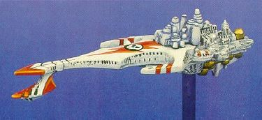

# 1566 狂怒深渊号 Furious Abyss

精校状态：中文行文已逐段精校，部分术语仍为暂定

分类：战舰

原文来源：https://www.bilibili.com/opus/1200969681753604096

原作者：帝国神选罐头

原文时间：2026年05月11日 08:55

[返回分类目录](目录.md) · [全书目录](../../目录.md)

<!-- A1566-B0001 -->
**英文原文**

The Furious Abyss was a massive starship constructed during the latter years of the Great Crusade.

<!-- /A1566-B0001 -->

<!-- A1566-B0002 -->

原译文

狂怒深渊号是在大远征后期建造的一艘巨大的星舰。

**校订译文**

狂怒深渊号是在大远征后期建造的一艘巨大的星舰。

<!-- /A1566-B0002 -->

<!-- A1566-B0003 -->
**英文原文**

Originally thought to be the sole ship of its class, it is eventually revealed by Lorgar that two more of the massive ships, the Trisagion and Blessed Lady, were constructed. Upon their completion the Abyss Class Battleships were the largest and most powerful ships in the Imperium, rivaled only by the Phalanx.

<!-- /A1566-B0003 -->

<!-- A1566-B0004 -->

原译文

最初被认为是其级别中唯一的一艘舰船，珞珈最终透露，又建造了两艘大型舰，即三圣颂号和受祝女士号。完成后，深渊级战列舰成为帝国中最大、最强大的战舰，仅次于山阵号。

**校订译文**

最初人们以为它是同级唯一一舰，后来珞珈透露，另有三圣颂号和受祝女士号建成。深渊级完工时，是帝国最大、最强的战舰，只有山阵号能与之匹敌。

<!-- /A1566-B0004 -->

<!-- A1566-B0005 -->
## Overview 概述

<!-- /A1566-B0005 -->

<!-- A1566-B0006 -->
**英文原文**

The vessel was a unique configuration within the Imperium at the time and were quite large with even Emperor and Gloriana Battleships being dwarfed by these massive vessels. It was roughly shaped like a sword with three points sticking out from the vessel like a trident. These ships were more akin to floating cities then battleships and a noted appearance was a large open golden book present on its hull. The command throne was on a raised dais with numerous screens present allowing its commander to control the entire vessel. The ship carried a complement of fighters, even though it did not look like it had any launch bays.

<!-- /A1566-B0006 -->

<!-- A1566-B0007 -->

原译文

这艘战舰在当时的帝国中是一种独特的配置，而且相当大，即使是帝皇和荣光女王战列舰也被这些巨大的战舰所淹没。它的形状大致像一把剑，有三个尖端像三叉戟一样从船上伸出。这些舰船更像是漂浮的城市，而不是战列舰，一个值得注意的外观是船体上有一本巨大的打开的金色书籍。指挥王座位于一个升高的平台上，上面有许多屏幕，让指挥官可以控制整艘船。这艘船搭载了一批战斗机，尽管它看起来没有任何发射舱。

**校订译文**

其构型在当时的帝国独树一帜，体型之大，连帝皇级和荣光女王级战列舰都显得渺小。舰体大致呈剑形，三个突出部分又如三叉戟，整体更像漂浮城市。舰身有一部巨大的展开金书装饰；指挥王座位于高台，周围布满控制全舰的屏幕。尽管外观似乎没有发射舱，它仍搭载了战斗机。

<!-- /A1566-B0007 -->

<!-- A1566-B0008 -->
**英文原文**

The nature of the ship meant that many did not think it was capable of carrying fighters but these individuals were often surprisingly mistaken when the ship launched its compliment of fighters from its hanger bay.

<!-- /A1566-B0008 -->

<!-- A1566-B0009 -->

原译文

这艘船的性质意味着许多人认为它没有能力携带战斗机，但当这艘船从机库发射战斗机时，这些人往往出乎意料地弄错了。

**校订译文**

许多人因外形而误以为它不能搭载战斗机，直到机群从机库中飞出，才惊觉判断错误。

<!-- /A1566-B0009 -->

<!-- A1566-B0010 -->
**英文原文**

The Abyss contained the first prototype plasma lance, which was capable of destroying other ships in close combat. It was also capable of being equipped with psionic charges which were able to be deployed in the Warp and disrupt the senses of a Navigator.

<!-- /A1566-B0010 -->

<!-- A1566-B0011 -->

原译文

深渊装有第一支原型等离子光矛，能够在近距离战斗中摧毁其他舰船。它还能够配备灵能电荷，这些电荷能够部署在亚空间中并扰乱导航者的感知。

**校订译文**

舰上装有首门原型等离子光矛，能在近距离舰战中摧毁敌舰。它还可携带灵能爆炸装置，在亚空间投放，扰乱导航员的感知。

**校注：** Navigator 按 GW09/GW10 第24页官方译名导航员；本处均为亚空间导航员。

<!-- /A1566-B0011 -->

<!-- A1566-B0012 -->
## History 历史

<!-- /A1566-B0012 -->

<!-- A1566-B0013 -->
**英文原文**

The starship was created secretly by a branch of the Adeptus Mechanicus who held loyalties to Warmaster Horus during the early start of the Horus Heresy. It was made at the shipyard moon of Thule and given as a gift to the Word Bearers Adeptus Astartes, who were serving their Primarch in their plan to assault the loyalist Legions that would serve the Emperor. After the commemoration ceremony, the shipyard was destroyed, killing all the workers and allowing the ship's existence to remain a secret as its design was unknown to everyone outside its construction.

<!-- /A1566-B0013 -->

<!-- A1566-B0014 -->

原译文

这艘星舰是由机械教的一个分支秘密创造的，该分支在荷鲁斯叛乱早期忠于荷鲁斯。它是在图勒的造船厂卫星上制造的，并作为礼物送给了怀言者阿斯塔特修会，他们正在为他们的原体服务，计划攻击为帝皇服务的忠诚派军团。纪念仪式结束后，造船厂被摧毁，杀死了所有工人，并让这艘船的存在成为一个秘密，因为它的设计对建造厂以外的人来说都是未知的。

**校订译文**

荷鲁斯之乱初期，忠于战帅的一支机械修会派系，在船坞卫星图勒秘密建造了这艘星舰，将其赠予怀言者，用于原体策划的对忠诚军团之袭击。落成仪式之后，船坞被毁，所有工人遭到灭口。除参与建造者之外无人知晓其设计，因此舰船的存在也得以保密。

**校注：** 正文称叛乱初期秘密建造，首段称大远征后期；原始时间表述存在差异，未自行合并。

<!-- /A1566-B0014 -->

<!-- A1566-B0015 -->
**英文原文**

The detachment of Word Bearers in command of the vessel was led by Fleet-Captain Zadkiel, who was given the task by Kor Phaeron to take the ship to Macragge and destroy the planet in order to create havoc among the Ultramarines. During its flight through space to its destination, it was detected by the Fist of Macragge and the Ultramarine vessel was used as target practice and destroyed by the Furious Abyss as it continued its journey. However, the distress signal from the ship's Astropaths was sent to an Imperial outpost and received by Captain Lysimachus Cestus, who led a group of Ultramarines, World Eaters, Space Wolves and Thousand Sons to investigate the message.

<!-- /A1566-B0015 -->

<!-- A1566-B0016 -->

原译文

指挥该战舰的怀言者分遣队由舰队连长扎德基尔领导，科尔·法伦赋予他将该舰带到马库拉格并摧毁该行星的任务，以在极限战士中制造浩劫。在穿越空域前往目的地的过程中，它被马库拉格之拳号探测到，极限战士战舰被用作靶子练习，并在继续航行时被狂怒深渊号摧毁。然而，来自舰船的星语者的遇险信号被发送到帝国前哨，并被吕西马库斯·塞斯图斯连长接收，他带领一队极限战士、吞世者、太空野狼和千子调查了这条信息。

**校订译文**

舰上怀言者由舰队连长扎德基尔统率。他奉科尔·法伦之命，准备摧毁马库拉格，让极限战士陷入混乱。途中，极限战士的马库拉格之拳号发现了它，却被它当作试射靶舰击毁。但星语者在覆灭前已将求救信号送到帝国前哨。里斯马卡斯·赛斯图斯连长收到消息，率领由极限战士、吞世者、太空野狼和千子组成的部队前往调查。

<!-- /A1566-B0016 -->

<!-- A1566-B0017 -->
**英文原文**

The fleet made its way and caught up with the Furious Abyss and learnt it was commanded by the Word Bearers. Confused, the loyalists contacted the ship but did not receive a response. Zadkiel instead contacted the commander of the Waning Moon, Mhotep, in order to secure his allegiance to Horus's side. However, Mhotep decided to warn his comrades leading to a fight between the squadron and the Furious Abyss which was no contest for the large vessel. It destroyed numerous escorts and the Waning Moon before entering the Warp in order to reach Macragge. As it did so, it deployed a Psionic mine into the Empyrean in order to disrupt any following ships' Navigators and their ability to travel through the warp.

<!-- /A1566-B0017 -->

<!-- A1566-B0018 -->

原译文

舰队继续前进，追上了狂怒深渊号，并得知它是由怀言者指挥的。忠诚派感到困惑，联系了这艘船，但没有得到回应。扎德基尔转而联系了残月号的指挥官姆霍特普，以确保他对荷鲁斯一方的忠诚。然而，姆霍特普决定警告他的战友，这将导致中队与狂怒深渊号之间的战斗，而这场战斗并不是对大型战舰的争夺。它摧毁了许多护卫舰和残月号，然后进入亚空间，以到达马库拉格。当它这样做的时候，它在至高天中部署了一枚灵能地雷，以扰乱任何后续舰船的导航者及其穿越亚空间的能力。

**校订译文**

追击舰队赶上狂怒深渊号，得知舰上是怀言者后疑惑地发出联络，却未获答复。扎德基尔反而私下联系残月号指挥官姆霍特普，试图拉拢他效忠荷鲁斯。姆霍特普选择警告同伴，于是双方交战。追击舰队完全不是这艘巨舰的对手，许多护卫舰连同残月号被毁。狂怒深渊号随后跃入亚空间，继续前往马库拉格，并投下灵能水雷，干扰追兵的导航员与跃迁航行。

**校注：** Navigator 按 GW09/GW10 第24页官方译名导航员；本处均为亚空间导航员。

<!-- /A1566-B0018 -->

<!-- A1566-B0019 -->
**英文原文**

The Furious Abyss would later be destroyed in the upper orbit of Macragge, while the Battle of Calth was ongoing simultaneously.

<!-- /A1566-B0019 -->

<!-- A1566-B0020 -->

原译文

狂怒深渊号后来在马库拉格的高轨被摧毁，而考斯之战也在同时进行。

**校订译文**

狂怒深渊号后来在马库拉格的高轨被摧毁，而考斯之战也在同时进行。

<!-- /A1566-B0020 -->

<!-- A1566-B0021 -->
## Trivia 琐事

<!-- /A1566-B0021 -->

<!-- A1566-B0022 -->
**英文原文**

The trident, cathedral-like structure of the Furious Abyss is likely a reference to the Gothic Battleship from the classic Games Workshop game Space Fleet.

<!-- /A1566-B0022 -->

<!-- A1566-B0023 -->

原译文

狂怒深渊的三叉戟、大教堂般的结构可能是参考自经典GW游戏太空舰队中的哥特战列舰。

**校订译文**

条目推测，狂怒深渊号如三叉戟般的哥特式教堂造型，可能致敬了 Games Workshop 经典游戏《太空舰队》中的哥特级战列舰。

**校注：** 与游戏模型的关联是原条目的推测，非经核实的设计者声明。

<!-- /A1566-B0023 -->

<!-- A1566-B0024 图片 -->

<!-- A1566-B0025 -->

原译文

The Gothic Battleship from Space Fleet 来自太空舰队的哥特战列舰

**校订译文**

The Gothic Battleship from Space Fleet 来自太空舰队的哥特战列舰

<!-- /A1566-B0025 -->

本篇核心术语与暂定项

以下列出本篇出现的英文原形及核心术语表用词。同形词可能指不同对象，具体词义以本篇正文和校注为准；单复数、别名和仅见于图注的名称可能尚未列入。完整候选见[术语表](../../术语表/双语术语候选.csv)。

| 英文 | 采用中文 | 状态 |
| --- | --- | --- |
| Adeptus Astartes | 阿斯塔特修会 | 官方已核对 |
| Space Wolves | 太空野狼 | 官方已核对 |
| Adeptus Mechanicus | 机械修会 | 官方已核对 |
| Thousand Sons | 千子 | 官方已核对 |
| World Eaters | 吞世者 | 官方已核对 |
| Ultramarines | 极限战士 | 官方已核对 |
| Horus Heresy | 荷鲁斯之乱 | 官方已核对 |
| Navigator | 导航员 | 官方已核对 |
| Warp | 亚空间 | 官方已核对 |
| Imperium | 帝国 | 暂定·简称 |
| Phalanx | 山阵号 | 暂定 |
| Emperor | 帝皇 | 官方已核对 |
| Primarch | 原体 | 官方已核对 |
| Word Bearers | 怀言者 | 暂定·官方待核 |
| Great Crusade | 大远征 | 暂定·官方待核 |
| Horus | 荷鲁斯 | 暂定·官方待核 |
| Navigators | 导航员 | 官方已核对 |
| Calth | 考斯 | 暂定·官方待核 |
| Macragge | 马库拉格 | 暂定·官方待核 |
| Lance | 骑士矛阵 | 暂定·官方待核 |
| The Phalanx | 山阵号 | 暂定·官方待核 |
| Kor Phaeron | 科尔·法伦 | 暂定·官方待核 |
| Captain | 连长 | 暂定·官方待核 |
| Lorgar | 珞珈 | 暂定·官方待核 |
| Furious Abyss | 狂怒深渊号 | 暂定·官方待核 |
| Trisagion | 三圣颂号 | 暂定·官方待核 |
| Blessed Lady | 受祝女士号 | 暂定·官方待核 |
| Zadkiel | 扎德基尔 | 暂定·官方待核 |
| Phaeron | 法皇 | 暂定·官方待核 |
| Cestus | 塞斯图斯号 | 暂定·官方待核 |
| Battle of Calth | 考斯之战 | 暂定·官方待核 |
| Lysimachus Cestus | 里斯马卡斯·赛斯图斯 | 暂定·官方待核 |
| Thule | 图勒 | 暂定·官方待核 |
| Trident | 三叉戟号 | 暂定·官方待核 |
| The Waning | 大衰落 | 暂定·官方待核 |
| Mhotep | 姆霍特普 | 暂定·官方待核 |
| Waning Moon | 残月号 | 暂定·官方待核 |
| Fist of Macragge | 马库拉格之拳号 | 暂定·官方待核 |
| Gothic Battleship | 哥特级战列舰 | 暂定·官方待核 |
| Games Workshop | Games Workshop | 暂定·官方待核 |

