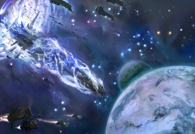
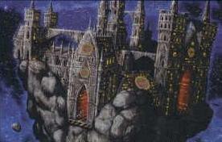
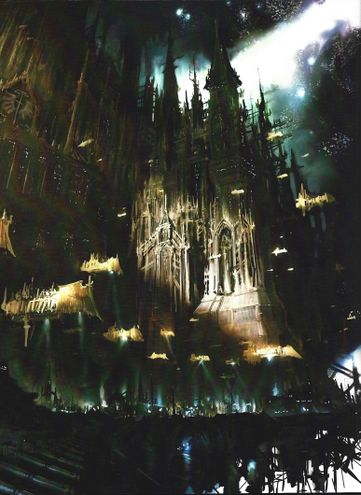
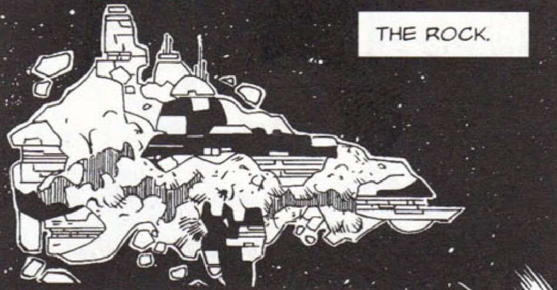
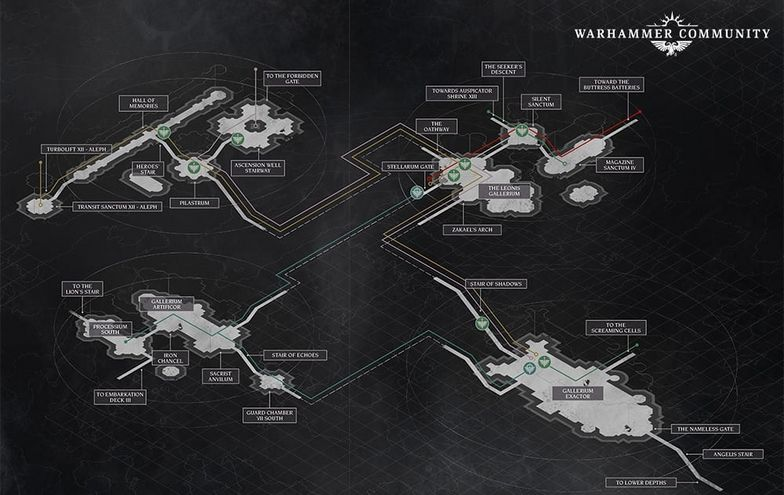

# 1567 巨石 The Rock

精校状态：中文行文已逐段精校，部分术语仍为暂定

分类：战舰

原文来源：https://www.bilibili.com/opus/1212899644890152983

原作者：帝国神选罐头

原文时间：2026年06月12日 12:30

[返回分类目录](目录.md) · [全书目录](../../目录.md)

<!-- A1567-B0001 -->
**英文原文**

The Rock, also known as the Tower of Angels or Spire of Angels, is the legendary home and fortress-monastery of the Dark Angels Space Marine Chapter. The Rock is an immense and powerful ship, capable of blasting even powerful Eldar fleets into oblivion during the Battle of Midpoint. Fully equipped with both Warp Drives and force fields, it is also home to many ancient and arcane technologies the Dark Angels have accumulated over the millennia. Overall operations of The Rock are overseen by the Master of the Rock.

<!-- /A1567-B0001 -->

<!-- A1567-B0002 -->

原译文

巨石，也被称为天使之塔或天使尖塔，是黑暗天使星际战士战团的传奇家园和堡垒修道院。巨石是一艘巨大而强大的舰船，在中点之战中，它甚至能够将强大的灵族舰队炸得面目全非。它配备了亚空间驱动和力场，也是黑暗天使数千年来积累的许多古老而神秘的技术的所在地。巨石的整体运行由巨石之主监督。

**校订译文**

巨石亦称天使之塔或天使尖塔，是黑暗天使战团传奇般的家园与要塞修道院。这艘巨大而强大的舰船，曾在中点之战中摧毁强劲的灵族舰队。它配有亚空间引擎和力场，珍藏着战团数千年来积累的古老秘传技术，整体运作由巨石之主掌管。

<!-- /A1567-B0002 -->

<!-- A1567-B0003 图片 -->

<!-- A1567-B0004 -->

原译文

The Rock at the head of a Dark Angels fleet 黑暗天使舰队最前面的巨石

**校订译文**

The Rock at the head of a Dark Angels fleet 黑暗天使舰队最前面的巨石

<!-- /A1567-B0004 -->

<!-- A1567-B0005 -->
## History 历史

<!-- /A1567-B0005 -->

<!-- A1567-B0006 -->
**英文原文**

The Rock is a remnant of Caliban itself that survived the destruction of the world at the end of the Horus Heresy. The remnant is built around the mountain Aldurukh, upon which sits the original Fortress-Monastery of the Dark Angels, the Angelicasta, which survived the destruction of the planet thanks to its shielding. The Rock travels around the galaxy and visits most of the Dark Angels' recruiting worlds, and the Watchers in the Dark patrol its halls; an example of a Watcher is the small hooded being that follows Supreme Grand Master Azrael around, carrying the Lion Helm. The Rock is larger than any conventional class of Imperial warship and is capable of laying waste to entire fleets with its massive array of weaponry. The Rock is further protected by a constant escort of frigates and squadrons of Thunderhawk Gunships. Beneath the surface of the rock lie vaults within which weapons of antiquity and terrible power are stored.

<!-- /A1567-B0006 -->

<!-- A1567-B0007 -->

原译文

巨石是卡利班本身的残余，在荷鲁斯叛乱结束时世界毁灭后幸存下来。残余建在阿尔杜鲁赫山脉周围，其上坐落着原初的黑暗天使堡垒修道院纯洁天使，由于其护盾，它在行星的毁灭中幸存下来。巨石在银河系中航行，访问了大多数黑暗天使的招募世界，黑暗守望者在其大厅巡逻；守望者的一个例子是戴着兜帽的小生物，它带着狮盔，跟随至高大导师阿兹瑞尔四处走动。巨石比任何传统级别的帝国战舰都大，能够用其庞大的武器阵列摧毁整个舰队。巨石得到了护卫舰和雷鹰炮艇中队的持续护航。巨石表面之下是储藏古代武器和可怕力量的秘库。

**校订译文**

巨石是卡利班在荷鲁斯之乱末期毁灭后留下的残片，以阿尔杜鲁赫山及山上的黑暗天使原要塞修道院安杰利卡斯塔为核心；修道院依靠护盾，熬过了行星毁灭。巨石航行于银河，造访战团的大多数征兵世界，黑暗守望者则在厅堂中巡行。跟随至高大导师阿兹瑞尔、替他携带狮盔的兜帽小人，就是其中之一。巨石比帝国任何常规舰级都庞大，其武器阵列足以摧毁整支舰队，平时还有护卫舰与雷鹰中队护航。表面之下的秘库中，封存着威力可怖的古代武器。

**校注：** Angelicasta为修道院专名，原“纯洁天使”混作其他战团名；暂音译安杰利卡斯塔。

<!-- /A1567-B0007 -->

<!-- A1567-B0008 图片 -->

<!-- A1567-B0009 -->

原译文

The Rock 巨石

**校订译文**

The Rock 巨石

<!-- /A1567-B0009 -->

<!-- A1567-B0010 -->
**英文原文**

Deep within the bowels of the Rock are cells in which the Fallen Angels are held. Luther is imprisoned there, kept alive over 10,000 years after his costly betrayal of the Dark Angels. Luther rants and raves, claiming that he has no need of repentance or confession, for the Lion - who he claims is near - will soon return and absolve him. Unbeknownst to any, the sleeping body of Lion El'Jonson is hidden in the heart of the Rock, guarded by the Watchers.

<!-- /A1567-B0010 -->

<!-- A1567-B0011 -->

原译文

在巨石的深处是堕天使被关押的舱室。卢瑟被囚禁在那里，在他对黑暗天使的昂贵背叛后，他活了一万多年。卢瑟咆哮着，声称他不需要悔改或忏悔，因为他声称就在附近的莱昂很快就会回来赦免他。任何人都不知道，莱昂·艾尔庄森的沉睡身体隐藏在巨石的中心，由守望者守卫。

**校订译文**

巨石深处设有囚禁堕天使的牢房。卢瑟曾被关在那里，在那场造成惨重代价的背叛之后存活了一万多年。他不断叫喊，声称无须悔改或告解，因为莱昂就在附近，终将归来赦免他。当时，莱昂·艾尔’庄森沉睡的躯体确实藏在巨石核心，由黑暗守望者看护，却无人知晓。

**校注：** 沉睡莱昂与被囚卢瑟描述的是随后逃脱/回归事件之前的状态，译文补明叙事时点，未删早期设定。

<!-- /A1567-B0011 -->

<!-- A1567-B0012 -->
**英文原文**

Shortly after the formation of the Great Rift, the Rock was besieged by daemons led by the Marbas, a member of the Fallen who has become a Daemon Prince. The battle was a mere distraction and was quickly defeated, however the Fallen succeeded in setting Luther free.

<!-- /A1567-B0012 -->

<!-- A1567-B0013 -->

原译文

大裂隙形成后不久，巨石就被马尔巴斯领导的恶魔围困了，马尔巴斯是堕天使的一员，现已成为恶魔王子。这场战斗只是分散了注意力，很快就被击败了，但堕天使成功地解放了卢瑟。

**校订译文**

大裂隙形成后不久，已成为恶魔亲王的堕天使马尔巴斯率恶魔围攻巨石。攻击很快被击退，但这原本只是牵制：堕天使真正的目的得逞，救走了卢瑟。

<!-- /A1567-B0013 -->

<!-- A1567-B0014 -->
**英文原文**

The Rock was again besieged during the Arks of Omen Campaign as part of the daemon Vashtorr's plans. Ambushing and boarding the mobile fortress, Vashtorr sought a Key Fragment which was sealed within one of The Rock's deepest vaults. Vashtorr's raid was initially on the verge of succeeding until Be'lakor intervened and allowed for nearby Imperial reinforcements to arrive. Enraged and with his plan in tatters, Vashtorr retreated.

<!-- /A1567-B0014 -->

<!-- A1567-B0015 -->

原译文

作为恶魔瓦什托尔计划的一部分，巨石在噩兆方舟战役中再次被围困。瓦什托尔伏击并登上移动堡垒，寻找一个被密封在巨石最深的秘库之一内的关键碎片。瓦什托尔的突袭最初接近成功，直到比'拉克介入并允许附近的帝国增援部队到达。瓦什托尔被激怒了，他的计划被破坏了，他撤退了。

**校订译文**

噩兆方舟战役中，瓦什托尔又伏击并登上巨石，寻找封存在深层秘库内的一块“钥匙碎片”。他几乎成功，却因比拉克尔介入而受阻，附近帝国援军也因此得以及时赶到。计划破败的瓦什托尔愤怒撤退。

<!-- /A1567-B0015 -->

<!-- A1567-B0016 图片 -->

<!-- A1567-B0017 -->

原译文

The Rock 巨石

**校订译文**

The Rock 巨石

<!-- /A1567-B0017 -->

<!-- A1567-B0018 -->
**英文原文**

Shortly after, The Rock and a massive Unforgiven armada pursued Vashtorr to the Somnium Stars, where in the subsequent Battle of Idolatros Vashtorr acquired the Key-Fragment he had originally sought: the Tuchulcha.

<!-- /A1567-B0018 -->

<!-- A1567-B0019 -->

原译文

不久之后，巨石和一支庞大的不可饶恕者舰队将瓦什托尔追击到幻梦群星，在随后的盲信星之战中，瓦什托尔获得了他最初寻求的关键碎片：图丘查。

**校订译文**

不久，巨石与庞大的戴罪者舰队追至幻梦群星。在随后的盲信星之战中，瓦什托尔终于夺得那块钥匙碎片——图丘查。

<!-- /A1567-B0019 -->

<!-- A1567-B0020 -->
**英文原文**

Unknown to the Dark Angels until Cypher informed them, for the last ten thousand years The Rock has had the ancient sentient device known as Tuchulcha hidden within it. The device was later extracted by Vashtorr during the Battle of Idolatros.

<!-- /A1567-B0020 -->

<!-- A1567-B0021 -->

原译文

在塞弗通知他们之前，黑暗天使并不知道，在过去的一万年里，巨石中隐藏着一个被称为图丘查的古老的有感知装置。该装置后来在盲信星之战中被瓦什托尔提取出来。

**校订译文**

直到塞弗告知，黑暗天使才知道，古老的有意识装置图丘查已在巨石内藏了一万年。后来，瓦什托尔在盲信星之战中将其取走。

<!-- /A1567-B0021 -->

<!-- A1567-B0022 图片 -->

<!-- A1567-B0023 -->

原译文

The Rock 巨石

**校订译文**

The Rock 巨石

<!-- /A1567-B0023 -->

<!-- A1567-B0024 -->
## Known regions 已知地区

<!-- /A1567-B0024 -->

<!-- A1567-B0025 图片 -->

<!-- A1567-B0026 -->

原译文

Map of The Rock 巨石的地图

**校订译文**

Map of The Rock 巨石的地图

<!-- /A1567-B0026 -->

<!-- A1567-B0027 -->
**英文原文**

Tower of Angels - Central Command Spire at the top of The Rock

<!-- /A1567-B0027 -->

<!-- A1567-B0028 -->

原译文

天使之塔 - 巨石顶部的中央指挥塔

**校订译文**

天使之塔 - 巨石顶部的中央指挥塔

<!-- /A1567-B0028 -->

<!-- A1567-B0029 -->

原译文

Vault of Banners 旗帜密库

**校订译文**

Vault of Banners 旗帜密库

<!-- /A1567-B0029 -->

<!-- A1567-B0030 -->

原译文

Stair of Swords 剑之阶梯

**校订译文**

Stair of Swords 剑之阶梯

<!-- /A1567-B0030 -->

<!-- A1567-B0031 -->

原译文

Whispering Dome 低语穹顶

**校订译文**

Whispering Dome 低语穹顶

<!-- /A1567-B0031 -->

<!-- A1567-B0032 -->

原译文

Hallowed Nave 神圣正厅

**校订译文**

Hallowed Nave 神圣正厅

<!-- /A1567-B0032 -->

<!-- A1567-B0033 -->

原译文

Galleria Apscondael 阿普斯孔代尔拱廊

**校订译文**

Galleria Apscondael 隐秘长廊

<!-- /A1567-B0033 -->

<!-- A1567-B0034 -->

原译文

Forbidden Gate 禁忌之门

**校订译文**

Forbidden Gate 禁忌之门

<!-- /A1567-B0034 -->

<!-- A1567-B0035 -->

原译文

Ascension Well Stairway 升天阶梯

**校订译文**

Ascension Well Stairway 升天之井阶梯

<!-- /A1567-B0035 -->

<!-- A1567-B0036 -->
**英文原文**

Nameless Gate - Past this gate are the greatest secrets of the Dark Angels

<!-- /A1567-B0036 -->

<!-- A1567-B0037 -->

原译文

无名之门 - 穿过这道门是黑暗天使最大的秘密

**校订译文**

无名之门 - 穿过这道门是黑暗天使最大的秘密

<!-- /A1567-B0037 -->

<!-- A1567-B0038 -->

原译文

Apothecarion 药剂部

**校订译文**

Apothecarion 药剂部

<!-- /A1567-B0038 -->

<!-- A1567-B0039 -->
**英文原文**

Columbarium - Holds the cremated ashes of countless generations of Dark Angels.

<!-- /A1567-B0039 -->

<!-- A1567-B0040 -->

原译文

骨灰龛 - 存放着无数代黑暗天使的骨灰。

**校订译文**

骨灰龛 - 存放着无数代黑暗天使的骨灰。

<!-- /A1567-B0040 -->

<!-- A1567-B0041 -->
## Defences 防御

<!-- /A1567-B0041 -->

<!-- A1567-B0042 -->
**英文原文**

The Rock is equipped with numerous batteries and launch bays, garrisoned with the elite forces of the chapter, and is also protected by an incredibly potent and ancient force field known as the Gorgon's Aegis. Furthermore, the fortress is escorted by a fleet of Dark Angels void ships.

<!-- /A1567-B0042 -->

<!-- A1567-B0043 -->

原译文

巨石配备了许多炮台和发射舱，驻扎着战团的精英部队，并受到一个被称为戈尔贡宙斯盾的强大而古老的力场的保护。此外，堡垒由一群黑暗天使虚空舰护卫。

**校订译文**

巨石配备大量炮组与舰载机发射舱，由战团精锐驻守，并有异常强大的古代力场“戈尔贡之盾”保护。黑暗天使舰队还为它提供外围护航。

<!-- /A1567-B0043 -->

本篇核心术语与暂定项

以下列出本篇出现的英文原形及核心术语表用词。同形词可能指不同对象，具体词义以本篇正文和校注为准；单复数、别名和仅见于图注的名称可能尚未列入。完整候选见[术语表](../../术语表/双语术语候选.csv)。

| 英文 | 采用中文 | 状态 |
| --- | --- | --- |
| Dark Angels | 黑暗天使 | 官方已核对 |
| Eldar | 灵族 | 暂定·语境区分 |
| Be'lakor | 比拉克尔 | 官方已核对 |
| Horus Heresy | 荷鲁斯之乱 | 官方已核对 |
| Warp | 亚空间 | 官方已核对 |
| Great Rift | 大裂隙 | 官方已核对 |
| Daemon Prince | 恶魔亲王 | 官方已核对 |
| Horus | 荷鲁斯 | 暂定·官方待核 |
| Lion El'Jonson | 莱昂·艾尔’庄森 | 官方已核对 |
| Caliban | 卡利班 | 暂定·官方待核 |
| Master | 导师（审判庭职衔）／舰务官（舰员职务） | 语境定译·官方待核 |
| Master of the Rock | 巨石之主 | 暂定·官方待核 |
| Unforgiven | 戴罪者 | 暂定·官方待核 |
| Ancient | 旗手 | 官方已核对 |
| Space Marine | 星际战士 | 暂定·官方待核 |
| Chapter | 战团 | 暂定·官方待核 |
| Fortress-monastery | 要塞修道院 | 暂定·官方待核 |
| Azrael | 阿兹瑞尔 | 官方已核 |
| Supreme Grand Master | 至高大导师 | 暂定·官方待核 |
| Nameless | 无名者 | 暂定·官方待核 |
| Cypher | 塞弗 | 官方已核对 |
| Marbas | 马尔巴斯 | 暂定·官方待核 |
| Grand Master | 大导师 | 暂定·官方待核 |
| Tuchulcha | 图丘查 | 暂定·官方待核 |
| The Key | 钥匙 | 暂定·官方待核 |
| The Dark | 《黑暗》 | 暂定·官方待核 |
| Tower of Angels | 天使之塔 | 暂定·官方待核 |
| The Remnant | 遗存者 | 暂定·官方待核 |
| Omen | 预兆号 | 暂定·官方待核 |
| Nameless Gate | 无名之门 | 暂定·官方待核 |
| Somnium Stars | 幻梦群星 | 暂定·官方待核 |
| Spire of Angels | 天使尖塔 | 暂定·官方待核 |
| Angelicasta | 安杰利卡斯塔 | 暂定·官方待核 |
| Aldurukh | 阿尔杜鲁赫山 | 暂定·官方待核 |
| Gorgon | 戈尔贡 | 暂定·官方待核 |

