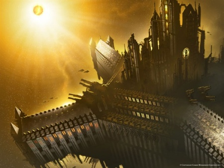
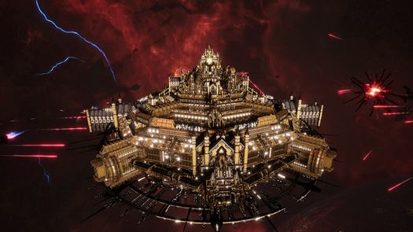
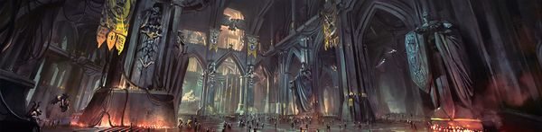

# 1570 山阵号 Phalanx

精校状态：中文行文已逐段精校，部分术语仍为暂定

分类：战舰

原文来源：https://www.bilibili.com/opus/1195043232446152711

原作者：帝国神选罐头

原文时间：2026年04月25日 09:38

[返回分类目录](目录.md) · [全书目录](../../目录.md)

<!-- A1570-B0001 -->
**英文原文**

The Phalanx is the mobile fortress-monastery of the Imperial Fists. Officially, the homeworld of the Imperial Fists is Terra, but in functional terms the chapter has been fleet based and used the Phalanx as its primary base of operations throughout its entire history.

<!-- /A1570-B0001 -->

<!-- A1570-B0002 -->

原译文

山阵号是帝国之拳的移动堡垒修道院。官方说法，帝国之拳的家园世界是泰拉，但从职能上讲，该战团一直以舰队为基础，在整个历史中都将山阵号作为其主要行动基地。

**校订译文**

山阵号是帝国之拳的移动要塞修道院。官方说法，帝国之拳的家园世界是泰拉，但从职能上讲，该战团一直以舰队为基础，在整个历史中都将山阵号作为其主要行动基地。

<!-- /A1570-B0002 -->

<!-- A1570-B0003 -->
## History 历史

<!-- /A1570-B0003 -->

<!-- A1570-B0004 -->
## Heresy 叛乱

<!-- /A1570-B0004 -->

<!-- A1570-B0005 -->
**英文原文**

For much of the Horus Heresy, the Phalanx was stationed over Terra and used as Dorn's command base. However, as Horus's advance to Terra drew near, Dorn eventually moved to the Bhab Bastion of the Imperial Palace. During the final stages of the Solar War, Dorn intended to use the Phalanx to shatter the traitor armada emerging on Luna and Mars and personally took command of the vessel. However, the remembrancer Mersadie Oliton unwittingly unleashed the daemon Samus upon the vessel. Samus and his daemonic hordes were on the verge of capturing the Phalanx and Dorn was about to order its self-destruction until Oliton committed suicide, banishing the daemons through the same portal from which they had come. The Phalanx was damaged during the battle, and with traitor forces closing in around them Dorn ordered Imperial Army Admiral Niora Su-Kassen to take the Phalanx into the outer reaches of Sol System in order to both save it and wage war on the traitors' rear lines. During the Siege of Terra, the Phalanx helped form a loyalist refugee fleet under Su-Kassen hiding at the edge of the Sol System along with other vessels, such as the Imperator Somnium, Red Tear, and Monarch of Fire.

<!-- /A1570-B0005 -->

<!-- A1570-B0006 -->

原译文

在荷鲁斯叛乱的大部分时间里，山阵号驻扎在泰拉上空，并被用作多恩的指挥基地。然而，随着荷鲁斯向泰拉的推进越来越近，多恩最终搬到了帝国皇宫的巴布堡垒。在太阳战争的最后阶段，多恩打算用山阵号粉碎出现在月球和火星上的叛徒舰队，并亲自指挥这艘战舰。然而，记述者梅尔萨迪·奥利顿无意中将恶魔萨姆斯释放到战舰上。萨姆斯和他的恶魔部落即将占领山阵号，多恩正要下令自毁，直到奥利顿自杀，通过他们来的同一个传送门放逐恶魔。山阵号在战斗中遭到破坏，随着叛徒部队向他们逼近，多恩命令帝国军队海军上将尼奥拉·苏-卡森将山阵号带到太阳系的外围，以拯救它并向叛徒的后方发动战争。在泰拉围城期间，山阵号帮助苏-卡森组建了一支忠诚的流亡者舰队，与其他战舰，如帝皇幻梦号、红泪号和火焰君主号，一起躲在太阳系的边缘。

**校订译文**

荷鲁斯之乱的大部分时间里，山阵号停驻泰拉上空，作为多恩的指挥基地。荷鲁斯逐渐逼近后，多恩转驻皇宫的巴布堡垒。太阳战争末期，他又亲自登舰，准备以山阵号粉碎在月球与火星附近出现的叛军舰队。然而，记述者梅萨迪·奥莱顿无意间将恶魔萨姆斯释放上舰。恶魔大军眼看就要夺舰，多恩几乎下令自毁；奥莱顿此时自尽，将恶魔通过它们来时的门户逐回。山阵号已受损，叛军又步步逼近，多恩遂命帝国军海军上将尼奥拉·苏·卡森将其驶往太阳系外围，既保全此舰，也袭扰叛军后方。泰拉围城期间，它与帝皇幻梦号、红泪号、火焰君王号等舰组成苏·卡森统率的忠诚派避难舰队，藏身太阳系边缘。

**校注：** Imperial Army 沿第18篇定译帝国军；旧制包括后来拆出的海军，与普通陆军及后世帝国卫队区分。

<!-- /A1570-B0006 -->

<!-- A1570-B0007 图片 -->

<!-- A1570-B0008 -->

原译文

The Phalanx in deep space 深空中的山阵号

**校订译文**

The Phalanx in deep space 深空中的山阵号

<!-- /A1570-B0008 -->

<!-- A1570-B0009 -->
**英文原文**

In the final stages of the battle, the Astronomican was relit thanks to the efforts of Corswain's Dark Angels and Euphrati Keeler and her faithful. Upon observing this, Su-Kassen and Halbracht took it as a sign to attack and move the Phalanx from hiding amongst the rings of Saturn. They launched a vicious counterattack on the traitor fleet just hours before Guilliman's fleet would arrive. During this heavy fighting, the Phalanx was badly damaged and was described as a "half ruin" at the end of the Siege of Terra.

<!-- /A1570-B0009 -->

<!-- A1570-B0010 -->

原译文

在战斗的最后阶段，由于考斯韦恩的黑暗天使和幼发拉底·基勒及其信徒的努力，星炬得以重新点燃。在观察到这一点后，苏-卡森和哈尔布拉赫特将其视为攻击的信号，并将山阵号从土星环中移开。就在基里曼舰队抵达前几个小时，他们对叛徒舰队发动了猛烈的反击。在这场激烈的战斗中，山阵号严重受损，在泰拉围城结束时被描述为“半毁”。

**校订译文**

战斗末期，考斯韦恩麾下黑暗天使及尤弗拉蒂·琪乐率领的信徒，重新点燃了星炬。苏·卡森与哈尔布拉赫特将其视为进攻信号，让山阵号离开土星环中的藏身处，在基里曼舰队抵达前数小时向叛军发起猛烈反击。此役令山阵号严重受损，围城结束时已“半成废墟”。

<!-- /A1570-B0010 -->

<!-- A1570-B0011 -->
## Post-Heresy 叛乱后

<!-- /A1570-B0011 -->

<!-- A1570-B0012 -->
**英文原文**

By M32, the Phalanx was already in a state of decay. Built to sustain a Legion, it was far too large to be garrisoned by a mere Chapter of Space Marines. Most of its vast docking bays were deserted, and the Imperium's inability to replicate its ancient technologies resulted in even minor damage creating significant operational troubles. Thus, during the War of the Beast, the Phalanx was moved to the area of space between Terra and Venus so as to not risk it against the Ork Attack Moons.

<!-- /A1570-B0012 -->

<!-- A1570-B0013 -->

原译文

到M32时，山阵号已经处于衰弱状态。它是为了维持一个军团而建造的，它太大了，不能仅由星际战士的一个战团驻扎。其大部分巨大的船坞都被遗弃了，帝国无法复制其古老的技术，甚至造成了轻微的损坏，造成了重大的操作问题。因此，在野兽战争期间，山阵号被转移到泰拉和金星之间的空域，以免面临欧克攻击月亮的风险。

**校订译文**

到M32，山阵号已日益衰败。它原本能够支撑整个军团，仅靠一个战团无法填满庞大舰体，大多数船坞已空置。帝国又无法复制其古老技术，连轻微损伤都会造成严重的运行障碍。因此，野兽战争期间，它被转移到泰拉与金星之间，以免冒险迎战欧克攻击月亮。

<!-- /A1570-B0013 -->

<!-- A1570-B0014 图片 -->

<!-- A1570-B0015 -->

原译文

The Phalanx 山阵号

**校订译文**

The Phalanx 山阵号

<!-- /A1570-B0015 -->

<!-- A1570-B0016 -->
## 13th Black Crusade 第13次黑色远征

<!-- /A1570-B0016 -->

<!-- A1570-B0017 -->
**英文原文**

In 999.M41, the 3rd Company defended the Phalanx from a daemonic boarding action led by Iron Warriors Warsmith Shon'tu and the daemon Be'lakor. Shon'tu and Be'lakor sought to outdo Abaddon's 13th Black Crusade by infesting the massive starship while on station in the Sol System and use it to bombard the Imperial Palace. Captain Tor Garadon commanded the 3rd Company's defence of the Phalanx. His forces inflicted extreme casualties on the attackers and manoeuvred Phalanx into the warp in order to protect Holy Terra should they fail in repelling the assault. The Iron Warriors used Daemonic computer viruses to take control of much of the station, forcing Garadon to turn the Phalanx's guns on itself to cleanse the infected sections. Ultimately, Be'lakor was able to summon a Warp Rift into the Phalanx but as victory seemed certain for the forces of Chaos the Legion of the Damned arrived to turn the tide. However, despite the eventual Imperial victory, some 10% of the Phalanx was destroyed in the battle.

<!-- /A1570-B0017 -->

<!-- A1570-B0018 -->

原译文

999.M41，第三连队在钢铁勇士战争铁匠绍恩'图和恶魔比'拉克领导的恶魔跳帮行动中保卫了山阵号。绍恩'图和比'拉克试图胜过阿巴顿的第13次黑色远征，在太阳系中驻扎时侵扰这艘巨大的星舰，并用它轰炸帝国皇宫。托尔·加拉顿连长指挥第三连队对山阵号的防御。他的部队给袭击者造成了极大的伤亡，并在击退进攻失败时，将山阵号开进亚空间，以保护神圣泰拉。钢铁勇士使用恶魔计算机病毒控制了空间站的大部分地区，迫使加拉顿打开山阵号的枪炮来清理受感染的区域。最终，比'拉克能够召唤出一个亚空间裂隙进入山阵号，但随着混沌部队的胜利似乎已成定局，咒缚军团的到来扭转了局势。然而，尽管帝国最终取得了胜利，但约10%的山阵号在战斗中被摧毁。

**校订译文**

999.M41，钢铁勇士战争铁匠绍恩’图与恶魔比拉克尔率军跳帮，第三连奋起保卫山阵号。敌人想抢在阿巴顿第十三次黑色远征之前立下大功，夺取停驻太阳系的巨舰，炮轰皇宫。托尔·加拉顿连长指挥守军重创来敌，并将山阵号驶入亚空间，防止万一守舰失败，泰拉遭到威胁。钢铁勇士以恶魔计算机病毒夺取大片舰区，迫使加拉顿用山阵号自己的火炮轰击受感染部分。比拉克尔最终在舰内撕开亚空间裂隙；混沌眼看胜券在握，诅咒军团却突然到来，扭转局势。帝国虽胜，约十分之一舰体仍遭摧毁。

<!-- /A1570-B0018 -->

<!-- A1570-B0019 -->
**英文原文**

The Phalanx later appeared over Cadia during the Thirteenth Black Crusade, destroying the Blackstone Fortress Will of Eternity after its shields were disabled by Space Wolves under Sven Bloodhowl. When Cadia was destroyed, the Phalanx led the Imperial evacuation fleet out of the system. The vessel now stands vigil over Terra on the orders of the reborn Roboute Guilliman, enveloped by repair-cradles and servo-armatures.

<!-- /A1570-B0019 -->

<!-- A1570-B0020 -->

原译文

后来，在第十三次黑色远征期间，山阵号出现在卡迪亚上空，在斯文·血嚎的指挥下，黑石要塞的护盾被太空野狼摧毁后，摧毁了黑石要塞永恒意志号。当卡迪亚被摧毁时，山阵号带领帝国撤离舰队离开了星系。这艘战舰现在根据重生的罗伯特·基里曼的命令在泰拉上空警戒，他被修理吊架和伺服电枢包围着。

**校订译文**

随后，山阵号在第十三次黑色远征中抵达卡迪亚。斯万·血吼率太空野狼破坏永恒意志号黑石要塞的护盾后，山阵号将其摧毁。卡迪亚毁灭时，它率领帝国撤离舰队突围。此后，遵照重生的罗保特·基里曼之命，它返回泰拉上空值守，舰体周围布满维修支架与机械臂。

<!-- /A1570-B0020 -->

<!-- A1570-B0021 -->
## Indomitus Crusade 不屈远征

<!-- /A1570-B0021 -->

<!-- A1570-B0022 -->
**英文原文**

By the time of the Indomitus Crusade, the Phalanx was badly damaged and long-decayed. In an act of solidarity, the Shadowkeepers of the Adeptus Custodes opened one of their Dark Cells and provided the Fists with secret technology, giving the sons of Dorn a chance to restore the station. The vessel now operates on a level not seen in countless years.

<!-- /A1570-B0022 -->

<!-- A1570-B0023 -->

原译文

等到不屈远征，禁军修会的暗影守护者打开了他们的一个暗牢，并为帝国之拳提供了秘密技术，让多恩之子们有机会恢复空间站。这艘战舰现在的运行水平是无数年来从未见过的。

**校订译文**

不屈远征开始时，山阵号既有严重战损，也早已年久失修。为表示援助，禁军的暗影守护者打开一间暗牢，向帝国之拳提供秘藏技术，让多恩之子有机会修复巨舰。此后，它恢复了多年未有的运作水平。

<!-- /A1570-B0023 -->

<!-- A1570-B0024 -->
**英文原文**

During the Fourth Tyrannic War, the Phalanx became the headquarters of Lord Commander Solar Arcadian Leontus and left Terra's orbit to travel to the Anchor World of Sanctum within the Bastior Sub-sector in order to respond to the Tyranid threat. During the ensuing Battle of Bastior, the Phalanx engaged a massive Tyranid fleet and reaped a terrible toll on the xenos.

<!-- /A1570-B0024 -->

<!-- A1570-B0025 -->

原译文

在第四次泰伦战争期间，山阵号成为太阳领主指挥官阿卡迪安·莱昂图斯的总部，并离开泰拉的轨道前往巴斯蒂奥分区内的圣地星锚点世界，以应对泰伦的威胁。在随后的巴斯蒂奥之战中，山阵号与庞大的泰伦舰队交战，给敌人造成了可怕的损失。

**校订译文**

第四次泰伦战争期间，山阵号成为太阳领主指挥官阿卡迪安·雷昂图斯的指挥总部，离开泰拉轨道，前往巴斯蒂奥次星区的锚点世界圣所星，应对泰伦威胁。随后在巴斯蒂奥之战中，它与庞大的泰伦舰队交战，给予异形惨重打击。

**校注：** 雷昂图斯姓氏参考官方Lord Solar Leontus太阳领主雷昂图斯；Arcadian全名及完整长职衔仍暂定。

<!-- /A1570-B0025 -->

<!-- A1570-B0026 -->
## Characteristics 特点

<!-- /A1570-B0026 -->

<!-- A1570-B0027 -->
**英文原文**

The Phalanx is gigantic, the size of a "small moon", and is said to shine like a star. During the Great Crusade, the awesome magnitude of the ship served as a symbol of the coming era of the Imperium. It is so big, it easily eclipses the gigantic Penitence Arks and Solar Reliquaries of the Adeptus Ministorum, which themselves are dozens of miles long. The capabilities of the Phalanx are substantial. Entire portions of the vessel are used to emulate different combat environments for training purposes. Her foredeck is so large that it can dock a dozen large cruisers and has developed its own ecosystem, complete with unique species of animal life that have had their own evolutionary history aboard the ship.

<!-- /A1570-B0027 -->

<!-- A1570-B0028 -->

原译文

山阵号是巨大的，有“小型卫星”那么大，据说像星星一样闪闪发光。在大远征期间，这艘船令人敬畏的巨大规模象征着即将到来的帝国时代。它太大了，很容易让国教教会长达数十英里的巨大忏悔方舟和的太阳圣骨匣黯然失色。山阵号的能力是巨大的。该战舰的整个部分用于模拟不同的作战环境以进行训练。她的前甲板非常大，可以停靠十几艘大型巡洋舰，并发展了自己的生态系统，其中包括在船上有自己进化历史的独特动物物种。

**校订译文**

山阵号如小型卫星般庞大，据说辉耀如恒星。大远征中，它的规模象征着帝国新时代的到来，连国教长达数十英里的忏悔方舟和太阳圣骨匣都相形见绌。舰内整片区域可模拟不同战场，供部队训练。前甲板能停靠十二艘大型巡洋舰，甚至形成了自有生态系统；一些独特动物在舰上经历了自己的演化历史。

**校注：** 复查英文细节与数量，补明对象、地点或程度，避免精简中文时削弱原意。

<!-- /A1570-B0028 -->

<!-- A1570-B0029 -->
**英文原文**

The interior of the Phalanx incorporates stone corridors, archways, and cathedral elements. As of the very beginning of the Horus Heresy, the starship featured a gallery that displayed the battle honours of the Imperial Fists, which stretched for kilometres. Of course, the ship continues to house Chapter honours and relics. Among the most prized are the Remains of Rogal Dorn and the battle honour Roma. The station itself is defended by the Auric Auxilia.

<!-- /A1570-B0029 -->

<!-- A1570-B0030 -->

原译文

山阵号的内部融合了石廊、拱门和大教堂元素。从荷鲁斯叛乱开始，这艘星舰就有一个画廊，展示了绵延数公里的帝国之拳的战斗荣誉。当然，这艘船继续容纳战团荣誉和圣物。其中最珍贵的是罗格·多恩的遗体和战斗荣誉罗马。空间站本身由金甲辅助军防御。

**校订译文**

舰内遍布石廊、拱门与大教堂式建筑。荷鲁斯之乱初期，就已有绵延数公里、陈列帝国之拳战绩的长廊。如今仍保存战团荣誉和遗物，其中最珍贵的包括罗格·多恩的遗骸，以及“罗马”战功荣誉。山阵号本身由黄金辅助军守卫。

<!-- /A1570-B0030 -->

<!-- A1570-B0031 -->
**英文原文**

There are various descriptions on the general shape and exterior character of the ship. These include a structure of "towering forests of spires interlaced with flying buttresses", A structure that leads observers to believe the Phalanx "might have been a planetoid or minor moon". It is also described as a ship that is "many kilometres long, triangular in cross-section with its upper surface bristling with weapons and sensorium domes. Two wings swept back from the hull, trailing directional vanes like long gilded feathers. Every surface was clad in solid armour plating and every angle was covered by more torpedo tubes and lance batteries than any Imperial battleship could muster" and with "thousands of battle-honours and campaign markings all over the beak-like prow."

<!-- /A1570-B0031 -->

<!-- A1570-B0032 -->

原译文

关于这艘船的总体形状和外观特征有各种各样的描述。其中包括一个“高耸的尖顶森林与飞扶壁交织在一起”的结构，一个让观察者相信山阵号“可能是一颗小行星或小卫星”的结构。它也被描述为一艘“长数公里，横截面呈三角形，其上表面布满了武器和感知穹顶。两翼从船体后掠，拖着方向轮片，就像镀金的长羽毛。每个表面都覆盖着坚固的装甲板，每个角度都覆盖着比任何帝国战舰都多的鱼雷发射管和光矛阵列”，并且“喙状船首上遍布着数千个战斗荣誉和战役标志”

**校订译文**

关于这艘船的总体形状和外观特征有各种各样的描述。其中包括一个“高耸的尖顶森林与飞扶壁交织在一起”的结构，一个让观察者相信山阵号“可能是一颗小行星或小卫星”的结构。它也被描述为一艘“长数公里，横截面呈三角形，其上表面布满了武器和感知穹顶。两翼从船体后掠，拖着方向轮片，就像镀金的长羽毛。每个表面都覆盖着坚固的装甲板，每个角度都覆盖着比任何帝国战舰都多的鱼雷发射管和光矛阵列”，并且“喙状船首上遍布着数千个战斗荣誉和战役标志”

<!-- /A1570-B0032 -->

<!-- A1570-B0033 -->
## Foredeck 前甲板

<!-- /A1570-B0033 -->

<!-- A1570-B0034 -->
**英文原文**

The massive foredeck is able to accept large transport ships, including the High Lords' ship Potus Terrae, the equivalent of a light cruiser. The dock itself had a massive atrium covered in ornate panels and had four large, decorated docking corridors that allowed entrance into the ship. The concourse was huge, over 100 metres high with a domed ceiling decorated with Legionary and Chapter victories. A 30 metre-wide diamond sat at the top of the dome, the walls held beautiful reliefs, and the marble floor was further decorated with a mosaic of Imperial Fist imagery. At the other end was a massive staircase leading to a kilometres-long hall containing various trophies of conquest.

<!-- /A1570-B0034 -->

<!-- A1570-B0035 -->

原译文

巨大的前甲板能够容纳大型运输船，包括相当于轻型巡洋舰的高领主舰船泰拉之饮号。码头本身有一个巨大的中庭，上面覆盖着华丽的嵌板，并有四个装饰精美的大型码头走廊，可以进入船内。大厅很大，超过100米高，穹顶天花板上装饰着军团和战团的胜利。穹顶顶部有一颗30米宽的钻石，墙壁上有美丽的浮雕，大理石地板上还装饰着帝国之拳的镶嵌图案。另一端是一个巨大的楼梯，通往一个长达数公里的大厅，里面有各种征服的战利品。

**校订译文**

巨大的前甲板能够容纳大型运输船，包括相当于轻型巡洋舰的高领主舰船泰拉之饮号。码头本身有一个巨大的中庭，上面覆盖着华丽的嵌板，并有四个装饰精美的大型码头走廊，可以进入船内。大厅很大，超过100米高，穹顶天花板上装饰着军团和战团的胜利。穹顶顶部有一颗30米宽的钻石，墙壁上有美丽的浮雕，大理石地板上还装饰着帝国之拳的镶嵌图案。另一端是一个巨大的楼梯，通往一个长达数公里的大厅，里面有各种征服的战利品。

<!-- /A1570-B0035 -->

<!-- A1570-B0036 图片 -->

<!-- A1570-B0037 -->

原译文

The interior of the Phalanx 山阵号的内部

**校订译文**

The interior of the Phalanx 山阵号的内部

<!-- /A1570-B0037 -->

<!-- A1570-B0038 -->
**英文原文**

Adjacent to the trophy hall was another corridor with a grand but smaller stairway and corridor that contained damage from fighting during the War of the Beast. At one end of the smaller corridor was a hall for dining and a chamber surrounded with plain glass for meetings. The chamber held a black, circular table and a finely crafted statue of a Space Marine in the centre of the room.

<!-- /A1570-B0038 -->

<!-- A1570-B0039 -->

原译文

战利品大厅旁边是另一条走廊，有一个宏伟但较小的楼梯和走廊，里面有野兽战争期间战斗造成的损坏。在较小走廊的一端是一个餐厅和一个用平纹玻璃环绕的会议室。房间中央摆放着一张黑色的圆形桌子和一尊精心制作的星际战士雕像。

**校订译文**

战利品大厅旁还有较小的宏伟阶梯与走廊，保留着野兽战争留下的战损。走廊一端是餐厅，以及用普通透明玻璃围成的会议室。室内有黑色圆桌，中央立着精雕的星际战士像。

<!-- /A1570-B0039 -->

<!-- A1570-B0040 -->
## Other Notable Locations 其他著名地点

<!-- /A1570-B0040 -->

<!-- A1570-B0041 -->
**英文原文**

Strategium - The command bridge of not only the Phalanx but also the headquarters of the Imperial Fists fleet. The strategium contains the Hand of Dorn, which members of the Chapter renew their vows before.

<!-- /A1570-B0041 -->

<!-- A1570-B0042 -->

原译文

战略室 - 不仅是山阵号的指挥桥，也是帝国之拳舰队的总部。战略室包含多恩之手，战团的成员在其之前重申了他们的誓言。

**校订译文**

战略室 - 不仅是山阵号的指挥桥，也是帝国之拳舰队的总部。战略室包含多恩之手，战团的成员在其之前重申了他们的誓言。

<!-- /A1570-B0042 -->

<!-- A1570-B0043 -->
**英文原文**

Hall Martalis - The location where Aspirant recruits are gathered and trained.

<!-- /A1570-B0043 -->

<!-- A1570-B0044 -->

原译文

勇士大厅 - 有志者新兵聚集和训练的地方。

**校订译文**

勇士大厅——志愿入伍者集合并接受训练之处。

<!-- /A1570-B0044 -->

<!-- A1570-B0045 -->
**英文原文**

Temple of Oaths - Shrine deep inside the station. Once the spiritual heart of the Legion, today it is sealed, for those who were once to permitted to walk its halls without leave from Dorn are long dead.

<!-- /A1570-B0045 -->

<!-- A1570-B0046 -->

原译文

誓言圣堂 - 空间站深处的圣地。曾经是军团的精神核心，今天它被封闭了，因为那些曾经被允许在多恩未经许可的情况下行走其大厅的人早已死去。

**校订译文**

誓言圣堂——舰内深处的圣所，昔日军团的精神中心。如今它已封闭，因为当年无须多恩特别许可便能进入其中的人，早已全部去世。

<!-- /A1570-B0046 -->

<!-- A1570-B0047 -->
**英文原文**

Cloister of Remembrance - Modern shrine and the closest current equivalent to the Temple of Oaths. It is here where captured trophies and battle honours are kept and where Captains of the Chapter renew their oaths. The Cloister is unfurnished and austere.

<!-- /A1570-B0047 -->

<!-- A1570-B0048 -->

原译文

纪念修道院 - 如今的圣地，目前最接近誓言圣堂。这里保存着缴获的战利品和战斗荣誉，也是战团的连长重申誓言的地方。修道院没有家具，很简朴。

**校订译文**

纪念修道院——现今最接近昔日誓言圣堂职能的圣所，保存缴获的战利品与战功荣誉，也是战团连长重申誓言之处。内部没有陈设，极为简朴。

<!-- /A1570-B0048 -->

<!-- A1570-B0049 -->

原译文

The Scriptum Ascenda 追忆笔录

**校订译文**

The Scriptum Ascenda 追忆笔录

<!-- /A1570-B0049 -->

<!-- A1570-B0050 -->
## Trivia 琐事

<!-- /A1570-B0050 -->

<!-- A1570-B0051 -->
## Conflicting sources 来源冲突

<!-- /A1570-B0051 -->

<!-- A1570-B0052 -->
**英文原文**

The origins of the Phalanx are contested in the background material, of which there are two accounts:

<!-- /A1570-B0052 -->

<!-- A1570-B0053 -->

原译文

山阵号的起源在背景材料中存在争议，其中有两种说法：

**校订译文**

山阵号的起源在背景材料中存在争议，其中有两种说法：

<!-- /A1570-B0053 -->

<!-- A1570-B0054 -->
**英文原文**

The Index Astartes entry for the Imperial Fists holds that the origins of the starship are unknown, but is believed to have been constructed during the Dark Age of Technology, predating the Imperium. In this account, the vessel was discovered by Rogal Dorn above Inwit prior to being reunited with the Emperor of Mankind. Upon encountering his father for the first time, Dorn was manning the helm of the Phalanx, which he offered to the Emperor as a gift. The Emperor declined and willed that Dorn use the ship in carrying out his command of the VII Legion. The recent 8th Edition Codex Supplement for the Imperial Fists seems to supports this origin.

<!-- /A1570-B0054 -->

<!-- A1570-B0055 -->

原译文

帝国之拳的阿斯塔特索引条目认为，星舰的起源尚不清楚，但据信是在帝国之前的黑暗技术时代建造的。在这个故事中，这艘战舰是在与人类帝皇重聚之前被因维特上的罗格·多恩发现的。当多恩第一次见到他的父亲时，他正在掌舵山阵号，并将山阵号作为礼物献给了帝皇。帝皇拒绝了，并希望多恩使用这艘船来执行他对第七军团的指挥。 最近的第8版《帝国之拳圣典补充》似乎支持了这一起源。

**校订译文**

《阿斯塔特索引》的帝国之拳条目称，其起源不明，据信建于帝国诞生前的黑暗科技时代。按这一说法，多恩与帝皇重逢之前，就在因维特上空发现了山阵号。初见父亲时，他驾驭此舰，并将其作为礼物献上。帝皇没有收下，而是让他继续使用它，统领第七军团。第八版《帝国之拳圣典增补》似乎也支持这一版本。

**校注：** “第八版”是底稿引用版本，未将其称为当前最新版。

<!-- /A1570-B0055 -->

<!-- A1570-B0056 -->
**英文原文**

"The Lightning Tower" by Dan Abnett gives a less extensive account, stating that the Phalanx was built by Rogal Dorn himself and evinces his excellence in constructing fortresses.

<!-- /A1570-B0056 -->

<!-- A1570-B0057 -->

原译文

丹·阿伯奈特的《闪电之塔》给出了一个不那么广泛的描述，他说山阵号是由罗格·多恩自己建造的，并证明了他在建造堡垒方面的卓越表现。

**校订译文**

丹·阿伯奈特的《闪电之塔》则有较简略的另一种说法：山阵号由多恩亲手建造，体现了他营建堡垒的高超技艺。

<!-- /A1570-B0057 -->

本篇核心术语与暂定项

以下列出本篇出现的英文原形及核心术语表用词。同形词可能指不同对象，具体词义以本篇正文和校注为准；单复数、别名和仅见于图注的名称可能尚未列入。完整候选见[术语表](../../术语表/双语术语候选.csv)。

| 英文 | 采用中文 | 状态 |
| --- | --- | --- |
| Space Marines | 星际战士 | 官方已核对 |
| Dark Angels | 黑暗天使 | 官方已核对 |
| Space Wolves | 太空野狼 | 官方已核对 |
| Adeptus Custodes | 帝皇禁军 | 官方已核对 |
| Imperial Army | 帝国军 | 暂定·官方待核 |
| Roboute Guilliman | 罗保特·基里曼 | 官方已核对 |
| Be'lakor | 比拉克尔 | 官方已核对 |
| Horus Heresy | 荷鲁斯之乱 | 官方已核对 |
| Astronomican | 星炬 | 暂定 |
| Warp | 亚空间 | 官方已核对 |
| Imperium | 帝国 | 暂定·简称 |
| Dark Age of Technology | 黑暗科技时代 | 暂定 |
| Indomitus | 不屈学派 | 暂定·学派语境 |
| History | 历史 | 编辑用语已统一 |
| Imperial Fists | 帝国之拳 | 暂定 |
| Phalanx | 山阵号 | 暂定 |
| Emperor of Mankind | 人类帝皇 | 暂定 |
| Emperor | 帝皇 | 官方已核对 |
| Adeptus Ministorum | 国教会 | 暂定 |
| Iron Warriors | 钢铁勇士 | 暂定·官方待核 |
| Great Crusade | 大远征 | 暂定·官方待核 |
| Terra | 泰拉 | 暂定·官方待核 |
| Horus | 荷鲁斯 | 暂定·官方待核 |
| Indomitus Crusade | 不屈远征 | 暂定·官方待核 |
| Fourth Tyrannic War | 第四次泰伦战争 | 暂定·官方待核 |
| Sector | 星区 | 暂定·官方待核 |
| Mars | 火星 | 暂定·官方待核 |
| Cadia | 卡迪亚 | 暂定·官方待核 |
| Luna | 月球 | 暂定·官方待核 |
| Venus | 金星 | 暂定·官方待核 |
| Warsmith | 战争铁匠 | 暂定·官方待核 |
| Euphrati Keeler | 尤弗拉蒂·琪乐 | 暂定 |
| Ancient | 旗手 | 官方已核对 |
| Lance | 骑士矛阵 | 暂定·官方待核 |
| Aspirant | 候补骑士 | 暂定·官方待核 |
| Vigil | 警戒团（静默修女编制）／警戒堡（红蝎空间站）／守夜星（行星） | 语境定译·官方待核 |
| Lord Commander | 领主指挥官 | 暂定·官方待核 |
| Sol | 太阳系 | 暂定·官方待核 |
| The Phalanx | 山阵号 | 暂定·官方待核 |
| Corswain | 考斯韦恩 | 暂定·官方待核 |
| Space Marine | 星际战士 | 暂定·官方待核 |
| Chapter | 战团 | 暂定·官方待核 |
| Fortress-monastery | 要塞修道院 | 暂定·官方待核 |
| Captain | 连长 | 暂定·官方待核 |
| Tor Garadon | 托尔·加拉顿 | 官方已核 |
| Legion of the Damned | 诅咒军团 | 暂定·官方待核 |
| Reborn | 复生者（战团）／重生者（死神军自称） | 语境定译·官方待核 |
| Sons of Dorn | 多恩之子 | 暂定·官方待核 |
| Torpedo | 鱼雷 | 暂定·官方待核 |
| Auric Auxilia | 黄金辅助军 | 暂定·官方待核 |
| Sven Bloodhowl | 斯万·血吼 | 暂定·官方待核 |
| Xenos | 异形 | 暂定·官方待核 |
| Blackstone Fortress | 黑石要塞 | 暂定·官方待核 |
| The Beast | 野兽 | 暂定·官方待核 |
| Sanctum | 圣所星 | 暂定·官方待核 |
| Bastior Sub-sector | 巴斯蒂奥次星区 | 暂定·官方待核 |
| Red Tear | 红泪号 | 暂定·官方待核 |
| Battle of Bastior | 巴斯蒂奥之战 | 暂定·官方待核 |
| Mersadie Oliton | 梅萨迪·奥莱顿 | 暂定·官方待核 |
| Niora Su-Kassen | 尼奥拉·苏·卡森 | 暂定·官方待核 |
| The Dark | 《黑暗》 | 暂定·官方待核 |
| Monarch of Fire | 火焰君王号 | 暂定·官方待核 |
| System | 星系（恒星系统） | 暂定·官方待核 |
| Imperator Somnium | 帝皇幻梦号 | 暂定·官方待核 |
| Lord Commander Solar | 太阳领主指挥官 | 暂定·官方待核 |
| Will of Eternity | 永恒意志号 | 暂定·官方待核 |
| Halbracht | 哈尔布拉赫特 | 暂定·官方待核 |
| Potus Terrae | 泰拉之饮号 | 暂定·官方待核 |
| Hall Martalis | 勇士大厅 | 暂定·官方待核 |
| Temple of Oaths | 誓言圣堂 | 暂定·官方待核 |
| Cloister of Remembrance | 纪念修道院 | 暂定·官方待核 |
| Arcadian Leontus | 阿卡迪安·雷昂图斯 | 暂定·官方待核 |
| Saturn | 土星 | 暂定·官方待核 |
| Sol System | 太阳系 | 暂定·官方待核 |
| The Bhab Bastion | 巴布要塞 | 暂定·官方待核 |

