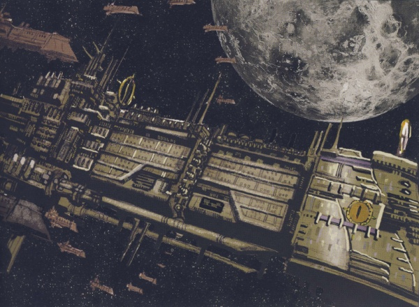
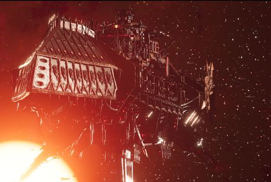

# 1571 复仇之魂号 Vengeful Spirit

精校状态：中文行文已逐段精校，部分术语仍为暂定

分类：战舰

原文来源：https://www.bilibili.com/opus/1066359964968157188

原作者：帝国神选罐头

原文时间：2025年05月13日 15:01

[返回分类目录](目录.md) · [全书目录](../../目录.md)

<!-- A1571-B0001 -->
**英文原文**

The Vengeful Spirit is a Gloriana Class Battleship that served as the flagship of the Warmaster Horus during the Great Crusade and the Horus Heresy. Today, it serves as the flagship of Abaddon the Despoiler and the Black Legion.

<!-- /A1571-B0001 -->

<!-- A1571-B0002 -->

原译文

复仇之魂号是一艘荣光女王级战列舰，在大远征和荷鲁斯叛乱期间曾是战帅荷鲁斯的旗舰。如今，它是掠夺者阿巴顿和黑色军团的旗舰。

**校订译文**

复仇之魂号是一艘荣光女王级战列舰，在大远征和荷鲁斯之乱期间曾是战帅荷鲁斯的旗舰。如今，它是掠夺者阿巴顿和黑色军团的旗舰。

<!-- /A1571-B0002 -->

<!-- A1571-B0003 图片 -->

<!-- A1571-B0004 -->

原译文

The Vengeful Spirit during the Horus Heresy 荷鲁斯叛乱期间的复仇之魂号

**校订译文**

The Vengeful Spirit during the Horus Heresy 荷鲁斯之乱期间的复仇之魂号

**校注：** Horus Heresy图注与正文沿已核官方名称统一。

<!-- /A1571-B0004 -->

<!-- A1571-B0005 -->
## Overview 概述

<!-- /A1571-B0005 -->

<!-- A1571-B0006 -->
### Great Crusade & Horus Heresy 大远征&荷鲁斯叛乱

<!-- /A1571-B0006 -->

<!-- A1571-B0007 -->
**英文原文**

The Vengeful Spirit is an ancient vessel, constructed in the 30th Millennium by the artisans of Mars. The Vengeful Spirit was one of the largest of the Gloriana-class command vessels alongside the Hrafnkel, Conqueror, and Iron Blood. Heavily armed, the Vengeful Spirit gained a formidable reputation during the Great Crusade as the command ship of Primarch and later Imperial Warmaster Horus Lupercal. The mere arrival of the Vengeful Spirit would often result in the surrender of an entire star system.

<!-- /A1571-B0007 -->

<!-- A1571-B0008 -->

原译文

复仇之魂号是一艘古老的船只，由火星的工匠在第30个千年建造。复仇之魂号是荣光女王级指挥舰中最大的一艘，与赫拉芬克尔号、征服者号和铁血号并列。全副武装的复仇之魂号在大远征期间获得了令人敬畏的声誉，成为原体和后来的帝国战帅荷鲁斯·卢佩卡尔的指挥舰。复仇之魂号的到来往往会导致整个星系的投降。

**校订译文**

复仇之魂号是一艘古老的船只，由火星的工匠在第30个千年建造。复仇之魂号是荣光女王级指挥舰中最大的一艘，与赫拉芬克尔号、征服者号和铁血号并列。全副武装的复仇之魂号在大远征期间获得了令人敬畏的声誉，成为原体和后来的帝国战帅荷鲁斯·卢佩卡尔的指挥舰。复仇之魂号的到来往往会导致整个星系的投降。

<!-- /A1571-B0008 -->

<!-- A1571-B0009 -->
**英文原文**

From the strategium, and later Lupercal's Court, upon the command deck, Horus would coordinate the military and diplomatic efforts of the 63rd Expeditionary Fleet, and countless thousands of personnel lived and worked on board. Additionally because it was so old the core of the ship was a rotting, empty labyrinth of filth and rats. Over time as the Sons of Horus became corrupted during the Horus Heresy, it became less of a warship and more of a temple to the dark gods of Chaos whom Horus came to revere. By this time, Horus' throneroom Lupercal's Court existed within its own Warp Pocket Dimension inside the ship, and inside this lair Horus, often accompanied by Zardu Layak, spent much of his time comatose as his spirit walked the Empyrean.

<!-- /A1571-B0009 -->

<!-- A1571-B0010 -->

原译文

从战略室到后来的卢佩卡尔王庭，在指挥甲板上，荷鲁斯将协调第63远征舰队的军事和外交努力，无数人员在船上生活和工作。此外，由于它太旧了，船的核心是一个腐烂的、空荡荡的污秽和老鼠迷宫。随着时间的推移，荷鲁斯之子在荷鲁斯叛乱期间变得腐败，它不再是一艘战舰，而更多地成为了荷鲁斯所崇拜的混沌黑暗诸神的神殿。到这个时候，荷鲁斯的休息室卢佩卡尔王庭已经存在于飞船内自己的亚空间口袋维度内，在这个巢穴里，荷鲁斯经常在扎杜·拉亚克的陪伴下，大部分时间都处于昏迷状态，因为他的灵魂在至高天中行走。

**校订译文**

荷鲁斯先在指挥甲板的战略室、后来在卢佩卡尔王庭，统筹第63远征舰队的军事与外交事务，舰上有无数人员生活工作。但舰龄古老，核心区域已成为污秽鼠患滋生、空旷腐朽的迷宫。随着荷鲁斯之子在叛乱中堕落，战舰逐渐变成奉祀混沌诸神的神殿。王座厅卢佩卡尔王庭甚至形成舰内独立的亚空间口袋维度。荷鲁斯经常在扎度·拉亚克陪伴下长时间昏睡，而灵魂则游走于至高天。

<!-- /A1571-B0010 -->

<!-- A1571-B0011 -->
**英文原文**

During the final hours of the Siege of Terra, the Vengeful Spirit had essentially become an extension of Horus' will. So corrupted had the vessel become that it was now acting as a conduit to drag Terra itself into the Warp. Horus' psychic connection to the ship allowed him to lower its shields with a thought to bait the Emperor to him before Roboute Guilliman's fleet could arrive. Thus, when the Emperor led a teleportation assault on the Vengeful Spirit the attackers became scattered throughout the vessel and fell prey to many of the daemonic and surreal traps Horus had prepared. The final battle between Horus and the Emperor took place aboard the Vengeful Spirit, ending in Horus' death and the Emperor's grievous wounding.

<!-- /A1571-B0011 -->

<!-- A1571-B0012 -->

原译文

在泰拉围城的最后几个小时里，复仇之魂号基本上已经成为荷鲁斯意志的延伸。这艘船已经变得如此腐败，以至于它现在充当了将泰拉本身拖入亚空间的管道。荷鲁斯与这艘船的灵能联系使他能够放下护盾，想在罗伯特·基里曼的舰队到达之前引诱帝皇。因此，当帝皇对复仇之魂号发起传送攻击时，攻击者分散在船上，成为荷鲁斯准备的许多恶魔和超现实陷阱的牺牲品。荷鲁斯和帝皇之间的最后一场战斗发生在复仇之魂号上，以荷鲁斯的死亡和帝皇的重伤告终。

**校订译文**

泰拉围城最后数小时，复仇之魂号几乎已成为荷鲁斯意志的延伸，腐化到充当将泰拉拖入亚空间的通道。荷鲁斯仅凭心念便能降下舰盾，诱使帝皇赶在罗保特·基里曼舰队抵达前登舰。当帝皇率军传送突入时，突击者被分散到舰内各处，落入荷鲁斯布置的恶魔与超现实陷阱。两人的最后决战发生于舰上，以荷鲁斯死亡、帝皇重伤告终。

<!-- /A1571-B0012 -->

<!-- A1571-B0013 -->
**英文原文**

After Horus' death, sanity returned to the Vengeful Spirit and the metaphysical realm which acted as an extension of Horus dissipated. The Spirit became just a ship once more, albeit one forever touched by Chaos. Ezekyle Abaddon was able to reestablish control over the vessel to lead a retreat from the Sol System.

<!-- /A1571-B0013 -->

<!-- A1571-B0014 -->

原译文

荷鲁斯死后，复仇之魂号恢复了理智，作为荷鲁斯延伸的形而上学领域也消散了。复仇之魂号再次变成了一艘船，尽管它永远被混沌所触碰。以泽凯尔·阿巴顿能够重新控制这艘船，从而从太阳系撤退。

**校订译文**

荷鲁斯死后，舰船重归某种正常状态，那个作为他意志延伸的超自然领域消散。它再次成为一艘船，却永远带着混沌印记。以泽凯尔·阿巴顿重新取得控制权，率军撤离太阳系。

<!-- /A1571-B0014 -->

<!-- A1571-B0015 -->
### Post-Heresy 叛乱后

<!-- /A1571-B0015 -->

<!-- A1571-B0016 -->
**英文原文**

Following death of Horus and the defeat of the traitors in The Scouring, the Vengeful Spirit fell under the control First Captain Ezekyle Abaddon. Somehow, the vessel became embedded under the former Eldar world of Asa'ciaral deep within the Eye of Terror. With the Sons of Horus in disarray after the fall of Maleum, an expedition led by Falkus Kibre, Iskandar Khayon, and others eventually managed to find both Abaddon and the Vengeful Spirit. Commanding a fleet once again, Abaddon used the vessel to crush the Emperor's Children and their clone of Horus on Harmony. Shortly before the battle, Iskandar Khayon's preserved sister, now known as the Anamnesis, combined with the Machine Spirit of the Vengeful Spirit, allowing the vessel to operate with minimal crew.

<!-- /A1571-B0016 -->

<!-- A1571-B0017 -->

原译文

荷鲁斯死后，大清洗击败了叛徒，复仇之魂号落入了第一连长以泽凯尔·阿巴顿的控制之下。不知怎么的，这艘船被嵌入了恐惧之眼深处的前灵族世界阿萨’恰拉尔。马勒姆陷落后，荷鲁斯之子陷入混乱，由法库斯·凯博、伊斯坎达尔·卡扬和其他人率领的探险队最终设法找到了阿巴顿和复仇之魂号。阿巴顿再次指挥舰队，用这艘船粉碎了帝皇之子和他们在和谐星上克隆的荷鲁斯。在战斗前不久，伊斯坎达尔·卡扬保存下来的妹妹，现在被称为记忆体，与复仇之魂号的机魂相结合，使该船能够以最少的船员运行。

**校订译文**

荷鲁斯死去、叛军在大清洗中败退之后，复仇之魂号由第一连长以泽凯尔·阿巴顿掌控。后来，它不知为何埋入恐惧之眼深处、曾属于灵族的阿萨’恰拉尔地底。玛勒姆陷落，荷鲁斯之子四分五裂，法库斯·凯博、伊斯坎达尔·卡扬等人率探险队，终于找到了阿巴顿与座舰。重新统领舰队的阿巴顿，随后以此舰在和谐星击败帝皇之子和荷鲁斯克隆体。战前不久，卡扬以特殊方式保存下来的妹妹“记忆体”与舰船机魂融合，使其能由极少舰员维持运作。

<!-- /A1571-B0017 -->

<!-- A1571-B0018 -->
**英文原文**

Following the Battle of Harmony, Abaddon resumed command of the Sons of Horus. The Vengeful Spirit became the flagship of the newly christened Black Legion, a role it continues to this day. The Vengeful Spirit is known to have appeared in the 10th 12th and 13th Black Crusades. During the battle above Cadia in the 13th Black Crusade, the Vengeful Spirit was damaged as it was overwhelmed by Imperial Navy battlegroups, but before it could be finished off retreated with the rest of the Black Legion fleet as a Blackstone Fortress was dropped on the planet.

<!-- /A1571-B0018 -->

<!-- A1571-B0019 -->

原译文

和谐星之战后，阿巴顿恢复了对荷鲁斯之子的指挥。复仇之魂号成为新命名的黑色军团的旗舰，这一角色一直延续到今天。众所周知，复仇之魂号出现在第10、12和13次黑色远征中。在第13次黑色远征卡迪亚上空的战斗中，复仇之魂号被帝国海军战斗群击溃而受损，但在它被摧毁之前，随着黑石要塞被扔到星球上，它与黑色军团舰队的其他成员一起撤退了。

**校订译文**

和谐星之战后，阿巴顿重新统率荷鲁斯之子；复仇之魂号成为新成立的黑色军团旗舰，并延续至今。它曾参加第十、十二和十三次黑色远征。第十三次远征的卡迪亚轨道战中，帝国海军战斗群将其压制并击伤；尚未将其击毁，黑石要塞便被投向行星，它也随黑色军团舰队撤走。

<!-- /A1571-B0019 -->

<!-- A1571-B0020 图片 -->

<!-- A1571-B0021 -->

原译文

The Vengeful Spirit during the 13th Black Crusade 第十三次黑色远征期间的复仇之魂号

**校订译文**

The Vengeful Spirit during the 13th Black Crusade 第十三次黑色远征期间的复仇之魂号

<!-- /A1571-B0021 -->

<!-- A1571-B0022 -->
**英文原文**

The Vengeful Spirit later reappeared at the head of the massive Chaos armada that invaded Vigilus. Blasting aside all opposition, it went into orbit above the world and was the primary Black Legion command centers. During the climax of the war as Abaddon engaged Marneus Calgar in a duel, the remaining Imperial vessels launched a last-ditch assault on the orbiting Vengeful Spirit. Though 80% of the Imperial ships were lost, Calgar's plan succeeded when he had the allied Eldar stealth vessel Vaul's Ghost collide with the Vengeful Spirit. The Eldar ship detonated a cache of Imperial Deathstrike Missiles, blowing a hole in the Vengeful Spirit and causing catastrophic damage. Facing destruction, the Vengeful Spirit was forced into an emergency Warp Jump. Faced with the prospect of losing his prized flagship and key symbol of authority, Abaddon was forced to withdraw from Vigilus to reach the Vengeful Spirit before it made its Warp transition.

<!-- /A1571-B0022 -->

<!-- A1571-B0023 -->

原译文

复仇之魂号后来再次出现在入侵警戒星的庞大混沌舰队之中。抛开所有抵抗，它进入了世界上空的轨道，是黑色军团的主要指挥中心。在战争最激烈的时候，阿巴顿与马涅乌斯·卡尔加决斗，剩下的帝国船只对轨道上的复仇之魂号发动了最后一搏。尽管80%的帝国船只都失败了，但卡尔加的计划成功了，他让灵族盟军隐形战舰瓦尔幽魂号与复仇之魂号相撞。灵族飞船引爆了帝国死亡直击导弹的藏匿处，在复仇之魂号上炸了一个洞，造成了灾难性的破坏。面对毁灭，复仇之魂号被迫进行紧急亚空间跳跃。面对失去他珍贵的旗舰和权威的关键象征的前景，阿巴顿被迫从警戒星撤军，在复仇之魂号进行亚空间转移之前到达那里。

**校订译文**

后来，它率庞大混沌舰队入侵警戒星，击破沿途抵抗，进入行星轨道，充当黑色军团主要指挥中心。阿巴顿与马涅乌斯·卡尔加决斗时，残余帝国战舰对它发动孤注一掷的攻击，损失达八成。卡尔加的计划仍获成功：灵族盟军隐形舰瓦尔幽灵号撞上旗舰，引爆所载帝国死亡直击导弹，炸开舰体，造成灾难性损伤。复仇之魂号被迫准备紧急跃迁；阿巴顿面临失去珍贵旗舰及权威象征的风险，只得撤出警戒星，赶在跃迁前登舰。

**校注：** Vaul’s Ghost/Vaul's Ghost仅撇号不同，沿684同一舰船定译。

<!-- /A1571-B0023 -->

<!-- A1571-B0024 -->
**英文原文**

Later, the still-repairing Vengeful Spirit was the site of the first meeting between Abaddon and Vashtorr, who hacked into its systems to manifest aboard the flagship. It was subsequently again utilized by Abaddon as his flagship during the Arks of Omen Campaign. The vessel led Black Legion actions at both Magdalor and Idolatros.

<!-- /A1571-B0024 -->

<!-- A1571-B0025 -->

原译文

后来，仍在维修中的复仇之魂号是阿巴顿和瓦什托尔第一次会面的地点，他们入侵了其系统，在旗舰上现身。随后，阿巴顿在噩兆方舟战役中再次将其用作旗舰。该船在马格达洛和盲信星领导了黑色军团的行动。

**校订译文**

尚在维修时，瓦什托尔侵入舰船系统，在舰内显形，与阿巴顿首次会面。随后，阿巴顿仍以此舰为旗舰，参加噩兆方舟战役，指挥黑色军团在马格达洛及盲信星的行动。

<!-- /A1571-B0025 -->

本篇核心术语与暂定项

以下列出本篇出现的英文原形及核心术语表用词。同形词可能指不同对象，具体词义以本篇正文和校注为准；单复数、别名和仅见于图注的名称可能尚未列入。完整候选见[术语表](../../术语表/双语术语候选.csv)。

| 英文 | 采用中文 | 状态 |
| --- | --- | --- |
| Eldar | 灵族 | 暂定·语境区分 |
| Roboute Guilliman | 罗保特·基里曼 | 官方已核对 |
| Horus Heresy | 荷鲁斯之乱 | 官方已核对 |
| Warp | 亚空间 | 官方已核对 |
| Imperial Navy | 帝国海军 | 暂定 |
| Warp Jump | 亚空间跳跃 | 暂定 |
| Teleportation | 传送 | 暂定 |
| Eye of Terror | 恐惧之眼 | 官方已核对 |
| Emperor | 帝皇 | 官方已核对 |
| Primarch | 原体 | 官方已核对 |
| Black Legion | 黑色军团 | 暂定·官方待核 |
| Emperor's Children | 帝皇之子 | 官方已核对 |
| Great Crusade | 大远征 | 暂定·官方待核 |
| Terra | 泰拉 | 暂定·官方待核 |
| Horus | 荷鲁斯 | 暂定·官方待核 |
| Vengeful Spirit | 复仇之魂号 | 暂定·官方待核 |
| Sons of Horus | 荷鲁斯之子 | 暂定·官方待核 |
| Mars | 火星 | 暂定·官方待核 |
| Cadia | 卡迪亚 | 暂定·官方待核 |
| Vigilus | 警戒星 | 暂定·官方待核 |
| Ancient | 旗手 | 官方已核对 |
| Horus Lupercal | 荷鲁斯·卢佩卡尔 | 暂定·官方待核 |
| Lupercal | 卢佩卡尔 | 暂定·官方待核 |
| Maleum | 玛勒姆 | 暂定·官方待核 |
| Falkus Kibre | 法库斯·凯博 | 暂定·官方待核 |
| Sol | 太阳系 | 暂定·官方待核 |
| First Captain | 第一连长 | 暂定·官方待核 |
| Ezekyle Abaddon | 以泽凯尔·阿巴顿 | 暂定·官方待核 |
| Zardu Layak | 扎度·拉亚克 | 暂定·官方待核 |
| Despoiler | 劫掠者 | 暂定·官方待核 |
| Captain | 连长 | 暂定·官方待核 |
| Marneus Calgar | 马涅乌斯·卡尔加 | 暂定·官方待核 |
| Gloriana Class Battleship | 荣光女王级战列舰 | 暂定·官方待核 |
| Blackstone Fortress | 黑石要塞 | 暂定·官方待核 |
| Abaddon the Despoiler | 掠夺者阿巴顿 | 官方已核对 |
| Vaul | 瓦尔 | 暂定·官方待核 |
| Harmony | 和谐星 | 暂定·官方待核 |
| Prospect | 开拓团 | 暂定·官方待核 |
| Iskandar Khayon | 伊斯坎达尔·卡扬 | 暂定·官方待核 |
| Hrafnkel | 赫拉芬克尔号 | 暂定·官方待核 |
| Iron Blood | 铁血（芬里斯部落）／铁血号（舰船） | 语境定译·官方待核 |
| The Dark | 《黑暗》 | 暂定·官方待核 |
| Anamnesis | 记忆体 | 暂定·官方待核 |
| System | 星系（恒星系统） | 暂定·官方待核 |
| Omen | 预兆号 | 暂定·官方待核 |
| Touched | 受触者 | 暂定·官方待核 |
| Magdalor | 马格达洛 | 暂定·官方待核 |
| Deathstrike | 死亡直击导弹车 | 官方已核对 |
| Asa'ciaral | 阿萨’恰拉尔 | 暂定·官方待核 |
| Vaul's Ghost | 瓦尔幽灵号 | 暂定·官方待核 |
| Lupercal's Court | 卢佩卡尔王庭 | 暂定·官方待核 |
| Sol System | 太阳系 | 暂定·官方待核 |

