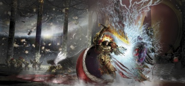

# 1572 卢佩卡尔王庭 Lupercal's Court

精校状态：中文行文已逐段精校，部分术语仍为暂定

分类：战舰

原文来源：https://www.bilibili.com/opus/1068932508627763225

原作者：帝国神选罐头

原文时间：编辑于 2025年06月22日 14:18

[返回分类目录](目录.md) · [全书目录](../../目录.md)

<!-- A1572-B0001 -->
**英文原文**

The Lupercal's Court was a large strategium room located on the starship Vengeful Spirit.

<!-- /A1572-B0001 -->

<!-- A1572-B0002 -->

原译文

卢佩卡尔王庭是位于复仇之魂号星舰上的一个大型战略室。

**校订译文**

卢佩卡尔王庭是位于复仇之魂号星舰上的一个大型战略室。

<!-- /A1572-B0002 -->

<!-- A1572-B0003 图片 -->

<!-- A1572-B0004 -->

原译文

Lupercal's Court during the Siege of Terra 泰拉围城期间的卢佩卡尔王庭

**校订译文**

Lupercal's Court during the Siege of Terra 泰拉围城期间的卢佩卡尔王庭

<!-- /A1572-B0004 -->

<!-- A1572-B0005 -->
## Overview 概述

<!-- /A1572-B0005 -->

<!-- A1572-B0006 -->
**英文原文**

This chamber was created in the waning years of the Great Crusade and during the early start of the Horus Heresy. It was made under the explicit orders of Warmaster Horus who required a large room through which his war council was capable of assembling in. Horus himself sat in a central throne which seemed too small to contain his large frame. Numerous commanders were present with the former members of the Mournival typically standing by the side of the Warmaster.

<!-- /A1572-B0006 -->

<!-- A1572-B0007 -->

原译文

这个房间是在大远征的最后几年和荷鲁斯叛乱的早期开始时创建的。这是在战帅荷鲁斯的明确命令下制作的，他需要一个大房间，他的战争议会可以通过这个房间聚集。荷鲁斯自己坐在一个中央宝座上，这个宝座似乎太小了，无法容纳他巨大的身躯。许多指挥官与通常站在战帅旁边的前四王议会成员一起出席会议。

**校订译文**

大远征末期至荷鲁斯之乱初期，战帅荷鲁斯下令建造这间宽阔议事厅，供战争议会集会。他坐在中央王座上，魁梧的体型几乎使座椅显得狭小。众多指挥官在此参会，原四王议会成员通常侍立于战帅身侧。

<!-- /A1572-B0007 -->

<!-- A1572-B0008 -->
**英文原文**

When the Imperial Expedition of Horus began to secretly prepare for their Heresy against the Emperor, the Remembrancer Order had their movements through the ships restrained with any requests being sent to the Office of the Lupercal's Court. This allowed Horus to keep the civilian population of the fleet contained and trapped so that he was capable of eliminating them when he openly declared his war against his father. During the assault on the rebels in the Isstvan system, Death Guard Primarch Mortarion, World Eaters Primarch Angron and Emperor's Children Lord Commander Eidolon assembled in Lupercal's Court in order to gain instructions on how to take the system.

<!-- /A1572-B0008 -->

<!-- A1572-B0009 -->

原译文

当荷鲁斯的帝国远征队开始秘密准备对帝皇的叛乱时，记述者法令限制了他们在船上的行动，并将任何请求发送给卢佩卡尔王庭的办公处。这使得荷鲁斯能够控制和困住舰队中的平民，以便在公开向父亲宣战时能够消灭他们。在攻击伊斯塔万星系的叛军期间，死亡守卫原体莫塔里安、吞世者原体安格隆和帝皇之子领主指挥官艾多隆聚集在卢佩卡尔王庭，以获得如何夺取该星系的指示。

**校订译文**

荷鲁斯的远征舰队秘密筹备叛乱时，记述者团体在舰内的活动受到限制，所有行动申请都须交卢佩卡尔王庭办公处处理。这样，荷鲁斯便能控制并困住舰队平民，待公开反叛父亲时将他们灭口。进攻伊斯塔万星系叛军期间，死亡守卫原体莫塔里安、吞世者原体安格隆和帝皇之子领主指挥官艾多隆曾在此集会，接受夺取星系的命令。

**校注：** Remembrancer Order指记述者组织，原译“记述者法令”将组织误作命令。

<!-- /A1572-B0009 -->

<!-- A1572-B0010 -->
**英文原文**

By the Siege of Terra, Lupercal's court had become a twisted temple to the Dark Gods. Its banners had been replaced with the symbols of the Ruinous Powers, and eventually the Court existed within the Vengeful Spirit as a sort of pocket dimension. Inside there was little indication of what was going on outside. In the later stages of the Heresy Horus spent much time here, often accompanied by Zardu Layak and scanning the Warp for knowledge while psychically battling the Emperor. During the final battle between Horus and the Emperor, Lupercal's Court resembled a dark cathedral whose form, size, and shape could change depending on the will of Horus. Five thrones (each representing the Four Chaos Gods and a new ascendent fifth god) were erected as the Gods of Chaos watched the battle with glee. After Horus' death, Lupercal's Court returned to some semblance of conventional reason.

<!-- /A1572-B0010 -->

<!-- A1572-B0011 -->

原译文

在泰拉围城中，卢佩卡尔王庭变成了黑暗诸神的扭曲神殿。它的旗帜被毁灭力量的象征所取代，最终王庭作为一种口袋维度存在于复仇之魂号之中。里面几乎没有迹象表明外面发生了什么。在叛乱的后期阶段，荷鲁斯在这里度过了很多时间，经常在扎杜·拉亚克的陪同下，在灵能上与帝皇作战的同时，扫描亚空间以获取知识。在荷鲁斯和帝皇之间的最后一场战斗中，卢佩卡尔王庭就像一座黑暗的大教堂，其形式、大小和形状可能会根据荷鲁斯的意愿而改变。五个王座（代表四个混沌诸神和一个新的升格的第五神）竖立起来，混沌诸神高兴地观看了这场战斗。荷鲁斯死后，卢佩卡尔王庭恢复了某种形式的传统理性。

**校订译文**

到了泰拉围城时期，王庭已变成侍奉黑暗诸神的扭曲神殿，原有旗帜换作毁灭诸力的符号，最终形成舰内的口袋维度。在其中几乎感受不到外界发生之事。叛乱末期，荷鲁斯经常在扎度·拉亚克陪伴下，探索亚空间知识，同时以灵能对抗帝皇。最终决战时，王庭宛如一座黑暗教堂，形态和尺度随荷鲁斯意志变化。五座王座分别象征混沌四神，以及将要升格的第五位神；诸神欣然观看决战。荷鲁斯死后，这里才恢复了某种近乎常理的状态。

**校注：** 原文称new ascendent fifth god，按该段决战叙述翻译，不额外断言第五神已经完成诞生。

<!-- /A1572-B0011 -->

<!-- A1572-B0012 -->
**英文原文**

When Ezekyle Abaddon began assembling the Black Legion, he had Lupercal's Court sealed off, allowing only the Ezekarion to enter.

<!-- /A1572-B0012 -->

<!-- A1572-B0013 -->

原译文

当以泽凯尔·阿巴顿开始组建黑色军团时，他封锁了卢佩卡尔王庭，只允许伊泽凯里昂进入。

**校订译文**

当以泽凯尔·阿巴顿开始组建黑色军团时，他封锁了卢佩卡尔王庭，只允许伊泽凯里昂进入。

<!-- /A1572-B0013 -->

本篇核心术语与暂定项

以下列出本篇出现的英文原形及核心术语表用词。同形词可能指不同对象，具体词义以本篇正文和校注为准；单复数、别名和仅见于图注的名称可能尚未列入。完整候选见[术语表](../../术语表/双语术语候选.csv)。

| 英文 | 采用中文 | 状态 |
| --- | --- | --- |
| Death Guard | 死亡守卫 | 官方已核对 |
| World Eaters | 吞世者 | 官方已核对 |
| Horus Heresy | 荷鲁斯之乱 | 官方已核对 |
| Warp | 亚空间 | 官方已核对 |
| Emperor | 帝皇 | 官方已核对 |
| Primarch | 原体 | 官方已核对 |
| Black Legion | 黑色军团 | 暂定·官方待核 |
| Emperor's Children | 帝皇之子 | 官方已核对 |
| Great Crusade | 大远征 | 暂定·官方待核 |
| Mortarion | 莫塔里安 | 官方已核对 |
| Terra | 泰拉 | 暂定·官方待核 |
| Horus | 荷鲁斯 | 暂定·官方待核 |
| Vengeful Spirit | 复仇之魂号 | 暂定·官方待核 |
| Thrones | 王座币 | 暂定·官方待核 |
| Lupercal | 卢佩卡尔 | 暂定·官方待核 |
| Mournival | 四王议会 | 暂定·官方待核 |
| Lord Commander | 领主指挥官 | 暂定·官方待核 |
| Isstvan | 伊斯塔万 | 暂定·官方待核 |
| Eidolon | 艾多隆 | 暂定·官方待核 |
| Ezekyle Abaddon | 以泽凯尔·阿巴顿 | 暂定·官方待核 |
| Zardu Layak | 扎度·拉亚克 | 暂定·官方待核 |
| Powers | 能天使 | 暂定·官方待核 |
| Ruinous Powers | 毁灭诸力 | 暂定·官方待核 |
| Angron | 安格隆 | 官方已核对 |
| Ezekarion | 伊泽凯里昂 | 暂定·官方待核 |
| The Dark | 《黑暗》 | 暂定·官方待核 |
| System | 星系（恒星系统） | 暂定·官方待核 |
| War Council | 战争议会 | 暂定·官方待核 |
| The Waning | 大衰落 | 暂定·官方待核 |
| Lupercal's Court | 卢佩卡尔王庭 | 暂定·官方待核 |
| Office of the Lupercal's Court | 卢佩卡尔王庭办公处 | 暂定·官方待核 |

