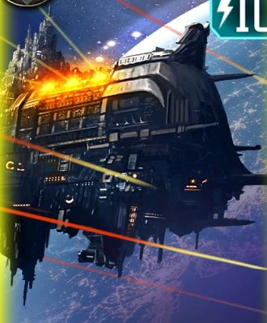

# 1573 无敌理性号 Invincible Reason

精校状态：中文行文已逐段精校，部分术语仍为暂定

分类：战舰

原文来源：https://www.bilibili.com/opus/1189119248478240788

原作者：帝国神选罐头

原文时间：2026年04月09日 10:30

[返回分类目录](目录.md) · [全书目录](../../目录.md)

<!-- A1573-B0001 -->
**英文原文**

The Invincible Reason was a Gloriana Class Battleship which served as the flagship of the Dark Angels Legion during the Great Crusade and Horus Heresy.

<!-- /A1573-B0001 -->

<!-- A1573-B0002 -->

原译文

无敌理性号是一艘荣光女王级战列舰，在大远征和荷鲁斯叛乱期间担任黑暗天使军团的旗舰。

**校订译文**

无敌理性号是一艘荣光女王级战列舰，在大远征和荷鲁斯之乱期间担任黑暗天使军团的旗舰。

<!-- /A1573-B0002 -->

<!-- A1573-B0003 图片 -->

<!-- A1573-B0004 -->

原译文

The Invincible Reason 无敌理性号

**校订译文**

The Invincible Reason 无敌理性号

<!-- /A1573-B0004 -->

<!-- A1573-B0005 -->
## Overview 概述

<!-- /A1573-B0005 -->

<!-- A1573-B0006 -->
**英文原文**

The Invincible Reason was the first Gloriana-class vessel to be constructed. As a result, it had a level of detail and craftsmanship not seen in subsequent vessels. During the Great Crusade, Castellan Duriel was installed into its command chair and was in command of the vessel when The Lion was not aboard.

<!-- /A1573-B0006 -->

<!-- A1573-B0007 -->

原译文

无敌理性号是第一艘建造的荣光女王级战舰。因此，它具有后续战舰所没有的细节和工艺水平。在大远征期间，堡主督瑞尔被任命为指挥席，并在莱昂不在舰上时指挥这艘战舰。

**校订译文**

它是首艘建成的荣光女王级，细节与工艺之精，后来同级舰也未能复制。大远征期间，堡主杜里尔坐镇指挥席，莱昂不在舰上时便由他指挥。

<!-- /A1573-B0007 -->

<!-- A1573-B0008 -->
**英文原文**

The Invincible Reason was a colossal vessel even by the standards of other Gloriana class Battleships, stretching out a total of twenty-eight kilometres from bow to stern, with a grand processional positioned under its dorsoventral spine that ran the entire length of the ship. Along this were inbuilt strongpoints that would serve as checkpoints for thousands of her million-strong crew of men and women to transit through every hour while attending to their duties. When they did, their transit authorisations, ident wafers, order papers and subdermal signum pips were scanned and verified in a largely automated process. As high-grade servitors encased in polished metal, outfitted with subtle First Legion devices bearing the manufactory stamp of the Ural forges, issued ­dozens of authorisations every second. A system of grav-trains also ran throughout the ship, and could transport anything from super-heavy equipment to crew personnel to various points within the vessel. While the hangers of the Invincible Reason could accommodate landmass sized squadrons of super-heavy craft, such as Monarch heavy landers.

<!-- /A1573-B0008 -->

<!-- A1573-B0009 -->

原译文

即使按照其他荣光女王级战列舰的标准，无敌理性号也是巨大的，从船首到船尾总长28公里，其脊部背腹下有一个庞大的宏伟游行大道，贯穿整艘船。沿着这条路，有一些内置的据点，作为检查站，让成千上万的男女船员在履行职责的同时每小时经过。当他们这样做时，他们的经过授权、身份晶片、命令文件和皮下符点都会在很大程度上自动化的过程中进行扫描和验证。作为被抛光金属包裹的高级机仆，配备了带有乌拉尔铸造厂印章的微妙的第一军团设备，每秒都会发出数十份批准。重力列车系统也贯穿整艘船，可以将从超重型设备到船员的任何东西运送到船内的各个地点。而无敌理性号的吊架可以容纳地块大小的超重型飞船中队，如君主重型登陆舰。

**校订译文**

即使与其他荣光女王级相比，无敌理性号也堪称巨舰，从首至尾长28公里。舰体脊梁下是一条贯穿全长的宏伟仪典大道，沿途内置据点充当检查站。百万舰员中，每小时都有数千人因公务经过，通行授权、身份晶片、命令文书及皮下识别标记主要由自动系统核验。高级机仆外覆抛光金属，配备出自乌拉尔铸造厂、带有第一军团风格的精密设备，每秒可处理数十次授权。全舰重力列车能将超重型设备或人员送往各处；庞大机库则足以容纳由君主重型登陆艇等超重型飞行器组成、规模如陆块的机群。

<!-- /A1573-B0009 -->

<!-- A1573-B0010 -->
**英文原文**

The internal layout of the Invincible Reason is a puzzle designed to baffle any who have not earned the privilege of being there, and it is said that there is no such thing as an easy route aboard her. Journeys across the ship would take her mortal serfs the better part of a day to complete, although the Dark Angels themselves can do it in under an hour, as their legion-priority overrides grant them access to the vessel’s mag-lifts and grav-rails.

<!-- /A1573-B0010 -->

<!-- A1573-B0011 -->

原译文

无敌理性号的内部布局是一个谜题，旨在让任何没有获得在那里的特权的人感到困惑，据说船上没有简单的路线。穿越舰船的旅程需要她的凡人侍从花上一天的大部分时间才能完成，尽管黑暗天使自己可以在一个小时内完成，因为他们的军团优先权赋予了他们进入战舰的磁力升降机和重力轨道的权利。

**校订译文**

舰内布局如迷宫，专为阻挠无权进入者设计，据说没有一条轻松可行的路线。凡人农奴横穿全舰需花去大半天，黑暗天使却凭军团优先权限使用磁力升降机和重力轨道，不到一小时就能走完。

<!-- /A1573-B0011 -->

<!-- A1573-B0012 -->
**英文原文**

In contrast to most expeditionary vessels, the Invincible Reason, like other First Legion warships, lacked the typical hordes of crimson robed tech-priests beetling about its interiors. As the Dark Angel’s forge-wrights and Techmarines were capable of tending to all but the most arcane and intemperate of its technologies themselves, and did so.

<!-- /A1573-B0012 -->

<!-- A1573-B0013 -->

原译文

与大多数远征战舰相比，无敌理性号和其他第一军团战舰一样，缺乏典型的成群穿着深红色长袍的技术神甫在内部徘徊。作为黑暗天使的铸造工匠和技术军士，他们能够处理除最神秘和最无节制的技术之外的所有技术，并且做到了这一点。

**校订译文**

与大多数远征舰不同，无敌理性号和其他第一军团舰船里，看不到成群红袍技术祭司来回忙碌。除最玄奥、最难驾驭的技术外，黑暗天使自己的铸造工匠和科技战士就能负责维护。

<!-- /A1573-B0013 -->

<!-- A1573-B0014 -->
**英文原文**

For weaponry the Invincible Reason possessed lances and many hundreds of Macro-ordnance batteries.

<!-- /A1573-B0014 -->

<!-- A1573-B0015 -->

原译文

在武器方面，无敌理性好拥有光矛和数百个宏军械阵列。

**校订译文**

舰上武装包括光矛和数百组宏型舰炮。

<!-- /A1573-B0015 -->

<!-- A1573-B0016 -->
## History 历史

<!-- /A1573-B0016 -->

<!-- A1573-B0017 -->
## Horus Heresy 荷鲁斯之乱

原题：Horus Heresy 荷鲁斯叛乱

<!-- /A1573-B0017 -->

<!-- A1573-B0018 -->
**英文原文**

The personal ship of Primarch Lion El'Jonson, the Invincible Reason led the Dark Angels' effort in the Rangdan Xenocides, the Battle of Diamat, and the Thramas Crusade. Following the Thramas ambush against the Night Lords, Konrad Curze became stranded on board the Invincible Reason for a time. However, the Night Haunter found ample hiding places on the immense vessel, and terrorized the bowels of the ship despite repeated Dark Angels search parties. He eventually left the vessel when the Lion led the Dark Angels' fleet to Macragge.

<!-- /A1573-B0018 -->

<!-- A1573-B0019 -->

原译文

莱昂·艾尔庄森的个人舰船，无敌理性号，领导了黑暗天使在冉丹种族灭绝、迪亚马特之战和萨拉玛斯远征中的努力。在萨拉玛斯伏击午夜领主之后，康拉德·科兹被困在无敌理性号上一段时间。然而，午夜幽魂在这艘巨大的战舰上找到了充足的藏身之处，尽管黑暗天使多次搜查，他还是恐吓了船的内部。当莱昂率领黑暗天使舰队前往马库拉格时，他最终离开了战舰。

**校订译文**

作为莱昂·艾尔’庄森的座舰，无敌理性号曾率黑暗天使参加冉丹灭绝战争、迪亚马特之战和萨拉玛斯远征。伏击午夜领主后，康拉德·科兹一度被困舰内。巨大的舰体却为午夜幽魂提供了无数藏身处，他在深层舰区散播恐怖，黑暗天使多次搜捕仍无法将其制服。直到莱昂率舰队抵达马库拉格，他才离舰。

<!-- /A1573-B0019 -->

<!-- A1573-B0020 -->
**英文原文**

Upon the defeat of Curze on Macragge by the Lion, the Night Lords Primarch was again chained within the Invincible Reason. Following the abolition of Imperium Secundus and the journey by Roboute Guilliman and Sanguinius through the Ruinstorm to try and reach Terra, the vessel was part of the combined loyalist fleet. However, upon the arrival at Davin, Sanguinius boarded the Invincible Reason and took the captive Curze with him for his own pilgrimage on the world, dispatching several Dark Angels guards through non-lethal force in the process. In the subsequent Second Battle of Davin the Invincible Reason engaged in a vicious duel with the Daemonship Veritas Ferrum.

<!-- /A1573-B0020 -->

<!-- A1573-B0021 -->

原译文

在科兹在马库拉格被莱昂击败后，午夜领主原体再次被束缚在无敌理性号之中。随着第二帝国的废除，以及罗伯特·基里曼和圣吉列斯穿越毁灭风暴试图到达泰拉，这艘战舰成为了联合忠诚派舰队的一部分。然而，在抵达戴文后，圣吉列斯登上了无敌理性号，并带着被俘的科兹前往世界朝圣，在此过程中通过非致命武力处理了几名黑暗天使守卫。在随后的第二次戴文之战中，无敌理性号与恶魔舰钢铁真理号进行了激烈的决斗。

**校订译文**

科兹在马库拉格败于莱昂之后，再度被锁在舰内。第二帝国解散，罗保特·基里曼与圣吉列斯尝试穿越毁灭风暴、驰援泰拉，无敌理性号也加入忠诚派联合舰队。抵达戴文时，圣吉列斯登舰，以不致命的手段制服数名黑暗天使守卫，带走科兹，一同前往地表完成自己的朝圣。随后，舰船在第二次戴文之战中与恶魔舰钢铁真理号激烈交锋。

<!-- /A1573-B0021 -->

<!-- A1573-B0022 -->
**英文原文**

Later during The Lion's Exterminatus of Barbarus the Invincible Reason was attacked by the Emperor's Children Heavy Cruiser Sybarite, which was now possessed entirely by a Daemon. The Invincible Reason was heavily damaged in the battle after the Sybarite rammed it. The vessel sought repairs on the Forge World of Thagria.

<!-- /A1573-B0022 -->

<!-- A1573-B0023 -->

原译文

后来，在莱昂对巴巴鲁斯的灭绝令中，无敌理性号遭到了帝皇之子重型巡洋享乐者号的袭击，该巡洋舰现在完全被一个恶魔所占据。在享乐者号撞击后，无敌理性号在战斗中严重受损。该战舰在塔格里亚铸造世界寻求维修。

**校订译文**

莱昂后来对巴巴鲁斯执行灭绝令时，已完全被恶魔附体的帝皇之子重巡洋舰享乐者号袭击无敌理性号，并以撞击使其重创。它随后前往铸造世界塔格里亚维修。

<!-- /A1573-B0023 -->

<!-- A1573-B0024 -->
## Post-Heresy 叛乱后

<!-- /A1573-B0024 -->

<!-- A1573-B0025 -->
**英文原文**

The Invincible Reason survived the Heresy and today remains the flagship of the Dark Angels fleet. During the Siege of the Fenris System, Azrael led his operation from the vessel.

<!-- /A1573-B0025 -->

<!-- A1573-B0026 -->

原译文

无敌理性号在叛乱中幸存下来，今天仍然是黑暗天使舰队的旗舰。在芬里斯星系围攻期间，阿兹瑞尔从战舰上指挥了他的行动。

**校订译文**

无敌理性号在叛乱中幸存下来，今天仍然是黑暗天使舰队的旗舰。在芬里斯星系围攻期间，阿兹瑞尔从战舰上指挥了他的行动。

<!-- /A1573-B0026 -->

<!-- A1573-B0027 -->
## Notable Locations 著名地点

<!-- /A1573-B0027 -->

<!-- A1573-B0028 -->

原译文

The Dreadwing Sacristy 死翼圣器收藏室

**校订译文**

The Dreadwing Sacristy 恐翼圣器室

**校注：** Dreadwing为恐翼，原译死翼混同Deathwing。

<!-- /A1573-B0028 -->

本篇核心术语与暂定项

以下列出本篇出现的英文原形及核心术语表用词。同形词可能指不同对象，具体词义以本篇正文和校注为准；单复数、别名和仅见于图注的名称可能尚未列入。完整候选见[术语表](../../术语表/双语术语候选.csv)。

| 英文 | 采用中文 | 状态 |
| --- | --- | --- |
| Dark Angels | 黑暗天使 | 官方已核对 |
| Roboute Guilliman | 罗保特·基里曼 | 官方已核对 |
| Horus Heresy | 荷鲁斯之乱 | 官方已核对 |
| Imperium | 帝国 | 暂定·简称 |
| Equipment | 装备 | 编辑用语已统一 |
| Emperor | 帝皇 | 官方已核对 |
| Primarch | 原体 | 官方已核对 |
| Forge World | 铸造世界 | 暂定·官方待核 |
| Emperor's Children | 帝皇之子 | 官方已核对 |
| Night Lords | 午夜领主 | 暂定·官方待核 |
| Great Crusade | 大远征 | 暂定·官方待核 |
| Barbarus | 巴巴鲁斯 | 暂定·官方待核 |
| Terra | 泰拉 | 暂定·官方待核 |
| Horus | 荷鲁斯 | 暂定·官方待核 |
| Lion El'Jonson | 莱昂·艾尔’庄森 | 官方已核对 |
| Diamat | 迪亚马特 | 暂定·官方待核 |
| Konrad Curze | 康拉德·科兹 | 暂定·官方待核 |
| Thramas Crusade | 萨拉玛斯远征 | 暂定·官方待核 |
| Fenris | 芬里斯 | 暂定·官方待核 |
| Davin | 戴文 | 暂定·官方待核 |
| Macragge | 马库拉格 | 暂定·官方待核 |
| Imperium Secundus | 第二帝国 | 暂定·官方待核 |
| Tech | 技术语 | 暂定·官方待核 |
| Stamp | 印块 | 暂定·官方待核 |
| Rangdan Xenocides | 冉丹灭绝战争 | 暂定·官方待核 |
| Signum | 目标指示器 | 暂定·官方待核 |
| Azrael | 阿兹瑞尔 | 官方已核 |
| Gloriana Class Battleship | 荣光女王级战列舰 | 暂定·官方待核 |
| Mortal | 凡人 | 暂定·官方待核 |
| Castellan | 堡主 | 官方已核对 |
| Rangdan | 冉丹 | 暂定·官方待核 |
| Duriel | 杜里尔 | 暂定·官方待核 |
| Veritas Ferrum | 钢铁真理号 | 暂定·官方待核 |
| Invincible Reason | 无敌理性号 | 暂定·官方待核 |
| The Dark | 《黑暗》 | 暂定·官方待核 |
| Ruinstorm | 毁灭风暴 | 暂定·官方待核 |
| System | 星系（恒星系统） | 暂定·官方待核 |
| Ferrum | 钢铁号 | 暂定·官方待核 |
| Thagria | 塔格里亚 | 暂定·官方待核 |

