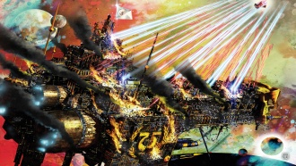
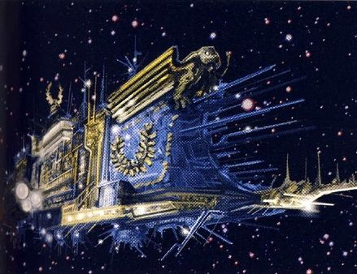
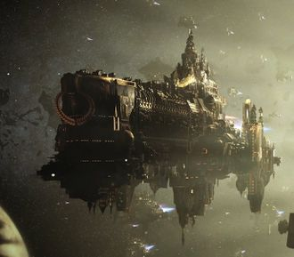
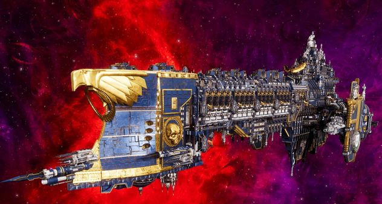
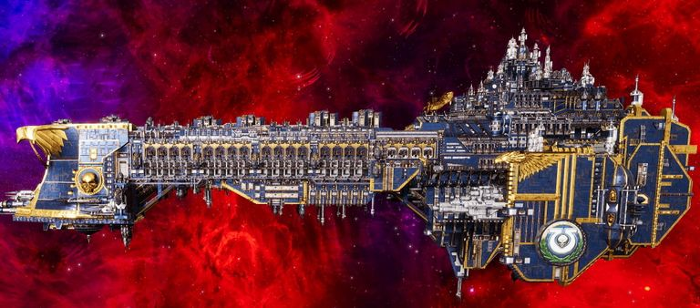

# 1574 马库拉格之耀号 Macragge's Honour

精校状态：中文行文已逐段精校，部分术语仍为暂定

分类：战舰

原文来源：https://www.bilibili.com/opus/1189126979407839248

原作者：帝国神选罐头

原文时间：2026年04月09日 11:00

[返回分类目录](目录.md) · [全书目录](../../目录.md)

<!-- A1574-B0001 -->
**英文原文**

Macragge's Honour is a 26 kilometer-long Gloriana Class Battleship and the flagship of the Ultramarines Legion's space fleet during the latter years of the Great Crusade, and the opening of the Horus Heresy. Currently it serves as flagship for Imperial Regent Roboute Guilliman.

<!-- /A1574-B0001 -->

<!-- A1574-B0002 -->

原译文

马库拉格之耀号是一艘26公里长的荣光女王级战列舰，是大远征后期和荷鲁斯叛乱开始期间极限战士军团太空舰队的旗舰。目前，它是帝国摄政罗伯特·基里曼的旗舰。

**校订译文**

马库拉格之耀号是一艘长26公里的荣光女王级战列舰，在大远征后期与荷鲁斯之乱初期担任极限战士军团舰队旗舰。如今，它是帝国摄政罗保特·基里曼的旗舰。

<!-- /A1574-B0002 -->

<!-- A1574-B0003 图片 -->

<!-- A1574-B0004 -->

原译文

The Macragge's Honour engages in its infamous duel with the Infidus Imperator during the Horus Heresy 在荷鲁斯叛乱期间，马库拉格之耀号与伪帝号进行了著名的决斗

**校订译文**

The Macragge's Honour engages in its infamous duel with the Infidus Imperator during the Horus Heresy 在荷鲁斯之乱期间，马库拉格之耀号与伪帝号进行了著名的决斗

**校注：** Horus Heresy图注与正文沿已核官方名称统一。

<!-- /A1574-B0004 -->

<!-- A1574-B0005 -->
## History 历史

<!-- /A1574-B0005 -->

<!-- A1574-B0006 -->
### Heresy-era 叛乱时期

<!-- /A1574-B0006 -->

<!-- A1574-B0007 -->
**英文原文**

Shortly before the Battle of Calth, the Macragge's Honour was Roboute Guilliman's headquarters for coordinating the muster of the Legion for its planned deployment to the Veridian system.

<!-- /A1574-B0007 -->

<!-- A1574-B0008 -->

原译文

在考斯之战前不久，马库拉格之耀号是罗伯特·基里曼的总部，负责协调军团的集结，以计划部署到维瑞迪安星系。

**校订译文**

考斯之战前夕，基里曼以此舰为指挥总部，协调军团集结，准备按计划部署至维里迪亚星系。

<!-- /A1574-B0008 -->

<!-- A1574-B0009 图片 -->

<!-- A1574-B0010 -->

原译文

Macragge's Honour 马库拉格之耀号

**校订译文**

Macragge's Honour 马库拉格之耀号

<!-- /A1574-B0010 -->

<!-- A1574-B0011 -->
**英文原文**

The ship came under attack from the Word Bearers' ambush, and was overrun with daemons, but was purged through the combined efforts of Guilliman, Chapter Master Marius Gage, and Sergeant Aeonid Thiel. Guilliman and a force of fifty Ultramarines also used the Macragge's Honour teleport pad to launch an assault on the orbital weapons platform occupied by Kor Phaeron and his Gal Vorbak elite warriors. When the battle turned in the Ultramarines' favour, Kor Phaeron and his surviving men retreated to the Word Bearers' flagship Infidus Imperator and attempted to flee the system. Guilliman ordered Gage to follow in the Honour, leading to one of the most infamous naval duels in Imperial history. Macragge's Honour would ultimately destroy the Word Bearers vessel, though in the process, it would end up becalmed in the warp. The Samothrace became Guilliman's new temporary flagship. Sometime later during the Heresy, the Macragge's Honour was boarded by enemy forces as they attempted to target Guilliman's surrogate mother, Tarasha Euten.

<!-- /A1574-B0011 -->

<!-- A1574-B0012 -->

原译文

这艘船遭到了怀言者伏击的袭击，被恶魔占据，但在基里曼、战团长马吕斯·盖奇和军士埃奥尼德·希尔的共同努力下被清除。基里曼和一支由50名极限战士组成的部队还使用马库拉格之耀号的传送平台对科尔·法伦和他的受祝之子精英战士占领的轨道武器平台发动了攻击。当战斗转向对极限战士有利时，科尔·法伦和他幸存的部下撤退到了怀言者的旗舰伪帝号，并试图逃离该星系。吉利曼命令盖奇让马库拉格之耀号追上，导致了帝国历史上最著名的海军决斗之一。马库拉格之耀号最终将摧毁怀言者战舰，尽管在这个过程中，它最终会在亚空间中停滞。萨莫色雷斯号成为基里曼的新临时旗舰。在叛乱时期的之后某个时候，当敌军试图袭击基里曼的养母塔拉莎·尤顿时，马库拉格之耀号被敌军跳帮。

**校订译文**

怀言者伏击时，恶魔侵入舰内；基里曼、战团长马吕斯·盖奇与军士伊奥尼德·希尔合力将其肃清。随后，基里曼率50名极限战士借舰上传送台，突击科尔·法伦及受祝之子精锐占据的轨道武器平台。战局转向极限战士后，科尔·法伦带残部逃上旗舰伪帝号，试图撤出星系。基里曼命盖奇驾驶马库拉格之耀号追击，由此爆发帝国历史上最著名的舰战之一。它最终摧毁伪帝号，却滞留亚空间，基里曼于是暂用萨莫色雷斯号为旗舰。叛乱期间的另一个时点，敌军还曾登上马库拉格之耀号，试图袭击基里曼的养母塔拉莎·尤顿。

<!-- /A1574-B0012 -->

<!-- A1574-B0013 -->
**英文原文**

Macragge's Honour eventually made its way back to Imperial space. The vessel took part in various campaigns during the Great Scouring against scattered remnants of the Traitor Legions.

<!-- /A1574-B0013 -->

<!-- A1574-B0014 -->

原译文

马库拉格之耀号最终回到了帝国恐惧。这艘战舰在大轻型期间参加了各个战役，对抗分散的叛徒军团残余。

**校订译文**

马库拉格之耀号最终重返帝国宙域，在大清洗期间参与多场战役，追剿分散的叛徒军团残部。

**校注：** Imperial space应为帝国宙域，原“帝国恐惧”有误；Great Scouring为大清洗，原“大轻型”有误。

<!-- /A1574-B0014 -->

<!-- A1574-B0015 图片 -->

<!-- A1574-B0016 -->

原译文

The Macragge's Honour in the modern era 当下时代的马库拉格之耀号

**校订译文**

The Macragge's Honour in the modern era 当下时代的马库拉格之耀号

<!-- /A1574-B0016 -->

<!-- A1574-B0017 -->
### Post-Heresy 叛乱后

<!-- /A1574-B0017 -->

<!-- A1574-B0018 -->
**英文原文**

By M41, the Ultramarines, now a Chapter, still possessed the Macragge's Honour. It was later used as the flagship of the revived Guilliman during the Terran Crusade, but was captured by the Red Corsairs in the Maelstrom. As Guilliman and his warriors escaped captivity from a Webway Portal, the Macragge's Honour was still in the hands of the Red Corsairs. The Red Corsairs Warlord Verngar later moved the vessel to New Badab in The Maelstrom.

<!-- /A1574-B0018 -->

<!-- A1574-B0019 -->

原译文

到了M41，现在已经是一个战团的极限战士仍然拥有马库拉格之耀号。后来，它在泰拉远征期间被用作复活的基里曼的旗舰，但在大漩涡中被红海盗占领。当基里曼和他的战士从网道门户逃脱时，马库拉格之耀号仍然掌握在红海盗手中。红海盗军阀文加尔后来将该战舰移至大漩涡中的新巴达布。

**校订译文**

到了M41，现在已经是一个战团的极限战士仍然拥有马库拉格之耀号。后来，它在泰拉远征期间被用作复活的基里曼的旗舰，但在大漩涡中被红海盗占领。当基里曼和他的战士从网道门户逃脱时，马库拉格之耀号仍然掌握在红海盗手中。红海盗军阀弗恩加尔后来将该战舰移至大漩涡中的新巴达布。

<!-- /A1574-B0019 -->

<!-- A1574-B0020 -->
**英文原文**

During the Red Corsairs attack on Ogrys, Huron Blackheart intentionally engineered the abandonment of the vessel to the Ultramarines. The Blood Reaver had deemed the vessel too troublesome due to its loyal Machine Spirit, and moreover was able to use its abandonment as a means to curb the power of Verngar. Thereafter, the Ultramarines and Guilliman were able to reacquire the Macragge's Honour. The vessel served as Guilliman's flagship during the subsequent parts of Crusade and was extensively refitted to accommodate the Primarch.

<!-- /A1574-B0020 -->

<!-- A1574-B0021 -->

原译文

在红海盗袭击奥格里斯期间，休伦·黑心故意将该战舰遗弃给了极限战士。鲜血收割者认为这艘战舰太麻烦了，因为它忠诚的机魂，而且能够利用它的废弃来遏制文加尔的力量。此后，极限战士和基里曼得以重新获得马库拉格之耀号。在远征的后续部分，该战舰充当了吉利曼的旗舰，并进行了广泛的改装，以适应原体。

**校订译文**

红海盗进攻奥格里斯时，休伦·黑心故意安排弃舰，让极限战士将其收回。忠诚的机魂使这艘舰极难控制，鲜血收割者也借此削弱弗恩加尔的权势。极限战士与基里曼因此重获座舰。它经过大规模改装，以适应原体需要，继续担任远征后续阶段的旗舰。

<!-- /A1574-B0021 -->

<!-- A1574-B0022 图片 -->

<!-- A1574-B0023 -->

原译文

Macragge's Honour 马库拉格之耀号

**校订译文**

Macragge's Honour 马库拉格之耀号

<!-- /A1574-B0023 -->

<!-- A1574-B0024 -->
## Conflicting sources 来源冲突

<!-- /A1574-B0024 -->

<!-- A1574-B0025 -->
**英文原文**

There are conflicting accounts given for when Macragge's Honour managed to regain contact with Imperial space following the Battle of the Macragge's Honour. In the novel Of Honour and Iron, the vessel is depicted as active in campaigns during the Great Scouring (specifically in a campaign against the Iron Warriors on Quradim) under the command of Roboute Guilliman. However, in the earlier novel Dark Imperium, Guilliman notes during the Indomitus Crusade (prior to the Battle of Raukos) that Macragge's Honour didn't reach safe port until after Guilliman had been mortally wounded and rendered comatose in the Battle of Thessala.

<!-- /A1574-B0025 -->

<!-- A1574-B0026 -->

原译文

关于马库拉格之耀号在马库拉格之耀之战后何时设法重新与帝国空域取得联系，存在相互矛盾的说法。在小说《荣誉与钢铁》中，该战舰被描绘为在罗伯特·基里曼的指挥下，在大清洗期间积极参与战役（特别是在库拉迪姆对抗钢铁勇士的战役中）。 然而，在更早的小说《黑暗帝国》中，基里曼在不屈远征（劳科斯之战之前）中提到，马库拉格之耀号直到基里曼在塞萨拉之战中身受致命重伤并陷入昏迷后才抵达安全港口。

**校订译文**

对于考斯之后何时重返帝国，来源存在矛盾。《荣誉与钢铁》描写此舰在大清洗期间仍随基里曼出征，尤其参加了库拉迪姆对钢铁勇士的战役。但更早出版的《黑暗帝国》中，基里曼在不屈远征、劳科斯之战之前回忆说，直到自己在色萨拉之战受致命伤、陷入昏迷之后，马库拉格之耀号才终于抵达安全港。

**校注：** 按原文保留两部小说的回归时间冲突，不选择其一覆盖另一版本。

<!-- /A1574-B0026 -->

<!-- A1574-B0027 图片 -->

<!-- A1574-B0028 -->

原译文

Macragge's Honour 马库拉格之耀号

**校订译文**

Macragge's Honour 马库拉格之耀号

<!-- /A1574-B0028 -->

本篇核心术语与暂定项

以下列出本篇出现的英文原形及核心术语表用词。同形词可能指不同对象，具体词义以本篇正文和校注为准；单复数、别名和仅见于图注的名称可能尚未列入。完整候选见[术语表](../../术语表/双语术语候选.csv)。

| 英文 | 采用中文 | 状态 |
| --- | --- | --- |
| Roboute Guilliman | 罗保特·基里曼 | 官方已核对 |
| Ultramarines | 极限战士 | 官方已核对 |
| Horus Heresy | 荷鲁斯之乱 | 官方已核对 |
| Warp | 亚空间 | 官方已核对 |
| Imperium | 帝国 | 暂定·简称 |
| Webway | 网道 | 暂定 |
| Indomitus | 不屈学派 | 暂定·学派语境 |
| History | 历史 | 编辑用语已统一 |
| Notes | 注释 | 编辑用语已统一 |
| Maelstrom | 大漩涡 | 官方已核对 |
| Primarch | 原体 | 官方已核对 |
| Word Bearers | 怀言者 | 暂定·官方待核 |
| Iron Warriors | 钢铁勇士 | 暂定·官方待核 |
| Great Crusade | 大远征 | 暂定·官方待核 |
| Horus | 荷鲁斯 | 暂定·官方待核 |
| Imperial Regent | 帝国摄政 | 暂定·官方待核 |
| Dark Imperium | 黑暗帝国 | 暂定·官方待核 |
| Indomitus Crusade | 不屈远征 | 暂定·官方待核 |
| Badab | 巴达布 | 暂定·官方待核 |
| Calth | 考斯 | 暂定·官方待核 |
| Macragge | 马库拉格 | 暂定·官方待核 |
| Master | 导师（审判庭职衔）／舰务官（舰员职务） | 语境定译·官方待核 |
| Gal | 加尔 | 暂定·官方待核 |
| Marius Gage | 马吕斯·盖奇 | 暂定·官方待核 |
| Kor Phaeron | 科尔·法伦 | 暂定·官方待核 |
| Chapter | 战团 | 暂定·官方待核 |
| Chapter Master | 战团长 | 暂定·官方待核 |
| Sergeant | 军士 | 暂定·官方待核 |
| Remnants | 残骸 | 暂定·官方待核 |
| Gloriana Class Battleship | 荣光女王级战列舰 | 暂定·官方待核 |
| Gal Vorbak | 受祝之子 | 暂定·官方待核 |
| Infidus Imperator | 伪帝号 | 暂定·官方待核 |
| Aeonid Thiel | 伊奥尼德·希尔 | 暂定·官方待核 |
| Phaeron | 法皇 | 暂定·官方待核 |
| Blood Reaver | 鲜血收割者 | 暂定·官方待核 |
| Battle of Calth | 考斯之战 | 暂定·官方待核 |
| Great Scouring | 大清洗 | 暂定·官方待核 |
| Thessala | 色萨拉 | 暂定·官方待核 |
| Macragge's Honour | 马库拉格之耀号 | 暂定·官方待核 |
| Veridian System | 维里迪亚星系 | 暂定·官方待核 |
| Samothrace | 萨莫色雷斯号 | 暂定·官方待核 |
| The Blood | 鲜血 | 暂定·官方待核 |
| System | 星系（恒星系统） | 暂定·官方待核 |
| Raukos | 劳科斯 | 暂定·官方待核 |
| Huron Blackheart | 休伦·黑心 | 官方已核对 |
| Terran Crusade | 泰拉远征 | 暂定·官方待核 |
| Verngar | 弗恩加尔 | 暂定·官方待核 |
| Tarasha Euten | 塔拉莎·尤顿 | 暂定·官方待核 |
| Quradim | 库拉迪姆 | 暂定·官方待核 |
| Ogrys | 奥格里斯 | 暂定·官方待核 |

