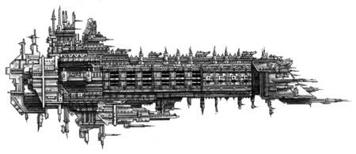

# 1575 战列舰 Battleship

精校状态：中文行文已逐段精校，部分术语仍为暂定

分类：战舰

原文来源：https://www.bilibili.com/opus/1203208974628814918

原作者：帝国神选罐头

原文时间：2026年05月17日 09:45

[返回分类目录](目录.md) · [全书目录](../../目录.md)

<!-- A1575-B0001 -->
**英文原文**

Battleship is a general term to describe the largest combat ships fielded in galactic warfare (Space Stations, Space Hulks and Craftworlds do not classify as ships).

<!-- /A1575-B0001 -->

<!-- A1575-B0002 -->

原译文

战列舰是一个通用术语，用于描述银河系战争中部署的最大战舰（空间站、太空废船和方舟世界不被归类为舰船）。

**校订译文**

战列舰是一个通用术语，用于描述银河系战争中部署的最大战舰（空间站、太空废船和方舟世界不被归类为舰船）。

<!-- /A1575-B0002 -->

<!-- A1575-B0003 -->
## Overview 概述

<!-- /A1575-B0003 -->

<!-- A1575-B0004 -->
**英文原文**

Battleships are the largest fighting vessels in space, gigantic ships capable of absorbing a huge amount of damage, and with vast amounts of firepower, capable of laying waste to entire continents. They also contain landing bays for Attack craft and are commonly used as the capital ships in fleets due to the greater protection offered by their defences. They are usually accompanied by Cruisers and Escorts, as they are so large and slow that they prove ponderous to maneuver.

<!-- /A1575-B0004 -->

<!-- A1575-B0005 -->

原译文

战列舰是太空中最大的战舰，巨大的舰船能够吸收巨大的伤害，拥有巨大的火力，能够摧毁整个大陆。它们还包含攻击艇的登陆舱，由于防御提供了更大的保护，通常被用作舰队的主力舰。它们通常由巡洋舰和护卫舰陪同，因为它们又大又慢，移动起来很笨重。

**校订译文**

战列舰是太空中最大的战斗舰艇，能承受极重打击，也拥有足以毁灭大陆的火力。它们设有攻击机起降舱，凭借强大防护成为舰队主力。由于舰体巨大、航速慢、转向笨重，通常需要巡洋舰与护卫舰艇伴随。

<!-- /A1575-B0005 -->

<!-- A1575-B0006 -->
## Imperium 帝国

<!-- /A1575-B0006 -->

<!-- A1575-B0007 -->
## Imperialis Armada 帝国无敌舰队

<!-- /A1575-B0007 -->

<!-- A1575-B0008 -->
**英文原文**

The Imperialis Armada was the predecessor to the Imperial Navy during the Great Crusade and Horus Heresy.

<!-- /A1575-B0008 -->

<!-- A1575-B0009 -->

原译文

帝国无敌舰队是大远征和荷鲁斯叛乱时期帝国海军的前身。

**校订译文**

帝国无敌舰队是大远征和荷鲁斯之乱时期帝国海军的前身。

<!-- /A1575-B0009 -->

<!-- A1575-B0010 -->

原译文

Annihilator Class Battleship 歼灭者级战列舰

**校订译文**

Annihilator Class Battleship 歼灭者级战列舰

<!-- /A1575-B0010 -->

<!-- A1575-B0011 -->

原译文

Dictatus Class Battleship 独裁级战列舰

**校订译文**

Dictatus Class Battleship 独裁者级战列舰

<!-- /A1575-B0011 -->

<!-- A1575-B0012 -->

原译文

Emperor Class Battleship 帝皇级战列舰

**校订译文**

Emperor Class Battleship 帝皇级战列舰

<!-- /A1575-B0012 -->

<!-- A1575-B0013 图片 -->

<!-- A1575-B0014 -->

原译文

Imperial Emperor Class Battleship 帝国帝皇级战列舰

**校订译文**

Imperial Emperor Class Battleship 帝国帝皇级战列舰

<!-- /A1575-B0014 -->

<!-- A1575-B0015 -->

原译文

Gloriana Class Battleship 荣光女王级战列舰

**校订译文**

Gloriana Class Battleship 荣光女王级战列舰

<!-- /A1575-B0015 -->

<!-- A1575-B0016 -->

原译文

Goliath Class Battleship 歌利亚级战列舰

**校订译文**

Goliath Class Battleship 歌利亚级战列舰

<!-- /A1575-B0016 -->

<!-- A1575-B0017 -->

原译文

Infernus Class Battleship 地狱火级战列舰

**校订译文**

Infernus Class Battleship 炼狱级战列舰

<!-- /A1575-B0017 -->

<!-- A1575-B0018 -->

原译文

Invincible Class Fast Battleship 无敌级快速战列舰

**校订译文**

Invincible Class Fast Battleship 无敌级快速战列舰

<!-- /A1575-B0018 -->

<!-- A1575-B0019 -->

原译文

Ironclad Battleship 铁甲战列舰

**校订译文**

Ironclad Battleship 铁甲战列舰

<!-- /A1575-B0019 -->

<!-- A1575-B0020 -->

原译文

Legatus Class Battleship 特使级战列舰

**校订译文**

Legatus Class Battleship 特使级战列舰

<!-- /A1575-B0020 -->

<!-- A1575-B0021 -->

原译文

Mortis Rex Class Battleship 死亡之王级战列舰

**校订译文**

Mortis Rex Class Battleship 死亡之王级战列舰

<!-- /A1575-B0021 -->

<!-- A1575-B0022 -->

原译文

Retribution Class Battleship 报复级战列舰

**校订译文**

Retribution Class Battleship 报复级战列舰

<!-- /A1575-B0022 -->

<!-- A1575-B0023 -->

原译文

Tiamat Class Battleship 提亚马特级战列舰

**校订译文**

Tiamat Class Battleship 提亚马特级战列舰

<!-- /A1575-B0023 -->

<!-- A1575-B0024 -->

原译文

Victorem Class Battleship 胜利者级战列舰

**校订译文**

Victorem Class Battleship 胜利者级战列舰

<!-- /A1575-B0024 -->

<!-- A1575-B0025 -->

原译文

Victory Class Battleship 胜利级战列舰

**校订译文**

Victory Class Battleship 胜利级战列舰

<!-- /A1575-B0025 -->

<!-- A1575-B0026 -->

原译文

Warspite Class Battleship 厌战级战列舰

**校订译文**

Warspite Class Battleship 厌战级战列舰

<!-- /A1575-B0026 -->

<!-- A1575-B0027 -->
## Imperial Navy 帝国海军

<!-- /A1575-B0027 -->

<!-- A1575-B0028 -->
**英文原文**

Imperial Battleships are generally between 8km and 12km long.

<!-- /A1575-B0028 -->

<!-- A1575-B0029 -->

原译文

帝国战列舰的长度通常在8公里至12公里之间。

**校订译文**

帝国战列舰的长度通常在8公里至12公里之间。

<!-- /A1575-B0029 -->

<!-- A1575-B0030 -->

原译文

Adjudicator Class Battleship 裁决者级战列舰

**校订译文**

Adjudicator Class Battleship 裁决者级战列舰

<!-- /A1575-B0030 -->

<!-- A1575-B0031 -->

原译文

Annihilator Class Battleship 歼灭者级战列舰

**校订译文**

Annihilator Class Battleship 歼灭者级战列舰

<!-- /A1575-B0031 -->

<!-- A1575-B0032 -->

原译文

Apocalypse Class Battleship 启示录级战列舰

**校订译文**

Apocalypse Class Battleship 启示录级战列舰

<!-- /A1575-B0032 -->

<!-- A1575-B0033 -->

原译文

Ascension-class Battleship 升天级战列舰

**校订译文**

Ascension-class Battleship 升天级战列舰

<!-- /A1575-B0033 -->

<!-- A1575-B0034 -->

原译文

Emperor Class Battleship 帝皇级战列舰

**校订译文**

Emperor Class Battleship 帝皇级战列舰

<!-- /A1575-B0034 -->

<!-- A1575-B0035 -->

原译文

Falchion Class Battleship 弯刀级战列舰

**校订译文**

Falchion Class Battleship 弯刀级战列舰

<!-- /A1575-B0035 -->

<!-- A1575-B0036 -->

原译文

Gothic Battleship 哥特战列舰

**校订译文**

Gothic Battleship 哥特级战列舰

<!-- /A1575-B0036 -->

<!-- A1575-B0037 -->

原译文

Graia Class Battleship 格拉亚级战列舰

**校订译文**

Graia Class Battleship 格拉亚级战列舰

<!-- /A1575-B0037 -->

<!-- A1575-B0038 -->

原译文

Incarnate-Class Battleship 化身级战列舰

**校订译文**

Incarnate-Class Battleship 化身级战列舰

<!-- /A1575-B0038 -->

<!-- A1575-B0039 -->

原译文

Invincible Class Fast Battleship 无敌级快速战列舰

**校订译文**

Invincible Class Fast Battleship 无敌级快速战列舰

<!-- /A1575-B0039 -->

<!-- A1575-B0040 -->

原译文

Judgement Class Battleship 审判级战列舰

**校订译文**

Judgement Class Battleship 审判级战列舰

<!-- /A1575-B0040 -->

<!-- A1575-B0041 -->

原译文

Jupiter-class Battleship 木星级战列舰

**校订译文**

Jupiter-class Battleship 木星级战列舰

<!-- /A1575-B0041 -->

<!-- A1575-B0042 -->

原译文

Majestic-class Super-Carrier 雄伟级超级航母

**校订译文**

Majestic-class Super-Carrier 雄伟级超级航母

<!-- /A1575-B0042 -->

<!-- A1575-B0043 -->

原译文

Nemesis Class Fleet Carrier 复仇女神级舰队航母

**校订译文**

Nemesis Class Fleet Carrier 复仇女神级舰队航母

<!-- /A1575-B0043 -->

<!-- A1575-B0044 -->

原译文

Oberon Class Battleship 奥伯龙级战列舰

**校订译文**

Oberon Class Battleship 天卫四级战列舰

<!-- /A1575-B0044 -->

<!-- A1575-B0045 -->

原译文

Retribution Class Battleship 报复级战列舰

**校订译文**

Retribution Class Battleship 报复级战列舰

<!-- /A1575-B0045 -->

<!-- A1575-B0046 -->

原译文

Tiamat Class Battleship 提亚马特级战列舰

**校订译文**

Tiamat Class Battleship 提亚马特级战列舰

<!-- /A1575-B0046 -->

<!-- A1575-B0047 -->

原译文

Torrent-class Battleship 洪流级战列舰

**校订译文**

Torrent-class Battleship 洪流级战列舰

<!-- /A1575-B0047 -->

<!-- A1575-B0048 -->

原译文

Vanquisher Class Battleship 征服者级战列舰

**校订译文**

Vanquisher Class Battleship 征服者级战列舰

<!-- /A1575-B0048 -->

<!-- A1575-B0049 -->

原译文

Victory Class Battleship 胜利级战列舰

**校订译文**

Victory Class Battleship 胜利级战列舰

<!-- /A1575-B0049 -->

<!-- A1575-B0050 -->

原译文

Excessive Force 过度武力号

**校订译文**

Excessive Force 过度武力号

<!-- /A1575-B0050 -->

<!-- A1575-B0051 -->

原译文

Reach of Judgement 审判范围号

**校订译文**

Reach of Judgement 审判范围号

<!-- /A1575-B0051 -->

<!-- A1575-B0052 -->
## Space Marines 星际战士

<!-- /A1575-B0052 -->

<!-- A1575-B0053 -->

原译文

Battle Barge 战斗驳船

**校订译文**

Battle Barge 战斗驳船

<!-- /A1575-B0053 -->

<!-- A1575-B0054 -->

原译文

Dictatus Class Battleship 独裁级战列舰

**校订译文**

Dictatus Class Battleship 独裁者级战列舰

<!-- /A1575-B0054 -->

<!-- A1575-B0055 -->

原译文

Gloriana Class Battleship 荣光女王级战列舰

**校订译文**

Gloriana Class Battleship 荣光女王级战列舰

<!-- /A1575-B0055 -->

<!-- A1575-B0056 -->

原译文

Infernus Class Battleship 地狱火级战列舰

**校订译文**

Infernus Class Battleship 炼狱级战列舰

<!-- /A1575-B0056 -->

<!-- A1575-B0057 -->

原译文

Lunar Class Battleship 月亮级战列舰

**校订译文**

Lunar Class Battleship 月球级战列舰

<!-- /A1575-B0057 -->

<!-- A1575-B0058 -->

原译文

Retribution Class Battleship 报复级战列舰

**校订译文**

Retribution Class Battleship 报复级战列舰

<!-- /A1575-B0058 -->

<!-- A1575-B0059 -->
## Adeptus Mechanicus 机械修会

原题：Adeptus Mechanicus 帝国神教

<!-- /A1575-B0059 -->

<!-- A1575-B0060 -->

原译文

Ark Mechanicus 机械方舟

**校订译文**

Ark Mechanicus 机械方舟

<!-- /A1575-B0060 -->

<!-- A1575-B0061 -->

原译文

Emperor Class Battleship 帝皇级战列舰

**校订译文**

Emperor Class Battleship 帝皇级战列舰

<!-- /A1575-B0061 -->

<!-- A1575-B0062 -->

原译文

Retribution Class Battleship 报复级战列舰

**校订译文**

Retribution Class Battleship 报复级战列舰

<!-- /A1575-B0062 -->

<!-- A1575-B0063 -->

原译文

Oberon Class Battleship 奥伯龙级战列舰

**校订译文**

Oberon Class Battleship 天卫四级战列舰

<!-- /A1575-B0063 -->

<!-- A1575-B0064 -->

原译文

Explorator Class Battleship 探索者级战列舰

**校订译文**

Explorator Class Battleship 探索者级战列舰

<!-- /A1575-B0064 -->

<!-- A1575-B0065 -->
## Inquisition 审判庭

<!-- /A1575-B0065 -->

<!-- A1575-B0066 -->

原译文

Redeemer 救世主

**校订译文**

Redeemer 救世主号

**校注：** Redeemer在本表是具名审判庭舰船，不能套用兰德掠袭者救赎者型号的官方名称。

<!-- /A1575-B0066 -->

<!-- A1575-B0067 -->
## Chaos 混沌

<!-- /A1575-B0067 -->

<!-- A1575-B0068 -->

原译文

Abyss Class Battleship 深渊级战列舰

**校订译文**

Abyss Class Battleship 深渊级战列舰

<!-- /A1575-B0068 -->

<!-- A1575-B0069 -->

原译文

Carrion-class Battleship 腐肉级战列舰

**校订译文**

Carrion-class Battleship 腐肉级战列舰

<!-- /A1575-B0069 -->

<!-- A1575-B0070 -->

原译文

Despoiler Class Battleship 掠夺者级战列舰

**校订译文**

Despoiler Class Battleship 掠夺者级战列舰

<!-- /A1575-B0070 -->

<!-- A1575-B0071 -->

原译文

Desolator Class Battleship 荒芜者级战列舰

**校订译文**

Desolator Class Battleship 荒芜者级战列舰

<!-- /A1575-B0071 -->

<!-- A1575-B0072 -->

原译文

Desecrator Class Battleship 亵渎者战列舰

**校订译文**

Desecrator Class Battleship 亵渎者级战列舰

<!-- /A1575-B0072 -->

<!-- A1575-B0073 -->

原译文

Eradicus 埃拉迪库斯号

**校订译文**

Eradicus 埃拉迪库斯号

<!-- /A1575-B0073 -->

<!-- A1575-B0074 -->

原译文

Juggernaut Battleship 主宰战列舰

**校订译文**

Juggernaut Battleship 主宰战列舰

<!-- /A1575-B0074 -->

<!-- A1575-B0075 -->

原译文

Planet Killer 行星杀手

**校订译文**

Planet Killer 行星杀手

<!-- /A1575-B0075 -->

<!-- A1575-B0076 -->

原译文

Stygian Beast 冥界野兽

**校订译文**

Stygian Beast 冥界野兽

<!-- /A1575-B0076 -->

<!-- A1575-B0077 -->
## Orks 欧克蛮人

原题：Orks 欧克

<!-- /A1575-B0077 -->

<!-- A1575-B0078 -->
**英文原文**

No design of Ork Battleship exists, but several Ork vessels have reached a size and power comparable to Imperial battleships.

<!-- /A1575-B0078 -->

<!-- A1575-B0079 -->

原译文

欧克战列舰的设计并不存在，但几艘欧克战舰已经达到了与帝国战列舰相当的尺寸和功率。

**校订译文**

欧克没有标准化的战列舰设计，但一些欧克舰船的体量与战力已经达到帝国战列舰的水平。

<!-- /A1575-B0079 -->

<!-- A1575-B0080 -->

原译文

Ork "Battleships" 欧克“战列舰”

**校订译文**

Ork "Battleships" 欧克“战列舰”

<!-- /A1575-B0080 -->

<!-- A1575-B0081 -->
## Eldar 灵族

<!-- /A1575-B0081 -->

<!-- A1575-B0082 -->

原译文

Star Hunter Battleship 星辰猎手战列舰

**校订译文**

Star Hunter Battleship 星辰猎手战列舰

<!-- /A1575-B0082 -->

<!-- A1575-B0083 -->

原译文

Void Stalker 虚空追猎者

**校订译文**

Void Stalker 虚空追猎者

<!-- /A1575-B0083 -->

<!-- A1575-B0084 -->
## Dark Eldar 黑暗灵族

<!-- /A1575-B0084 -->

<!-- A1575-B0085 -->

原译文

Dying Sun Class Battleship 死日级战列舰

**校订译文**

Dying Sun Class Battleship 死日级战列舰

<!-- /A1575-B0085 -->

<!-- A1575-B0086 -->

原译文

Falling Moon Class Battleship 陨月级战列舰

**校订译文**

Falling Moon Class Battleship 陨月级战列舰

<!-- /A1575-B0086 -->

<!-- A1575-B0087 -->

原译文

Obsidian Rose Class Battleship 黑曜石玫瑰级战列舰

**校订译文**

Obsidian Rose Class Battleship 黑曜石玫瑰级战列舰

<!-- /A1575-B0087 -->

<!-- A1575-B0088 -->
## Necrons 太空死灵

原题：Necrons 死灵

<!-- /A1575-B0088 -->

<!-- A1575-B0089 -->

原译文

Cairn Class Tomb Ship 石冢级墓穴舰

**校订译文**

Cairn Class Tomb Ship 石冢级墓穴舰

<!-- /A1575-B0089 -->

<!-- A1575-B0090 -->
## Tyranids 泰伦虫族

原题：Tyranids 泰伦

<!-- /A1575-B0090 -->

<!-- A1575-B0091 -->

原译文

Hive Ship 虫巢舰

**校订译文**

Hive Ship 虫巢舰

<!-- /A1575-B0091 -->

<!-- A1575-B0092 -->
## Tau 钛

<!-- /A1575-B0092 -->

<!-- A1575-B0093 -->

原译文

Gal'leath Class Battleship 伽'莱斯级战列舰

**校订译文**

Gal'leath Class Battleship 伽'莱斯级战列舰

<!-- /A1575-B0093 -->

<!-- A1575-B0094 -->

原译文

Or'es El'leath Class Battleship 奥'埃斯·埃'莱斯级战列舰

**校订译文**

Or'es El'leath Class Battleship 奥'埃斯·埃'莱斯级战列舰

<!-- /A1575-B0094 -->

<!-- A1575-B0095 -->
## Leagues of Votann 沃坦联盟

<!-- /A1575-B0095 -->

<!-- A1575-B0096 -->

原译文

Stronghold Class Commerce Vessel 要塞级贸易战舰

**校订译文**

Stronghold Class Commerce Vessel 要塞级贸易船

**校注：** Commerce Vessel为贸易船，条目将其列于战列舰类别不等于名称本身含战舰。

<!-- /A1575-B0096 -->

<!-- A1575-B0097 -->
## Fra'al 弗拉'尔

<!-- /A1575-B0097 -->

<!-- A1575-B0098 -->
**英文原文**

Despite their name, Fra'al Battlecruisers are also designated as Battleships.

<!-- /A1575-B0098 -->

<!-- A1575-B0099 -->

原译文

尽管命名如此，弗拉'尔战列巡洋舰也被指定为战列舰。

**校订译文**

弗拉’尔战列巡洋舰虽名为“巡洋舰”，实际也被归入战列舰。

<!-- /A1575-B0099 -->

<!-- A1575-B0100 -->

原译文

Sharak-Fraka 沙拉克-弗拉卡

**校订译文**

Sharak-Fraka 沙拉克-弗拉卡

<!-- /A1575-B0100 -->

本篇核心术语与暂定项

以下列出本篇出现的英文原形及核心术语表用词。同形词可能指不同对象，具体词义以本篇正文和校注为准；单复数、别名和仅见于图注的名称可能尚未列入。完整候选见[术语表](../../术语表/双语术语候选.csv)。

| 英文 | 采用中文 | 状态 |
| --- | --- | --- |
| Horus Heresy | 荷鲁斯之乱 | 官方已核对 |
| Imperial Navy | 帝国海军 | 暂定 |
| Great Crusade | 大远征 | 暂定·官方待核 |
| Horus | 荷鲁斯 | 暂定·官方待核 |
| Imperialis Armada | 帝国无敌舰队 | 暂定·官方待核 |
| Imperialis | 帝国徽记 | 暂定·官方待核 |

