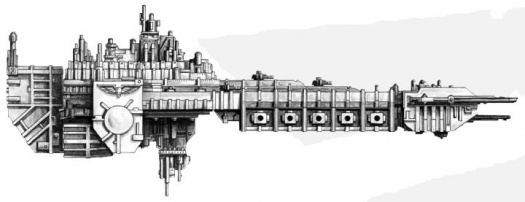
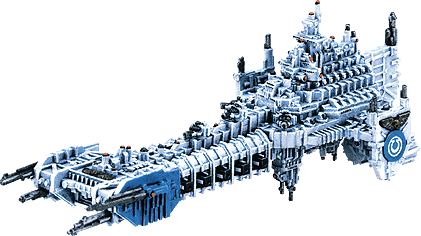
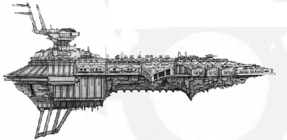
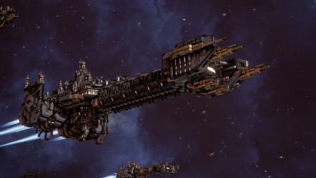
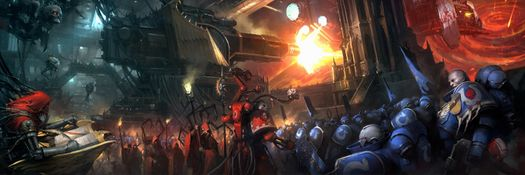
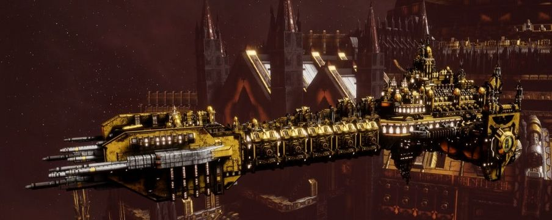
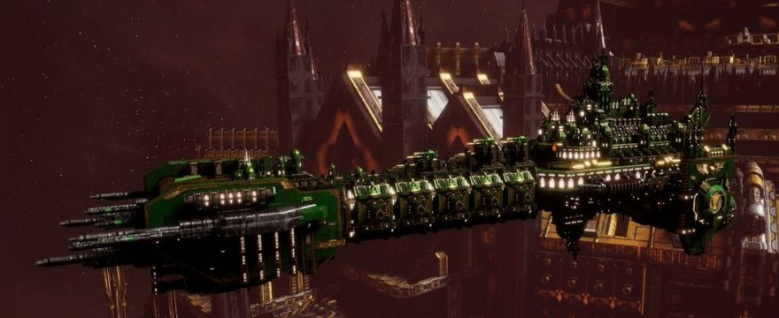

# 1576 战斗驳船 Battle Barge

精校状态：中文行文已逐段精校，部分术语仍为暂定

分类：战舰

原文来源：https://www.bilibili.com/opus/1210765896558051411

原作者：帝国神选罐头

原文时间：2026年06月06日 18:30

[返回分类目录](目录.md) · [全书目录](../../目录.md)

<!-- A1576-B0001 -->
**英文原文**

The Battle Barge is the largest Space Marine warship and is configured for close support of planetary landings. Battle Barges were originally a simple designation during the Great Crusade to refer to Battleships under Legiones Astartes control. Commonly though any capital class vessel used exclusively by the legion’s was often referred to as a Battle Barge regardless of the technical truth of the matter. Today, most Chapters control two or three Battle Barges designed to deploy a fighting force to planets in a rapid fashion. Battle Barges are also operated by the Deathwatch, the fleet stationed at a single Watch Fortress having two.

<!-- /A1576-B0001 -->

<!-- A1576-B0002 -->

原译文

战斗驳船是最大的星际战士战舰，配置用于近距离支援行星着陆。战斗驳船最初是大远征期间的一个简单名称，指的是阿斯塔特军团控制下的战列舰。尽管如此，无论技术真相如何，军团专用的任何主力级战舰通常都被称为战斗驳船。如今，大多数战团控制着两三艘战斗驳船，旨在快速向行星部署战斗部队。战斗驳船也由死亡守望操作，舰队驻扎在一个守望要塞，有两艘。

**校订译文**

战斗驳船是星际战士最大的常规战舰，专为近距离支援行星登陆而配置。大远征时，这一名称最初泛指阿斯塔特军团控制的战列舰；实际上，军团专用的各类主力舰也常被如此称呼，不论严格技术分类。如今，多数战团拥有两三艘，负责迅速投送部队。死亡守望也使用战斗驳船，本条所述某座守望堡的驻守舰队就有两艘。

**校注：** a single Watch Fortress having two为所举驻守舰队，不足以推断每一座守望堡都固定拥有两艘。

<!-- /A1576-B0002 -->

<!-- A1576-B0003 图片 -->

<!-- A1576-B0004 -->

原译文

Space Marine Battle Barge 星际战士战斗驳船

**校订译文**

Space Marine Battle Barge 星际战士战斗驳船

<!-- /A1576-B0004 -->

<!-- A1576-B0005 -->
## Overview 概述

<!-- /A1576-B0005 -->

<!-- A1576-B0006 -->
**英文原文**

Battle Barges are between five and seven and a half miles long. Each Battle Barge is capable of deploying three Space Marine Companies plus supplies and support. Large amounts of space are designed to hold launch bays for inter-system craft and drop pods allowing up to three Companies to deploy simultaneously. The vessel is extremely heavily armoured and well-shielded for breaching planetary defences while also protecting its cargo. It is also a dangerous enemy, especially with boarding actions but also contains enough firepower to destroy all but the most powerful of warships. Battle Barges are some of the most powerful ships the Imperium has at its disposal, due to both the power of the ships and their contents.

<!-- /A1576-B0006 -->

<!-- A1576-B0007 -->

原译文

战斗驳船的长度在五到七英里半之间。每艘战斗驳船能够部署三个星际战士连队以及补给和支援。大量的空间被设计用来容纳星系内飞船的发射舱和空投舱，最多可同时部署三个连队。该船装甲极为坚固，防护良好，可以突破行星防御，同时保护其货物。它也是一个危险的敌人，尤其是在跳帮行动中，但它也有足够的火力摧毁除最强大的战舰之外的所有战舰。战斗驳船是帝国所拥有的最强大的船只之一，这得益于船只的力量和所容纳之物。

**校订译文**

战斗驳船长约5至7.5英里，每舰可运送三个星际战士连及其补给和支援力量。大片内部空间留给航行器与空降舱的发射设施，使三个连能够同时投入战场。厚重装甲与强大护盾既保护所载部队，也使其能突破行星防御。它尤其擅长跳帮，舰炮火力也足以摧毁除最强敌舰之外的大多数目标。舰船与搭载战力相结合，使它成为帝国最强大的军事资产之一。

<!-- /A1576-B0007 -->

<!-- A1576-B0008 图片 -->

<!-- A1576-B0009 -->

原译文

Model of a Space Marine Battle Barge for Battlefleet Gothic 哥特舰队星际战士战斗驳船模型

**校订译文**

Model of a Space Marine Battle Barge for Battlefleet Gothic 哥特舰队星际战士战斗驳船模型

<!-- /A1576-B0009 -->

<!-- A1576-B0010 -->
**英文原文**

Battle Barges are highly prized by their operating Chapters and serve as command-and-control nexus during the campaigns they are deployed in. For this reason every Battle Barge features a hololith-equipped strategium with a seating capacity for nearly a hundred generals, admirals and commanders to better allow for coordination between the various arms of the Imperial military during the prosecution of a military operation.

<!-- /A1576-B0010 -->

<!-- A1576-B0011 -->

原译文

战斗驳船被其操作战团高度重视，并在被部署的战役中充当指挥和控制枢纽。因此，每艘战斗驳船都有一个配备全息投影的带座位的战略室，可容纳近百名将军、海军上将和指挥官，以便在军事行动中更好地协调帝国军队的各个武装。

**校订译文**

战团十分珍视战斗驳船，将其用作战役指挥枢纽。每艘舰都设有全息设备完善的战略室，可容纳近百名陆海军将领及指挥官，协调帝国各军种行动。

<!-- /A1576-B0011 -->

<!-- A1576-B0012 -->
## Defences 防御

<!-- /A1576-B0012 -->

<!-- A1576-B0013 -->
**英文原文**

Constructed with its unique role of low-orbit planetary assault in mind, the Battle Barges' skeletons were forged from an ultra-dense alloy. The rare base mineral can only be mined from the sites of recent volcanic eruptions, and is further hardened by ballast compression tanks situated on high-gravity moons. The pressurized environment hardens the alloy, ensuring the superstructure is as solid as the doors protecting the Emperor’s throne room itself. These inner frameworks were then girded in kilometres of hardened plasteel and adamantium, and edged with thick ferrocrete buttresses that surround the main hull like a reinforced rib-cage. Finally, a second and ablative layer of armour was added to each vessel's prow, forging an impenetrable figurehead for the indomitable fury of a Battle Barge.

<!-- /A1576-B0013 -->

<!-- A1576-B0014 -->

原译文

考虑到其在低轨行星突击中的独特作用，战斗驳船的骨架是由超致密合金铸造而成的。这种稀有的基础矿物只能从最近火山爆发的地点开采，并通过位于高重力卫星上的压载压缩舱进一步硬化。加压的环境使合金硬化，确保上层结构与保护帝皇的王座厅本身的门一样坚固。然后，这些内部框架由数公里长的硬化塑钢和精金制成，边缘有厚厚的钢筋混凝土扶壁，像加固的肋骨一样环绕着主船体。最后，每艘战舰的舰首都增加了第二层烧蚀装甲，为战斗驳船的不屈不挠的愤怒铸造了一个无法穿透的艏饰像。

**校订译文**

为适应低轨道行星突击，战斗驳船以超高密度合金铸造骨架。其基础矿物只产于近期火山喷发地点，再送往高重力卫星的加压舱中进一步硬化，使上层结构坚如帝皇王座厅的大门。骨架外覆盖绵延数公里的强化塑钢与精金，厚重铁混凝土支撑结构如加固肋骨环抱主舰体；舰首再加一层烧蚀装甲，形成几乎无法击穿的防护。

<!-- /A1576-B0014 -->

<!-- A1576-B0015 图片 -->

<!-- A1576-B0016 -->

原译文

Emperor's Children Pre-Heresy Battle Barge 帝皇之子叛乱前战斗驳船

**校订译文**

Emperor's Children Pre-Heresy Battle Barge 帝皇之子叛乱前战斗驳船

<!-- /A1576-B0016 -->

<!-- A1576-B0017 -->
**英文原文**

Protected in the Warp by Gellar Fields, in the Materium Battle Barges are protected by a group of layered void shields. The shields protecting a Battle Barge are among the most sophisticated that the Emperor’s armies have at their disposal. Segmented into a series of zones, it is possible for an area of shield to fail without leaving the ship entirely exposed. Further to this, energy can be siphoned from one zone to another, and redirected to where there is the most need of protection. In dire circumstances the shields' energy can be driven up past their normal maximum. This temporarily provides the Battle Barge with greater protection but soon burns out the generators, and renders the shields inert.

<!-- /A1576-B0017 -->

<!-- A1576-B0018 -->

原译文

在亚空间中由盖勒力场保护，在物质界战斗驳船由一组分层的虚空盾保护。保护战斗驳船的护盾是帝皇的军队所拥有的最先进的护盾之一。被分割成一系列区域，一个护盾区域可能会发生故障，而不会使舰船完全暴露在外。除此之外，能量可以从一个区域转移到另一个区域，并重新定向到最需要保护的地方。在可怕的情况下，护盾的能量可能会超过正常的最大值。这暂时为战斗驳船提供了更大的保护，但很快就会烧坏发生器，并使护盾失效。

**校订译文**

在亚空间中，战斗驳船依靠盖勒力场；在物质宇宙中，则由多层虚空盾保护。这些护盾属于帝皇军队所能配备的最先进型号之一，划分为多个独立区域，一处失效不会令全舰暴露，能量还能在分区之间转移，集中到最需要保护的位置。危急时可以超负荷驱动护盾，暂时增强防护，但很快就会烧毁发生器，令护盾完全失效。

**校注：** 复查英文细节与数量，补明对象、地点或程度，避免精简中文时削弱原意。

<!-- /A1576-B0018 -->

<!-- A1576-B0019 -->
**英文原文**

The Battle Barge carries a compliment of three squadrons of Thunderhawks designed to act as either Attack Craft or orbit-to-surface transports.

<!-- /A1576-B0019 -->

<!-- A1576-B0020 -->

原译文

战斗驳船搭载了三个雷鹰中队，旨在作为攻击艇或轨道到地面运输工具。

**校订译文**

战斗驳船搭载了三个雷鹰中队，旨在作为攻击艇或轨道到地面运输工具。

<!-- /A1576-B0020 -->

<!-- A1576-B0021 -->
## Weaponry 武器

<!-- /A1576-B0021 -->

<!-- A1576-B0022 -->
**英文原文**

The primary weapons of any Battle Barge are their dorsal-mounted bombardment cannons. Each cannon comprises a series of heavyweight batteries, huge turret-mounted linear accelerators that launch salvos of heavy magma bomb warheads. As the name suggests, bombardment cannons were primarily developed to bombard planets from high orbit, a task at which they excel. A Battle Barge will begin firing as soon as it reaches orbit and will continue to rain destruction down on a planet even as its complement of Space Marines is hurled downwards in their assault craft, clearing a path for their deployment on the ground. Capable of obliterating almost any manner of planetary defences, bombardment cannons will first be directed against missile silos and laser towers, ensuring that the Space Marine attack force can proceed unmolested, before being used to take out command bunkers and shield generators, aiding their swift domination of the planet. On more than one occasion, a single salvo fired into a dense population centre has ended the conflict before it has gathered any real momentum, shocking a world's leaders into seeing the error of their ways and quickly swearing fealty to the Emperor once more.

<!-- /A1576-B0022 -->

<!-- A1576-B0023 -->

原译文

任何战斗驳船的主要武器都是底装式轰击炮。每门炮都由一系列重型电池、安装在炮塔上的巨大线性加速器组成，这些加速器可以发射重型岩浆炸弹弹头。顾名思义，轰击炮主要是为了从高轨轰击行星而开发的，这是它们擅长的一项任务。一艘战斗驳船一旦进入轨道就会开始射击，并将持续对一颗行星造成毁灭性的打击，其补充的星际战士在突击艇中向下空降，为他们在地面上的部署扫清了道路。轰击炮能够摧毁几乎任何形式的行星防御，首先将针对导弹发射井和激光塔，确保星际战士攻击部队能够不受干扰地前进，然后用于摧毁指挥地堡和护盾发生器，帮助他们迅速统治行星。不止一次，向人口稠密的中心发射的一次齐射在冲突形成任何真正的势头之前就结束了冲突，震惊了世界的领导人，他们看到了自己的错误，并迅速再次宣誓效忠帝皇。

**校订译文**

主武器是背部轰炸炮，由巨大的炮塔式线性加速器构成重型炮组，齐射重型熔岩炸弹弹头。它们专为高轨道行星轰炸而设计。战斗驳船一进入轨道便开始射击，直到星际战士乘突击艇下降时仍持续轰击，为登陆清路。火炮足以抹平几乎任何行星防御设施：先摧毁导弹井和激光塔，确保星际战士攻击部队顺利推进，再打击指挥地堡与护盾发生器，帮助部队迅速控制行星。有时，仅向人口密集区的一次齐射，就足以让战事尚未扩大便告结束，迫使统治者重新宣誓效忠帝皇。

**校注：** 复查英文细节与数量，补明对象、地点或程度，避免精简中文时削弱原意。

<!-- /A1576-B0023 -->

<!-- A1576-B0024 图片 -->

<!-- A1576-B0025 -->

原译文

Battle Barge of the Space Wolves 太空野狼战斗驳船

**校订译文**

Battle Barge of the Space Wolves 太空野狼战斗驳船

<!-- /A1576-B0025 -->

<!-- A1576-B0026 -->
**英文原文**

In ship-to-ship combat, Battle Barges rely primarily on Space Marine boarding actions. The class maintains a hefty compliment of macro-cannons, plasma projectors, fusion beamers, and missile launchers designed to overwhelm enemy defences and shields, allowing for boarding to take place. In addition, if all else fails the Battle Barge may use its Bombardment Cannons against enemy vessels. Though they lack the range of a Lance, they make up for it in raw killing power.

<!-- /A1576-B0026 -->

<!-- A1576-B0027 -->

原译文

在舰对舰战斗中，战斗驳船主要依靠星际战士跳帮行动。该类别配备了大量的宏炮、等离子投射炮、融合光束炮和导弹发射器，旨在压倒敌人的防御和护盾，使跳帮成为可能。此外，如果所有其他方法都失败了，战斗驳船可能会使用其轰击炮攻击敌方战舰。虽然他们缺乏光矛的射程，但他们用原始的杀伤力弥补了这一点。

**校订译文**

舰对舰作战时，战斗驳船主要依靠星际战士跳帮。宏炮、等离子投射炮、聚变光束炮和导弹发射器先压垮敌方防御与护盾，为登舰创造机会。其他手段无效时，也可用轰炸炮直接攻击敌舰；它虽不及光矛射程远，却以惊人毁伤弥补。

<!-- /A1576-B0027 -->

<!-- A1576-B0028 图片 -->

<!-- A1576-B0029 -->

原译文

Interior of a Battle Barge 战斗驳船内部

**校订译文**

Interior of a Battle Barge 战斗驳船内部

<!-- /A1576-B0029 -->

<!-- A1576-B0030 -->
**英文原文**

Battle Barges in service with the Deathwatch are armed with weapon batteries, turreted bombardment cannons in dorsal mounts and even nova cannons.

<!-- /A1576-B0030 -->

<!-- A1576-B0031 -->

原译文

与死亡守望一起服役的战斗驳船配备了武器阵列、背装式轰击炮塔，甚至还有新星炮。

**校订译文**

死亡守望的战斗驳船配有舰炮组、背部炮塔式轰炸炮，有些甚至装备新星炮。

<!-- /A1576-B0031 -->

<!-- A1576-B0032 -->
**英文原文**

Battle Barges are frequently used to enact Exterminatus. As such, they usually also carry a lethal cargo of world-killing weaponry such as Cyclonic Torpedos and Virus Bombs.

<!-- /A1576-B0032 -->

<!-- A1576-B0033 -->

原译文

战斗驳船经常被用来进行灭绝令。因此，他们通常还携带致命的世界杀伤性武器，如旋风鱼雷和病毒炸弹。

**校订译文**

它们也常执行灭绝令，因此通常携带旋风鱼雷、病毒炸弹等足以毁灭世界的武器。

<!-- /A1576-B0033 -->

<!-- A1576-B0034 -->
## Subclasses 子类型

<!-- /A1576-B0034 -->

<!-- A1576-B0035 -->
**英文原文**

Battle Barge Mk.I - Base planetary invasion version equipped with 3 Bombardment Cannons, 6 Torpedo launchers, 2 heavy macrocannon batteries, and launch bays for Attack Craft and gunships.

<!-- /A1576-B0035 -->

<!-- A1576-B0036 -->

原译文

战斗驳船Mk.I - 基础行星入侵版本，配备3门轰击炮、6个鱼雷发射器、2个重型宏炮阵列以及攻击艇和炮艇的发射舱。

**校订译文**

战斗驳船 Mk.I——基本行星突击型，配有三门轰炸炮、六具鱼雷发射器、两组重型宏炮，以及攻击机与炮艇发射舱。

<!-- /A1576-B0036 -->

<!-- A1576-B0037 图片 -->

<!-- A1576-B0038 -->

原译文

Battle Barge Mk.I Subclass 战斗驳船Mk.I子类

**校订译文**

Battle Barge Mk.I Subclass 战斗驳船Mk.I子类

<!-- /A1576-B0038 -->

<!-- A1576-B0039 -->
**英文原文**

Battle Barge Mk.II - Fleet combat version equipped with 2 Heavy Lance batteries, 3 standard Lance batteries, 2 Plasma Projector batteries, and launch bays for Attack Craft and gunships.

<!-- /A1576-B0039 -->

<!-- A1576-B0040 -->

原译文

战斗驳船Mk.II - 舰队战斗版本，配备2个重型光矛阵列、3个标准光矛阵列、2个等离子投射炮阵列，以及攻击艇和炮艇的发射舱。

**校订译文**

战斗驳船Mk.II - 舰队战斗版本，配备2个重型光矛阵列、3个标准光矛阵列、2个等离子投射炮阵列，以及攻击艇和炮艇的发射舱。

<!-- /A1576-B0040 -->

<!-- A1576-B0041 图片 -->

<!-- A1576-B0042 -->

原译文

Battle Barge Mk.II Subclass 战斗驳船Mk.II子类

**校订译文**

Battle Barge Mk.II Subclass 战斗驳船Mk.II子类

<!-- /A1576-B0042 -->

<!-- A1576-B0043 -->
**英文原文**

Gloriana Class Battleship - A massive type of command Battle Barge used by the Legiones Astartes during the Great Crusade. Some are still in service to this day.

<!-- /A1576-B0043 -->

<!-- A1576-B0044 -->

原译文

荣光女王级战列舰 - 阿斯塔特军团在大远征期间使用的一种大型指挥战斗驳船。有些至今仍在服役。

**校订译文**

荣光女王级战列舰 - 阿斯塔特军团在大远征期间使用的一种大型指挥战斗驳船。有些至今仍在服役。

<!-- /A1576-B0044 -->

<!-- A1576-B0045 -->
**英文原文**

Warspite Class Battleship - A sub-type of Battle Barge which was used by the Legiones Astartes during the Great Crusade and Horus Heresy.

<!-- /A1576-B0045 -->

<!-- A1576-B0046 -->

原译文

厌战级战列舰 - 一种战斗驳船的子类型，在大远征和荷鲁斯叛乱期间被阿斯塔特军团使用。

**校订译文**

厌战级战列舰 - 一种战斗驳船的子类型，在大远征和荷鲁斯之乱期间被阿斯塔特军团使用。

<!-- /A1576-B0046 -->

<!-- A1576-B0047 -->

原译文

Basileus Class 贝利撒留级

**校订译文**

Basileus Class 巴西琉斯级

**校注：** Basileus是独立舰级名，不是Belisarius贝利萨留；暂音译巴西琉斯级。

<!-- /A1576-B0047 -->

<!-- A1576-B0048 -->

原译文

Dominus Class 统御级

**校订译文**

Dominus Class 统御级

<!-- /A1576-B0048 -->

<!-- A1576-B0049 -->

原译文

Legatus Class 使节级

**校订译文**

Legatus Class 特使级

<!-- /A1576-B0049 -->

<!-- A1576-B0050 -->

原译文

Ryza Class 瑞扎级

**校订译文**

Ryza Class 瑞扎级

<!-- /A1576-B0050 -->

<!-- A1576-B0051 -->
## Famous Active Battle Barges 著名活跃战斗驳船

<!-- /A1576-B0051 -->

<!-- A1576-B0052 -->
### Loyalist 忠诚派

<!-- /A1576-B0052 -->

<!-- A1576-B0053 -->
**英文原文**

Macragge's Honour - Gloriana Class Battleship in Ultramarines service and current command vessel of Lord Commander Roboute Guilliman.

<!-- /A1576-B0053 -->

<!-- A1576-B0054 -->

原译文

马库拉格之耀号 - 极限战士服役的荣光女王级战列舰，现为领主指挥官罗伯特·基里曼的指挥战舰。

**校订译文**

马库拉格之耀号——极限战士的荣光女王级战列舰，现为领主指挥官罗保特·基里曼的指挥舰。

<!-- /A1576-B0054 -->

<!-- A1576-B0055 -->
**英文原文**

Laurels of Victory - Current flagship of Ultramarines Chapter Master Marneus Calgar.

<!-- /A1576-B0055 -->

<!-- A1576-B0056 -->

原译文

胜利桂冠号 - 目前的极限战士战团长马涅乌斯卡尔加的旗舰。

**校订译文**

胜利桂冠号——极限战士战团长马涅乌斯·卡尔加的现任旗舰。

<!-- /A1576-B0056 -->

<!-- A1576-B0057 -->
**英文原文**

Resilient - Ultramarines Battle Barge.

<!-- /A1576-B0057 -->

<!-- A1576-B0058 -->

原译文

坚韧号 - 极限战士战斗驳船

**校订译文**

坚韧号 - 极限战士战斗驳船

<!-- /A1576-B0058 -->

<!-- A1576-B0059 -->
**英文原文**

Aeternus - Most venerated Ultramarines Battle Barge.

<!-- /A1576-B0059 -->

<!-- A1576-B0060 -->

原译文

永恒号 - 最受尊敬的极限战士战斗驳船。

**校订译文**

永恒号 - 最受尊敬的极限战士战斗驳船。

<!-- /A1576-B0060 -->

<!-- A1576-B0061 -->
**英文原文**

Invincible Reason - Gloriana Class Battleship and currently still in service with the Dark Angels.

<!-- /A1576-B0061 -->

<!-- A1576-B0062 -->

原译文

无敌理性号 - 荣光女王级战列舰，目前仍在黑暗天使服役。

**校订译文**

无敌理性号 - 荣光女王级战列舰，目前仍在黑暗天使服役。

<!-- /A1576-B0062 -->

<!-- A1576-B0063 -->
**英文原文**

Eternal Crusader - Gloriana Class Battleship and current Fortress-Monastery of the Black Templars.

<!-- /A1576-B0063 -->

<!-- A1576-B0064 -->

原译文

永恒远征号 - 荣光女王级战列舰，目前黑色圣堂的堡垒修道院。

**校订译文**

永恒远征号 - 荣光女王级战列舰，目前黑色圣堂的要塞修道院。

<!-- /A1576-B0064 -->

<!-- A1576-B0065 -->
**英文原文**

Allfather's Honour - Current flagship of the Space Wolves.

<!-- /A1576-B0065 -->

<!-- A1576-B0066 -->

原译文

全父荣誉号 - 当前太空野狼的旗舰

**校订译文**

全父荣誉号 - 当前太空野狼的旗舰

<!-- /A1576-B0066 -->

<!-- A1576-B0067 -->
**英文原文**

Baal's Fury - Flagship of Blood Angels Chapter Master Dante.

<!-- /A1576-B0067 -->

<!-- A1576-B0068 -->

原译文

巴尔之怒号 - 圣血天使战团长但丁的旗舰

**校订译文**

巴尔之怒号 - 圣血天使战团长但丁的旗舰

<!-- /A1576-B0068 -->

<!-- A1576-B0069 -->
**英文原文**

Flamewrought - Famous Salamanders Battle Barge.

<!-- /A1576-B0069 -->

<!-- A1576-B0070 -->

原译文

火焰精炼号 - 著名火蜥蜴战斗驳船

**校订译文**

火焰精炼号 - 著名火蜥蜴战斗驳船

<!-- /A1576-B0070 -->

<!-- A1576-B0071 -->
**英文原文**

Victus - Flagship of the Flesh Tearers.

<!-- /A1576-B0071 -->

<!-- A1576-B0072 -->

原译文

征服号 - 撕肉者的旗舰

**校订译文**

征服号 - 撕肉者的旗舰

<!-- /A1576-B0072 -->

<!-- A1576-B0073 -->
**英文原文**

Nicor - Flagship of the Carcharodons.

<!-- /A1576-B0073 -->

<!-- A1576-B0074 -->

原译文

水怪号 - 噬人鲨的旗舰

**校订译文**

水怪号 - 噬人鲨的旗舰

<!-- /A1576-B0074 -->

<!-- A1576-B0075 -->
**英文原文**

Omnis Arcanum - Fortress-Monastery of the Blood Ravens.

<!-- /A1576-B0075 -->

<!-- A1576-B0076 -->

原译文

全知奥秘号 - 血鸦的堡垒修道院

**校订译文**

全知奥秘号 - 血鸦的要塞修道院

<!-- /A1576-B0076 -->

<!-- A1576-B0077 -->
### Traitor 叛徒

<!-- /A1576-B0077 -->

<!-- A1576-B0078 -->
**英文原文**

Vengeful Spirit - Gloriana Class Battleship and currently the flagship of Abaddon the Despoiler.

<!-- /A1576-B0078 -->

<!-- A1576-B0079 -->

原译文

复仇之魂号 - 荣光女王级战列舰，目前是掠夺者阿巴顿的旗舰。

**校订译文**

复仇之魂号 - 荣光女王级战列舰，目前是掠夺者阿巴顿的旗舰。

<!-- /A1576-B0079 -->

<!-- A1576-B0080 -->
**英文原文**

Conqueror - Gloriana Class Battleship and currently under the control of World Eaters Chaos Lord Kossolax the Foresworn. Still utilized by the Primarch Angron.

<!-- /A1576-B0080 -->

<!-- A1576-B0081 -->

原译文

征服者号 - 荣光女王级战列舰，目前由吞世者混沌领主背誓者科索拉克斯控制。至今仍被原体安格隆使用。

**校订译文**

征服者号 - 荣光女王级战列舰，目前由吞世者混沌领主背誓者科索拉克斯控制。至今仍被原体安格隆使用。

<!-- /A1576-B0081 -->

<!-- A1576-B0082 -->
**英文原文**

Endurance - Gloriana Class Battleship and currently the flagship of Death Guard Primarch Mortarion.

<!-- /A1576-B0082 -->

<!-- A1576-B0083 -->

原译文

坚忍号 - 荣光女王级战列舰，目前是死亡守卫原体莫塔里安的旗舰。

**校订译文**

坚忍号 - 荣光女王级战列舰，目前是死亡守卫原体莫塔里安的旗舰。

<!-- /A1576-B0083 -->

<!-- A1576-B0084 -->
**英文原文**

Wage of Sin - Under the control of Eidolon and leads one of the largest Emperor's Children warbands.

<!-- /A1576-B0084 -->

<!-- A1576-B0085 -->

原译文

罪恶之酬号 - 在艾多隆的控制下，他领导着一支最大的帝皇之子战帮。

**校订译文**

罪恶之酬号——由艾多隆掌控，统领规模最大的帝皇之子战帮之一。

<!-- /A1576-B0085 -->

<!-- A1576-B0086 -->
**英文原文**

Infidus Imperator - Flagship of Word Bearers First Captain Kor Phaeron.

<!-- /A1576-B0086 -->

<!-- A1576-B0087 -->

原译文

伪帝号 - 怀言者第一连长科尔·法伦的旗舰

**校订译文**

伪帝号 - 怀言者第一连长科尔·法伦的旗舰

**校注：** 本条将伪帝号列于现役，而1574记载其被马库拉格之耀号摧毁；原资料可能来自不同版本或时间点，未擅自重排为已毁。

<!-- /A1576-B0087 -->

<!-- A1576-B0088 -->
**英文原文**

Spectre of Ruin - Current flagship of the Red Corsairs.

<!-- /A1576-B0088 -->

<!-- A1576-B0089 -->

原译文

毁灭幽魂号 - 目前红海盗的旗舰

**校订译文**

毁灭幽魂号 - 目前红海盗的旗舰

<!-- /A1576-B0089 -->

<!-- A1576-B0090 -->
## Trivia 琐事

<!-- /A1576-B0090 -->

<!-- A1576-B0091 -->
## Conflicting sources 来源冲突

<!-- /A1576-B0091 -->

<!-- A1576-B0092 -->
**英文原文**

Sources given in the Battlefleet Gothic rulebook state that Battle Barges are not equipped with Lance weaponry. However, the video game Battlefleet Gothic: Armada II depicts a Battle Barge (the Mk.II) as wielding Lances.

<!-- /A1576-B0092 -->

<!-- A1576-B0093 -->

原译文

《哥特舰队规则书》中给出的消息称，战斗驳船没有配备光矛武器。然而，电子游戏《哥特舰队:阿玛达II》将一艘战斗驳船（Mk.II）描绘为配备光矛。

**校订译文**

《哥特舰队规则书》中给出的消息称，战斗驳船没有配备光矛武器。然而，电子游戏《哥特舰队:阿玛达II》将一艘战斗驳船（Mk.II）描绘为配备光矛。

<!-- /A1576-B0093 -->

本篇核心术语与暂定项

以下列出本篇出现的英文原形及核心术语表用词。同形词可能指不同对象，具体词义以本篇正文和校注为准；单复数、别名和仅见于图注的名称可能尚未列入。完整候选见[术语表](../../术语表/双语术语候选.csv)。

| 英文 | 采用中文 | 状态 |
| --- | --- | --- |
| Space Marines | 星际战士 | 官方已核对 |
| Black Templars | 黑色圣堂 | 官方已核对 |
| Blood Angels | 圣血天使 | 官方已核对 |
| Dark Angels | 黑暗天使 | 官方已核对 |
| Deathwatch | 死亡守望 | 官方已核对 |
| Space Wolves | 太空野狼 | 官方已核对 |
| Death Guard | 死亡守卫 | 官方已核对 |
| World Eaters | 吞世者 | 官方已核对 |
| Roboute Guilliman | 罗保特·基里曼 | 官方已核对 |
| Ultramarines | 极限战士 | 官方已核对 |
| Horus Heresy | 荷鲁斯之乱 | 官方已核对 |
| Warp | 亚空间 | 官方已核对 |
| Imperium | 帝国 | 暂定·简称 |
| Blood Ravens | 血鸦 | 暂定 |
| Emperor | 帝皇 | 官方已核对 |
| Primarch | 原体 | 官方已核对 |
| Battle Barge | 战斗驳船 | 暂定·官方待核 |
| Word Bearers | 怀言者 | 暂定·官方待核 |
| Emperor's Children | 帝皇之子 | 官方已核对 |
| Great Crusade | 大远征 | 暂定·官方待核 |
| Mortarion | 莫塔里安 | 官方已核对 |
| Horus | 荷鲁斯 | 暂定·官方待核 |
| Vengeful Spirit | 复仇之魂号 | 暂定·官方待核 |
| Legiones Astartes | 阿斯塔特军团 | 暂定·官方待核 |
| Endurance | 坚韧 | 暂定·官方待核 |
| Salamanders | 火蜥蜴 | 暂定·官方待核 |
| Baal | 巴尔 | 暂定·官方待核 |
| Macragge | 马库拉格 | 暂定·官方待核 |
| Master | 导师（审判庭职衔）／舰务官（舰员职务） | 语境定译·官方待核 |
| Lance | 骑士矛阵 | 暂定·官方待核 |
| Lord Commander | 领主指挥官 | 暂定·官方待核 |
| First Captain | 第一连长 | 暂定·官方待核 |
| Eidolon | 艾多隆 | 暂定·官方待核 |
| Kor Phaeron | 科尔·法伦 | 暂定·官方待核 |
| Despoiler | 劫掠者 | 暂定·官方待核 |
| Space Marine | 星际战士 | 暂定·官方待核 |
| Chapter | 战团 | 暂定·官方待核 |
| Fortress-monastery | 要塞修道院 | 暂定·官方待核 |
| Chapter Master | 战团长 | 暂定·官方待核 |
| Captain | 连长 | 暂定·官方待核 |
| Marneus Calgar | 马涅乌斯·卡尔加 | 暂定·官方待核 |
| Dante | 但丁 | 暂定·官方待核 |
| Flesh Tearers | 撕肉者 | 暂定·官方待核 |
| The Black Templars | 黑色圣堂 | 暂定·官方待核 |
| Carcharodons | 噬人鲨 | 暂定·官方待核 |
| Gloriana Class Battleship | 荣光女王级战列舰 | 暂定·官方待核 |
| Torpedo | 鱼雷 | 暂定·官方待核 |
| Macrocannon | 宏炮 | 暂定·官方待核 |
| Plasma Projector | 等离子投射炮 | 暂定·官方待核 |
| Missile Launchers | 导弹发射器 | 暂定·官方待核 |
| Infidus Imperator | 伪帝号 | 暂定·官方待核 |
| Victus | 征服号 | 暂定·官方待核 |
| Abaddon the Despoiler | 掠夺者阿巴顿 | 官方已核对 |
| Kossolax | 科索拉克斯 | 暂定·官方待核 |
| Angron | 安格隆 | 官方已核对 |
| Phaeron | 法皇 | 暂定·官方待核 |
| Baal's Fury | 巴尔之怒号 | 暂定·官方待核 |
| Macragge's Honour | 马库拉格之耀号 | 暂定·官方待核 |
| Laurels of Victory | 胜利桂冠号 | 暂定·官方待核 |
| Flamewrought | 火焰精炼号 | 暂定·官方待核 |
| Fealty | 忠诚 | 暂定·官方待核 |
| Invincible Reason | 无敌理性号 | 暂定·官方待核 |
| The Dark | 《黑暗》 | 暂定·官方待核 |
| The Blood | 鲜血 | 暂定·官方待核 |
| Omnis Arcanum | 全知奥秘号 | 暂定·官方待核 |
| System | 星系（恒星系统） | 暂定·官方待核 |
| Kossolax the Foresworn | 背誓者科索拉克斯 | 暂定·官方待核 |
| Warspite Class Battleship | 厌战级战列舰 | 暂定·官方待核 |
| Resilient | 坚韧号 | 暂定·官方待核 |
| Aeternus | 永恒号 | 暂定·官方待核 |
| Allfather's Honour | 全父荣誉号 | 暂定·官方待核 |
| Nicor | 水怪号 | 暂定·官方待核 |
| Wage of Sin | 罪恶之酬号 | 暂定·官方待核 |
| Spectre of Ruin | 毁灭幽魂号 | 暂定·官方待核 |

