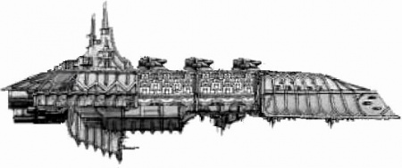
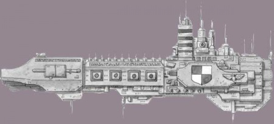

# 1577 审判庭黑船 Inquisitorial Black Ship

精校状态：中文行文已逐段精校，部分术语仍为暂定

分类：战舰

原文来源：https://www.bilibili.com/opus/1149014841026936838

原作者：帝国神选罐头

原文时间：2025年12月22日 08:44

[返回分类目录](目录.md) · [全书目录](../../目录.md)

<!-- A1577-B0001 -->
**英文原文**

Inquisitorial Black Ships are special Battle Barges used by the Inquisition, not to be confused with the Adeptus Astra Telepathica's League of Black Ships, which are used solely to collect psykers throughout the Imperium and ship them to Terra.

<!-- /A1577-B0001 -->

<!-- A1577-B0002 -->

原译文

审判官黑船是审判庭使用的特殊战斗驳船，不要与星语庭的黑船联盟混淆，后者仅用于在整个帝国收集灵能者并将其运送到泰拉。

**校订译文**

审判庭黑船是审判庭使用的特殊战斗驳船，须与星语庭的黑船联盟区分：后者专门从帝国各地征集灵能者并送往泰拉。

<!-- /A1577-B0002 -->

<!-- A1577-B0003 图片 -->

<!-- A1577-B0004 -->

原译文

Inquisitorial Black ship 审判官黑船

**校订译文**

Inquisitorial Black ship 审判庭黑船

<!-- /A1577-B0004 -->

<!-- A1577-B0005 -->
## Overview 概述

<!-- /A1577-B0005 -->

<!-- A1577-B0006 -->
**英文原文**

Built by the Mechanicum of Mars, the Inquisition's Black Ships are used for more general purposes, as harbingers of Imperial justice, making sure all laws are followed with the might to back up their decrees. They were first created by Inquisitors who felt that over-reliance on the Imperial Navy or Space Marines for their duties was unacceptable and potentially dangerous. Combining the power of a Strike Cruiser with a Navy Battlecruiser, Black Ships are secretive vessels which normally operate alone. They will sometimes operate alongside the Imperial Navy or Space Marines, forming the core of a formidable battlegroup for dealing with rebellions or heresy. The Black Ships actually predate the Inquisition which uses them in the 41st Millennium; their presence was noted as far back as during the Horus Heresy, when Death Guard Nathaniel Garro described them to himself,"Ships of the Astartes flotilla were swords against the enemies of Terra, a Black Ship was a hammer of witches."

<!-- /A1577-B0006 -->

<!-- A1577-B0007 -->

原译文

由火星机械教建造的审判庭的黑船被用于更一般的目的，作为帝国正义的先兆，确保所有法律都得到遵守，以支持他们的法令。它们最初是由审判官创造的，他们认为过度依赖帝国海军或星际战士履行职责是不可接受的，而且可能是危险的。黑船结合了打击巡洋舰和海军战列巡洋舰的力量，是通常单独行动的秘密战舰。他们有时会与帝国海军或星际战士并肩作战，形成一个强大的战斗群的核心，以应对叛乱或异端。黑船实际上早于第41个千年使用它们的审判庭；他们的存在早在荷鲁斯叛乱时期就被注意到了，当时死亡守卫的纳撒尼尔·伽罗对自己描述道：“阿斯塔特小型舰队的船只是对抗泰拉之敌的剑，黑船是女巫之锤。”

**校订译文**

这些由火星机械教制造的舰船承担广泛任务，以武力保障审判庭敕令的执行。最初，一些审判官认为履职时过分依赖海军与星际战士既难以接受，也可能危险，因而建立了自己的舰队。黑船结合打击巡洋舰与海军战列巡洋舰的力量，行动隐秘，通常单独出动；也会与海军或星际战士联合作战，成为镇压叛乱和异端的强大战斗群核心。底稿随后又指出，黑船早于M41的审判庭，荷鲁斯之乱时已有记载。纳撒尼尔·伽罗曾将阿斯塔特舰船比作斩向泰拉之敌的剑，将黑船比作粉碎巫师的锤。

**校注：** 原条目一面强调与星语庭黑船区分，一面将审判官建舰与早于审判庭的黑船记载并述，来源存在混用可能，保留并标注；不能因此认定所有黑船同一舰种。

<!-- /A1577-B0007 -->

<!-- A1577-B0008 图片 -->

<!-- A1577-B0009 -->

原译文

Inquisitorial Black ship 审判官黑船

**校订译文**

Inquisitorial Black ship 审判庭黑船

<!-- /A1577-B0009 -->

<!-- A1577-B0010 -->
**英文原文**

Normal ships of the Imperium have armoured prows, for protection upon ramming, or closing with an enemy ship, and have grey-steel paint schemes. Other ships of the Imperium also run with lights on at all times, to prevent collisions, and turn more lights on during warfare, to "illuminate the enemy." Black Ships have none of these: they run without lights, with black paint, and have blunt prows. Typical armament includes a dorsal Bombardment Cannon, port weapons batteries, Attack Craft prow launch bays, and prow Torpedoes.

<!-- /A1577-B0010 -->

<!-- A1577-B0011 -->

原译文

帝国的普通船只有装甲船首，用于在撞击或与敌舰接近时提供保护，并有灰钢涂装配色。帝国的其他船只也一直开着灯，以防止碰撞，并在战争期间打开更多的灯，以“启明敌人”。黑船没有这些：它们没有灯，涂着黑色涂装，船首钝。典型的武器包括背部轰击炮、舷侧武器阵列、攻击艇舰首发射舱和舰首鱼雷。

**校订译文**

普通帝国舰船常有装甲舰首，用来保护接敌或撞击时的船体，并采用钢灰涂装。它们平时亮灯防撞，战时更会增开照明，照亮敌人。黑船却涂成黑色、关闭灯光，舰首钝平。典型武装包括背部轰炸炮、左舷舰炮组、舰首攻击机发射舱及鱼雷管。

**校注：** port为左舷，原译只说舷侧漏去方位。

<!-- /A1577-B0011 -->

<!-- A1577-B0012 -->
**英文原文**

The ships of the Ordo Xenos and Ordo Malleus carry Deathwatch and Grey Knights Space Marines, respectively. During the Horus Heresy, Black Ships carried Witchseekers and held a myriad of oddities, much as they do in M41.

<!-- /A1577-B0012 -->

<!-- A1577-B0013 -->

原译文

攘外修会和圣锤修会的飞船分别搭载了死亡守望和灰骑士星际战士。在荷鲁斯叛乱时期，黑船搭载了猎巫人，并拥有无数奇怪的东西，就像他们在M41所做的那样。

**校订译文**

异形审判庭与恶魔审判庭的舰船分别搭载死亡守望和灰骑士。荷鲁斯之乱时期的黑船则搭载寻巫修女，并藏有种种奇物，与M41的情形相仿。

<!-- /A1577-B0013 -->

<!-- A1577-B0014 -->
## Known Black Ships 已知黑船

<!-- /A1577-B0014 -->

<!-- A1577-B0015 -->

原译文

Aeria Gloris 苍穹荣耀

**校订译文**

Aeria Gloris 苍穹荣耀

<!-- /A1577-B0015 -->

<!-- A1577-B0016 -->

原译文

Ecclesiarch Nevsky 教宗涅夫斯基

**校订译文**

Ecclesiarch Nevsky 教宗涅夫斯基

<!-- /A1577-B0016 -->

<!-- A1577-B0017 -->

原译文

Spear Excelsis 崇高之矛

**校订译文**

Spear Excelsis 崇高之矛

<!-- /A1577-B0017 -->

<!-- A1577-B0018 -->

原译文

Validus 坚不可摧

**校订译文**

Validus 坚不可摧

<!-- /A1577-B0018 -->

本篇核心术语与暂定项

以下列出本篇出现的英文原形及核心术语表用词。同形词可能指不同对象，具体词义以本篇正文和校注为准；单复数、别名和仅见于图注的名称可能尚未列入。完整候选见[术语表](../../术语表/双语术语候选.csv)。

| 英文 | 采用中文 | 状态 |
| --- | --- | --- |
| Space Marines | 星际战士 | 官方已核对 |
| Deathwatch | 死亡守望 | 官方已核对 |
| Grey Knights | 灰骑士 | 官方已核对 |
| Death Guard | 死亡守卫 | 官方已核对 |
| Horus Heresy | 荷鲁斯之乱 | 官方已核对 |
| Adeptus Astra Telepathica | 星语庭 | 暂定 |
| Inquisition | 审判庭 | 暂定 |
| Imperium | 帝国 | 暂定·简称 |
| Imperial Navy | 帝国海军 | 暂定 |
| Mechanicum | 机械教 | 暂定·历史称谓 |
| Ordo Malleus | 恶魔审判庭 | 用户指定 |
| Terra | 泰拉 | 暂定·官方待核 |
| Horus | 荷鲁斯 | 暂定·官方待核 |
| League of Black Ships | 黑船联盟 | 暂定·官方待核 |
| Ordo Xenos | 异形审判庭 | 用户指定 |
| Inquisitorial Black Ships | 审判庭黑船 | 暂定·官方待核 |
| Mars | 火星 | 暂定·官方待核 |
| Witchseekers | 寻巫修女 | 官方已核对 |
| Nathaniel Garro | 纳撒尼尔·伽罗 | 暂定·官方待核 |
| Harbingers | 凶兆 | 暂定·官方待核 |
| Strike Cruiser | 打击巡洋舰 | 暂定·官方待核 |
| Bombardment Cannon | 轰炸炮 | 暂定·官方待核 |
| Xenos | 异形 | 暂定·官方待核 |
| Weapons Batteries | 舰炮组 | 暂定·官方待核 |

