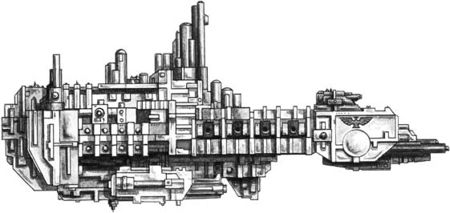
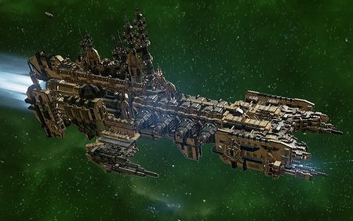
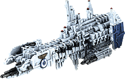

# 1578 打击巡洋舰 Strike Cruiser

精校状态：中文行文已逐段精校，部分术语仍为暂定

分类：战舰

原文来源：https://www.bilibili.com/opus/1211028744265793666

原作者：帝国神选罐头

原文时间：2026年06月07日 11:30

[返回分类目录](目录.md) · [全书目录](../../目录.md)

<!-- A1578-B0001 -->
**英文原文**

Most Space Marine Chapters control only two or three mighty Battle Barges, however these behemoths are called upon rarely. The Chapter's Strike Cruisers are more common, although still rare compared to Imperial Navy ship classes, but the arrival of a single Strike Cruiser is usually enough to quell a rebellious planet; the same cannot be said of an Imperial Navy Cruiser.

<!-- /A1578-B0001 -->

<!-- A1578-B0002 -->

原译文

大多数星际战士战团只控制两三艘强大的战斗驳船，但这些庞然大物很少被调用。战团的打击巡洋舰更为常见，尽管与帝国海军舰船类别相比仍然罕见，但一艘打击巡洋舰的到来通常足以平息一个叛乱的行星；帝国海军巡洋舰则不然。

**校订译文**

多数星际战士战团只有两三艘强大的战斗驳船，平时很少动用。打击巡洋舰更常见，尽管相较帝国海军舰艇仍很稀少；通常只需一艘抵达，就足以使叛乱行星屈服，普通海军巡洋舰却未必能做到。

<!-- /A1578-B0002 -->

<!-- A1578-B0003 图片 -->

<!-- A1578-B0004 -->

原译文

Space Marine Strike Cruiser 星际战士打击巡洋舰

**校订译文**

Space Marine Strike Cruiser 星际战士打击巡洋舰

<!-- /A1578-B0004 -->

<!-- A1578-B0005 -->
## Overview 概述

<!-- /A1578-B0005 -->

<!-- A1578-B0006 -->
**英文原文**

Strike Cruisers can carry up to one full company of Space Marines and their equipment. They are primarily used for rapid deployment and are often the first arrive in orbit of a threatened planet and capable of deploying their cargo within twenty minutes of said arrival.

<!-- /A1578-B0006 -->

<!-- A1578-B0007 -->

原译文

打击巡洋舰最多可以携带一个完整的星际战士连队及其装备。它们主要用于快速部署，通常是第一个到达受威胁行星轨道的，能够在到达后二十分钟内部署货物。

**校订译文**

打击巡洋舰最多可搭载一个完整星际战士连及其装备，主要承担快速部署任务。它往往最先赶到受威胁行星，并能在进入轨道后20分钟内投送部队。

<!-- /A1578-B0007 -->

<!-- A1578-B0008 -->
**英文原文**

The armament of a Strike Cruiser is comparable to that of a Imperial Navy Dauntless Light Cruiser, equipped with two Weapons Batteries. However, the Strike Cruiser omits the lance weaponry in exchange for a mighty Bombardment Cannon. Additionally a Strike Cruiser has a flight deck for launching two squadrons of Thunderhawk Gunships. Strike Cruisers can also be equipped with Exterminatus-class weapons or a Nova Cannon.

<!-- /A1578-B0008 -->

<!-- A1578-B0009 -->

原译文

打击巡洋舰的武器装备与帝国海军无畏轻型巡洋舰相当，配备了两个武器阵列。然而，打击巡洋舰省略了光矛武器，以换取强大的轰击炮。此外，一艘打击巡洋舰还有一个飞行甲板，用于发射两个雷鹰炮艇中队。打击巡洋舰也可以配备灭绝类武器或新星炮。

**校订译文**

其武装规模相当于帝国海军无畏级轻型巡洋舰，配有两组舰炮，但以强大的轰炸炮替代光矛；飞行甲板还可放出两个雷鹰中队。它也能搭载执行灭绝令的武器或新星炮。

**校注：** 本段通述不装光矛，下文Mk.III却明确装有光矛，按所给不同配置保留；不将通述改成绝对规则。

<!-- /A1578-B0009 -->

<!-- A1578-B0010 图片 -->

<!-- A1578-B0011 -->

原译文

Strike Cruiser 打击巡洋舰

**校订译文**

Strike Cruiser 打击巡洋舰

<!-- /A1578-B0011 -->

<!-- A1578-B0012 -->
**英文原文**

Vulkan led the design of the first true Strike Cruisers near the end of the Great Crusade, but the Horus Heresy delayed their rollout. After the first stages of the Scouring and the Second Founding the design was revised by the rebuilding Imperium to arm the Adeptus Astartes.

<!-- /A1578-B0012 -->

<!-- A1578-B0013 -->

原译文

在大远征接近尾声时，沃坎领导了第一艘真正的打击巡洋舰的设计，但荷鲁斯叛乱推迟了它们的推出。在大清洗的第一阶段和二次建军之后，重建的帝国对设计进行了修改，以武装阿斯塔特修会。

**校订译文**

大远征末期，沃坎主持设计了第一批真正的打击巡洋舰，但荷鲁斯之乱延迟了列装。大清洗初期与二次建军之后，重建中的帝国修订设计，将其配发阿斯塔特。

<!-- /A1578-B0013 -->

<!-- A1578-B0014 图片 -->

<!-- A1578-B0015 -->

原译文

Ultramarines Strike Cruiser 极限战士打击巡洋舰

**校订译文**

Ultramarines Strike Cruiser 极限战士打击巡洋舰

<!-- /A1578-B0015 -->

<!-- A1578-B0016 -->
## Variants 变体

<!-- /A1578-B0016 -->

<!-- A1578-B0017 -->
**英文原文**

Mk.I Strike Cruiser - Assault carrier equipped with with Attack Craft launch bays, Drop Pod and Boarding Torpedo launchers, 2 Macrocannon batteries, and 1 Bombardment Cannon.

<!-- /A1578-B0017 -->

<!-- A1578-B0018 -->

原译文

Mk.I打击巡洋舰 - 配备攻击艇发射舱、空投舱和跳帮鱼雷发射器、2个宏炮阵列和1门轰击炮的突击母舰。

**校订译文**

Mk.I 打击巡洋舰——突击航母，配备攻击机发射舱、空降舱及跳帮鱼雷发射器、两组宏炮与一门轰炸炮。

<!-- /A1578-B0018 -->

<!-- A1578-B0019 -->
**英文原文**

Mk.II Strike Cruiser - Torpedo cruiser equipped with 6 Torpedo tubes, 2 Macrocannon batteries, and 1 Bombardment Cannon.

<!-- /A1578-B0019 -->

<!-- A1578-B0020 -->

原译文

Mk.II打击巡洋舰 - 鱼雷巡洋舰，配备6个鱼雷管、2个宏炮阵列和1门轰击炮。

**校订译文**

Mk.II 打击巡洋舰——鱼雷巡洋舰，配备六具鱼雷管、两组宏炮和一门轰炸炮。

<!-- /A1578-B0020 -->

<!-- A1578-B0021 -->
**英文原文**

Mk.III Strike Cruiser - Anti-ship fleet combatant equipped with 1 heavy Lance battery, 2 Macrocannon batteries, and 1 Bombardment Cannon.

<!-- /A1578-B0021 -->

<!-- A1578-B0022 -->

原译文

Mk.III打击巡洋舰 - 反舰舰队战斗舰，配备1个重型光矛阵列、2个宏炮阵列和1门轰击炮。

**校订译文**

Mk.III 打击巡洋舰——反舰作战型，配备一组重型光矛、两组宏炮和一门轰炸炮。

<!-- /A1578-B0022 -->

<!-- A1578-B0023 -->

原译文

Vanguard Cruiser 先锋巡洋舰

**校订译文**

Vanguard Cruiser 先锋巡洋舰

<!-- /A1578-B0023 -->

<!-- A1578-B0024 -->

原译文

Grey Knights Strike Cruiser 灰骑士打击巡洋舰

**校订译文**

Grey Knights Strike Cruiser 灰骑士打击巡洋舰

<!-- /A1578-B0024 -->

<!-- A1578-B0025 -->

原译文

Punisher Class Strike Cruiser 惩罚者级打击巡洋舰

**校订译文**

Punisher Class Strike Cruiser 惩罚者级打击巡洋舰

<!-- /A1578-B0025 -->

<!-- A1578-B0026 -->
**英文原文**

Olympia Class Strike Cruiser - Used by the Legiones Astartes during the Great Crusade and Horus Heresy.

<!-- /A1578-B0026 -->

<!-- A1578-B0027 -->

原译文

奥林匹亚级打击巡洋舰 - 在大远征和荷鲁斯叛乱期间，阿斯塔特军团使用过。

**校订译文**

奥林匹亚级打击巡洋舰 - 在大远征和荷鲁斯之乱期间，阿斯塔特军团使用过。

<!-- /A1578-B0027 -->

<!-- A1578-B0028 -->
**英文原文**

Agentha Class Strike Cruiser - A pattern of Strike Cruiser used during the Horus Heresy.

<!-- /A1578-B0028 -->

<!-- A1578-B0029 -->

原译文

阿根塔级打击巡洋舰 -荷鲁斯叛乱时期使用的一种打击巡洋舰型号。

**校订译文**

阿根塔级打击巡洋舰 -荷鲁斯之乱时期使用的一种打击巡洋舰型号。

<!-- /A1578-B0029 -->

<!-- A1578-B0030 -->
**英文原文**

Excelsior Class Strike Cruiser - A pattern of Strike Cruiser used during the Horus Heresy.

<!-- /A1578-B0030 -->

<!-- A1578-B0031 -->

原译文

精益级打击巡洋舰 - 荷鲁斯叛乱时期使用的一种打击巡洋舰型号。

**校订译文**

精益级打击巡洋舰 - 荷鲁斯之乱时期使用的一种打击巡洋舰型号。

<!-- /A1578-B0031 -->

<!-- A1578-B0032 -->
**英文原文**

Maegaron Class Strike Cruiser - A pattern of Strike Cruiser used during the Horus Heresy.

<!-- /A1578-B0032 -->

<!-- A1578-B0033 -->

原译文

梅加隆级打击巡洋舰 - 荷鲁斯叛乱时期使用的一种打击巡洋舰型号。

**校订译文**

梅加隆级打击巡洋舰 - 荷鲁斯之乱时期使用的一种打击巡洋舰型号。

<!-- /A1578-B0033 -->

<!-- A1578-B0034 -->
## Famous Strike Cruisers 著名打击巡洋舰

<!-- /A1578-B0034 -->

<!-- A1578-B0035 -->
**英文原文**

Andronius - Famous Emperor's Children Strike Cruiser from the Horus Heresy.

<!-- /A1578-B0035 -->

<!-- A1578-B0036 -->

原译文

安德罗尼乌斯号 -荷鲁斯叛乱时期著名帝皇之子打击巡洋舰。

**校订译文**

安德罗尼乌斯号 -荷鲁斯之乱时期著名帝皇之子打击巡洋舰。

<!-- /A1578-B0036 -->

<!-- A1578-B0037 -->
**英文原文**

Atreides - Scythes of the Emperor

<!-- /A1578-B0037 -->

<!-- A1578-B0038 -->

原译文

亚崔迪号 - 帝皇之镰

**校订译文**

亚崔迪号 - 帝皇之镰

<!-- /A1578-B0038 -->

<!-- A1578-B0039 -->
**英文原文**

Blade of the Seventh Son - Flagship of the Celestial Lions.

<!-- /A1578-B0039 -->

<!-- A1578-B0040 -->

原译文

七子之刃 - 天狮的旗舰

**校订译文**

七子之刃号——天狮战团旗舰。

<!-- /A1578-B0040 -->

<!-- A1578-B0041 -->
**英文原文**

Bronze Minos - Sons of Malice

<!-- /A1578-B0041 -->

<!-- A1578-B0042 -->

原译文

青铜米诺斯号 - 恶意之子

**校订译文**

青铜米诺斯号 - 恶意之子

<!-- /A1578-B0042 -->

<!-- A1578-B0043 -->
**英文原文**

Claw of Russ - Space Wolves.

<!-- /A1578-B0043 -->

<!-- A1578-B0044 -->

原译文

鲁斯之爪号 - 太空野狼

**校订译文**

鲁斯之爪号 - 太空野狼

<!-- /A1578-B0044 -->

<!-- A1578-B0045 -->
**英文原文**

Death's Cowl - Flesh Tearers Strike Cruiser which holds the majority of their Death Company.

<!-- /A1578-B0045 -->

<!-- A1578-B0046 -->

原译文

死亡兜帽号 - 撕肉者打击巡洋舰，拥有其死亡连的大部分。

**校订译文**

死亡之罩号——撕肉者的打击巡洋舰，搭载战团死亡连的大部分兵力。

<!-- /A1578-B0046 -->

<!-- A1578-B0047 -->
**英文原文**

Defiance of Calth - Served as the flagship of Aeonid Thiel after the Battle of Calth in the Horus Heresy.

<!-- /A1578-B0047 -->

<!-- A1578-B0048 -->

原译文

考斯之抗号 - 在荷鲁斯异端考斯之战后，担任埃奥尼德·希尔的旗舰。

**校订译文**

考斯之抗号——荷鲁斯之乱中，考斯之战后伊奥尼德·希尔的旗舰。

<!-- /A1578-B0048 -->

<!-- A1578-B0049 -->
**英文原文**

Ebon Drake - Experimental Strike Cruiser variant of the Salamanders from the Horus Heresy.

<!-- /A1578-B0049 -->

<!-- A1578-B0050 -->

原译文

黑檀龙兽号 - 荷鲁斯叛乱火蜥蜴的实验性打击巡洋舰变体。

**校订译文**

黑檀龙兽号 - 荷鲁斯之乱火蜥蜴的实验性打击巡洋舰变体。

<!-- /A1578-B0050 -->

<!-- A1578-B0051 -->
**英文原文**

Echo of Damnation - Flagship of the Night Lords warband under Talos Valcoran.

<!-- /A1578-B0051 -->

<!-- A1578-B0052 -->

原译文

天谴回响号 - 塔洛斯·瓦尔科兰领导的午夜领主战帮旗舰。

**校订译文**

天谴回响号 - 塔洛斯·瓦尔科兰领导的午夜领主战帮旗舰。

<!-- /A1578-B0052 -->

<!-- A1578-B0053 -->
**英文原文**

Emperor's Will - Flagship of Ultramarines Captain Cato Sicarius.

<!-- /A1578-B0053 -->

<!-- A1578-B0054 -->

原译文

帝皇之志号 - 极限战士连长卡托·西卡留斯的旗舰

**校订译文**

帝皇意志号——极限战士连长卡托·西卡留斯的旗舰。

<!-- /A1578-B0054 -->

<!-- A1578-B0055 -->
**英文原文**

Infidus Diabolus - Flagship of Word Bearers Dark Apostle Marduk.

<!-- /A1578-B0055 -->

<!-- A1578-B0056 -->

原译文

不忠魔鬼号 - 怀言者黑暗使徒马杜克的旗舰

**校订译文**

背信恶魔号——怀言者黑暗使徒马尔杜克的旗舰。

<!-- /A1578-B0056 -->

<!-- A1578-B0057 -->
**英文原文**

Light of Inwit - Famous Imperial Fists Strike Cruiser from the Horus Heresy.

<!-- /A1578-B0057 -->

<!-- A1578-B0058 -->

原译文

因维特之光号 - 荷鲁斯叛乱著名帝国之拳打击巡洋舰

**校订译文**

因维特之光号 - 荷鲁斯之乱著名帝国之拳打击巡洋舰

<!-- /A1578-B0058 -->

<!-- A1578-B0059 -->
**英文原文**

Lord of Vespator - Flagship of Ultramarines Tetrarch Decimus Felix.

<!-- /A1578-B0059 -->

<!-- A1578-B0060 -->

原译文

维斯帕托领主号 - 极限战士英杰德西穆斯·菲利克斯的旗舰

**校订译文**

维斯帕托领主号——极限战士四方领主德西穆斯·菲利克斯的旗舰。

<!-- /A1578-B0060 -->

<!-- A1578-B0061 -->
**英文原文**

Northwind - Used by the White Scars 4th Brotherhood.

<!-- /A1578-B0061 -->

<!-- A1578-B0062 -->

原译文

北风号 - 被白色疤痕第四兄弟会使用

**校订译文**

北风号——白疤第四兄弟会使用。

<!-- /A1578-B0062 -->

<!-- A1578-B0063 -->
**英文原文**

Sacrum Finem - Grey Knights Strike Cruiser used by the Purifiers.

<!-- /A1578-B0063 -->

<!-- A1578-B0064 -->

原译文

神圣终点号 - 净化者使用的灰骑士打击巡洋舰

**校订译文**

神圣终点号 - 净化者使用的灰骑士打击巡洋舰

<!-- /A1578-B0064 -->

<!-- A1578-B0065 -->
**英文原文**

Shield of Valour - Imperial Fists

<!-- /A1578-B0065 -->

<!-- A1578-B0066 -->

原译文

英勇之盾号 - 帝国之拳

**校订译文**

英勇之盾号 - 帝国之拳

<!-- /A1578-B0066 -->

<!-- A1578-B0067 -->
**英文原文**

Sisypheum - Famous Iron Hands Strike Cruiser from the Horus Heresy.

<!-- /A1578-B0067 -->

<!-- A1578-B0068 -->

原译文

西西弗姆号 - 荷鲁斯叛乱著名钢铁之手打击巡洋舰

**校订译文**

西西弗姆号 - 荷鲁斯之乱著名钢铁之手打击巡洋舰

<!-- /A1578-B0068 -->

<!-- A1578-B0069 -->
**英文原文**

Skulltaker - Flagship of World Eaters warlord Khârn.

<!-- /A1578-B0069 -->

<!-- A1578-B0070 -->

原译文

夺颅者号 - 吞世者军阀卡恩的旗舰

**校订译文**

夺颅者号 - 吞世者军阀卡恩的旗舰

<!-- /A1578-B0070 -->

<!-- A1578-B0071 -->
**英文原文**

Sword of Caliban - Dark Angels

<!-- /A1578-B0071 -->

<!-- A1578-B0072 -->

原译文

卡利班之剑号 - 黑暗天使

**校订译文**

卡利班之剑号 - 黑暗天使

<!-- /A1578-B0072 -->

<!-- A1578-B0073 -->
**英文原文**

Vae Victus - Famous Ultramarines Strike Cruiser under the command of Lazlo Tiberius.

<!-- /A1578-B0073 -->

<!-- A1578-B0074 -->

原译文

败者迎祸号 -拉兹洛·提比略指挥下的著名极限战士打击巡洋舰。

**校订译文**

成王败寇号——拉兹洛·提比略指挥的著名极限战士打击巡洋舰。

<!-- /A1578-B0074 -->

<!-- A1578-B0075 -->
**英文原文**

Veritas Ferrum - Iron Hands Strike Cruiser that became heavily corrupted during the Horus Heresy.

<!-- /A1578-B0075 -->

<!-- A1578-B0076 -->

原译文

钢铁真理号 - 在荷鲁斯叛乱期间被严重腐化的钢铁之手打击巡洋舰

**校订译文**

钢铁真理号 - 在荷鲁斯之乱期间被严重腐化的钢铁之手打击巡洋舰

<!-- /A1578-B0076 -->

<!-- A1578-B0077 -->
**英文原文**

Wolf of Fenris - Space Wolves, captured by the Red Corsairs.

<!-- /A1578-B0077 -->

<!-- A1578-B0078 -->

原译文

芬里斯之狼号 - 太空野狼，被红海盗俘获

**校订译文**

芬里斯之狼号 - 太空野狼，被红海盗俘获

<!-- /A1578-B0078 -->

本篇核心术语与暂定项

以下列出本篇出现的英文原形及核心术语表用词。同形词可能指不同对象，具体词义以本篇正文和校注为准；单复数、别名和仅见于图注的名称可能尚未列入。完整候选见[术语表](../../术语表/双语术语候选.csv)。

| 英文 | 采用中文 | 状态 |
| --- | --- | --- |
| Space Marines | 星际战士 | 官方已核对 |
| Adeptus Astartes | 阿斯塔特修会 | 官方已核对 |
| Dark Angels | 黑暗天使 | 官方已核对 |
| Grey Knights | 灰骑士 | 官方已核对 |
| Space Wolves | 太空野狼 | 官方已核对 |
| World Eaters | 吞世者 | 官方已核对 |
| Ultramarines | 极限战士 | 官方已核对 |
| Horus Heresy | 荷鲁斯之乱 | 官方已核对 |
| Imperium | 帝国 | 暂定·简称 |
| Imperial Navy | 帝国海军 | 暂定 |
| Equipment | 装备 | 编辑用语已统一 |
| Imperial Fists | 帝国之拳 | 暂定 |
| Emperor | 帝皇 | 官方已核对 |
| Word Bearers | 怀言者 | 暂定·官方待核 |
| Dark Apostle | 黑暗使徒 | 官方已核对 |
| Emperor's Children | 帝皇之子 | 官方已核对 |
| Night Lords | 午夜领主 | 暂定·官方待核 |
| Great Crusade | 大远征 | 暂定·官方待核 |
| Horus | 荷鲁斯 | 暂定·官方待核 |
| Iron Hands | 钢铁之手 | 暂定·官方待核 |
| Legiones Astartes | 阿斯塔特军团 | 暂定·官方待核 |
| Vulkan | 沃坎 | 暂定·官方待核 |
| Salamanders | 火蜥蜴 | 暂定·官方待核 |
| Brotherhood | 兄弟会 | 暂定·官方待核 |
| Caliban | 卡利班 | 暂定·官方待核 |
| Olympia | 奥林匹亚 | 暂定·官方待核 |
| Calth | 考斯 | 暂定·官方待核 |
| Fenris | 芬里斯 | 暂定·官方待核 |
| Marduk | 马尔杜克 | 暂定·官方待核 |
| Drop Pod | 空降舱 | 官方已核·中英对照 |
| Lance | 骑士矛阵 | 暂定·官方待核 |
| White Scars | 白疤 | 官方已核 |
| Second Founding | 二次建军 | 暂定·官方待核 |
| Scars | 伤疤 | 暂定·官方待核 |
| Founding | 建军 | 暂定·官方待核 |
| Khârn | 卡恩 | 暂定·官方待核 |
| Space Marine | 星际战士 | 暂定·官方待核 |
| Chapter | 战团 | 暂定·官方待核 |
| Captain | 连长 | 暂定·官方待核 |
| Cato Sicarius | 卡托·西卡留斯 | 暂定·官方待核 |
| Flesh Tearers | 撕肉者 | 暂定·官方待核 |
| Scythes of the Emperor | 帝皇之镰 | 暂定·官方待核 |
| Celestial Lions | 天狮 | 暂定·官方待核 |
| Decimus Felix | 德西穆斯·菲利克斯 | 暂定·官方待核 |
| Strike Cruiser | 打击巡洋舰 | 暂定·官方待核 |
| Torpedo | 鱼雷 | 暂定·官方待核 |
| Macrocannon | 宏炮 | 暂定·官方待核 |
| Bombardment Cannon | 轰炸炮 | 暂定·官方待核 |
| Infidus Diabolus | 背信恶魔号 | 暂定·官方待核 |
| Aeonid Thiel | 伊奥尼德·希尔 | 暂定·官方待核 |
| Malice | 恶意 | 暂定·官方待核 |
| Victus | 征服号 | 暂定·官方待核 |
| Skulltaker | 夺颅者 | 官方已核对 |
| Tetrarch | 四方领主 | 暂定·官方待核 |
| Blade of the Seventh Son | 七子之刃号 | 暂定·官方待核 |
| Talos Valcoran | 塔洛斯·瓦尔科兰 | 暂定·官方待核 |
| Death's Cowl | 死亡之罩号 | 暂定·官方待核 |
| Sisypheum | 西西弗姆号 | 暂定·官方待核 |
| Veritas Ferrum | 钢铁真理号 | 暂定·官方待核 |
| Battle of Calth | 考斯之战 | 暂定·官方待核 |
| Lazlo Tiberius | 拉兹洛·提比略 | 暂定·官方待核 |
| Vespator | 维斯帕托 | 暂定·官方待核 |
| Atreides | 亚崔迪号 | 暂定·官方待核 |
| Emperor's Will | 帝皇意志号 | 暂定·官方待核 |
| Ebon Drake | 黑檀龙兽号 | 暂定·官方待核 |
| Light of Inwit | 因维特之光号 | 暂定·官方待核 |
| Shield of Valour | 英勇之盾号 | 暂定·官方待核 |
| Defiance | 反抗号 | 暂定·官方待核 |
| Vae Victus | 成王败寇号 | 暂定·官方待核 |
| Boarding Torpedo | 跳帮鱼雷 | 暂定·官方待核 |
| Andronius | 安德罗尼乌斯号 | 暂定·官方待核 |
| Ferrum | 钢铁号 | 暂定·官方待核 |
| claw | 利爪分队 | 暂定·官方待核 |
| Weapons Batteries | 舰炮组 | 暂定·官方待核 |
| Olympia Class Strike Cruiser | 奥林匹亚级打击巡洋舰 | 暂定·官方待核 |
| Agentha Class Strike Cruiser | 阿根塔级打击巡洋舰 | 暂定·官方待核 |
| Excelsior Class Strike Cruiser | 精益级打击巡洋舰 | 暂定·官方待核 |
| Maegaron Class Strike Cruiser | 梅加隆级打击巡洋舰 | 暂定·官方待核 |
| Bronze Minos | 青铜米诺斯号 | 暂定·官方待核 |
| Claw of Russ | 鲁斯之爪号 | 暂定·官方待核 |
| Defiance of Calth | 考斯之抗号 | 暂定·官方待核 |
| Echo of Damnation | 天谴回响号 | 暂定·官方待核 |
| Lord of Vespator | 维斯帕托领主号 | 暂定·官方待核 |
| Northwind | 北风号 | 暂定·官方待核 |
| Sacrum Finem | 神圣终点号 | 暂定·官方待核 |
| Sword of Caliban | 卡利班之剑号 | 暂定·官方待核 |
| Wolf of Fenris | 芬里斯之狼号 | 暂定·官方待核 |

