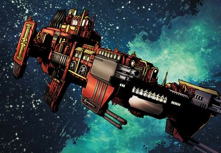

# 1579 审判庭巡洋舰 Inquisitorial Cruiser

精校状态：中文行文已逐段精校，部分术语仍为暂定

分类：战舰

原文来源：https://www.bilibili.com/opus/1149411507066372097

原作者：帝国神选罐头

原文时间：2025年12月23日 10:23

[返回分类目录](目录.md) · [全书目录](../../目录.md)

<!-- A1579-B0001 -->
**英文原文**

Inquisitorial Cruisers are Strike Cruiser-class vessels used by the Inquisition.

<!-- /A1579-B0001 -->

<!-- A1579-B0002 -->

原译文

审判官巡洋舰是审判庭所使用的打击巡洋舰级战舰。

**校订译文**

审判庭巡洋舰是审判庭使用的打击巡洋舰类舰船。

<!-- /A1579-B0002 -->

<!-- A1579-B0003 图片 -->

<!-- A1579-B0004 -->

原译文

Astor Sabbathiel's Inquisitorial Cruiser 阿斯特·萨巴蒂尔的审判官巡洋舰

**校订译文**

Astor Sabbathiel's Inquisitorial Cruiser 阿斯特·萨巴蒂尔的审判庭巡洋舰

<!-- /A1579-B0004 -->

<!-- A1579-B0005 -->
**英文原文**

These vessels are specially constructed for the Inquisition, and wield technology and weaponry available only to the fleets of Mars itself. As a result they are faster, better armed, and better protected than Imperial Navy ships of the same class. While a few standard pattern are used by the Inquisition, they are just as often purpose-constructed and optimized for specific roles. These ships are usually used by Inquisitors mission-to-mission before being transferred, though it is not unheard of for individual Inquisitors to have permanent Cruisers attached to their names.

<!-- /A1579-B0005 -->

<!-- A1579-B0006 -->

原译文

这些战舰是专门为审判庭建造的，并使用只有火星舰队才能使用的技术和武器。因此，它们比同级别的帝国海军舰船更快、装备更好、保护更好。虽然审判庭使用了一些标准型号，但它们通常是专门为特定角色构建和优化的。这些舰船通常由审判官在被转移之前逐个任务使用，尽管个别审判官的名字上附有永久巡洋舰的情况并非闻所未闻。

**校订译文**

它们专为审判庭建造，采用通常只有火星本部舰队才能取得的技术与武器，因而比同级海军舰艇更快、火力更强、防护更好。虽然有少数标准型号，许多仍按特定任务定制优化。通常，一名审判官完成任务后，舰船就会转交其他任务使用；但个别审判官永久配属一艘巡洋舰，也并非没有先例。

<!-- /A1579-B0006 -->

本篇核心术语与暂定项

以下列出本篇出现的英文原形及核心术语表用词。同形词可能指不同对象，具体词义以本篇正文和校注为准；单复数、别名和仅见于图注的名称可能尚未列入。完整候选见[术语表](../../术语表/双语术语候选.csv)。

| 英文 | 采用中文 | 状态 |
| --- | --- | --- |
| Inquisition | 审判庭 | 暂定 |
| Imperial Navy | 帝国海军 | 暂定 |
| Inquisitorial Cruisers | 审判庭巡洋舰 | 暂定·官方待核 |
| Mars | 火星 | 暂定·官方待核 |
| Mission | 教团／传教机构 | 暂定 |
| Strike Cruiser | 打击巡洋舰 | 暂定·官方待核 |

