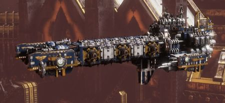

# 1580 先锋级轻型巡洋舰 Vanguard Class Light Cruiser

精校状态：中文行文已逐段精校，部分术语仍为暂定

分类：战舰

原文来源：https://www.bilibili.com/opus/1212157457353146393

原作者：帝国神选罐头

原文时间：2026年06月10日 12:30

[返回分类目录](目录.md) · [全书目录](../../目录.md)

<!-- A1580-B0001 -->
**英文原文**

The Vanguard Class Light Cruiser is a class of Light Cruiser used by the Space Marine Fleet.

<!-- /A1580-B0001 -->

<!-- A1580-B0002 -->

原译文

先锋级轻型巡洋舰是星际战士舰队使用的一类轻型巡洋舰。

**校订译文**

先锋级轻型巡洋舰是星际战士舰队使用的一类轻型巡洋舰。

<!-- /A1580-B0002 -->

<!-- A1580-B0003 图片 -->

<!-- A1580-B0004 -->

原译文

Vanguard Class Light Cruiser 先锋级轻型巡洋舰

**校订译文**

Vanguard Class Light Cruiser 先锋级轻型巡洋舰

<!-- /A1580-B0004 -->

<!-- A1580-B0005 -->
## Overview 概述

<!-- /A1580-B0005 -->

<!-- A1580-B0006 -->
**英文原文**

Vanguard Cruisers are normally refitted Strike Cruisers rather than purpose-built. They have improved thrusters and defensive turrets, but this comes at the expense of weaker offensive weaponry so Vanguards are less capable in a planetary assault role. As a result, Vanguards are used as scouting vessels operating independently or as heavy escorts as part of a large Space Marine fleet. Not all Space Marine Chapters utilise or designate their vessels this way, and those that do are more commonly entirely Fleet-Based Chapters who have need of such vessels, often operating beyond the Imperium's borders and without any assistance from the Imperial Navy.

<!-- /A1580-B0006 -->

<!-- A1580-B0007 -->

原译文

先锋巡洋舰通常是改装的打击巡洋舰，而不是专门建造的。他们改进了推进器和防御炮塔，但这是以牺牲较弱的进攻性武器为代价的，因此先锋在行星突击任务中的能力较弱。因此，先锋被用作独立运作的侦察战舰，或作为大型星际战士舰队的重型护卫舰。并非所有星际战士战团都以这种方式使用或指定其战舰，而那些使用或指定这种方式的战团更常见的是完全的舰基战团，他们需要这种战舰，通常在帝国边界之外运作，没有帝国海军的任何协助。

**校订译文**

先锋级通常由打击巡洋舰改装，强化推进器和防御炮塔，代价是进攻火力减弱，行星突击能力因而逊色。它可独立侦察，也可在大型战团舰队中充当重型护航舰。并非每个战团都有这种分类或用法，采用它的往往是完全以舰队为家的战团；这些部队常在帝国疆界之外行动，无法获得海军协助。

<!-- /A1580-B0007 -->

<!-- A1580-B0008 -->
## Patterns 型号

<!-- /A1580-B0008 -->

<!-- A1580-B0009 -->
**英文原文**

The Vanguard Light Cruiser comes in three main patterns:

<!-- /A1580-B0009 -->

<!-- A1580-B0010 -->

原译文

先锋轻型巡洋舰有三种主要型号：

**校订译文**

先锋轻型巡洋舰有三种主要型号：

<!-- /A1580-B0010 -->

<!-- A1580-B0011 -->
**英文原文**

Mk.I — Armed with Torpedo launchers, Macrocannons, and launch bays for Attack Craft.

<!-- /A1580-B0011 -->

<!-- A1580-B0012 -->

原译文

Mk.I — 配备鱼雷发射器、宏炮和攻击艇发射舱。

**校订译文**

Mk.I — 配备鱼雷发射器、宏炮和攻击艇发射舱。

<!-- /A1580-B0012 -->

<!-- A1580-B0013 -->
**英文原文**

Mk.II — Armed with Lances, Macrocannons, and Attack Craft launch bays.

<!-- /A1580-B0013 -->

<!-- A1580-B0014 -->

原译文

Mk.II——配备光矛、宏炮和攻击艇发射舱。

**校订译文**

Mk.II——配备光矛、宏炮和攻击艇发射舱。

<!-- /A1580-B0014 -->

<!-- A1580-B0015 -->
**英文原文**

Mk.III — Armed with a single Bombardment Cannon, Macrocannons, and Attack Craft Launch Bays.

<!-- /A1580-B0015 -->

<!-- A1580-B0016 -->

原译文

Mk.III — 配备一门轰击炮、宏炮和攻击艇发射舱。

**校订译文**

Mk.III — 配备一门轰炸炮、宏炮和攻击机发射舱。

<!-- /A1580-B0016 -->

<!-- A1580-B0017 -->
## Known Vanguard Light Cruisers 已知先锋轻型巡洋舰

<!-- /A1580-B0017 -->

<!-- A1580-B0018 -->
**英文原文**

Cantatum Bellum — Black Templars. Part of the Angevin Crusade.

<!-- /A1580-B0018 -->

<!-- A1580-B0019 -->

原译文

咏颂战争号 — 黑色圣堂。安茹远征的一部分

**校订译文**

咏颂战争号 — 黑色圣堂。安茹远征的一部分

<!-- /A1580-B0019 -->

<!-- A1580-B0020 -->
**英文原文**

Mitrah — Mentors.

<!-- /A1580-B0020 -->

<!-- A1580-B0021 -->

原译文

米特拉号 — 导师

**校订译文**

米特拉号 — 导师

<!-- /A1580-B0021 -->

<!-- A1580-B0022 -->
**英文原文**

Obsidia — Salamanders. Fought in the Badab War.

<!-- /A1580-B0022 -->

<!-- A1580-B0023 -->

原译文

黑曜石号 — 火蜥蜴。在巴达布战争中战斗

**校订译文**

黑曜石号 — 火蜥蜴。在巴达布战争中战斗

**校注：** Obsidia此处具名舰船沿原黑曜石号，与核心地名奥布西迪亚分义。

<!-- /A1580-B0023 -->

<!-- A1580-B0024 -->
**英文原文**

Red Harbinger — Fire Hawks. Crippled and then captured by the Mantis Warriors in 350 904.M41.

<!-- /A1580-B0024 -->

<!-- A1580-B0025 -->

原译文

红色预兆号 — 火鹰。瘫痪，然后在350 904.M41被螳螂勇士俘虏。

**校订译文**

赤红先兆号——火鹰所属，于350 904.M41被击瘫，随后遭螳螂勇士俘获。

**校注：** 350 904.M41按原帝国纪年格式保留，不误当公历350904年。

<!-- /A1580-B0025 -->

本篇核心术语与暂定项

以下列出本篇出现的英文原形及核心术语表用词。同形词可能指不同对象，具体词义以本篇正文和校注为准；单复数、别名和仅见于图注的名称可能尚未列入。完整候选见[术语表](../../术语表/双语术语候选.csv)。

| 英文 | 采用中文 | 状态 |
| --- | --- | --- |
| Black Templars | 黑色圣堂 | 官方已核对 |
| Imperium | 帝国 | 暂定·简称 |
| Imperial Navy | 帝国海军 | 暂定 |
| Salamanders | 火蜥蜴 | 暂定·官方待核 |
| Badab | 巴达布 | 暂定·官方待核 |
| Mentors | 导师战团 | 暂定·官方待核 |
| Space Marine | 星际战士 | 暂定·官方待核 |
| Vanguard | 先锋 | 暂定·官方待核 |
| Mantis Warriors | 螳螂勇士 | 暂定·官方待核 |
| Fire Hawks | 火鹰 | 暂定·官方待核 |
| Fleet-Based Chapters | 舰基战团 | 暂定·官方待核 |
| Space Marine Fleet | 星际战士舰队 | 暂定·官方待核 |
| Vanguard Class Light Cruiser | 先锋级轻型巡洋舰 | 暂定·官方待核 |
| Torpedo | 鱼雷 | 暂定·官方待核 |
| Bombardment Cannon | 轰炸炮 | 暂定·官方待核 |
| Obsidia | 奥布西迪亚 | 暂定·官方待核 |
| Red Harbinger | 赤红先兆号 | 暂定·官方待核 |
| Cantatum Bellum | 咏颂战争号 | 暂定·官方待核 |
| Mitrah | 米特拉号 | 暂定·官方待核 |
| Angevin Crusade | 安茹远征 | 暂定·官方待核 |

