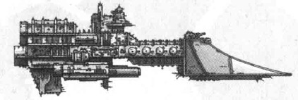

# 1581 护卫舰艇 Escort

精校状态：中文行文已逐段精校，部分术语仍为暂定

分类：战舰

原文来源：https://www.bilibili.com/opus/1212141999794159641

原作者：帝国神选罐头

原文时间：2026年06月10日 11:30

[返回分类目录](目录.md) · [全书目录](../../目录.md)

原篇名：护卫舰 Escort

<!-- A1581-B0001 -->
**英文原文**

Escorts (also known as Frigates or Destroyers) are a classification of combat space vessel. Escorts are the smallest craft in use but come in the largest numbers, providing support in defence of larger ships. The most common duties of Escort-class vessels are patrol, reconnaissance, convoy protection, raiding, and picketing. In combat Escorts have a short life expediency but will swarm larger vessels.

<!-- /A1581-B0001 -->

<!-- A1581-B0002 -->

原译文

护卫舰（也称为护航舰或驱逐舰）是战斗太空战舰的一种分类。护卫舰是使用中最小的船只，但数量最多，为大型舰船的防御提供支援。护卫级战舰最常见的职责是巡逻、侦查、护航、突袭和封锁。在战斗中，护卫舰的生存时间很短，但会成群结队地向更大的战舰。

**校订译文**

护卫舰艇是小型战斗星舰的统称，包括护卫舰与驱逐舰。它们体型最小、数量最多，为大型舰船提供防护，常执行巡逻、侦察、护航、袭扰和警戒任务。交战时虽然损失率高，却能成群围攻更大的敌舰。

**校注：** Escort为涵盖Frigate与Destroyer的小型护航舰艇总类；采用护卫舰艇，避免原译将三个层级互换。

<!-- /A1581-B0002 -->

<!-- A1581-B0003 图片 -->

<!-- A1581-B0004 -->

原译文

Imperial Sword Class Frigate 帝国剑级护卫舰

**校订译文**

Imperial Sword Class Frigate 帝国剑级护卫舰

<!-- /A1581-B0004 -->

<!-- A1581-B0005 -->
## Types 类别

<!-- /A1581-B0005 -->

<!-- A1581-B0006 -->
## Imperial 帝国

<!-- /A1581-B0006 -->

<!-- A1581-B0007 -->
**英文原文**

Imperial Escort-class ships are generally 1-2km in length.

<!-- /A1581-B0007 -->

<!-- A1581-B0008 -->

原译文

帝国护卫级舰船的长度通常为1-2km。

**校订译文**

帝国护卫舰艇通常长1至2公里。

<!-- /A1581-B0008 -->

<!-- A1581-B0009 -->
### Imperial Navy 帝国海军

<!-- /A1581-B0009 -->

<!-- A1581-B0010 -->

原译文

Turbulent Class Heavy Frigate 湍流级重型护卫舰

**校订译文**

Turbulent Class Heavy Frigate 湍流级重型护卫舰

<!-- /A1581-B0010 -->

<!-- A1581-B0011 -->

原译文

Invictor Class Heavy Frigate 不败者级重型护卫舰

**校订译文**

Invictor Class Heavy Frigate 不败者级重型护卫舰

<!-- /A1581-B0011 -->

<!-- A1581-B0012 -->

原译文

Sword Class Frigate 剑级护卫舰

**校订译文**

Sword Class Frigate 剑级护卫舰

<!-- /A1581-B0012 -->

<!-- A1581-B0013 -->

原译文

Firestorm Class Frigate 火风暴级护卫舰

**校订译文**

Firestorm Class Frigate 火风暴级护卫舰

<!-- /A1581-B0013 -->

<!-- A1581-B0014 -->

原译文

Tempest Class Frigate 暴风级护卫舰

**校订译文**

Tempest Class Frigate 暴风级护卫舰

<!-- /A1581-B0014 -->

<!-- A1581-B0015 -->

原译文

Havoc Class Frigate 浩劫级护卫舰

**校订译文**

Havoc Class Frigate 浩劫级护卫舰

<!-- /A1581-B0015 -->

<!-- A1581-B0016 -->

原译文

Cobra Class Destroyer 眼镜蛇级驱逐舰

**校订译文**

Cobra Class Destroyer 眼镜蛇级驱逐舰

<!-- /A1581-B0016 -->

<!-- A1581-B0017 -->

原译文

Viper Class Destroyer 蝰蛇级驱逐舰

**校订译文**

Viper Class Destroyer 蝰蛇级驱逐舰

<!-- /A1581-B0017 -->

<!-- A1581-B0018 -->

原译文

Falchion Class Escort 弯刀级护卫舰

**校订译文**

Falchion Class Escort 弯刀级护卫舰

<!-- /A1581-B0018 -->

<!-- A1581-B0019 -->

原译文

Claymore Class Corvette 阔剑级小型护卫舰

**校订译文**

Claymore Class Corvette 阔剑级小型护卫舰

<!-- /A1581-B0019 -->

<!-- A1581-B0020 -->

原译文

Viper Class Support Sloop 毒蛇级支援舰

**校订译文**

Viper Class Support Sloop 蝰蛇级支援舰

<!-- /A1581-B0020 -->

<!-- A1581-B0021 -->

原译文

Praetor-class Frigate 执政官级护卫舰

**校订译文**

Praetor-class Frigate 执政官级护卫舰

<!-- /A1581-B0021 -->

<!-- A1581-B0022 -->

原译文

Lancet-class Corvette 柳叶刀级小型护卫舰

**校订译文**

Lancet-class Corvette 柳叶刀级小型护卫舰

<!-- /A1581-B0022 -->

<!-- A1581-B0023 -->

原译文

Sica-class Corvette 弯刃级小型护卫舰

**校订译文**

Sica-class Corvette 弯刃级小型护卫舰

<!-- /A1581-B0023 -->

<!-- A1581-B0024 -->
### Other 其他

<!-- /A1581-B0024 -->

<!-- A1581-B0025 -->

原译文

Fire Ship 火船

**校订译文**

Fire Ship 火船

<!-- /A1581-B0025 -->

<!-- A1581-B0026 -->

原译文

System Ship 星系舰

**校订译文**

System Ship 星系舰

<!-- /A1581-B0026 -->

<!-- A1581-B0027 -->

原译文

Defence Monitor 防御监视舰

**校订译文**

Defence Monitor 防御重炮舰

<!-- /A1581-B0027 -->

<!-- A1581-B0028 -->
### Space Marines 星际战士

<!-- /A1581-B0028 -->

<!-- A1581-B0029 -->

原译文

Nova Frigate 新星护卫舰

**校订译文**

Nova Frigate 新星级护卫舰

<!-- /A1581-B0029 -->

<!-- A1581-B0030 -->

原译文

Gladius Frigate 短剑护卫舰

**校订译文**

Gladius Frigate 短剑级护卫舰

<!-- /A1581-B0030 -->

<!-- A1581-B0031 -->

原译文

Azkaellon Class Frigate 阿兹卡隆级护卫舰

**校订译文**

Azkaellon Class Frigate 阿兹卡隆级护卫舰

<!-- /A1581-B0031 -->

<!-- A1581-B0032 -->

原译文

Hunter Destroyer 猎手驱逐舰

**校订译文**

Hunter Destroyer 猎手驱逐舰

<!-- /A1581-B0032 -->

<!-- A1581-B0033 -->

原译文

Rapid Strike vessel 快速打击战舰

**校订译文**

Rapid Strike vessel 快速打击战舰

<!-- /A1581-B0033 -->

<!-- A1581-B0034 -->

原译文

Wrath Hammer Class Escort 愤怒之锤级护卫舰

**校订译文**

Wrath Hammer Class Escort 愤怒之锤级护卫舰

<!-- /A1581-B0034 -->

<!-- A1581-B0035 -->

原译文

Tiamat Class Destroyer 提亚马特级驱逐舰

**校订译文**

Tiamat Class Destroyer 提亚马特级驱逐舰

<!-- /A1581-B0035 -->

<!-- A1581-B0036 -->
## Chaos 混沌

<!-- /A1581-B0036 -->

<!-- A1581-B0037 -->

原译文

Idolator Raider 圣像崇拜者袭击舰

**校订译文**

Idolator Raider 圣像崇拜者袭击舰

<!-- /A1581-B0037 -->

<!-- A1581-B0038 -->

原译文

Infidel Raider 不信者袭击舰

**校订译文**

Infidel Raider 不信者袭击舰

<!-- /A1581-B0038 -->

<!-- A1581-B0039 -->

原译文

Apostate Raider 天启袭击舰

**校订译文**

Apostate Raider 叛教者袭击舰

**校注：** Apostate是叛教者，原“天启”混同Apocalypse。

<!-- /A1581-B0039 -->

<!-- A1581-B0040 -->

原译文

Iconoclast Destroyer 圣像破坏者驱逐舰

**校订译文**

Iconoclast Destroyer 圣像破坏者驱逐舰

<!-- /A1581-B0040 -->

<!-- A1581-B0041 -->
## Eldar 灵族

<!-- /A1581-B0041 -->

<!-- A1581-B0042 -->

原译文

Hellebore Frigate 藜芦护卫舰

**校订译文**

Hellebore Frigate 藜芦护卫舰

<!-- /A1581-B0042 -->

<!-- A1581-B0043 -->

原译文

Aconite Frigate 附子护卫舰

**校订译文**

Aconite Frigate 附子护卫舰

<!-- /A1581-B0043 -->

<!-- A1581-B0044 -->

原译文

Nightshade Destroyer 龙葵驱逐舰

**校订译文**

Nightshade Destroyer 龙葵驱逐舰

<!-- /A1581-B0044 -->

<!-- A1581-B0045 -->

原译文

Hemlock Destroyer 铁杉驱逐舰

**校订译文**

Hemlock Destroyer 铁杉驱逐舰

<!-- /A1581-B0045 -->

<!-- A1581-B0046 -->

原译文

Shadowhunter Escort 暗影猎手护卫舰

**校订译文**

Shadowhunter Escort 暗影猎手护卫舰

<!-- /A1581-B0046 -->

<!-- A1581-B0047 -->
## Dark Eldar 黑暗灵族

<!-- /A1581-B0047 -->

<!-- A1581-B0048 -->

原译文

Corsair Escort 海盗护卫舰

**校订译文**

Corsair Escort 海盗护卫舰

<!-- /A1581-B0048 -->

<!-- A1581-B0049 -->

原译文

Talon Cyriix Class Frigate 猛兽利爪级护卫舰

**校订译文**

Talon Cyriix Class Frigate 猛兽利爪级护卫舰

<!-- /A1581-B0049 -->

<!-- A1581-B0050 -->

原译文

Venom Blade Class Frigate 毒液之刃级护卫舰

**校订译文**

Venom Blade Class Frigate 毒液之刃级护卫舰

<!-- /A1581-B0050 -->

<!-- A1581-B0051 -->

原译文

Immortality Denied Class Destroyer 否认不朽级驱逐舰

**校订译文**

Immortality Denied Class Destroyer 否认不朽级驱逐舰

<!-- /A1581-B0051 -->

<!-- A1581-B0052 -->

原译文

Sigil Class Destroyer 印记级驱逐舰

**校订译文**

Sigil Class Destroyer 印记级驱逐舰

<!-- /A1581-B0052 -->

<!-- A1581-B0053 -->
## Orks 欧克蛮人

原题：Orks 欧克

<!-- /A1581-B0053 -->

<!-- A1581-B0054 -->

原译文

Onslaught Attack Ship 猛攻攻击舰

**校订译文**

Onslaught Attack Ship 猛攻攻击舰

<!-- /A1581-B0054 -->

<!-- A1581-B0055 -->

原译文

Savage Gunship 野蛮炮艇

**校订译文**

Savage Gunship 野蛮炮艇

<!-- /A1581-B0055 -->

<!-- A1581-B0056 -->

原译文

Ravager Attack Ship 蹂躏者攻击舰

**校订译文**

Ravager Attack Ship 蹂躏者攻击舰

<!-- /A1581-B0056 -->

<!-- A1581-B0057 -->

原译文

Brute Ram Ship 暴力撞击舰

**校订译文**

Brute Ram Ship 暴力撞击舰

<!-- /A1581-B0057 -->

<!-- A1581-B0058 -->

原译文

Grunt Assault Ship 步兵突击舰

**校订译文**

Grunt Assault Ship 步兵突击舰

<!-- /A1581-B0058 -->

<!-- A1581-B0059 -->
## Necrons 太空死灵

原题：Necrons 死灵

<!-- /A1581-B0059 -->

<!-- A1581-B0060 -->

原译文

Jackal Raider 豺狼袭击舰

**校订译文**

Jackal Raider 豺狼袭击舰

<!-- /A1581-B0060 -->

<!-- A1581-B0061 -->

原译文

Dirge Raider 挽歌袭击舰

**校订译文**

Dirge Raider 挽歌袭击舰

<!-- /A1581-B0061 -->

<!-- A1581-B0062 -->
## Tyranids 泰伦虫族

原题：Tyranids 泰伦

<!-- /A1581-B0062 -->

<!-- A1581-B0063 -->

原译文

Kraken 克拉肯

**校订译文**

Kraken 克拉肯

**校注：** Kraken本条指泰伦舰艇类别，沿克拉肯；不能据同名直接等同克拉肯虫巢舰队。

<!-- /A1581-B0063 -->

<!-- A1581-B0064 -->

原译文

Vanguard Drone Ship 先锋雄蜂舰

**校订译文**

Vanguard Drone Ship 先锋雄蜂舰

<!-- /A1581-B0064 -->

<!-- A1581-B0065 -->

原译文

Escort Drone 护卫雄蜂舰

**校订译文**

Escort Drone 护卫雄蜂舰

<!-- /A1581-B0065 -->

<!-- A1581-B0066 -->
## Tau 钛

<!-- /A1581-B0066 -->

<!-- A1581-B0067 -->

原译文

Kir'Qath Escort 基尔'卡斯护卫舰

**校订译文**

Kir'Qath Escort 基尔'卡斯护卫舰

<!-- /A1581-B0067 -->

<!-- A1581-B0068 -->

原译文

Skether'Qan Escort 斯凯瑟'坎护卫舰

**校订译文**

Skether'Qan Escort 斯凯瑟'坎护卫舰

<!-- /A1581-B0068 -->

<!-- A1581-B0069 -->

原译文

Kass'l Escort 卡斯'尔护卫舰

**校订译文**

Kass'l Escort 卡斯'尔护卫舰

<!-- /A1581-B0069 -->

<!-- A1581-B0070 -->

原译文

Kir'la Carrier Escort 基尔'拉母舰护卫舰

**校订译文**

Kir'la Carrier Escort 基尔'拉母舰护卫舰

<!-- /A1581-B0070 -->

<!-- A1581-B0071 -->

原译文

Kir'shasvre 基尔'沙斯维尔

**校订译文**

Kir'shasvre 基尔'沙斯维尔

<!-- /A1581-B0071 -->

<!-- A1581-B0072 -->
### Allies 盟友

原题：Allies 异型

<!-- /A1581-B0072 -->

<!-- A1581-B0073 -->

原译文

Nicassar Dhow 尼卡萨尔三角舰

**校订译文**

Nicassar Dhow 尼卡萨尔三角舰

<!-- /A1581-B0073 -->

<!-- A1581-B0074 -->
## General 通用

<!-- /A1581-B0074 -->

<!-- A1581-B0075 -->
**英文原文**

These are ships that are used by many races in one form or another

<!-- /A1581-B0075 -->

<!-- A1581-B0076 -->

原译文

这些是许多种族以某种形式使用的船只

**校订译文**

以下舰种在多个种族中都有相应形式。

<!-- /A1581-B0076 -->

<!-- A1581-B0077 -->

原译文

Escort Carrier 护卫母舰

**校订译文**

Escort Carrier 护卫母舰

<!-- /A1581-B0077 -->

<!-- A1581-B0078 -->

原译文

Q-Ship 伪装舰

**校订译文**

Q-Ship 伪装舰

<!-- /A1581-B0078 -->

<!-- A1581-B0079 -->

原译文

Armed Freighter 武装货舰

**校订译文**

Armed Freighter 武装货舰

<!-- /A1581-B0079 -->

本篇核心术语与暂定项

以下列出本篇出现的英文原形及核心术语表用词。同形词可能指不同对象，具体词义以本篇正文和校注为准；单复数、别名和仅见于图注的名称可能尚未列入。完整候选见[术语表](../../术语表/双语术语候选.csv)。

| 英文 | 采用中文 | 状态 |
| --- | --- | --- |
| Destroyers | 毁灭者 | 暂定·官方待核 |

