# 1582 战锤世界 Warhammer World

精校状态：中文行文已逐段精校，部分术语仍为暂定

分类：现实世界

原文来源：https://www.bilibili.com/opus/1216602748486680582

原作者：帝国神选罐头

原文时间：2026年06月22日 12:00

[返回分类目录](目录.md) · [全书目录](../../目录.md)

<!-- A1582-B0001 -->
**英文原文**

Warhammer World is a building in Nottingham, England, and serves as the exhibition centre of the Games Workshop company, being situated in the same architectural complex.

<!-- /A1582-B0001 -->

<!-- A1582-B0002 -->

原译文

战锤世界是英国诺丁汉的一座建筑，是Games Workshop公司的展览中心，位于同一建筑群中。

**校订译文**

战锤世界位于英国诺丁汉，与 Games Workshop 总部同处一个建筑群，是公司的展览中心。

<!-- /A1582-B0002 -->

<!-- A1582-B0003 -->
**英文原文**

Headquarters:Nottingham, England

<!-- /A1582-B0003 -->

<!-- A1582-B0004 -->

原译文

总部：英国诺丁汉

**校订译文**

总部：英国诺丁汉

<!-- /A1582-B0004 -->

<!-- A1582-B0005 -->
**英文原文**

Subsidiaries:Bugman's Bar

<!-- /A1582-B0005 -->

<!-- A1582-B0006 -->

原译文

子公司：布格曼酒吧

**校订译文**

附属设施：布格曼酒吧

**校注：** 底稿模板将酒吧列于Subsidiaries，按此处附属设施语境翻译，不据此认定独立子公司。

<!-- /A1582-B0006 -->

<!-- A1582-B0007 -->
## Overview 概述

<!-- /A1582-B0007 -->

<!-- A1582-B0008 -->
**英文原文**

Warhammer World is made up of several areas, including:

<!-- /A1582-B0008 -->

<!-- A1582-B0009 -->

原译文

战锤世界由几个区域组成，包括：

**校订译文**

战锤世界由几个区域组成，包括：

<!-- /A1582-B0009 -->

<!-- A1582-B0010 -->
**英文原文**

The Exhibition Centre, home to many Warhammer miniatures normally used for display in official publications, plus a regularly updated set of giant dioramas. The Exhibition Centre itself is made up of several sub-areas, including one for classic miniatures, one for Golden Demon awards, one for each current game, and one for the Battle for Angelus Prime.

<!-- /A1582-B0010 -->

<!-- A1582-B0011 -->

原译文

展览中心是许多通常用于在官方出版物上展示的战锤微缩模型的所在地，还有一套定期更新的巨型立体模型。展览中心本身由几个分区组成，包括一个经典微缩模型展区、一个金恶魔奖展区、每个当前游戏展区和一个天使一号之战展区。

**校订译文**

展览中心陈列许多曾用于官方出版物展示的战锤微缩模型，以及定期更新的大型场景模型。其分区包括经典模型、金恶魔奖、各款游戏，以及天使一号之战等主题。

**校注：** 展区与销售描述反映所给底稿的资料时点，并非对当前开放设施的实时核查。

<!-- /A1582-B0011 -->

<!-- A1582-B0012 -->
**英文原文**

The retail store, featuring the ability to buy Forge World products straight out of the factory.

<!-- /A1582-B0012 -->

<!-- A1582-B0013 -->

原译文

直营店，特点是可以直接从工厂购买铸造世界(FW)的产品。

**校订译文**

零售店——可在此直接购买 Forge World 的工厂产品。

<!-- /A1582-B0013 -->

<!-- A1582-B0014 -->

原译文

The Events Hall 事件大厅

**校订译文**

The Events Hall 活动大厅

<!-- /A1582-B0014 -->

<!-- A1582-B0015 -->
**英文原文**

Bugman's Bar - A dedicated bar and restaurant at Warhammer World. Named in honour of Josef Bugman of Warhammer Fantasy.

<!-- /A1582-B0015 -->

<!-- A1582-B0016 -->

原译文

布格曼酒吧 - 战锤世界的专用酒吧和餐厅。以战锤幻想中的约瑟夫·布格曼的名字命名。

**校订译文**

布格曼酒吧 - 战锤世界的专用酒吧和餐厅。以战锤幻想中的约瑟夫·布格曼的名字命名。

<!-- /A1582-B0016 -->

<!-- A1582-B0017 -->
## Dioramas 场景模型

原题：Dioramas 透视画

<!-- /A1582-B0017 -->

<!-- A1582-B0018 图片 -->
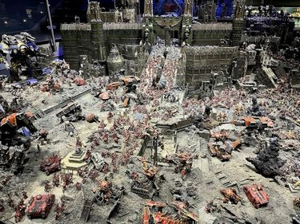

<!-- A1582-B0019 -->

原译文

Battle for Angelus Prime 天使一号之战

**校订译文**

Battle for Angelus Prime 天使一号之战

<!-- /A1582-B0019 -->

<!-- A1582-B0020 图片 -->
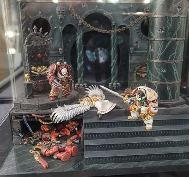

<!-- A1582-B0021 -->

原译文

The Emperor vs Horus 帝皇vs荷鲁斯

**校订译文**

The Emperor vs Horus 帝皇对战荷鲁斯

<!-- /A1582-B0021 -->

<!-- A1582-B0022 图片 -->
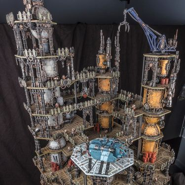

<!-- A1582-B0023 -->

原译文

Ferro-Giant Alphus 铁巨人阿尔弗斯

**校订译文**

Ferro-Giant Alphus 铁巨人阿尔弗斯

<!-- /A1582-B0023 -->

<!-- A1582-B0024 图片 -->
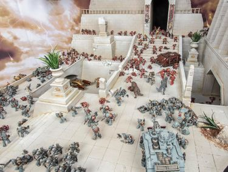

<!-- A1582-B0025 -->

原译文

Burning of Prospero 普罗斯佩罗之焚

**校订译文**

Burning of Prospero 普罗斯佩罗之焚

<!-- /A1582-B0025 -->

<!-- A1582-B0026 -->
## Statues and sculptures 雕像和雕塑

<!-- /A1582-B0026 -->

<!-- A1582-B0027 图片 -->
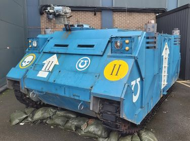

<!-- A1582-B0028 -->

原译文

Space Marine MKII Rhino 星际战士MKII犀牛

**校订译文**

Space Marine MKII Rhino 星际战士MKII犀牛

<!-- /A1582-B0028 -->

<!-- A1582-B0029 图片 -->
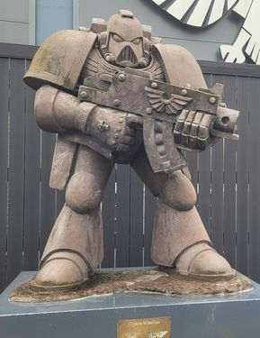

<!-- A1582-B0030 -->

原译文

Space Marine 星际战士

**校订译文**

Space Marine 星际战士

<!-- /A1582-B0030 -->

<!-- A1582-B0031 图片 -->
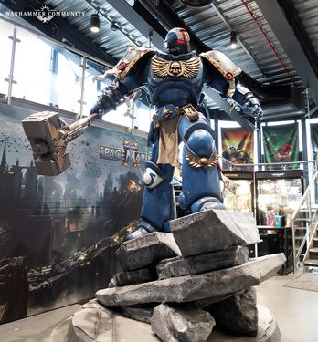

<!-- A1582-B0032 -->

原译文

Lieutenant Titus 副官泰图斯

**校订译文**

Lieutenant Titus 副官泰图斯

<!-- /A1582-B0032 -->

<!-- A1582-B0033 -->
## Feature gaming tables 特色游戏桌

<!-- /A1582-B0033 -->

<!-- A1582-B0034 -->
**英文原文**

Gaming tables with narrative elements themed around a particular world or scenario.

<!-- /A1582-B0034 -->

<!-- A1582-B0035 -->

原译文

以特定世界或场景为主题的叙事元素游戏桌。

**校订译文**

围绕特定世界或场景设计、带有叙事元素的游戏桌。

<!-- /A1582-B0035 -->

<!-- A1582-B0036 图片 -->
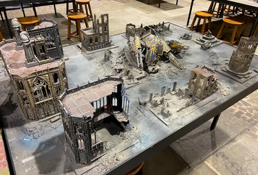

<!-- A1582-B0037 -->

原译文

Death of Imperius 帝国之死

**校订译文**

Death of Imperius 帝国之死

<!-- /A1582-B0037 -->

<!-- A1582-B0038 图片 -->
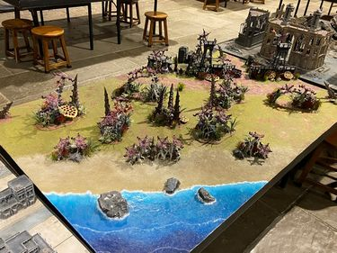

<!-- A1582-B0039 -->

原译文

Makhis Cove 马奇斯湾

**校订译文**

Makhis Cove 马奇斯湾

<!-- /A1582-B0039 -->

<!-- A1582-B0040 图片 -->
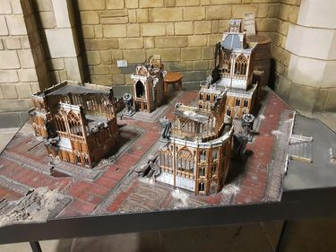

<!-- A1582-B0041 -->

原译文

Shrine World 圣地世界

**校订译文**

Shrine World 圣地世界

<!-- /A1582-B0041 -->

<!-- A1582-B0042 图片 -->
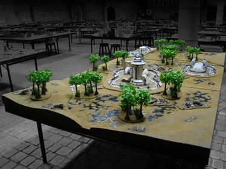

<!-- A1582-B0043 -->

原译文

Return to Vigos 返回维戈斯

**校订译文**

Return to Vigos 返回维戈斯

<!-- /A1582-B0043 -->

本篇核心术语与暂定项

以下列出本篇出现的英文原形及核心术语表用词。同形词可能指不同对象，具体词义以本篇正文和校注为准；单复数、别名和仅见于图注的名称可能尚未列入。完整候选见[术语表](../../术语表/双语术语候选.csv)。

| 英文 | 采用中文 | 状态 |
| --- | --- | --- |
| Forge World | 铸造世界 | 暂定·官方待核 |
| Warhammer World | 战锤世界 | 暂定·官方待核 |
| Bugman's Bar | 布格曼酒吧 | 暂定·官方待核 |
| Josef Bugman | 约瑟夫·布格曼 | 暂定·官方待核 |
| Battle for Angelus Prime | 天使一号之战 | 暂定·官方待核 |
| Games Workshop | Games Workshop | 暂定·官方待核 |

