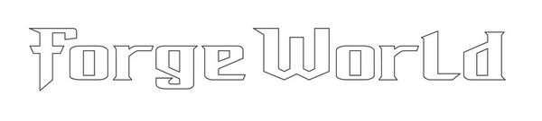
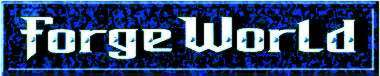
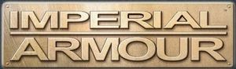
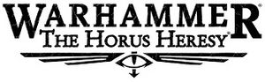
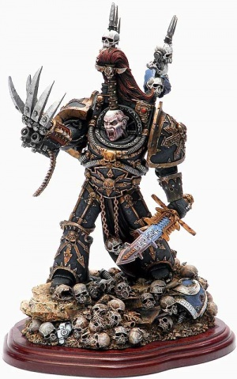

# 1583 Forge World 模型品牌

精校状态：中文行文已逐段精校，部分术语仍为暂定

分类：现实世界

原文来源：https://www.bilibili.com/opus/1216610492333686800

原作者：帝国神选罐头

原文时间：2026年06月22日 12:30

[返回分类目录](目录.md) · [全书目录](../../目录.md)

原篇名：铸造世界 Forge World

<!-- A1583-B0001 -->
**英文原文**

Forge World (sometimes styled Forgeworld) is a division of Games Workshop that specialises in the production of highly-detailed resin miniatures and conversion kits, large-scale models, and terrain pieces, as well as supplemental rulebooks and expansions for both Warhammer Fantasy Battles and Warhammer 40,000, as well as Games Workshop's other game systems.

<!-- /A1583-B0001 -->

<!-- A1583-B0002 -->

原译文

铸造世界（有时称为FW）是游戏工作室的一个部门，专门生产高度精细的树脂微缩模型和转换套件、大型模型和地形部件，以及战锤幻想战斗和战锤40000以及游戏工作室其他游戏系统的补充规则书和扩展。

**校订译文**

Forge World（亦写作Forgeworld，常简称FW；原稿译“铸造世界”）是 Games Workshop 旗下部门，主要制作高精细度树脂微缩模型、改造套件、大比例模型与地形组件，也为《战锤幻想战役》《战锤40,000》及其他游戏体系编写扩充规则和资料。

**校注：** 本篇Forge World是现实模型部门/品牌，不是设定中的铸造世界；Citadel也是模型品牌，不译成城堡。

<!-- /A1583-B0002 -->

<!-- A1583-B0003 图片 -->

<!-- A1583-B0004 -->

原译文

Forge World logo 铸造世界标志

**校订译文**

Forge World logo 铸造世界标志

<!-- /A1583-B0004 -->

<!-- A1583-B0005 -->
## History 历史

<!-- /A1583-B0005 -->

<!-- A1583-B0006 -->
**英文原文**

Forge World was established in October 1998, the brainchild of John Stallard and headed by Paul Robins, the man responsible for the original Thunderhawk Gunship. The new division was first announced in White Dwarf 226, coinciding with the release of the 3rd Edition of Warhammer 40,000.

<!-- /A1583-B0006 -->

<!-- A1583-B0007 -->

原译文

铸造世界成立于1998年10月，由约翰·斯托拉德创立，由最初的雷鹰炮艇负责人保罗·罗宾斯领导。新部门在《白矮人第226期》中首次宣布，恰逢战锤40000第三版的发布。

**校订译文**

Forge World 于1998年10月成立，由约翰·斯托拉德提出构想，曾负责最初雷鹰炮艇模型的保罗·罗宾斯担任负责人。新部门在《白矮人》第226期公布，恰逢《战锤40,000》第三版推出。

<!-- /A1583-B0007 -->

<!-- A1583-B0008 图片 -->

<!-- A1583-B0009 -->

原译文

The original Forge World logo (ca. 2000) 原始的铸造世界标志（约2000年）

**校订译文**

The original Forge World logo (ca. 2000) 原始的铸造世界标志（约2000年）

<!-- /A1583-B0009 -->

<!-- A1583-B0010 -->
**英文原文**

Forge World would go on to produce a broad range of resin models and terrain for both Warhammer Fantasy Battles and Warhammer 40,000, as well as many of Games Workshop's specialist games, including Necromunda, Battlefleet Gothic and Warmaster. Forge World also produced conversion kits for plastic Citadel models in Games Workshop's main range, a series of large-scale collectors' pieces including busts and full figures, and a small number of etched brass accessories including faction icons and barbed wire for Warhammer 40,000.

<!-- /A1583-B0010 -->

<!-- A1583-B0011 -->

原译文

铸造世界继续为战锤幻想战斗和战锤40000以及许多游戏工作室的专业游戏（包括涅克罗蒙达、哥特舰队和战争之主）生产各种树脂模型和地形。铸造世界还为游戏工作室主系列中的塑料城堡模型生产了转换套件，一系列大型收藏家作品，包括半身像和全神像，以及少量蚀刻黄铜配件，包括派系图标和用于战锤40000的带刺铁丝网。

**校订译文**

此后，Forge World 为《战锤幻想战役》《战锤40,000》及《涅克罗蒙达》《哥特舰队》《战争之主》等专门游戏制作了大量树脂模型和地形。它还为主产品线的 Citadel 塑料模型提供改造套件，制作半身像、全身像等大比例收藏品，以及少量蚀刻黄铜配件，包括阵营徽记和铁丝网。

<!-- /A1583-B0011 -->

<!-- A1583-B0012 -->
**英文原文**

Beginning in the mid-2000s, Forge World began to produce ranges of models to represent entire factions that either lacked models or were limited to old and out of production kits. The first of these ventures was the previously unexplored Elysian Drop Troops, released in 2005. Other notable examples include the Death Korps of Krieg and a new resin line of Chaos Dwarfs. Eventually, this culminated in Forge World producing their own game system in 2011, set during the Horus Heresy.

<!-- /A1583-B0012 -->

<!-- A1583-B0013 -->

原译文

从2000年代中期开始，铸造世界开始生产一系列模型，以代表整个派系，这些派系要么缺乏模型，要么仅限于旧的和停产的套件。其中第一个项目是2005年发布的之前未被探索的艾丽西亚空降部队。其他值得注意的例子包括克里格死亡军团和混沌矮人的新树脂线。最终，铸造世界在2011年制作了自己的游戏系统，该系统以荷鲁斯叛乱为背景。

**校订译文**

2000年代中期起，Forge World 开始推出覆盖整个阵营的模型系列，填补原本没有模型、或只有老旧停产套件的空缺。首个项目是2005年的艾丽西亚空降部队；随后还包括克里格死亡军团，以及新的混沌矮人树脂系列。底稿称，这一路线最终在2011年发展为其自行制作的荷鲁斯之乱游戏体系。

**校注：** 2011与1587发布栏2012不一致，可能混合筹备、初始模型及正式游戏发行时间，未自行统一年份。

<!-- /A1583-B0013 -->

<!-- A1583-B0014 -->
**英文原文**

Games Workshop quietly removed the Forge World brand from public view between 2023 and 2024, absorbing its products and online store into the main Games Workshop website, newly rebranded as Warhammer.com. The "Forge World" brand continues to exist through the production of resin miniatures for all of Games Workshop's main games. These are marketed as 'Expert Kits', with the material frequently referred to as 'Forge World Resin'.

<!-- /A1583-B0014 -->

<!-- A1583-B0015 -->

原译文

游戏工作室在2023年至2024年间悄悄地将铸造世界品牌从公众视野中移除，将其产品和在线商店纳入游戏工作室的主要网站，新更名为Warhammer.com。“铸造世界”品牌通过为游戏工作室所有主要游戏生产树脂微缩模型而继续存在。这些产品被称为“专家套件”，其材料通常被称作“FW树脂”。

**校订译文**

2023至2024年间，Games Workshop 逐渐弱化 Forge World 独立品牌，将产品和网店整合进更名为 Warhammer.com 的统一网站。按底稿所述，相关树脂模型继续以“专家套件”（Expert Kits）销售，材料常标为“Forge World Resin”，品牌名称因而仍以这种形式保留。

**校注：** 品牌整合与销售状态按底稿的2023—2024资料叙述，不宣称已实时核查至2026。

<!-- /A1583-B0015 -->

<!-- A1583-B0016 -->
## Product ranges 产品范围

<!-- /A1583-B0016 -->

<!-- A1583-B0017 -->
**英文原文**

Forge World has developed a number of distinct product ranges over the years.

<!-- /A1583-B0017 -->

<!-- A1583-B0018 -->

原译文

多年来，铸造世界开发了许多不同的产品系列。

**校订译文**

多年来，铸造世界开发了许多不同的产品系列。

<!-- /A1583-B0018 -->

<!-- A1583-B0019 -->
## Imperial Armour 帝国装甲

<!-- /A1583-B0019 -->

<!-- A1583-B0020 -->
**英文原文**

Imperial Armour was launched in 1990 and announced in The Citadel Journal 32, described as a product range of "ultra-cool, ultra-detailed, ultra-specialist add-ons for Warhammer 40,000 tank kits."

<!-- /A1583-B0020 -->

<!-- A1583-B0021 -->

原译文

帝国装甲于1990年推出，并在《城堡杂志》第32期上公布，被描述为“用于战锤40000坦克套件的超酷、超细节、超专业附加组件”的产品系列

**校订译文**

底稿称，“帝国装甲”于1990年推出，并在《Citadel Journal》第32期公布，最初是一套为《战锤40,000》坦克模型制作的高精细度专用升级配件。

**校注：** 1990早于同篇部门成立时间，且与刊号关系存疑，按所给英文保留并标注，未无据改成1999等其他年份。

<!-- /A1583-B0021 -->

<!-- A1583-B0022 图片 -->

<!-- A1583-B0023 -->

原译文

Imperial Armour logo 帝国装甲标志

**校订译文**

Imperial Armour logo 帝国装甲标志

<!-- /A1583-B0023 -->

<!-- A1583-B0024 -->
**英文原文**

Over time, the range expanded to include tanks and vehicles from all of the major Warhammer 40,000 factions. Beginning in 2000, a series of rule books were also published under the Imperial Armour name. These provided background information and official rules for fielding Forge World miniatures in games of Warhammer 40,000.

<!-- /A1583-B0024 -->

<!-- A1583-B0025 -->

原译文

随着时间的推移，范围扩大到包括来自所有战锤40000主要派系的坦克和载具。从2000年开始，一系列规则书也以帝国装甲的名义出版。这些为在战锤40000游戏中部署铸造世界微缩模型提供了背景信息和官方规则。

**校订译文**

该系列随后扩展至《战锤40,000》各大阵营的坦克与载具。自2000年起，还以《帝国装甲》之名出版规则书，为 Forge World 模型提供背景资料及正式游戏规则。

<!-- /A1583-B0025 -->

<!-- A1583-B0026 -->
**英文原文**

As of November 2023, a small selection of miniatures from the Imperial Armour range were still available for purchase through Games Workshop's online store; however, the Imperial Armour branding was no longer in use.

<!-- /A1583-B0026 -->

<!-- A1583-B0027 -->

原译文

截至2023年11月，帝国装甲系列的一小部分微缩模型仍可通过游戏工作室的在线商店购买；然而，帝国装甲品牌已不再使用。

**校订译文**

截至2023年11月，帝国装甲系列的一小部分微缩模型仍可通过Games Workshop的在线商店购买；然而，帝国装甲品牌已不再使用。

**校注：** 对照本段英文确认同一实体，与全书核心译名统一；不改变同形异义词或省略称呼。

<!-- /A1583-B0027 -->

<!-- A1583-B0028 -->
## Warhammer Forge 战锤铸造

<!-- /A1583-B0028 -->

<!-- A1583-B0029 -->
**英文原文**

Warhammer Forge was announced in White Dwarf 374 and launched in 2011. The range focused on miniatures and publications for Warhammer Fantasy Battles. Inspired by the success of the Imperial Armour series, Warhammer Forge produced two hardback rules supplements authored by Alan Bligh: Monstrous Arcanum and Tamurkhan: The Throne of Chaos.

<!-- /A1583-B0029 -->

<!-- A1583-B0030 -->

原译文

战锤铸造在《白矮人第374期》中宣布，并于2011年推出。该系列专注于战锤幻想战斗的微缩模型和出版物。受到帝国装甲系列成功的启发，战锤铸造制作了两本由艾伦·布莱撰写的精装版规则补充：《怪物奥秘》和《塔穆尔可汗：混沌王座》。

**校订译文**

“战锤铸造”在《白矮人》第374期公布，2011年推出，专注《战锤幻想战役》模型与出版物。受“帝国装甲”成功启发，它出版了艾伦·布莱执笔的两本精装规则增补：《怪物奥秘》与《塔穆尔可汗：混沌王座》。

<!-- /A1583-B0030 -->

<!-- A1583-B0031 图片 -->

<!-- A1583-B0032 -->

原译文

Warhammer Forge logo 战锤铸造标志

**校订译文**

Warhammer Forge logo 战锤铸造标志

<!-- /A1583-B0032 -->

<!-- A1583-B0033 -->
**英文原文**

The Warhammer Forge branding was removed from Forge Worlds marketing material following the demise of Warhammer Fantasy Battles and the subsequent release of Age of Sigmar in 2015.

<!-- /A1583-B0033 -->

<!-- A1583-B0034 -->

原译文

2015年，随着战锤幻想战斗的终结和西格玛时代的发布，战锤铸造品牌从铸造世界的营销材料中删除。

**校订译文**

2015年，随着战锤幻想战斗的终结和西格玛时代的发布，战锤铸造品牌从铸造世界的营销材料中删除。

<!-- /A1583-B0034 -->

<!-- A1583-B0035 -->
## The Horus Heresy 荷鲁斯叛乱

<!-- /A1583-B0035 -->

<!-- A1583-B0036 -->
**英文原文**

In 2011, Forge World began producing a range of miniatures and accompanying rules for playing games during the period known as the Horus Heresy, set roughly ten thousand years before Warhammer 40,000. This developed into its own popular game system. Owing to the commercial success of the Horus Heresy, Games Workshop's main studio took over production of the second edition of the game, slowly replacing the resin miniatures produced by Forge World with new plastic equivalents following the new edition's release in 2022.

<!-- /A1583-B0036 -->

<!-- A1583-B0037 -->

原译文

2011年，铸造世界开始制作在荷鲁斯叛乱时期的一系列迷你模型和相应的游戏规则，该时期大约发生在战锤40000前的一万年。这发展成了自己的流行游戏系统。由于荷鲁斯叛乱的商业成功，游戏工作室的主工作室接管了第二版游戏的制作，在2022年新版游戏发布后，用新的塑料替代了铸造世界制作的树脂微缩模型。

**校订译文**

底稿称，Forge World 于2011年开始制作荷鲁斯之乱时期的模型及规则，背景距《战锤40,000》约一万年，随后发展成独立且受欢迎的游戏。商业成功促使 Games Workshop 主工作室接手第二版；2022年新版推出后，逐步用塑料新套件替代既有树脂模型。

<!-- /A1583-B0037 -->

<!-- A1583-B0038 图片 -->

<!-- A1583-B0039 -->

原译文

The Horus Heresy logo 荷鲁斯叛乱标志

**校订译文**

The Horus Heresy logo 荷鲁斯之乱标志

**校注：** Horus Heresy图注与正文沿已核官方名称统一。

<!-- /A1583-B0039 -->

<!-- A1583-B0040 -->
## Busts, Collector's Series and Showcase Series 半身像、收藏家系列和陈列系列

<!-- /A1583-B0040 -->

<!-- A1583-B0041 -->
**英文原文**

In addition to producing miniatures for tabletop wargaming, Forge World produced a range of larger-scale resin figures designed for display. These figures were marketed under three distinct categories: Character Busts, Collector's Series and Showcase Series. Each range featured highly detailed depictions of characters and creatures from worlds of Warhammer 40,000 and Warhammer Fantasy Battles.

<!-- /A1583-B0041 -->

<!-- A1583-B0042 -->

原译文

除了生产桌面战争游戏的微型模型外，铸造世界还生产了一系列用于展示的大型树脂人物。这些人物按三个不同的类别进行销售：人物半身像、收藏家系列和陈列系列。每个系列都对战锤40000和战锤幻想战斗中的角色和生物进行了非常详细的描述。

**校订译文**

除桌面战棋模型外，Forge World 还制作大比例树脂展示雕像，分为人物半身像、收藏家系列和陈列系列。各系列都精细再现《战锤40,000》与《战锤幻想战役》中的人物和生物。

<!-- /A1583-B0042 -->

<!-- A1583-B0043 图片 -->

<!-- A1583-B0044 -->

原译文

Showcase Series Abaddon the Despoiler Warmaster of Chaos 陈列系列混沌战帅掠夺者阿巴顿

**校订译文**

Showcase Series Abaddon the Despoiler Warmaster of Chaos 陈列系列混沌战帅掠夺者阿巴顿

<!-- /A1583-B0044 -->

<!-- A1583-B0045 -->
## Other games systems 其他游戏系统

<!-- /A1583-B0045 -->

<!-- A1583-B0046 -->
**英文原文**

In addition to producing miniatures and books for Warhammer 40,000 and Warhammer Fantasy Battles, Forge World has created resin miniatures for the following Games Workshop games:

<!-- /A1583-B0046 -->

<!-- A1583-B0047 -->

原译文

除了为战锤4000和战锤幻想战斗制作微缩模型和书籍外，铸造世界还为以下游戏工作室游戏制作了树脂微缩模型：

**校订译文**

除上述模型与书籍外，Forge World 也为以下 Games Workshop 游戏制作树脂模型：

<!-- /A1583-B0047 -->

<!-- A1583-B0048 -->

原译文

Epic 史诗

**校订译文**

Epic 史诗

<!-- /A1583-B0048 -->

<!-- A1583-B0049 -->

原译文

Adeptus Titanicus 泰坦修会

**校订译文**

Adeptus Titanicus 泰坦修会

<!-- /A1583-B0049 -->

<!-- A1583-B0050 -->

原译文

Battlefleet Gothic 哥特舰队

**校订译文**

Battlefleet Gothic 哥特舰队

<!-- /A1583-B0050 -->

<!-- A1583-B0051 -->

原译文

Necromunda 涅克罗蒙达

**校订译文**

Necromunda 涅克罗蒙达

<!-- /A1583-B0051 -->

<!-- A1583-B0052 -->

原译文

Aeronautica Imperialis 帝国海航

**校订译文**

Aeronautica Imperialis 帝国海航

<!-- /A1583-B0052 -->

<!-- A1583-B0053 -->

原译文

Warmaster 战争之主

**校订译文**

Warmaster 战争之主

<!-- /A1583-B0053 -->

<!-- A1583-B0054 -->
**英文原文**

Blood Bowl (2016 Edition onwards)

<!-- /A1583-B0054 -->

<!-- A1583-B0055 -->

原译文

血碗（2016年版及以后）

**校订译文**

血碗（2016年版及以后）

<!-- /A1583-B0055 -->

<!-- A1583-B0056 -->

原译文

The Lord of the Rings Strategy Battle Game 指环王战略战斗游戏

**校订译文**

The Lord of the Rings Strategy Battle Game 指环王战略战斗游戏

<!-- /A1583-B0056 -->

<!-- A1583-B0057 -->
## Trivia 琐事

<!-- /A1583-B0057 -->

<!-- A1583-B0058 -->
**英文原文**

Before the founding of Forge World, itself designed to streamline production of his models, Mike Biasi produced Games Workshop licensed models under his own company Mike Biasi Studios. Forge World, and by extension Games Workshop, now owns the license to Mike Biasi Studios' models in full and models produced by the studio can be considered Forge World models.

<!-- /A1583-B0058 -->

<!-- A1583-B0059 -->

原译文

铸造世界旨在简化其模型的制作，在铸造世界成立之前，迈克·比亚西在自己的公司迈克·比亚西工作室下制作了游戏工作室许可的模型。铸造世界和游戏工作室现在拥有迈克·比亚西工作室模型的全部许可证，工作室制作的模型可以被视为铸造世界模型。

**校订译文**

Forge World 成立前，迈克·比亚西曾通过自己的 Mike Biasi Studios 制作 Games Workshop 授权模型。底稿称，成立 Forge World 的目的之一是理顺这些模型的生产，此后 Forge World 及其母公司取得相关完整授权，因此这些工作室出品也可视作 Forge World 模型。

<!-- /A1583-B0059 -->

<!-- A1583-B0060 -->
**英文原文**

Biasi would produce other Games Workshop-licensed smaller production size miniatures with Tim Dupertuis, publisher of the Inquisitor fan-zine in their joint venture Armorcast, until their license expired in 1998.

<!-- /A1583-B0060 -->

<!-- A1583-B0061 -->

原译文

比亚西与合资企业装甲铸件的《审判官》粉丝杂志的出版商蒂姆·杜佩蒂斯合作，制作其他获得游戏工作室许可的小型微缩产品，直到他们的许可证于1998年到期。

**校订译文**

比亚西还曾与《审判官》爱好者杂志出版人蒂姆·杜佩蒂斯，共同经营 Armorcast，少量生产其他 Games Workshop 授权模型，直至1998年授权到期。

<!-- /A1583-B0061 -->

本篇核心术语与暂定项

以下列出本篇出现的英文原形及核心术语表用词。同形词可能指不同对象，具体词义以本篇正文和校注为准；单复数、别名和仅见于图注的名称可能尚未列入。完整候选见[术语表](../../术语表/双语术语候选.csv)。

| 英文 | 采用中文 | 状态 |
| --- | --- | --- |
| Horus Heresy | 荷鲁斯之乱 | 官方已核对 |
| Inquisitor | 审判官 | 官方已核对 |
| Forge World | 铸造世界 | 暂定·官方待核 |
| Necromunda | 涅克罗蒙达 | 暂定·官方待核 |
| Horus | 荷鲁斯 | 暂定·官方待核 |
| Founding | 建军 | 暂定·官方待核 |
| Thunderhawk Gunship | 雷鹰炮艇 | 暂定·官方待核 |
| Death Korps of Krieg | 克里格死亡军团 | 官方已核对 |
| Brand | 布兰德 | 暂定·官方待核 |
| System | 星系（恒星系统） | 暂定·官方待核 |
| Krieg | 克里格 | 暂定·官方待核 |
| John Stallard | 约翰·斯托拉德 | 暂定·官方待核 |
| Games Workshop | Games Workshop | 暂定·官方待核 |
| Paul Robins | 保罗·罗宾斯 | 暂定·官方待核 |
| Imperial Armour | 帝国装甲 | 暂定·官方待核 |
| Warhammer Forge | 战锤铸造 | 暂定·官方待核 |
| Alan Bligh | 艾伦·布莱 | 暂定·官方待核 |
| Monstrous Arcanum | 怪物奥秘 | 暂定·官方待核 |
| Tamurkhan: The Throne of Chaos | 塔穆尔可汗：混沌王座 | 暂定·官方待核 |
| Mike Biasi | 迈克·比亚西 | 暂定·官方待核 |
| Tim Dupertuis | 蒂姆·杜佩蒂斯 | 暂定·官方待核 |
| Armorcast | Armorcast | 暂定·官方待核 |
| Expert Kits | 专家套件 | 暂定·官方待核 |
| Elysian Drop Troops | 艾丽西亚空降兵 | 暂定·官方待核 |

