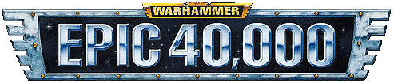
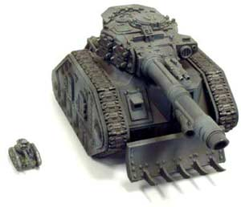
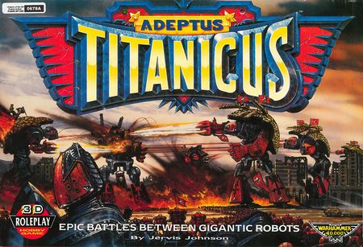
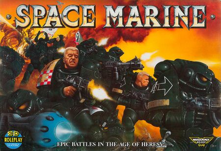
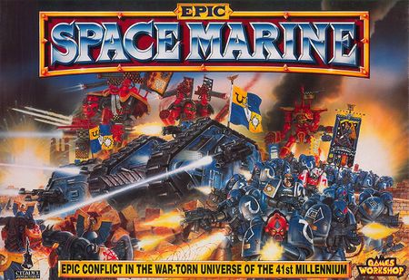
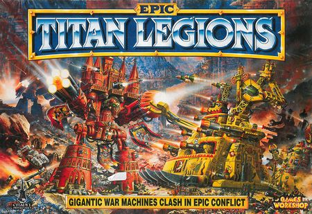
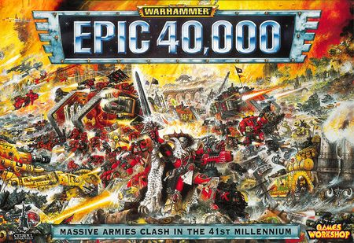
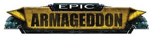
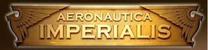
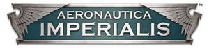

# 1585 史诗 Epic

精校状态：中文行文已逐段精校，部分术语仍为暂定

分类：现实世界

原文来源：https://www.bilibili.com/opus/1216966111367528513

原作者：帝国神选罐头

原文时间：2026年06月23日 11:30

[返回分类目录](目录.md) · [全书目录](../../目录.md)

<!-- A1585-B0001 -->
**英文原文**

Epic is the collective term for a series of tabletop wargames produced by Games Workshop, set in the Warhammer 40,000 and Horus Heresy universes. Gameplay is centred around large-scale battles involving hundreds of soldiers and dozens of tanks, and as such, employs comparatively small 6mm scale miniatures (often referred to as Epic-scale). Since its initial release in 1988 as Adeptus Titanicus, the series has gone through a number of incarnations with varying names.

<!-- /A1585-B0001 -->

<!-- A1585-B0002 -->

原译文

史诗是游戏工作室制作的一系列桌面战争游戏的统称，背景设定在战锤40000和荷鲁斯叛乱宇宙中。游戏以涉及数百名士兵和数十辆坦克的大规模战斗为中心，因此采用了相对较小的6mm微缩模型（通常称为史诗级）。自1988年以泰坦修会的名字首次公开以来，该系列经历了许多不同名字的化身。

**校订译文**

《史诗》是 Games Workshop 一系列桌面战棋游戏的统称，背景涵盖《战锤40,000》和荷鲁斯之乱。游戏着重表现数百名士兵、数十辆坦克参与的大规模战斗，因此传统版本采用约6毫米规格的微缩模型，亦称“史诗比例”。自1988年首作《泰坦修会》问世以来，该系列经历了多次更名与规则迭代。

<!-- /A1585-B0002 -->

<!-- A1585-B0003 图片 -->

<!-- A1585-B0004 -->

原译文

Epic 40,000 Logo 史诗40k标志

**校订译文**

Epic 40,000 Logo 史诗40k标志

<!-- /A1585-B0004 -->

<!-- A1585-B0005 -->
## General Information 基本信息

<!-- /A1585-B0005 -->

<!-- A1585-B0006 -->
**英文原文**

Epic battles consist of hundreds of soldiers and dozens of tanks arrayed across a long battlefield. To make this possible the scale of Epic miniatures is around 6mm, compared to the 28mm for Warhammer 40,000.

<!-- /A1585-B0006 -->

<!-- A1585-B0007 -->

原译文

史诗战斗由数百名士兵和数十辆坦克在广阔的战场上排列而成。为了实现这一点，史诗微缩模型的尺寸约为6mm，而战锤40000的尺寸为28mm。

**校订译文**

为在广阔桌面上表现数百士兵和数十辆坦克，传统《史诗》采用约6毫米模型规格，相对《战锤40,000》的28毫米更为微小。

<!-- /A1585-B0007 -->

<!-- A1585-B0008 图片 -->

<!-- A1585-B0009 -->

原译文

Leman Russ Vanquisher in Epic's 6mm scale vs. Warhammer 40,000's 28mm scale 黎曼鲁斯征服者在史诗的6毫米尺度上与战锤40000的28毫米尺度相比

**校订译文**

Leman Russ Vanquisher in Epic's 6mm scale vs. Warhammer 40,000's 28mm scale 黎曼鲁斯征服者在史诗的6毫米尺度上与战锤40000的28毫米尺度相比

<!-- /A1585-B0009 -->

<!-- A1585-B0010 -->
**英文原文**

As the game is based on 6mm scale, the physical size of armies is much smaller. This reduces the cost of purchasing forces dramatically compared to other games. It also allows much larger vehicles and creatures to be fielded, including Titans and Bio-Titans, as well as using many aircraft at once. Aeronautica Imperialis concentrates heavily on aircraft at the same 6mm as Epic, allowing physical interchanging of models between the game systems.

<!-- /A1585-B0010 -->

<!-- A1585-B0011 -->

原译文

由于游戏基于6mm的规模，军队的物理规模要小得多。与其他游戏相比，这大大降低了购买力的成本。它还允许部署更大的载具和生物，包括泰坦和生物泰坦，以及同时使用许多飞机。帝国海航非常专注于与史诗相同的6mm的飞机，允许在游戏系统之间进行物理模型交换。

**校订译文**

模型更小，使同等规模军队的实体占地和购置成本明显降低，也能容纳泰坦、生物泰坦及大量飞行器。早期《帝国海航》同样采用约6毫米规格，因此模型可以与同期《史诗》互用。

**校注：** 同篇后文明确2019版改为8毫米，因此此处模型互用限定于早期同规格版本，不能跨版无条件互换。

<!-- /A1585-B0011 -->

<!-- A1585-B0012 -->
**英文原文**

While the scale of Epic makes it excellent for fielding large ground forces, it is still too large to field Battlefleet Gothic forces. As the 4th Edition rulebook states: "Even a small Lunar class Cruiser would be over 5 meters long if we made an Epic scale model of it."

<!-- /A1585-B0012 -->

<!-- A1585-B0013 -->

原译文

虽然史诗的规模使其非常适合部署大型地面部队，但它仍然太大，无法部署哥特舰队部队。正如第四版规则书所述：“如果我们制作一个史诗规模的模型，即使是一艘小型月级巡洋舰也会超过5米长。”

**校订译文**

这一比例适合庞大地面军队，却仍不足以表现《哥特舰队》的舰战规模。第四版规则书举例说，即使一艘小型月球级巡洋舰，按《史诗》比例制作也会超过5米长。

<!-- /A1585-B0013 -->

<!-- A1585-B0014 -->
**英文原文**

Models for the various incarnations of Epic have been produced by both Citadel Miniatures and Forge World.

<!-- /A1585-B0014 -->

<!-- A1585-B0015 -->

原译文

城堡微缩模型和铸造世界都制作了史诗各种化身的模型。

**校订译文**

Citadel Miniatures 与 Forge World 都曾为不同版本的《史诗》制作模型。

<!-- /A1585-B0015 -->

<!-- A1585-B0016 -->
## History 历史

<!-- /A1585-B0016 -->

<!-- A1585-B0017 -->
## 1988-2006: Epic 史诗

<!-- /A1585-B0017 -->

<!-- A1585-B0018 -->
### Adeptus Titanicus (1988) 泰坦修会

<!-- /A1585-B0018 -->

<!-- A1585-B0019 -->
**英文原文**

Adeptus Titanicus was the first Epic-scale game released by Games Workshop. The game expanded the narrative of the Horus Heresy and centred on combat between Imperial Titans and Chaos Titans. The box set came with six plastic Warlord Titans, which were soon joined by the smaller Reaver and Warhound Titans in metal, as well as upgrade options.

<!-- /A1585-B0019 -->

<!-- A1585-B0020 -->

原译文

泰坦修会是游戏工作室发布的第一款史诗规模游戏。游戏扩展了荷鲁斯叛乱的叙事，并以帝国泰坦和混沌泰坦之间的战斗为中心。该套装包含六架塑料军阀泰坦，很快又加入了较小的金属收割者和战犬泰坦，以及升级选项。

**校订译文**

《泰坦修会》是 Games Workshop 首款史诗比例游戏，扩展了荷鲁斯之乱背景，以帝国泰坦与混沌泰坦交战为主题。盒装含六台塑料战将级泰坦，随后又推出较小的金属掠夺者级、战犬级及升级配件。

<!-- /A1585-B0020 -->

<!-- A1585-B0021 图片 -->

<!-- A1585-B0022 -->

原译文

Adeptus Titanicus 泰坦修会

**校订译文**

Adeptus Titanicus 泰坦修会

<!-- /A1585-B0022 -->

<!-- A1585-B0023 -->
### Space Marine (1st Edition) (1989) 星际战士(第一版)

<!-- /A1585-B0023 -->

<!-- A1585-B0024 -->
**英文原文**

Epic rules for Space Marine infantry and vehicles followed in White Dwarf 109, followed by Space Marine (1st Edition), a boxed game containing a balanced force of 320 Space Marines, 16 Land Raiders, and 32 Rhinos, cards, counters, and banners – and some card buildings with plastic roofs. Xenos miniatures soon began to appear in the pages of White Dwarf, with plastic boxed sets containing Eldar Guardians and Grav-tanks, and Ork Boyz and Battlewagons – plus metal models in support, including the first appearance of the Phantom Titan, as well as Wraithlords, War Walkers, and Jetbikes.

<!-- /A1585-B0024 -->

<!-- A1585-B0025 -->

原译文

在《白矮人第109期》中，星际战士步兵和载具遵循了史诗规则，随后是星际战士（第一版），这是一款盒装游戏，包含320名星际战士、16辆兰德掠袭者和32辆犀牛、卡片、计数器和旗帜，以及一些带有塑料屋顶的卡片建筑。异型微缩模型很快开始出现在《白矮人》的页面上，塑料盒子里装着灵族守卫者和反重力坦克，还有欧克小子和战斗大卡，还有金属模型作为支持，包括幻影泰坦的首次出现，以及幽冥领主、战争行者和悬浮摩托。

**校订译文**

《白矮人》第109期随后加入星际战士步兵和载具规则，继而推出《星际战士》第一版盒装，内含320名星际战士、16辆兰德掠袭者和32辆犀牛组成的均衡兵力，以及卡牌、标记、旗帜和带塑料屋顶的纸板建筑。很快，《白矮人》又介绍异形模型：灵族守护者与反重力坦克、欧克小子与战斗大卡都有塑料盒装，另有金属模型支援，包括首次登场的幻影泰坦、幽冥领主、战争行者和喷气摩托。

<!-- /A1585-B0025 -->

<!-- A1585-B0026 图片 -->

<!-- A1585-B0027 -->

原译文

Space Marine (1989) 星际战士

**校订译文**

Space Marine (1989) 星际战士

<!-- /A1585-B0027 -->

<!-- A1585-B0028 -->
### Space Marine (2nd Edition) (1991) 星际战士(第二版)

<!-- /A1585-B0028 -->

<!-- A1585-B0029 -->
**英文原文**

Space Marine (2nd Edition) moved away from the Horus Heresy, with a box that contained Orks, Eldar, Space Marines, and a Titan for good measure. These rules lasted a long time, growing to encompass a wide variety of troops and vehicles for Eldar, Orks, Space Marines, Squats, Chaos, Imperial Guard, and Tyranids over a series of boxed expansions. Every faction received plastic troops, which were supplemented by metal reinforcements – including Titan-sized behemoths.

<!-- /A1585-B0029 -->

<!-- A1585-B0030 -->

原译文

星际战士（第二版）带着一个盒子离开了荷鲁斯叛乱，盒子里装着欧克、灵族、星际战士和一架泰坦。这些规则持续了很长时间，在一系列盒装扩展中，涵盖了灵族、欧克、星际战士、矮人、混沌、帝国卫队和泰伦的各种部队和载具。每个派系都获得了塑料部队，并辅以金属增援，包括泰坦大小的巨兽。

**校订译文**

《星际战士》第二版不再局限于荷鲁斯之乱背景，盒装提供欧克、灵族、星际战士，外加一台泰坦。这套规则使用多年，经连续扩展，覆盖灵族、欧克、星际战士、矮人、混沌、帝国卫队与泰伦的多种部队载具。各阵营既有塑料兵模，也有金属增援，包括泰坦般巨大的战争机器。

<!-- /A1585-B0030 -->

<!-- A1585-B0031 图片 -->

<!-- A1585-B0032 -->

原译文

Space Marine (1991) 星际战士

**校订译文**

Space Marine (1991) 星际战士

<!-- /A1585-B0032 -->

<!-- A1585-B0033 -->
### Titan Legions (1994) 泰坦军团

<!-- /A1585-B0033 -->

<!-- A1585-B0034 -->
**英文原文**

Titan Legions was an expandalone big box which introduced Titans of even more ridiculous size into the Warhammer canon. This is the debut of the towering Imperator Titan and the two Ork Mega-Gargants.

<!-- /A1585-B0034 -->

<!-- A1585-B0035 -->

原译文

泰坦军团是一个扩展的大盒，它将更荒谬的泰坦引入了战锤标准。这是高耸的帝皇泰坦和两架欧克超级加冈特的首次亮相。

**校订译文**

《泰坦军团》是可独立游玩的扩展盒装，将更为庞大的泰坦引入正式设定。高耸的帝皇级泰坦及两台欧克超级加冈特在此登场。

**校注：** expandalone指可独立运行的扩展，而不是只描述盒子大。

<!-- /A1585-B0035 -->

<!-- A1585-B0036 图片 -->

<!-- A1585-B0037 -->

原译文

Titan Legions 泰坦军团

**校订译文**

Titan Legions 泰坦军团

<!-- /A1585-B0037 -->

<!-- A1585-B0038 -->
### Epic 40,000 (1997) 史诗40k

<!-- /A1585-B0038 -->

<!-- A1585-B0039 -->
**英文原文**

Epic 40,000 brought many changes for epic-scale. The miniatures stayed the same size, but the entire scope of the game changed around them. Armies were no longer confined to set companies or detachments, making force selection more flexible, but the trade-off meant that the complexities of different weapon types were much reduced to make the game faster. These were joined by other innovations, including the notorious blast markers which denoted suppression and morale. It made the controversial move from square infantry bases to oblongs. It was accompanied by a substantial range refresh – the old plastic troops were replaced with more intricate and detailed miniatures. The old Land Raider design (later called the Land Raider Proteus) was replaced with the Mk2B Land Raider.

<!-- /A1585-B0039 -->

<!-- A1585-B0040 -->

原译文

史诗40000为史诗规模带来了许多变化。微缩模型的大小保持不变，但游戏的整个范围在它们周围发生了变化。军队不再局限于设定连队或分遣队，使部队选择更加灵活，但权衡意味着不同武器类型的复杂性大大降低，使游戏更快。除此之外，还有其他创新，包括著名的爆炸标记，用于表示压制和士气。它做出了从方形步兵底座到长方形步兵底座的有争议的举动。它伴随着大量的范围更新 — 旧的塑料部队被更复杂、更精细的微型模型所取代。旧的兰德掠袭者设计（后来称为兰德掠袭者普罗透斯）被Mk2B兰德掠袭者所取代。

**校订译文**

《史诗40,000》保留模型规格，却大幅调整游戏组织方式。军队不再受固定连队和分遣队限制，选兵更灵活；为加快流程，不同武器的复杂细分则大幅简化。它还引入表示压制和士气状态的爆炸标记，并将步兵方底座改成长底座，引发争议。模型系列也大幅更新，精细的新兵模取代旧塑料模型；后来称为普罗透斯型的老式兰德掠袭者，也被 Mk.2B 取代。

<!-- /A1585-B0040 -->

<!-- A1585-B0041 图片 -->

<!-- A1585-B0042 -->

原译文

Epic 40,000 史诗40k

**校订译文**

Epic 40,000 史诗40k

<!-- /A1585-B0042 -->

<!-- A1585-B0043 -->
### Epic Armageddon (2003) 史诗：阿玛吉多顿

原题：Epic Armageddon (2003) 史诗世界末日

**校注：** Armageddon在此是战锤地名阿玛吉多顿；不按普通词义另译世界末日。

<!-- /A1585-B0043 -->

<!-- A1585-B0044 -->
**英文原文**

Epic: Armageddon was a product of the Specialist Games Studio. For the most part, it was a set of trial rules worked on in collaboration with the gaming community with a little additional support from the sculptors at Forge World, who released new miniatures – including for the T’au Empire and Imperial Navy – every so often.

<!-- /A1585-B0044 -->

<!-- A1585-B0045 -->

原译文

《史诗：世界末日》是专家游戏工作室的产品。在很大程度上，这是一套与游戏社区合作制定的试验规则，并得到了铸造世界雕塑家的额外支持，他们偶尔会发布新的微缩模型，包括为钛帝国和帝国海军发布的模型。

**校订译文**

《史诗：阿玛吉多顿》由 Specialist Games Studio 制作，主要是一套与玩家社区共同完善的试行规则。Forge World 雕塑师提供少量支援，不时推出钛帝国、帝国海军等新模型。

<!-- /A1585-B0045 -->

<!-- A1585-B0046 图片 -->

<!-- A1585-B0047 -->

原译文

Epic Armageddon logo 史诗世界末日标志

**校订译文**

Epic Armageddon logo 史诗：阿玛吉多顿标志

<!-- /A1585-B0047 -->

<!-- A1585-B0048 -->
### Aeronautica Imperialis (2006) 帝国海航

<!-- /A1585-B0048 -->

<!-- A1585-B0049 -->
**英文原文**

The 2006 Aeronautica Imperialis game represent aerial combat between two opposing forces in the Warhammer 40,000 universe. It was not formally part of the Epic Game system, but use a similar small-scale size.

<!-- /A1585-B0049 -->

<!-- A1585-B0050 -->

原译文

2006年的帝国海航游戏描绘了战锤40000宇宙中两支对立部队之间的空战。它不是史诗游戏系统的正式组成部分，但使用了类似的小规模。

**校订译文**

2006年的《帝国海航》表现《战锤40,000》背景中的双边空战，并非《史诗》规则体系的正式组成部分，但模型规格相近。

<!-- /A1585-B0050 -->

<!-- A1585-B0051 图片 -->

<!-- A1585-B0052 -->

原译文

Aeronautica Imperialis 2006 logo 帝国海航2006标志

**校订译文**

Aeronautica Imperialis 2006 logo 帝国海航2006标志

<!-- /A1585-B0052 -->

<!-- A1585-B0053 -->
## 2018 onward: Revival 2018年以后：复兴

<!-- /A1585-B0053 -->

<!-- A1585-B0054 -->

原译文

Adeptus Titanicus: The Horus Heresy (2018) 泰坦修会：荷鲁斯叛乱

**校订译文**

Adeptus Titanicus: The Horus Heresy (2018) 泰坦修会：荷鲁斯叛乱

<!-- /A1585-B0054 -->

<!-- A1585-B0055 -->
**英文原文**

The 2018 relaunch of Adeptus Titanicus focus on the Horus Heresy setting, in an updated 8mm scale.

<!-- /A1585-B0055 -->

<!-- A1585-B0056 -->

原译文

2018年重新推出的泰坦修会专注于荷鲁斯叛乱设置，采用更新的8毫米比例尺。

**校订译文**

2018年重启的《泰坦修会》聚焦荷鲁斯之乱，采用更新的约8毫米规格。

<!-- /A1585-B0056 -->

<!-- A1585-B0057 图片 -->

<!-- A1585-B0058 -->

原译文

Adeptus Titanicus: The Horus Heresy logo 泰坦修会：荷鲁斯叛乱标志

**校订译文**

Adeptus Titanicus: The Horus Heresy logo 泰坦修会：荷鲁斯之乱标志

**校注：** Horus Heresy图注与正文沿已核官方名称统一。

<!-- /A1585-B0058 -->

<!-- A1585-B0059 -->
### Aeronautica Imperialis (2019) 帝国海航

<!-- /A1585-B0059 -->

<!-- A1585-B0060 -->
**英文原文**

Aeronautica Imperialis was relaunched in a 8mm scale, in 2019.

<!-- /A1585-B0060 -->

<!-- A1585-B0061 -->

原译文

2019年，帝国海航以8毫米的规模重新推出。

**校订译文**

2019年，《帝国海航》以约8毫米规格重启。

<!-- /A1585-B0061 -->

<!-- A1585-B0062 图片 -->

<!-- A1585-B0063 -->

原译文

Aeronautica Imperialis 2019' logo 帝国海航2019标志

**校订译文**

Aeronautica Imperialis 2019' logo 帝国海航2019标志

<!-- /A1585-B0063 -->

<!-- A1585-B0064 -->
### Legions Imperialis (2023) 帝国军团

<!-- /A1585-B0064 -->

<!-- A1585-B0065 -->
**英文原文**

In 2023 Legions Imperialis was released, a new game using the Epic scale (a quarter of the height of the 28mm range), set during the Horus Heresy, pitting armies of Space Marines and Imperial Forces against each other. Models from the relaunched Adeptus Titanicus (2018) and Aeronautica Imperialis (2019) range are usable, with adapted rules, within this new game system. Compared to the miniatures of the 1990', the scale of the models has been updated to be more consistent relative to each other, with more details and slightly increased size.

<!-- /A1585-B0065 -->

<!-- A1585-B0066 -->

原译文

2023年，帝国军团被发布，一款使用史诗规模（28毫米范围高度的四分之一）的新游戏，设定在荷鲁斯叛乱时期，让星际战士和帝国部队相互对抗。在这个新的游戏系统中，可以使用重新推出的泰坦修会（2018）和帝国海航（2019）系列的模型，并调整规则。与20世纪90年代的微缩模型相比，模型的比例已经更新，彼此之间更加一致，细节更多，尺寸略有增加。

**校订译文**

2023年推出的《帝国军团》采用史诗比例，模型高度约为28毫米系列的四分之一，以荷鲁斯之乱中的星际战士和帝国军队交战为背景。2018年《泰坦修会》和2019年《帝国海航》的模型可配合相应规则加入新游戏。相比1990年代旧模，新系列相互之间的比例更一致，细节更丰富，整体也略大。

<!-- /A1585-B0066 -->

<!-- A1585-B0067 图片 -->

<!-- A1585-B0068 -->

原译文

Legions Imperialis logo 帝国军团标志

**校订译文**

Legions Imperialis logo 帝国军团标志

<!-- /A1585-B0068 -->

<!-- A1585-B0069 -->
## Video Games 电子游戏

<!-- /A1585-B0069 -->

<!-- A1585-B0070 -->
**英文原文**

Final Liberation (game) — a turn-based strategy game for the PC in 1997 based on Epic

<!-- /A1585-B0070 -->

<!-- A1585-B0071 -->

原译文

最终解放（游戏）— 1997年基于史诗的PC回合制战略游戏

**校订译文**

最终解放（游戏）— 1997年基于史诗的PC回合制战略游戏

<!-- /A1585-B0071 -->

本篇核心术语与暂定项

以下列出本篇出现的英文原形及核心术语表用词。同形词可能指不同对象，具体词义以本篇正文和校注为准；单复数、别名和仅见于图注的名称可能尚未列入。完整候选见[术语表](../../术语表/双语术语候选.csv)。

| 英文 | 采用中文 | 状态 |
| --- | --- | --- |
| Space Marines | 星际战士 | 官方已核对 |
| Imperial Guard | 帝国卫队 | 暂定·语境区分 |
| Eldar | 灵族 | 暂定·语境区分 |
| Tyranids | 泰伦虫族 | 官方已核对 |
| Orks | 欧克蛮人 | 官方已核对 |
| Horus Heresy | 荷鲁斯之乱 | 官方已核对 |
| Imperial Navy | 帝国海军 | 暂定 |
| Forge World | 铸造世界 | 暂定·官方待核 |
| Horus | 荷鲁斯 | 暂定·官方待核 |
| Aeronautica Imperialis | 帝国海航 | 暂定·官方待核 |
| Squats | 矮人 | 暂定·官方待核 |
| Armageddon | 阿玛吉多顿 | 暂定·官方待核 |
| Titan | 泰坦 | 暂定·官方待核 |
| Land Raider | 兰德掠袭者战车 | 官方已核对 |
| Space Marine | 星际战士 | 暂定·官方待核 |
| Rhinos | 犀牛 | 暂定·官方待核 |
| Land Raiders | 兰德掠袭者 | 暂定·官方待核 |
| Xenos | 异形 | 暂定·官方待核 |
| Proteus | 普罗透斯 | 暂定·官方待核 |
| Raider | 掠袭者飞艇 | 官方已核对 |
| Boyz | 蛮人小子 | 官方已核对 |
| Imperialis | 帝国徽记 | 暂定·官方待核 |
| Lunar Class Cruiser | 月球级巡洋舰 | 暂定·官方待核 |
| System | 星系（恒星系统） | 暂定·官方待核 |
| Citadel Miniatures | Citadel 微缩模型 | 暂定·官方待核 |
| Games Workshop | Games Workshop | 暂定·官方待核 |
| Epic | 史诗 | 暂定·官方待核 |
| Epic 40,000 | 史诗40,000 | 暂定·官方待核 |
| Epic: Armageddon | 史诗：阿玛吉多顿 | 暂定·官方待核 |
| Titan Legions | 泰坦军团 | 暂定·官方待核 |
| Final Liberation | 最终解放 | 暂定·官方待核 |
| Legions Imperialis | 帝国军团 | 暂定·官方待核 |
| Land Raider Proteus | 普罗透斯型兰德掠袭者 | 暂定·官方待核 |

