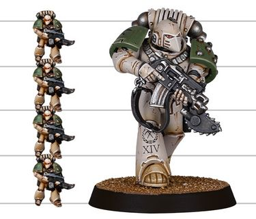
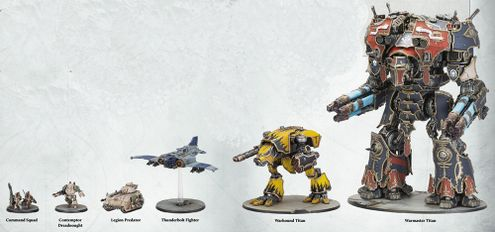

# 1586 荷鲁斯之乱：帝国军团 The Horus Heresy: Legions Imperialis

精校状态：中文行文已逐段精校，部分术语仍为暂定

分类：现实世界

原文来源：https://www.bilibili.com/opus/1216973829402787856

原作者：帝国神选罐头

原文时间：2026年06月23日 12:00

[返回分类目录](目录.md) · [全书目录](../../目录.md)

原篇名：荷鲁斯叛乱：帝国军团 The Horus Heresy: Legions Imperialis

<!-- A1586-B0001 -->
**英文原文**

The Horus Heresy: Legions Imperialis is an Epic scale game released in November 2023. It takes places during the Horus Heresy.

<!-- /A1586-B0001 -->

<!-- A1586-B0002 -->

原译文

荷鲁斯叛乱：帝国军团是一款于2023年11月发布的史诗规模游戏。故事发生在荷鲁斯叛乱时期。

**校订译文**

《荷鲁斯之乱：帝国军团》于2023年11月推出，是以荷鲁斯之乱为背景的史诗比例战棋游戏。

<!-- /A1586-B0002 -->

<!-- A1586-B0003 图片 -->

<!-- A1586-B0004 -->
**英文原文**

Manufacturer:Games Workshop

<!-- /A1586-B0004 -->

<!-- A1586-B0005 -->

原译文

制造商：游戏工作室

**校订译文**

制造商：Games Workshop

<!-- /A1586-B0005 -->

<!-- A1586-B0006 -->
**英文原文**

Released:November 2023

<!-- /A1586-B0006 -->

<!-- A1586-B0007 -->

原译文

发布日期：2023年11月

**校订译文**

发布日期：2023年11月

<!-- /A1586-B0007 -->

<!-- A1586-B0008 -->
**英文原文**

Scale:8mm

<!-- /A1586-B0008 -->

<!-- A1586-B0009 -->

原译文

比例尺：8mm

**校订译文**

模型规格：约8毫米

<!-- /A1586-B0009 -->

<!-- A1586-B0010 -->
**英文原文**

Players:2+

<!-- /A1586-B0010 -->

<!-- A1586-B0011 -->

原译文

玩家：2+

**校订译文**

玩家人数：2人或以上

<!-- /A1586-B0011 -->

<!-- A1586-B0012 -->
**英文原文**

Preceded by:Adeptus Titanicus: The Horus Heresy

<!-- /A1586-B0012 -->

<!-- A1586-B0013 -->

原译文

前作：泰坦修会：荷鲁斯叛乱

**校订译文**

前作：泰坦修会：荷鲁斯之乱

**校注：** Horus Heresy图注与正文沿已核官方名称统一。

<!-- /A1586-B0013 -->

<!-- A1586-B0014 -->
## Description 描述

<!-- /A1586-B0014 -->

<!-- A1586-B0015 -->
**英文原文**

Warhammer: The Horus Heresy - Legions Imperialis is a game of vast tabletop battles for two or more players. The epic-scale miniatures used in this game are smaller than those used in Warhammer: The Horus Heresy, allowing you to field more units and recreate the massive conflicts of that Imperial civil war on your tabletop. Declare your loyalty to the Emperor or the Warmaster, and fight for the fate of the war-torn Imperium.

<!-- /A1586-B0015 -->

<!-- A1586-B0016 -->

原译文

战锤：荷鲁斯叛乱-帝国军团是一款由两名或两名以上玩家进行的大型桌面战斗游戏。这款游戏中使用的史诗规模微缩模型比战锤：荷鲁斯叛乱中使用的要小，可以让你部署更多的单位，并在桌面上重现帝国内战的大规模冲突。宣布你对帝皇或战帅的忠诚，为饱受战争蹂躏的帝国的命运而战。

**校订译文**

这款游戏供两名及以上玩家进行大规模桌面战斗。其微缩模型小于常规《荷鲁斯之乱》模型，因此能在桌上部署更多部队，重现这场帝国内战。玩家选择效忠帝皇或战帅，为饱经战火的帝国命运而战。

<!-- /A1586-B0016 -->

<!-- A1586-B0017 -->
## Gameplay 游戏玩法

<!-- /A1586-B0017 -->

<!-- A1586-B0018 -->
**英文原文**

The recommended size is 3,000 points per side, played on a 5’ x 4’ battlefield.

<!-- /A1586-B0018 -->

<!-- A1586-B0019 -->

原译文

建议的大小是每方3000点，在5'x4'的战场上进行。

**校订译文**

底稿建议每方3,000点，使用5英尺×4英尺的战场。

**校注：** 点数和桌面建议按所给底稿记载，未将其当作已核当前赛事规则。

<!-- /A1586-B0019 -->

<!-- A1586-B0020 图片 -->

<!-- A1586-B0021 -->

原译文

Scale of Legions Imperialis Marine compared to a 28mm marine miniature 帝国军团战士与28毫米战士微缩模型的比例比较

**校订译文**

Scale of Legions Imperialis Marine compared to a 28mm marine miniature 帝国军团战士与28毫米战士微缩模型的比例比较

<!-- /A1586-B0021 -->

<!-- A1586-B0022 -->
**英文原文**

The activation of Detachments alternates, meaning you move or fire a Detachment, then your opponent does, and so on.

<!-- /A1586-B0022 -->

<!-- A1586-B0023 -->

原译文

分遣队的激活是交替的，这意味着你移动或射击分遣队，然后你的对手移动或射击，以此类推。

**校订译文**

双方交替启用分遣队：你让一支分遣队移动或射击，随后对手行动，如此轮流进行。

<!-- /A1586-B0023 -->

<!-- A1586-B0024 -->
**英文原文**

Using tokens placed face down next to their Detachments, players assign Orders simultaneously and in secret. There are four main Orders: First Fire, Advance, March, and Charge, plus Fall Back, which a unit can be assigned when they take heavy losses.

<!-- /A1586-B0024 -->

<!-- A1586-B0025 -->

原译文

使用面朝下放置在他们的支队旁边的标识，玩家可以同时秘密分配命令。有四个主要命令：第一次射击、前进、齐进和冲锋，以及撤退，当一个部队遭受重大损失时，可以分配给他们。

**校订译文**

双方同时秘密下达命令，将命令标记背面朝上放在分遣队旁。四种主要命令为优先开火、前进、行军和冲锋；部队遭受重创时，还可能被赋予撤退命令。

<!-- /A1586-B0025 -->

<!-- A1586-B0026 -->
**英文原文**

Shooting works pretty much the same as it does in most Warhammer games. Weapons have a range, an amount of dice to roll, a target number for the Hit roll, an Armour Penetration value, and Traits. Select a target in range, roll the right number of dice, and apply any modifiers to the roll. For each one that hits, the model gets a Save that can be modified. Traits are where extra variety happens – guns with the Light trait cannot hurt heavy tanks, for instance, while Assault weapons are more powerful up close – ensuring everything has a niche.

<!-- /A1586-B0026 -->

<!-- A1586-B0027 -->

原译文

射击的工作原理与大多数战锤游戏几乎相同。武器有一个射程、要掷的骰子数量、命中的目标数量、护甲穿透值和特性。在范围内选择一个目标，掷正确数量的骰子，并对掷骰子应用任何修改。对于每一击，模型都会得到一个可以被修改的保护。特性是发生额外变化的地方 — 例如，具有轻型特性的枪支不能伤害重型坦克，而突击武器在近距离时更强大 — 确保一切都有生态位。

**校订译文**

射击流程与许多战锤游戏相似。武器拥有射程、投骰数量、命中所需点数、破甲值及特性。先选定射程内目标，掷相应数量的骰子并应用修正；每次命中后，受击模型可进行相应豁免，豁免也可能受修正。武器特性带来额外差异：例如轻型武器无法伤害重型坦克，突击武器在近距离更强，使不同装备各有用途。

**校注：** target number为命中所需点数，Save为豁免；原译“目标数量”“保护”误解规则用语。

<!-- /A1586-B0027 -->

<!-- A1586-B0028 -->
## Released Box sets 已发行盒装

原题：Released Box sets 已发布的盒子套装

<!-- /A1586-B0028 -->

<!-- A1586-B0029 -->
**英文原文**

Legions Imperialis (Box)

<!-- /A1586-B0029 -->

<!-- A1586-B0030 -->

原译文

帝国军团（盒子）

**校订译文**

《帝国军团》盒装

<!-- /A1586-B0030 -->

<!-- A1586-B0031 -->
## Rulebooks and Expansions 规则书和扩展

<!-- /A1586-B0031 -->

<!-- A1586-B0032 -->
**英文原文**

Legions Imperialis Rulebook (2023)

<!-- /A1586-B0032 -->

<!-- A1586-B0033 -->

原译文

帝国军团规则书（2023）

**校订译文**

帝国军团规则书（2023）

<!-- /A1586-B0033 -->

<!-- A1586-B0034 -->
**英文原文**

Legions Imperialis: The Great Slaughter

<!-- /A1586-B0034 -->

<!-- A1586-B0035 -->

原译文

帝国军团：大屠杀

**校订译文**

帝国军团：大屠杀

<!-- /A1586-B0035 -->

<!-- A1586-B0036 -->
**英文原文**

Legions Imperialis: The Devastation of Tallarn

<!-- /A1586-B0036 -->

<!-- A1586-B0037 -->

原译文

帝国军团：塔兰的毁灭

**校订译文**

帝国军团：塔兰的毁灭

<!-- /A1586-B0037 -->

<!-- A1586-B0038 -->
**英文原文**

Legions Imperialis: The Rise of the Dark Mechanicum

<!-- /A1586-B0038 -->

<!-- A1586-B0039 -->

原译文

帝国军团：黑暗机械教的崛起

**校订译文**

帝国军团：黑暗机械教的崛起

<!-- /A1586-B0039 -->

<!-- A1586-B0040 -->

原译文

Liber Strategia 战略册

**校订译文**

Liber Strategia 战略册

<!-- /A1586-B0040 -->

<!-- A1586-B0041 -->
**英文原文**

Journal Strategia: The Ruin of the Salamanders

<!-- /A1586-B0041 -->

<!-- A1586-B0042 -->

原译文

战略杂志：火蜥蜴的毁灭

**校订译文**

战略杂志：火蜥蜴的毁灭

<!-- /A1586-B0042 -->

<!-- A1586-B0043 -->
## Miniatures 微缩模型

<!-- /A1586-B0043 -->

<!-- A1586-B0044 -->
**英文原文**

A range of 8mm scale miniatures were released alongside the various campaign books.

<!-- /A1586-B0044 -->

<!-- A1586-B0045 -->

原译文

一系列8毫米大小的微缩模型与各种战役书一起发布。

**校订译文**

各战役书配套推出了多款约8毫米规格的微缩模型。

<!-- /A1586-B0045 -->

<!-- A1586-B0046 图片 -->

<!-- A1586-B0047 -->

原译文

Scale of Legions Imperialis miniatures 帝国军团微缩模型规模

**校订译文**

Scale of Legions Imperialis miniatures 《帝国军团》微缩模型比例

<!-- /A1586-B0047 -->

本篇核心术语与暂定项

以下列出本篇出现的英文原形及核心术语表用词。同形词可能指不同对象，具体词义以本篇正文和校注为准；单复数、别名和仅见于图注的名称可能尚未列入。完整候选见[术语表](../../术语表/双语术语候选.csv)。

| 英文 | 采用中文 | 状态 |
| --- | --- | --- |
| Horus Heresy | 荷鲁斯之乱 | 官方已核对 |
| Imperium | 帝国 | 暂定·简称 |
| Mechanicum | 机械教 | 暂定·历史称谓 |
| Dark Mechanicum | 黑暗机械教 | 暂定·官方待核 |
| Emperor | 帝皇 | 官方已核对 |
| Horus | 荷鲁斯 | 暂定·官方待核 |
| Salamanders | 火蜥蜴 | 暂定·官方待核 |
| Tallarn | 塔兰 | 暂定·官方待核 |
| Imperialis | 帝国徽记 | 暂定·官方待核 |
| The Dark | 《黑暗》 | 暂定·官方待核 |
| Games Workshop | Games Workshop | 暂定·官方待核 |
| Epic | 史诗 | 暂定·官方待核 |
| The Horus Heresy: Legions Imperialis | 荷鲁斯之乱：帝国军团 | 暂定·官方待核 |
| Legions Imperialis | 帝国军团 | 暂定·官方待核 |
| Legions Imperialis: The Great Slaughter | 帝国军团：大屠杀 | 暂定·官方待核 |
| Legions Imperialis: The Devastation of Tallarn | 帝国军团：塔兰的毁灭 | 暂定·官方待核 |
| Legions Imperialis: The Rise of the Dark Mechanicum | 帝国军团：黑暗机械教的崛起 | 暂定·官方待核 |
| Journal Strategia: The Ruin of the Salamanders | 战略杂志：火蜥蜴的毁灭 | 暂定·官方待核 |

