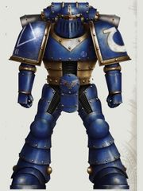
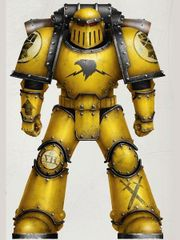
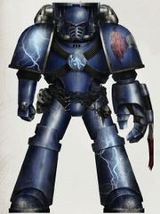
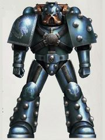
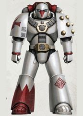

# 1587 荷鲁斯之乱：黑暗时代 The Horus Heresy : Age of Darkness

精校状态：中文行文已逐段精校，部分术语仍为暂定

分类：现实世界

原文来源：https://www.bilibili.com/opus/1219950246054854658

原作者：帝国神选罐头

原文时间：2026年07月01日 12:30

[返回分类目录](目录.md) · [全书目录](../../目录.md)

原篇名：荷鲁斯叛乱：黑暗时代 The Horus Heresy : Age of Darkness

<!-- A1587-B0001 -->
**英文原文**

The Horus Heresy : Age of Darkness, sometimes referred to as Warhammer 30,000 or 30k, is as a supplement and expansion game to Warhammer 40,000 produced by Forge World, and then Games Workshop (since 2022) following the merger of Forge World into the Specialist Design Studio.

<!-- /A1587-B0001 -->

<!-- A1587-B0002 -->

原译文

荷鲁斯叛乱：黑暗时代，有时也被称为战锤30000或30k，是Forge World制作的战锤40000的补充和扩展游戏，然后Games Workshop与Forge World合并为专业设计工作室后（自2022年起）。

**校订译文**

《荷鲁斯之乱：黑暗时代》又称《战锤30,000》或30K，最初由 Forge World 制作为《战锤40,000》的补充与扩展游戏。Forge World 并入 Specialist Design Studio 后，自2022年起由 Games Workshop 主工作室接手制作。

**校注：** 原译误作Games Workshop与Forge World合并；英文描述的是Forge World并入Specialist Design Studio后的制作分工变化。

<!-- /A1587-B0002 -->

<!-- A1587-B0003 图片 -->

<!-- A1587-B0004 -->
**英文原文**

Designer(s):Alan Bligh, John French, with Andy Hoare & Neil Wylid

<!-- /A1587-B0004 -->

<!-- A1587-B0005 -->

原译文

设计师：艾伦·布莱，约翰·弗伦奇，和安迪·霍尔&尼尔·怀利德

**校订译文**

设计：艾伦·布莱、约翰·弗伦奇，安迪·霍尔及尼尔·怀利德参与

<!-- /A1587-B0005 -->

<!-- A1587-B0006 -->
**英文原文**

Manufacturer:Forge World, Games Workshop

<!-- /A1587-B0006 -->

<!-- A1587-B0007 -->

原译文

制造商：铸造世界，游戏工作室

**校订译文**

制造商：Forge World、Games Workshop

<!-- /A1587-B0007 -->

<!-- A1587-B0008 -->
**英文原文**

Released:2012

<!-- /A1587-B0008 -->

<!-- A1587-B0009 -->

原译文

发布时间：2012年

**校订译文**

发布时间：2012年

**校注：** 发布栏2012、第一版小标题2011，1583亦记2011；保留底稿年份差异，不自行判定。

<!-- /A1587-B0009 -->

<!-- A1587-B0010 -->
**英文原文**

Scale:28mm

<!-- /A1587-B0010 -->

<!-- A1587-B0011 -->

原译文

规模：28mm

**校订译文**

模型规格：约28毫米

<!-- /A1587-B0011 -->

<!-- A1587-B0012 -->
**英文原文**

Players:2+

<!-- /A1587-B0012 -->

<!-- A1587-B0013 -->

原译文

玩家：2+

**校订译文**

玩家人数：2人或以上

<!-- /A1587-B0013 -->

<!-- A1587-B0014 -->
## Description 描述

<!-- /A1587-B0014 -->

<!-- A1587-B0015 -->
**英文原文**

The player commands an army of Forge World and Citadel models which represent either those Loyalist forces who fight in the name of the Emperor, or the Traitors who have chosen to side with Warmaster Horus.

<!-- /A1587-B0015 -->

<!-- A1587-B0016 -->

原译文

玩家指挥着一支由铸造世界和城堡模型组成的军队，这些模型要么代表以帝皇名义作战的忠诚派部队，要么代表选择与战帅荷鲁斯并肩作战的叛徒。

**校订译文**

玩家以 Forge World 与 Citadel 模型组成军队，选择代表以帝皇之名战斗的忠诚派，或追随战帅荷鲁斯的叛军。

<!-- /A1587-B0016 -->

<!-- A1587-B0017 -->
**英文原文**

From careful recreation of the detailed panoply and heraldry of the Legiones Astartes, to the organisation of exciting scenarios and campaigns for groups of like-minded friends or the creation of dioramas displaying iconic moments, the hobby provides a wealth of options.

<!-- /A1587-B0017 -->

<!-- A1587-B0018 -->

原译文

从精心再现阿斯塔特军团的详细数量和纹章，到为志同道合的朋友组织激动人心的方案和战役，或者创作展示标志性时刻的立体模型，这个爱好提供了丰富的选择。

**校订译文**

这项爱好有多种玩法：精细还原阿斯塔特军团的武备和纹章，为同好组织剧情任务与战役，或制作场景模型，重现标志性历史时刻。

<!-- /A1587-B0018 -->

<!-- A1587-B0019 -->
## Setting 设定

<!-- /A1587-B0019 -->

<!-- A1587-B0020 -->
**英文原文**

Set roughly 10,000 years before the time of Warhammer 40,000, the game system takes place during the events of the tumultuous Horus Heresy and includes weapons and characters such as Primarchs who existed during that time. The vast armies of the Imperium are sundered by the betrayal of the Warmaster Horus, who seeks to overthrow the Emperor and forge his own dark empire. Under the banner of Imperial Loyalists or the Traitors of Horus, the Space Marine Legions, Mechanicum Taghmata and endless hosts of the Imperial Army clash in a war that will reshape the galaxy.

<!-- /A1587-B0020 -->

<!-- A1587-B0021 -->

原译文

游戏设定在战锤40000之前大约10000年，游戏系统发生在动荡的荷鲁斯叛乱事件期间，包括当时存在的武器和角色，如原体。帝国的庞大军队被战帅荷鲁斯的背叛所分裂，他试图推翻帝皇，建立自己的黑暗帝国。在帝国忠诚派或荷鲁斯叛徒的旗帜下，星际战士，机械教禁卫和帝国军队的无数大军在一场将重塑银河系的战争中。

**校订译文**

游戏背景距《战锤40,000》约一万年，聚焦动荡的荷鲁斯之乱，包含原体等当时人物及装备。战帅试图推翻帝皇、建立黑暗帝国，他的背叛撕裂了帝国大军。星际战士军团、机械教禁卫军和无数帝国军部队，分别投向忠诚派或叛军，在重塑银河命运的战争中厮杀。

**校注：** Imperial Army 沿第18篇定译帝国军；旧制包括后来拆出的海军，与普通陆军及后世帝国卫队区分。

<!-- /A1587-B0021 -->

<!-- A1587-B0022 图片 -->

<!-- A1587-B0023 -->

原译文

Mark II Crusade Armour Mark II远征盔甲

**校订译文**

Mark II Crusade Armour Mark II远征盔甲

<!-- /A1587-B0023 -->

<!-- A1587-B0024 图片 -->

<!-- A1587-B0025 -->

原译文

Mark III Iron armour Mark III钢铁盔甲

**校订译文**

Mark III Iron armour Mark III钢铁盔甲

<!-- /A1587-B0025 -->

<!-- A1587-B0026 图片 -->

<!-- A1587-B0027 -->

原译文

Mark IV Imperial Armour Mark IV帝国盔甲

**校订译文**

Mark IV Imperial Armour Mark IV帝国盔甲

<!-- /A1587-B0027 -->

<!-- A1587-B0028 图片 -->

<!-- A1587-B0029 -->

原译文

Mark V Heresy Armour Mark V异端盔甲

**校订译文**

Mark V Heresy Armour Mark V异端盔甲

<!-- /A1587-B0029 -->

<!-- A1587-B0030 图片 -->

<!-- A1587-B0031 -->

原译文

Mark VI Corvus Armour Mark VI渡鸦盔甲

**校订译文**

Mark VI Corvus Armour Mark VI渡鸦盔甲

<!-- /A1587-B0031 -->

<!-- A1587-B0032 -->

原译文

‘Of all the conflicts that have beset this Imperium of Mankind, it is the rebellion of the Warmaster Horus, the Horus Heresy, which has left the greatest scars upon its fabric. Even now, centuries after its end, when few save ancient and shrivelled creatures such as myself remember the horror of those dark years, men speak of it with awe. For those were the last days of legend, when the Emperor and His sons, the mighty Primarchs, strode forth to war, when the dominion of Mankind spread across the galaxy and none could challenge our might, the last days of a golden age long since consigned to dust by the actions of one man. It is the curse of history that few care to remember other than those fragments that exalt them, to relive those glory days endlessly while the present crumbles about them.’ - From the final testament of Sulem Rei, historiarch of the Imperial Court, presented to the High Lords of Terra circa 098.M32 “在困扰这个人类帝国的所有冲突中，最严重的是战帅荷鲁斯的叛乱，荷鲁斯叛乱，在其结构上留下了最大的伤痕。即使在它结束几个世纪后的今天，当除了像我这样古老而干瘪的人外，很少有人记得那些黑暗岁月的恐怖时，人们还是怀着敬畏的心情谈论它。因为那是传说的最后几日，当帝皇和他的子嗣们，强大的原体，大步走向战争，当人类的统治遍布银河系，没有人能挑战我们的力量，这是一个黄金时代的最后几日，早已被一个人的行动化为尘土。除了那些高举它们的碎片外，很少有人愿意记住历史的诅咒，在当下关于他们的崩溃时，无休止地重温那些辉煌的日子。”- 摘自帝国王庭历史领主苏莱姆·雷于098.M32左右提交给泰拉高领主的最终遗言。

**校订译文**

‘Of all the conflicts that have beset this Imperium of Mankind, it is the rebellion of the Warmaster Horus, the Horus Heresy, which has left the greatest scars upon its fabric. Even now, centuries after its end, when few save ancient and shrivelled creatures such as myself remember the horror of those dark years, men speak of it with awe. For those were the last days of legend, when the Emperor and His sons, the mighty Primarchs, strode forth to war, when the dominion of Mankind spread across the galaxy and none could challenge our might, the last days of a golden age long since consigned to dust by the actions of one man. It is the curse of history that few care to remember other than those fragments that exalt them, to relive those glory days endlessly while the present crumbles about them.’ - From the final testament of Sulem Rei, historiarch of the Imperial Court, presented to the High Lords of Terra circa 098.M32 “在人类帝国经历的一切战乱中，留下最深伤痕的，当属战帅荷鲁斯的叛乱。即使在结束数百年后，只有像我这样衰老枯槁的人还记得黑暗年代的恐怖，人们谈起它时仍满怀敬畏。那是传奇最后的岁月：帝皇与强大的原体子嗣并肩出征，人类统治遍及银河，无人能挑战我们的力量；那也是黄金时代的余晖，却因一人的作为，早已化为尘土。历史的诅咒在于，人们只愿记住那些能使自己显得伟大的碎片，一遍遍重温昔日荣耀，任由眼前的现实在身边崩塌。”——帝国王庭历史领主苏莱姆·雷的最后遗言，约于098.M32呈交泰拉高领主。

**校注：** 保留混合段全部英文引文及署名，重译中文；末句原译严重失去主谓关系。

<!-- /A1587-B0032 -->

<!-- A1587-B0033 -->
## Editions 版本

<!-- /A1587-B0033 -->

<!-- A1587-B0034 -->
### Rulebooks, Army Lists, Campaigns Books 规则书、军队列表、战役书

<!-- /A1587-B0034 -->

<!-- A1587-B0035 -->
**英文原文**

Rulebooks provide the core rules to play the game. Army Lists provide datasheet for the playable units, as well as faction-specific units and rules. Campaigns Books focus on a particular setting, expanding on the rules, available units, missions and scenarios.

<!-- /A1587-B0035 -->

<!-- A1587-B0036 -->

原译文

规则书提供了玩游戏的核心规则。军队列表为可玩单位以及特定派系的单位和规则提供数据表。战役书侧重于特定的环境，扩展了规则、可用单位、任务和场景。

**校订译文**

规则书提供游戏的核心规则；军队列表收录可用单位的数据表、阵营专属单位与规则；战役书围绕特定背景，扩充规则、单位、任务和剧情场景。

<!-- /A1587-B0036 -->

<!-- A1587-B0037 -->
## 1st Edition (2011) 第一版

<!-- /A1587-B0037 -->

<!-- A1587-B0038 -->
**英文原文**

First played with the 6th and then 7th editions ruleset from Warhammer 40000, it received its own rulebook in 2017.

<!-- /A1587-B0038 -->

<!-- A1587-B0039 -->

原译文

它首先使用了战锤40000的第6版和第7版规则集，并于2017年获得了自己的规则书。

**校订译文**

第一版最初使用《战锤40,000》第六版、继而第七版规则，直到2017年才获得独立规则书。

<!-- /A1587-B0039 -->

<!-- A1587-B0040 -->
**英文原文**

To a great extent the works of Alan Bligh and John French, the various Horus Heresy books supplement and expand upon the core rules and provide the players with additional units, missions, battle zones and play styles. Campaign books (aka Black Books) focus on a particular Age of Darkness campaign and battles and include detailed background about the factions involved and rules to play those pivotal engagements. Army Lists (aka Red Books) are reference books that provide detailed rules information for using armies of Space Marines, the Mechanicum, the Imperial Army and more.

<!-- /A1587-B0040 -->

<!-- A1587-B0041 -->

原译文

在很大程度上，艾伦·布莱和约翰·弗伦奇的作品，各种荷鲁斯叛乱书籍补充和扩展了核心规则，并为玩家提供了额外的单位、任务、战区和游戏风格。战役书（又名黑皮书）侧重于特定的黑暗时代战役和战斗，包括有关所涉及派系的详细背景和进行这些关键交战的规则。军队列表（又名红皮书）是参考书，为使用星际战士、机械教、帝国军队等军队提供了详细的规则信息。

**校订译文**

这些书籍主要由艾伦·布莱和约翰·弗伦奇创作，在核心规则之上补充单位、任务、战区与玩法。战役书又称“黑皮书”，聚焦黑暗时代的特定战役，提供参战阵营背景及重现关键交锋的规则。军队列表又称“红皮书”，是星际战士、机械教、帝国军等军队的详细规则参考。

**校注：** Imperial Army 沿第18篇定译帝国军；旧制包括后来拆出的海军，与普通陆军及后世帝国卫队区分。

<!-- /A1587-B0041 -->

<!-- A1587-B0042 -->
## 2nd Edition (2022) 第二版

<!-- /A1587-B0042 -->

<!-- A1587-B0043 -->
**英文原文**

The 2nd Edition of The Horus Heresy was released in 2022, alongside a new box set: The Horus Heresy: Age of Darkness. This edition refreshes the rules, while injecting new decision-making into the mix. It is supplemented by new Army Books.

<!-- /A1587-B0043 -->

<!-- A1587-B0044 -->

原译文

荷鲁斯叛乱第二版于2022年发行，同时发行的还有一套新的盒子：荷鲁斯叛乱：黑暗时代。本版本更新了规则，同时为组合注入了新的决策。它由新的军队书补充。

**校订译文**

2022年，游戏第二版随《荷鲁斯之乱：黑暗时代》新盒装推出，更新规则并加入新的战术决策，另有配套军队书补充。

<!-- /A1587-B0044 -->

<!-- A1587-B0045 -->
## 3rd Edition (2025) 第三版

<!-- /A1587-B0045 -->

<!-- A1587-B0046 -->
**英文原文**

The 3rd Edition of the Horus Heresy was released in 2025, alongside a new box set: The Horus Heresy: Age of Darkness - Saturnine.

<!-- /A1587-B0046 -->

<!-- A1587-B0047 -->

原译文

荷鲁斯叛乱第三版于2025年发布，同时发布的还有一套新的盒子：荷鲁斯叛乱：黑暗时代-土星。

**校订译文**

2025年，第三版随《荷鲁斯之乱：黑暗时代——土星》新盒装推出。

**校注：** Saturnine盒装名称暂沿土星词根，全称官译待核。

<!-- /A1587-B0047 -->

<!-- A1587-B0048 -->
## Miniatures 微缩模型

<!-- /A1587-B0048 -->

<!-- A1587-B0049 -->
**英文原文**

At first played mainly with resin miniatures from Forge World (2012-2021), Games Workshop took over the production of generic units in plastic (2022+), while Faction-specific units will still be produced by Forge World in resin.

<!-- /A1587-B0049 -->

<!-- A1587-B0050 -->

原译文

起初主要使用Forge World的树脂微缩模型（2012-2021），Games Workshop接管了塑料通用单位的生产（2022+），而派系专用单位仍将由Forge World用树脂生产。

**校订译文**

2012至2021年主要使用 Forge World 树脂模型；从2022年起，Games Workshop 接手通用单位的塑料模型生产，阵营专用单位则继续由 Forge World 制作树脂版本。

<!-- /A1587-B0050 -->

本篇核心术语与暂定项

以下列出本篇出现的英文原形及核心术语表用词。同形词可能指不同对象，具体词义以本篇正文和校注为准；单复数、别名和仅见于图注的名称可能尚未列入。完整候选见[术语表](../../术语表/双语术语候选.csv)。

| 英文 | 采用中文 | 状态 |
| --- | --- | --- |
| Space Marines | 星际战士 | 官方已核对 |
| Imperial Army | 帝国军 | 暂定·官方待核 |
| Horus Heresy | 荷鲁斯之乱 | 官方已核对 |
| Imperium | 帝国 | 暂定·简称 |
| Mechanicum | 机械教 | 暂定·历史称谓 |
| Emperor | 帝皇 | 官方已核对 |
| Forge World | 铸造世界 | 暂定·官方待核 |
| Horus | 荷鲁斯 | 暂定·官方待核 |
| Legiones Astartes | 阿斯塔特军团 | 暂定·官方待核 |
| Space Marine | 星际战士 | 暂定·官方待核 |
| System | 星系（恒星系统） | 暂定·官方待核 |
| Games Workshop | Games Workshop | 暂定·官方待核 |
| Alan Bligh | 艾伦·布莱 | 暂定·官方待核 |
| The Horus Heresy: Age of Darkness | 荷鲁斯之乱：黑暗时代 | 暂定·官方待核 |
| John French | 约翰·弗伦奇 | 暂定·官方待核 |
| Andy Hoare | 安迪·霍尔 | 暂定·官方待核 |
| Neil Wylid | 尼尔·怀利德 | 暂定·官方待核 |

